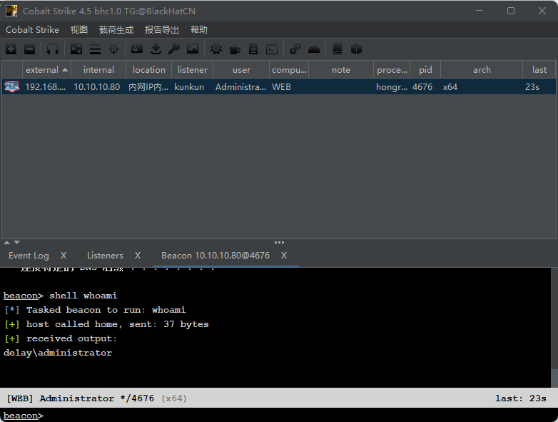

# 红日靶场二

## 外网：

```
dc：win2012     vm1:10.10.10.10	   NA

web：win2008 初始的状态默认密码无法登录，切换用户 de1ay/1qaz@WSX 登录进去，并且登进去后启动C:\Oracle\Middleware\user_projects\domains\base_domain\startWebLogic.bat 启动时需要管理员身份（administrator/1qaz@WSX）
vm1:10.10.10.80	   nat:192.168.111.80

pc：win7     vm1:10.10.10.201	   nat:192.168.111.201

kali 192.168.111.128
```

### 靶场环境搭建：

配置完毕先测试连通性

如果失败，尝试将靶机的防火墙暂时关闭


**开启web服务**


将服务依次运行


在kali weblogic的登录页面看到成功开启

再将之前关闭的防火墙重新打开

### 信息搜集

先对192.168.111.80进行端口扫描


发现目标机开放了80，135,193,445,1433等端口

常用高危端口漏洞：

```
445端口	存在SMB服务，可能有MS17_010永恒之蓝漏洞
3389端口	远程桌面服务，可以尝试连接以此进入内网
7001端口	Weblogic服务，可能存在与之相关的漏洞
```

对192.168.111.201进行端口扫描


发现也开启了多个端口，对端口进行访问发现7001端口有报错

再分别对目标机进行目录扫描

没有得到有用的信息

所以回过来对端口的漏洞进行验证，看是否含有漏洞


用weblogicscan漏洞扫描工具进行扫描，发现含有两个可以利用的weblogic漏洞


发现几条可以利用的漏洞

通过工具实现命令执行功能


上传内存马，用蚁剑连接，成功拿到shell

## 内网渗透：

### cs上线：

首先启动cs客户端和服务段，然后登录成功


设置监听


生成exe


通过蚁剑上传exe，并运行


上线成功，先sleep0缩短回显时间，且可以看到我们是管理员权限



再关闭防火墙


### 内网信息搜集：

**先获取主机凭证**


得到域delay以及密码1qaz@WSX（由于weblogic启动需要域管理员密码，而本台webserver2008存在内存明文密码的漏洞 故而可知域管理员账密 administrator/1qaz@WSX）

（直接从 lsass.exe 进程里获取 windows 处于 active 状态账号的明文密码，当前监听ip所有登录过的账号密码）

**查看是否在域中（该机子是否加入域 net view /domain）**


可以发现在delay这个域中，且发现内网ip为10.10.10.80

**再查看域内信息**：（net config workstation）


得到计算机名，计算机全名，用户名，工作站域，工作站dns域等信息

知道内网网段，且web处于内网中**扫描内网端口**：


可以看到扫描出的10.10.10.10的计算机名dc，基本可以确定就是域控

### 获取域控权限：

建立一个新的listener，选择payload是beacon_smb


