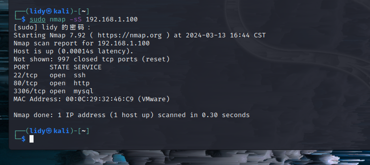
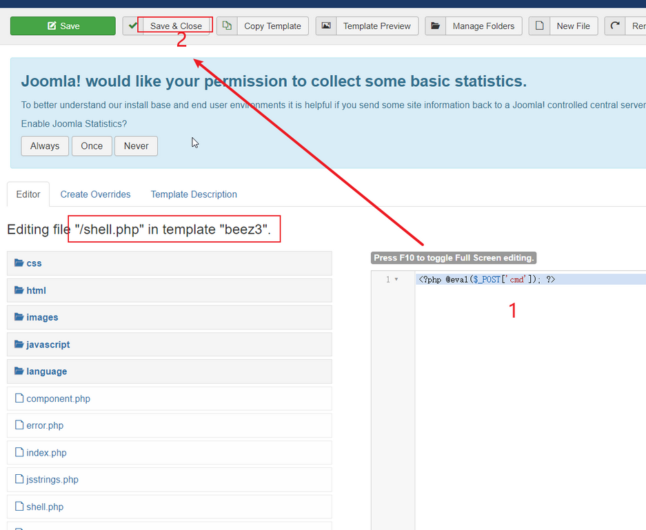

# 红日靶场三

## 外网

### 基础配置：

```python
web-centos:VMnet10、VMnet11 出网机 双网卡  192.168.93.100 出网地址：192.168.111.129
web1-ubantu:VMnet10 内网反代肉鸡 web1-ubuntu是Nginx的反向代理服务器（打开web-centos的同时一定要打开web1-ubuntu，centos的web服务才能正常服务，否则会报502网关错误）
pc：内部主机   192.168.93.30
win2008：内部主机   192.168.93.20
win2012： 域控服务器   192.168.93.10
有些windows密码：123qwe!ASD
centos账号密码： wwwuser  wwwuser_123Aqx
```

### 信息搜集:

#### 端口扫描：



发现22、80、3306都是开启的

先来访问一下80端口

利用火狐插件查看一下信息


识别出是Joomal框架

Joomla是一个流行的开源内容管理系统(CMS)世界各地的数百万用于构建强大的网站和在线应用程序

使用msf确定一下joomler的版本，use auxiliary/scanner/http/joomla_version模块，发现Joomla 的版本号是3.9.12（拿版本扫描脚本扫描版本。）


查到cms版本进行攻击，网上搜索exp。21年有个最新exp命令执行。网上搜索版本号为3.9.12的joomler存在RCE漏洞，但是需要管理员的账户和密码，再接着信息收集。

#### 目录扫描：


http://192.168.1.100/administrator/为jooml的a后台登录界面


dirsearch扫描后台还发现configuration.php~文件。

配置文件中有账号密码，且可以看到数据库类型为mysql。kali中或者navicat进行连接。


这里我们选择在Navicat中打开cvcvgjASD!@


找到user发现用户的密码是加密的


这里我们尝试创建一个新的用户看是否能够登入

在Navicat中新建查询，点击执行，创建一个admin3/123456的账户，在amu2zu-users的表中刷新下，会发现新的账户创建成功。


在http://192.168.1.100/administrator/上登录成功


### getshell

joomla<V3.9.15版本存在RCE，利用此漏洞getshell

找点：


New file创建一个马/或者上传一个马，我这里选择写一个一句话木马，密码为cmd,然后点击保存或者关闭




上传成功，文件已保存，文件会保存在http://192.168.1.100/templates/beez3目录下


蚁剑连接成功：


键入查询命令，发现回显ret=127,发现http://192.168.1.100/templates/beez3目录下不存在phpinfo，无法查看phpinfo的相关信息。那我们就创建一个查看


右击新建文件


新建一个文件phpinfo.txt，写入一下内容，并把phpinfo.txt更名为phpinfo.php,复制链接，在浏览器访问该php，发现该PHP的版本是7.1.32


发现是disable_functions设置命令被禁用，但是可以浏览文件夹，没发现什么，尝试下载蚁剑绕过disable_functions的插件，下载地址：https://github.com/AntSword-Store，然后将插件包放在antSword\antData\plugins\目录下，右击指定的链接，加载插件，选择辅助工具，我们下载的插件就能加载出来了，


在这选择PHP7_GC_UAF和PHP7_Backtrace_UAF这两个都能用


命令执行，成功绕过


**ifconfig可以查看到，这里的IP地址跟我们访问的地址（192.168.1.100）不一样，这就说明这是个其他网段的地址，而且还不出网，由另一台主机（web-centos)进行反向代理******（这里显示的就是Ubuntu反向代理的信息）****


再次翻看文件发现，在/tmp/mysql下有一个text.txt


打开看一下，发现了centos的账号密码


前期信息探测时候，开放了22端口SSH服务，尝试xshell


连接成功，查看一下ip、id和内核版本


uname -srm查看内核版本

linux内核版本为： 

```
2.6.32-431.e16.x86_64 x86_64
```


我们发现自己是普通用户，且已经进到了这个真正双网卡主机里，该Linux版本支持脏牛内核提权

## 内网

### 脏牛提权

```
脏牛漏洞 （CVE-2016-5195）对CentOS 进行提权
EXP下载：https://github.com/FireFart/dirtycow
将代码上传到一个可以执行的文件夹内，可以尝试我的方法：
# Xshell连接后——>开启ftp服务——>脏牛传入tmp中——>xshell输入命令
xshell命令：到可执行文件cd /tmp
编译脏牛：gcc -pthread dirty.c -o dirty -lcrypt
给编译文件设密码：./dirty 123456   id 显示用户的ID，以及所属群组的ID；uid=0，为root用户
给系统添加了一个管理员用户：用户名：firefart   密码：123456
```

我们先用工具finalshell来连接ssh

```
执行编译后的文件，并设置密码（该脚本利用dirtycow漏洞的pokemon漏洞利用为基础，自动生成新的passwd行。运行二进制文件时，将提示用户输入新密码。然后将原始 /etc/passwd 文件备份到 /tmp/passwd.bak 并使用生成的firefart账户覆盖 root 帐户。运行漏洞利用后，能够使用新创建的用户登录，所以需要先将/tmp/passwd.bak删除），原来的root账户就没有了，登录生成的新用户firefart成功，查看UID=0,为root用户，提权成功。成功后我们查看id如果id=0就代表是root权限。
```


因为我们当前目录的权限是普通权限，而/tmp目录下低权限用户也可以传东西，所以我们找到/tmp目录


然后上传可以检测的脚本


更改可执行文件sh的权限

然后运行


带加号代表存在这个漏洞

我们选择比较经典的dirtycow

找到他的可执行利用脚本，上传文件夹


进入利用文件


提权成功

查看id


### ubantu提权

整理一下成果：

```
web入口shell：主机不出网

192.168.1.103：主机出网

密码收集：123,cvcvgjASD!@,wwwuser_123Aqx

用户名：root ,testuser,wwwuser

内网网段：192.168.93.0/24
```

#### 隧道搭建

内网机器是不出网的，为了切实模拟真实的环境，在这里建一个隧道，使用EarthWorm或者Neo-regeorg工具(kali与centos的隧道)

先运行，设置密码生成：python  neoreg.py generate -k 123 密码为：123


使用：Neo-regeorg工具根据设置的密码生成的代理脚本放在Neo-reGeorg-master/neoreg_servers下，适用于各种语言的文件，如果后期密码忘记了，key.txt还可以查看曾经设置的密码。


（3）选择适用的代理脚本，把他通过webshell管理工具上传到目标网站web目录www下，尝试可以访问成功


（4）设置proxychains代理：vim /etc/proxychains4.conf ////编辑配置proxychains代理，

把ProxyList只留下一个地址：sock5 127.0.0.1 1080


（5）开启代理：python neoreg.py -k 123 -u http://192.168.1.100/tunnel.php，有如下提示即为开启成功！


（6）测试连接：测试以下内网地址（ping命令是icmp协议，无法代理）


### 信息搜集:

先拿fscan扫描，这里可以直接传入我们拿到到centos里面来扫描


可以看到很多机子存活


```
centos：192.168.93.100
Ubuntu：192.168.93.128
win7：192.168.93.30
win8:192.168.93.130
sever2012:192.168.93.131
```

从上面还可以得到192.168.93.130含有ms17-010永恒之蓝漏洞

### win8拿权限

