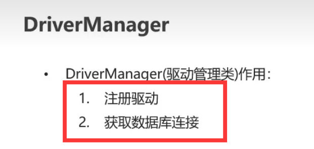
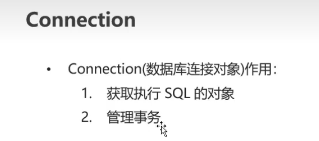
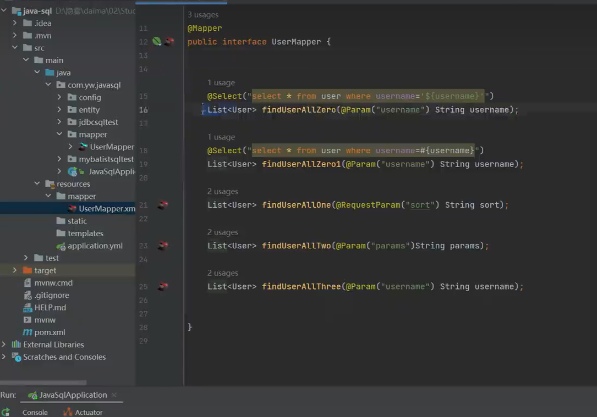
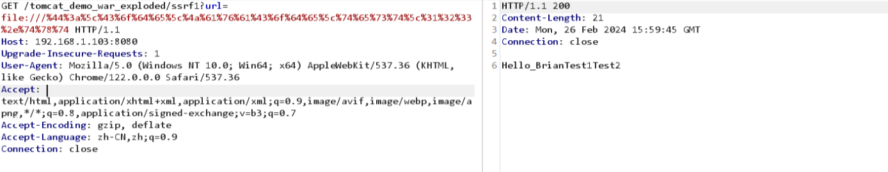

# accumulation2

# Java代码审计

## 简介

**包含：**

安全漏洞分析：主要审计是否存在常见漏洞，如授权等

框架审计：审计程序所使用的框架版本是否存在已知漏洞

依赖库审计：程序是否有不安全的第三方引入

配置审计：如文件权限 数据库连接

数据加密审计：数据处理过程中是否使用了合适的加密算法

安全编码审计：安全api的使用

**什么是Java安全**

1、安全管理器（运行时对代码进行访问控制和权限管理）

2、类加载器（加载类文件到内存）

3、沙箱环境（只允许范文特定的资源和操作）只运行特定的用户对特定的文件对下载的文件进行操作

4、加密库（数据加密与安全通信）

5、安全的API  shiro spring框架

## **安全架构**

**1.类加载器:**

java虚拟机（vm）的一部分，可以把类的字节码文件加载到内存中并转化为可执行的Java类

三种类加载器：启动类加载器，拓展类加载器，应用程序类加载器，自定义类加载器

主要作用：加载，验证，准备，解析，初始化，使用，写在（程序停止则死亡)

**2.字节码校验器（Java虚拟机的一部分）**

检查文件的结构和格式是否正确

检查文件按指定是有效合法

检查文件类型是否正确

检查文件操作是否合法

检查文件访问权限是否正确

**3.安全管理器：**

访问控制，安全策略，权限管理，异常处理

访问机制

public（公共）private（私有）protected（受保护）default（默认，当前包访问）

## SQLI

### JDBC

```
系统把用户输入的数据代入sql语句中执行

select * from user where id =12 idupdatexml //id值随意

jdbc：操作数据库对数据进行操作

可以使用statement 和 preparedstatement
```

#### 详解


**1、概念**


**2、用法**


#### 常见API

**1、DriverManager（获取与数据库的连接）——useSSL=false解除安全检查**




注册驱动可省略不写


**2、Connection（获取执行Sql的对象）**




**要开启事物则setAutoCommit(false)。**


回滚事物到开启事务处，期间执行的[sql语句](https://so.csdn.net/so/search?q=sql语句&spm=1001.2101.3001.7020)不生效


**3、Statement（执行Sql语句和获取数据库数据）**


**4、PrepareStatement（预防Sql注入问题））——useServerPrepStmts=true开启预编译提高性能**


**Sql注入示例**


**Sql注入，拼接字符串后恒成立了**


核心问题，就是拼接字符串导致了，下面介绍用参数替换来代替凭借字符串以解决Sql注入问题


要设置整数值，用setInt咯


会对敏感字符进行转义


开启预编译


##### statement例子

数据库配置


与数据表中字段想对应


sql语句这里的sql还有jdbc1相当于给了一个路径，访问的时候就是路径


注入点，标黄的部分，知道id可以直接查询，可以尝试id来得到数据库数据


```java
public String jdbcsqli(requestparam("id")string id)throws exception {
stringbuilder result =new stringbuilder();
class.forname(dirver);
connection connection = driivermanager,getconnection(url,username,password);
statement st =connection.createstatement();
sting sql ="select * from user where id = '"+id+"'";//字符串拼接 id 这里就可以通过id来得到数据库数据
.......................省略
}
```

尝试给id赋值查看，发现得到数据库数据，尝试各种语句得到数据库的各种信息，比如当前数据库，以及表字段等各种数据和各种敏感数据


##### preparedstatement例子

**jabc方式 preparedstatement 预编译sql注入 有一定的防御**

```
这里的ps.setstring(1,id)这里的1代表将id的位置放在第一位

也可以写比如：

ps.setstring(2.username)表示第二位为username位置

这样sql语句中就应该为： String sql =“select * from user where id = ? and username = ?”;
使用占位符进行预编译，statement是使用字符串拼接
```

**执行点在：resultset rs =ps.excutequery();**


数据库


访问


尝试使用and还有后面的单引号等，发现后面的不会再拿去数据库执行，多次尝试and1=1 and2=1 都无变化


##### 错误使用preparedstatement

**错误使用preparedstatement**


##### preparedstatement order by

错误使用preparestatement

```
预编译语句的限制‌：预编译语句在处理字符串时，只有自动加引号的setString()方法，没有不加引号的方法。而ORDER BY后面的字段名不能加引号，这导致预编译处理无法正确应用。

 ‌JDBC的局限性‌：在使用JDBC进行预编译查询时，ORDER BY无法正常工作，导致结果集顺序混乱。这是因为预编译的?占位符主要用于设置SQL字面量，而非改变数据库结构对象如表或列。
 
 
```

**jdbc order by 注入**


访问


存在时间盲注


#### Mybatis

**$和#区别**

```
$符号用于直接替换参数到SQL语句中，这意味着参数会被直接插入到SQL语句中，不经过预处理。这种方式的优点是它可以用于执行动态SQL，例如进行字符串拼接等操作，但缺点是存在SQL注入的风险，因为用户输入的数据没有经过适当的过滤或转义，直接拼接到SQL语句中可能会导致安全问
#符号则采用预编译处理的方式，它会生成占位符（如?），这样参数就不会直接暴露在SQL语句中，从而避免了SQL注入的风险。这种方式更安全，因为它确保了参数和SQL语句的分离，减少了直接操作数据库时可能出现的风险‌
#{}会直接加引号在后面 但是{}、${}不会
```

**安全性**

- 使用`$`符号时，如果参数是数值类型，其安全性与使用`#`符号时相当。但是，当参数为字符类型时，使用`$`符号可能会导致问题，因为字符类型的参数需要添加引号，而`$`符号直接替换可能会导致引号缺失，从而引发错误‌2。

- `#`符号由于其预编译的处理方式，能够更好地保护应用程序免受SQL注入攻击的影响，因为它确保了参数和SQL语句的分离‌

  **示例：**

**接口文件**


sql语句



**拼接符**

两种拼接符的区别


比如这里的id，输入进去通过预编译过后就会变成类似于后面额“1”


demo这里的拼接符是$


后面加上1=2发现有变化会出现报错


demo1拼接符这里是#

demo1直接跟进得到下面


正常执行得到下面


大部分与上面一致

```
like、order by 、in危险写法
```

## XSS

### 跨站脚本攻击xss


一次性xss


存储型把值存在Cookie里面，不管是什么xss值存在Cookie中，最后再调用，参照下面源代码


示例尝试：存储成功开启一个页面看是否成功


发现会出现弹窗，存储成功


防护，设置黑白名单，关键字，可以在网上找一些接口类，转换后直接输出原值

<script>自带的转义

直接输出自己输入的值，原样输出


#### 反射型

**白盒测试**
一般先找是否有XSS过滤器，如果存在看是否能绕过，以及它部署的范围

```
request.getParameter(param)或${param}获取用户的输入信息
```

```
getParameter
param.
<%=
```

JSP表达式
"<%=变量%>“是”<%out.println 变量;%>“的简写方式，”<%=%>"用于将已声明的变量或表达式输出到外网页中

通过"request.getParameter"获取msg传入的值，然后通过"<%=msg%>"将其输出到网页中

```
<% String msg = request.getParameter("msg");%>
<%= msg %>
```

#### 存储型xss

**例子1**、全局搜索数据库的插入语句(关键词：insert,save,update)，然后找到该插入语句所属的方
法名如(insertUser())，然后全局搜索该方法在哪里被调用，一层层的跟踪。直到
getParamter()方法获取请求参数的地方停止，如果没有全局 XSS 过滤器，跟踪的整个流
程都没有对获取的参数过滤，则存在存储型XSS。


**例子2**. 从getParamter 关键词开始 ，跟踪请求参数，直到插入数据库的语句，如果中间没有过
滤参数，则存在存储型XSS。


码中45行和46行获取usertype和name的值，然后在56行存进数据库由于没有过
滤传进来的参数，所以会在显示时出来触发XS

#### dom型xss

在前端源码搜索

```java
document.location
document.referer
document.url
```

### 修复

①、自定义转义，修复XSS攻击，一个有效的方案是将特殊字符做转义，对所有字符采用HTML实体编码

```java
private static String XssFilter(String content) {
    content = StringUtils.replace(content, "&", "&amp;");
    content = StringUtils.replace(content, "<", "&lt;");
    content = StringUtils.replace(content, ">", "&gt;");
    content = StringUtils.replace(content, "\", "&quot;");
    content = StringUtils.replace(content, "'", "&#x27;");
    content = StringUtils.replace(content, "/", "&#x2F;");
    return content;
}
```

②、采用Spring自带的方法会对特殊字符全转义，使用htmlEscape方法

```java
@GetMapping("/safe1")
public static String safe1(String content) {
    return HtmlUtils.htmlEscape(content);
}
```

③、对于富文本编辑器的XSS防御，一般采用白名单标签的方法，因为针对富文本的处理方式，需保留部分标签可以被解析使用

```java
public static String safe3(String content) {
    Safelist whitelist = (new Safelist())
           .addTags("p", "hr", "div", "img", "span", "textarea")  // 设置允许的标签
           .addAttributes("a", "href", "title")          // 设置标签允许的属性, 避免如nmouseover属性
           .addProtocols("img", "src", "http", "https")  // img的src属性只允许http和https开头
           .addProtocols("a", "href", "http", "https");
    return Jsoup.clean(content, whitelist);
}
```

④、编写全局过滤器实现拦截，并在web.xml进行配置

## SSRF

服务端请求伪造

```
代码中提供了从其他服务器应用获取数据的功能但没有对目标地址做过滤与限制。比如从指定URL链接获取图片、下载等。
```

可以使用其他的请求来读取敏感信息，如果未做限制


示例


socket


httpclient，比socket更安全无法读文件


### **白盒测试**

常出问题的函数

[SSRF漏洞](https://so.csdn.net/so/search?q=SSRF漏洞&spm=1001.2101.3001.7020)一般用于URL在线翻译、文件或图片的加载等功能处
代码审计时需要关注的发起HTTP请求的类及函数：

```
HttpURLConnection. getInputStream
URLConnection. getInputStream
Request.Get. execute
Request.Post. execute
URL.openStream
ImageIO.read
OkHttpClient.newCall.execute
HttpClients. execute
HttpClient.execute
```

常支持的协议


### 漏洞案例

#### **1、HttpURLConnection**

只允许http和https的协议

```java
import javax.servlet.ServletException;
import javax.servlet.annotation.WebServlet;
import javax.servlet.http.HttpServlet;
import javax.servlet.http.HttpServletRequest;
import javax.servlet.http.HttpServletResponse;
import java.io.BufferedReader;
import java.io.IOException;
import java.io.InputStreamReader;
import java.net.HttpURLConnection;
import java.net.URL;
import java.net.URLConnection;


//HttpURLConnection ssrf vul
//http
@WebServlet("/ssrf2")
public class SSRFDemo2 extends HttpServlet {

    @Override
    protected void doGet(HttpServletRequest req, HttpServletResponse resp) throws ServletException, IOException {

        String url = req.getParameter("url");
        URL u = new URL(url);
        System.out.println(u);
        URLConnection urlConnection = u.openConnection();
        HttpURLConnection httpUrl = (HttpURLConnection)urlConnection;
        InputStreamReader inputStream = new InputStreamReader(httpUrl.getInputStream()) ;
        BufferedReader bufferedReader = new BufferedReader(inputStream);
        String line;
        StringBuffer stringBuffer = new StringBuffer();
        while ((line = bufferedReader.readLine()) !=null){
            stringBuffer.append(line);
        }
        inputStream.close();
        bufferedReader.close();

        resp.getWriter().write(stringBuffer.toString());
    }

    @Override
    protected void doPost(HttpServletRequest req, HttpServletResponse resp) throws ServletException, IOException {
        super.doGet(req, resp);
    }
}
```

HttpURLConnection 只允许HTTP/HTTPS协议


- 访问 `/ssrf2?url=http://192.168.1.103:80/123.txt`


#### **2、URLConnection**

```
import javax.servlet.ServletException;
import javax.servlet.annotation.WebServlet;
import javax.servlet.http.HttpServlet;
import javax.servlet.http.HttpServletRequest;
import javax.servlet.http.HttpServletResponse;
import java.io.BufferedReader;
import java.io.IOException;
import java.io.InputStreamReader;
import java.net.URL;
import java.net.URLConnection;

//urlConnection
@WebServlet("/ssrf1")
public class SSRFDemo extends HttpServlet {
    @Override
    protected void doGet(HttpServletRequest req, HttpServletResponse resp) throws ServletException, IOException {

//        req.setCharacterEncoding("utf-8");
//        resp.setCharacterEncoding("utf-8");
//        resp.setContentType("text/html; charset=utf-8");
        String url = req.getParameter("url");
        URL u = new URL(url);
        System.out.println(u);
        URLConnection urlConnection = u.openConnection();
        InputStreamReader inputStream = new InputStreamReader(urlConnection.getInputStream()) ;
        BufferedReader bufferedReader = new BufferedReader(inputStream);
        String line;
        StringBuffer stringBuffer = new StringBuffer();
        while ((line = bufferedReader.readLine()) !=null){
            stringBuffer.append(line);
        }

        inputStream.close();
        bufferedReader.close();

        resp.getWriter().write(stringBuffer.toString());
    }
    @Override
    protected void doPost(HttpServletRequest req, HttpServletResponse resp
    ) throws ServletException, IOException {
        this.doGet(req,resp);
    }
}

```

**案例**


访问`/ssrf1?url=file:///D:\Code\JavaCode\test\123.txt` 反斜杠 \报错，这是因为tomcat对GET请求中的| {} 等特殊字符存在限制(RFC 3986)


可以修改为POST请求 `url=file:///D:\Code\JavaCode\test\123.txt`


- 可以修改为斜杠（/） `/ssrf1?url=file:///D:/Code/JavaCode/test/123.txt`


可以设置URL编码 `/ssrf1?url=file:///D:%5cCode%5cJavaCode%5ctest%5c123.txt`



#### 3、ImageIO

```java
import javax.imageio.ImageIO;
import javax.servlet.ServletException;
import javax.servlet.annotation.WebServlet;
import javax.servlet.http.HttpServlet;
import javax.servlet.http.HttpServletRequest;
import javax.servlet.http.HttpServletResponse;
import java.awt.image.BufferedImage;
import java.io.IOException;
import java.net.URL;

@WebServlet("/ssrf3")
public class SSRFDemo3 extends HttpServlet {
    @Override
    protected void doGet(HttpServletRequest req, HttpServletResponse resp) throws ServletException, IOException {
// ImageIO ssrf vul
        String url = req.getParameter("url");
        URL u = new URL(url);
        BufferedImage img = ImageIO.read(u); // 发起请求,触发漏洞
        resp.getWriter().write(img.toString());
    }

    @Override
    protected void doPost(HttpServletRequest req, HttpServletResponse resp) throws ServletException, IOException {
        super.doGet(req, resp);
    }
}


// ImageIO ssrf vul
String url = request.getParameter("url");
URL u = new URL(url);
BufferedImage img = ImageIO.read(u); // 发起请求,触发漏洞
```

访问 `/ssrf3?url=http://192.168.1.103:80/123.txt`，，如果获取到的不是图片，会返回null


\* 访问 `/ssrf3?url=http://192.168.1.103:80/xuegao.jpg`


#### 4、openStream

```
import javax.servlet.ServletException;
import javax.servlet.annotation.WebServlet;
import javax.servlet.http.HttpServlet;
import javax.servlet.http.HttpServletRequest;
import javax.servlet.http.HttpServletResponse;
import java.io.BufferedReader;
import java.io.IOException;
import java.io.InputStream;
import java.io.InputStreamReader;
import java.net.URL;
import java.net.URLConnection;

//openStream
@WebServlet("/ssrf4")
public class SSRFDemo4 extends HttpServlet {
    @Override
    protected void doGet(HttpServletRequest req, HttpServletResponse resp) throws ServletException, IOException {
        String url = req.getParameter("url");
        URL u = new URL(url);
        InputStream inputStream = u.openStream();
        InputStreamReader inputStreamReader = new InputStreamReader(inputStream);
        BufferedReader bufferedReader = new BufferedReader(inputStreamReader);
        String line;
        StringBuffer stringBuffer = new StringBuffer();
        while (( line = bufferedReader.readLine()) != null){
            stringBuffer.append(line);
        }

        inputStream.close();
        inputStreamReader.close();
        bufferedReader.close();

        resp.getWriter().write(stringBuffer.toString());


    }

    @Override
    protected void doPost(HttpServletRequest req, HttpServletResponse resp) throws ServletException, IOException {
        super.doGet(req, resp);
    }
}

```

访问 `/ssrf4?url=http://192.168.1.103:80/123.txt`


#### **5、其他**

```java
//1、 Request漏洞示例
String url = request.getParameter("url");
return Request.Get(url).execute().returnContent().toString();//发起请求

//2、 URL类中的openStream漏洞示例
String url = request.getParameter("url");
URL u = new URL(url);
inputStream = u.openStream();  //发起请求

// 3、OkHttpClient漏洞示例
String url = request.getParameter("url");
OkHttpClient client = new OkHttpClient();
com.squareup.okhttp.Request ok_http = new com.squareup.okhttp.Request.Builder().url(url).build();
client.newCall(ok_http).execute();  //发起请求

// 4、HttpClients漏洞示例
String url = request.getParameter("url");
CloseableHttpClient client = HttpClients.createDefault();
HttpGet httpGet = new HttpGet(url);
HttpResponse httpResponse = client.execute(httpGet); //发起请求
```

### 修复

1. 正确处理302跳转（在业务角度看，不能直接禁止302，而是对跳转的地址重新进行检查）
2. 限制协议只能为http/https，防止跨协议
3. 设置内网ip黑名单（正确判定内网ip、正确获取host）
4. 设置常见web端口白名单（防止端口扫描，可能业务受限比较大）

```java
@RequestMapping("/fetchURL")
public String fetchURL(String url) {
    if (!isValidURL(url)) {
        return "Invalid URL";
    }

    // 进行URL有效性检查和白名单验证后再发送请求
    try {
        URL urlObj = new URL(url);
        if (!isSafeProtocol(urlObj.getProtocol())) {
            return "Unsupported protocol";
        }
        
        // 设置连接超时时间
        HttpURLConnection connection = (HttpURLConnection) urlObj.openConnection();
        connection.setConnectTimeout(5000); // 5 seconds
        connection.setRequestMethod("GET");

        BufferedReader reader = new BufferedReader(new InputStreamReader(connection.getInputStream()));
        StringBuilder content = new StringBuilder();
        String line;
        while ((line = reader.readLine()) != null) {
            content.append(line);
        }
        reader.close();

        return content.toString();
    } catch (MalformedURLException e) {
        return "Malformed URL";
    } catch (IOException e) {
        return "Error fetching URL";
    }
}

// 验证URL是否合法
private boolean isValidURL(String url) {
    // 可根据实际需求添加更严格的URL验证逻辑
    return url != null && !url.isEmpty();
}

// 检查是否使用支持的协议
private boolean isSafeProtocol(String protocol) {
    // 只允许http和https协议
    return "http".equalsIgnoreCase(protocol) || "https".equalsIgnoreCase(protocol);
}

```

或者

```java
private static int connectTime = 5 * 1000;

public static boolean checkSsrf(String url) {
  HttpURLConnection httpURLConnection;
  String finalUrl = url;
  try {
    do {
      if(!Pattern.matches("^https?://.*/.*$", finalUrl)) { //只允许http/https协议
        return false;
      }
      if(isInnerIp(url)) { //判断是否为内网ip
        return false;
      }

      httpURLConnection = (HttpURLConnection) new URL(finalUrl).openConnection();
      httpURLConnection.setInstanceFollowRedirects(false); //不跟随跳转
      httpURLConnection.setUseCaches(false); //不使用缓存
      httpURLConnection.setConnectTimeout(connectTime); //设置超时时间
      httpURLConnection.connect(); //send dns request

      int statusCode = httpURLConnection.getResponseCode();
      if (statusCode >= 300 && statusCode <=307 && statusCode != 304 && statusCode != 306) {
        String redirectedUrl = httpURLConnection.getHeaderField("Location");
        if (null == redirectedUrl)
          break;
        finalUrl = redirectedUrl; //获取到跳转之后的url，再次进行判断
      } else {
        break;
      }
    } while (httpURLConnection.getResponseCode() != HttpURLConnection.HTTP_OK);//如果没有返回200，继续对跳转后的链接进行检查
    httpURLConnection.disconnect();
  } catch (Exception e) {
    return true;
  }
  return true;
}

private static boolean isInnerIp(String url) throws URISyntaxException, UnknownHostException {
    URI uri = new URI(url);
    String host = uri.getHost(); //url转host
  	//这一步会发送dns请求，host转ip，各种进制也会转化为常见的x.x.x.x的格式
    InetAddress inetAddress = InetAddress.getByName(host); 
    String ip = inetAddress.getHostAddress();

    String blackSubnetlist[] = {"10.0.0.0/8", "172.16.0.0/12", "192.168.0.0/16", "127.0.0.0/8"}; //内网ip段
    for(String subnet : blackSubnetlist) {
      SubnetUtils subnetUtils = new SubnetUtils(subnet); //commons-net 3.6
      if(subnetUtils.getInfo().isInRange(ip)) {
        return true; //如果ip在内网段中，直接返回
      }
    }
    return false;
}

```

## CSRF


带有token验证的案例


前段代码自动生成token部分


生成32位随机数，随机token


修复建议


## 文件上传

### 原理

大部分文件上传漏洞的产生是因为Web应用程序未对文件的格式和进行严格过滤，导致用户可上传jsp、php等webshell代码文件，从而被利用。例如在 BBS发布图片 , 在个人网站发布ZIP压缩包, 在办公平台发布DOC文件等 , 只要 Web应用程序允许上传文件, 就有可能存在文件上传漏洞。

### 审计策略

- 文件上传可以搜索以下关键词： upload，write,fileName ,filePath
- 在查看时，**主要判断是否有检查后缀和文件的大小**
- 同时要查看配置文件是否有设置白名单或者黑名单（不推荐黑名单，可能被绕过）

#### 1、无任何过滤

服务端脚本语言未对上传的文件进行任何限制和过滤，导致恶意用户上传任意文件。

```java
<form action="/file/upload01" method="post" enctype="multipart/form-data">
    <input type="file" name="uploadfile" >
    <input type="submit">
</form>
```

上传文件的后端处理，基于Spring Boot

```java
package com.ms08067.fileupload.controller;
​
import org.springframework.stereotype.Controller;
import org.springframework.ui.Model;
import org.springframework.web.bind.annotation.GetMapping;
import org.springframework.web.bind.annotation.PostMapping;
import org.springframework.web.bind.annotation.RequestMapping;
import org.springframework.web.bind.annotation.RequestParam;
import org.springframework.web.multipart.MultipartFile;
​
import java.io.File;
import java.io.IOException;
​
@Controller
@RequestMapping("/file")
public class FileUploadController {
    /**
     * 未对上传文件进行任何安全处理
     * @param file
     * @return
     */
    @PostMapping("/upload01")
    public String uploadFile01(@RequestParam("uploadfile") MultipartFile file) {
        //获取文件名
        String filename = file.getOriginalFilename();
        //文件保存路径
//        String path = "/";
        File outfile = new File("D:\\20230222"+filename);
        try {
            file.transferTo(outfile);
        } catch (IOException e) {
            e.printStackTrace();
        }
        return "success";
    }
    }
```

上述代码未对上传的文件进行任何检测，可以上传任意类型的文件，包括exe文件和木马等。

运行页面如下：


成功上传后


#### 2、客户端检测

S对文件后缀名检测绕过

通过前端js检测文件名是否合法没有任何意义，因为任意用户都可以对前端js进行任意修改或者通过burp suite抓包修改上传的文件名。

以下代码限制上传文件的后缀名必须为.jpg和.png

```java
<form action="/file/upload02" method="post"  οnsubmit="return judge()" enctype="multipart/form-data">
    <input type="file" name="uploadfile" id="checkfile" >
    <input type="submit" value="提交">
    <p id="msg"></p>
</form>
<script type="text/javascript">
​
    function judge(){
        var file=document.getElementById("checkfile").value;
        if (file==null||file==""){
            alert("请选择要上传的文件");
            // location.reload(true);
            return false;
        }
        var isnext=false;
        var filetypes=[".jpg",".png"];
        var fileend=file.substring(file.lastIndexOf("."));
        for (var i=0;i<filetypes.length;i++){
            if (filetypes[i]==fileend){
                isnext=true;
                break;
            }
        }
        if (!isnext){
            document.getElementById("msg").innerHTML="文件类型不允许";
​
            // location.reload(true);
            return false;
​
        }else {
            return true;
        }
​
    }
</script>
```

后端没有进行任何限制，将文件存储在src\main\resources\static\upload下

```java
import org.springframework.stereotype.Controller;
import org.springframework.ui.Model;
import org.springframework.web.bind.annotation.GetMapping;
import org.springframework.web.bind.annotation.PostMapping;
import org.springframework.web.bind.annotation.RequestMapping;
import org.springframework.web.bind.annotation.RequestParam;
import org.springframework.web.multipart.MultipartFile;
​
import java.io.File;
import java.io.IOException;
 /**
     * 前端通过JS进行文件名称限制
     * @param file
     * @return
     */
    @PostMapping("/upload02")
    public String uploadFile02(@RequestParam("uploadfile") MultipartFile file) {
        String filename = file.getOriginalFilename();
        String path = "D:\\20230222";
        File fileDir = new File(path);
        File outfile = new File(fileDir.getAbsolutePath()+File.separator + filename);
        try {
            file.transferTo(outfile);
        }catch (IOException e){
            e.printStackTrace();
        }
​
        return "success";
    }

```

绕过js检测方法一：**修改前端代码，删除js检测部分**，**或者禁用js**


绕过js检测方法二：使用代理Burp Suite上传文件;上传符合要求的文件类型，抓包修改文件类型。例

如要上传1.jsp，先将文件名改为1.jpg，上传，抓包，再修改为1.jsp即可。


成功上传


#### 3、服务端检测绕过

##### **服务器端后缀名检测绕过**

主要通过黑白名单进行过滤，如果不符合过滤规则，则不允许上传

一般有个专门的 blacklist 文件，里面会包含常见的危险脚本文件后缀名。

##### **大小写绕过**

以下后端代码，检测上传的文件的后缀名是否符合要求，不允许上

传".jsp",".php",".exe",".dll","vxd","html"结尾的文件，可通过将文件后缀大写进行绕过

```java
import org.springframework.stereotype.Controller;
import org.springframework.ui.Model;
import org.springframework.web.bind.annotation.GetMapping;
import org.springframework.web.bind.annotation.PostMapping;
import org.springframework.web.bind.annotation.RequestMapping;
import org.springframework.web.bind.annotation.RequestParam;
import org.springframework.web.multipart.MultipartFile;
​
import java.io.File;
import java.io.IOException;
//基于黑名单大小写绕过的文件上传
    @PostMapping("/upload03")
    public String uploadFile03(@RequestParam("uploadfile")MultipartFile file, Model model){
        boolean flag=true;
        String filename = file.getOriginalFilename();
        System.out.println(filename);
       String suffix=filename.substring(filename.lastIndexOf("."));
        String[] blacklist={".jsp",".php",".exe",".dll","vxd","html"};//后缀名黑名单
        for (String s : blacklist) {
            if (suffix.equals(s)){
                flag=false;
                break;
            }
        }
        if (flag){
            String path="D:\\20230222";
            File fileDir = new File(path);
            File outfile = new File(fileDir.getAbsolutePath()+File.separator + filename);
            try {
                file.transferTo(outfile);
                return "success";
            }catch (IOException e){
                e.printStackTrace();
            }
​
        }
        else {
            model.addAttribute("msg","非法文件类型");
        }
        return "index";
    }

```

通过大小写上传


上述黑名单仅过滤了少数后缀名，可以上传其他后缀类型的恶意文件。

可利用Burp suite截断HTTP请求，利用Intruder模块进行**枚举后缀名**，寻找黑名单中没有过滤的后缀名。接收HTTP请求，send to intruder，选中变量，在Payloads中加载相应的字典。

##### **双写绕过**

以下代码判断文件后缀名是否存在黑名单中的字符，若存在则将对应的**字符串替换为空**

```
import org.springframework.stereotype.Controller;
import org.springframework.ui.Model;
import org.springframework.web.bind.annotation.GetMapping;
import org.springframework.web.bind.annotation.PostMapping;
import org.springframework.web.bind.annotation.RequestMapping;
import org.springframework.web.bind.annotation.RequestParam;
import org.springframework.web.multipart.MultipartFile;
​
import java.io.File;
import java.io.IOException;
//基于双写绕过的文件上传（如果后缀名为非法的字符，将替换成空）修复大小写绕过
    @PostMapping("/upload04")
    public String uploadFile04(@RequestParam("uploadfile")MultipartFile file){
        String filename = file.getOriginalFilename();
        System.out.println(filename);
        String preFilename=filename.substring(0,filename.lastIndexOf("."));
        String suffix=filename.substring(filename.lastIndexOf(".")).toLowerCase();
        String[] blacklist={"jsp","php","exe","dll","vxd","html"};//后缀名黑名单
        for (String s : blacklist) {
            if (suffix.indexOf(s)!=-1){
                suffix=suffix.replace(s,"");//后缀存在黑名单字符串，则将字符串替换为空
            }
        }
        String path="D:\\20230222";
        File fileDir = new File(path);
        File outfile = new File(fileDir.getAbsolutePath()+File.separator + preFilename+suffix);
        try {
            file.transferTo(outfile);
            return "success";
        }catch (IOException e){
            e.printStackTrace();
        }
        return "index";
    }

```

可通过双写后缀名进行绕过，例如上传4.jjspsp文件，过滤掉jsp后，文件名正好是我们想要上传的


##### **双后缀名绕过**

以下代码，后端判断后缀名使用的是**filename.indexOf(".")，而不是filename.lastIndexOf(".")**，

可通过双后缀名绕过检测，例如欲上传1.jsp，可将文件名改为1.jsp.jsp，这样后端获得的后缀名

为.jsp.jsp，可通过检测。

```java
 //文件后缀名双写绕过-未修复大小写绕过
    @PostMapping("/upload05")
    public String uploadFile05(@RequestParam("uploadfile")MultipartFile file,Model model){
        boolean flag=true;
        String filename = file.getOriginalFilename();
        System.out.println(filename);
        String suffix=filename.substring(filename.indexOf("."));
        String[] blacklist={".jsp",".php",".exe",".dll",".vxd",".html"};//后缀名黑名单
        for (String s : blacklist) {
            if (suffix.equals(s)){
                flag=false;
                break;
​
            }
        }
        if (flag){
            String path="D:\\20230222";
            File fileDir = new File(path);
            File outfile = new File(fileDir.getAbsolutePath()+File.separator + filename);
            try {
                file.transferTo(outfile);
                return "success";
            }catch (IOException e){
                e.printStackTrace();
            }
​
        }else {
            model.addAttribute("msg","非法文件类型");
​
        }
        return "index";
​
    }
```


**上传不符合windows文件命名规则的文件名**

上述代码可以通过抓包，修改文件名为如下形式：

- 点绕过1.jsp.
- 空格绕过1.jsp(空格)
- 1.jsp:1.jpg
- 1.jsp::$DATA

#### **4、白名单检测**

在jdk低版本（1.7及以下）中可以使用%00截断。图片木马

##### **MIME类型检测绕过**

以下代码限制上传文件的MIME类型需为"image/jpeg","image/png"或"image/gif"，可通过抓包，

修改Content-Type为合法类型绕过MIME类型检测

```
@PostMapping("/upload07")
    public String uploadFile07(@RequestParam("uploadfile")MultipartFile file,Model model){
        boolean flag=false;
        String filename = file.getOriginalFilename();
        String contentType = file.getContentType();
        System.out.println(filename);
        String preFilename=filename.substring(0,filename.lastIndexOf("."));
        String suffix=filename.substring(filename.lastIndexOf(".")).toLowerCase();
        //基于文件头类型进行白名单校验
        String[] whiteList={"image/jpeg","image/png","image/gif"};
        for (String s : whiteList) {
            if (contentType.equals(s)){
                flag=true;
            }
        }
        if (flag){
            String path="D:\\20230222";
            File fileDir = new File(path);
            File outfile = new File(fileDir.getAbsolutePath()+File.separator + filename);
            try {
                file.transferTo(outfile);
                return "success";
            }catch (IOException e){
                e.printStackTrace();
            }
​
        }else {
            model.addAttribute("msg","非法文件类型");
        }
        return "index";
    }

```

例如上传1.jsp文件，可修改Content-Type值为 image/jpeg


#####  **文件头检测绕过**

根据文件的前面几个字节，即常说的魔术数字进行判断，不同文件类型的开头几个字节不同。

常见文件头：


以下代码，通过检测文件头部分判断上传的文件是否为图片，可利用如下两种方法绕过

```java
package com.ms08067.fileupload.controller;
​
import org.springframework.stereotype.Controller;
import org.springframework.ui.Model;
import org.springframework.web.bind.annotation.GetMapping;
import org.springframework.web.bind.annotation.PostMapping;
import org.springframework.web.bind.annotation.RequestMapping;
import org.springframework.web.bind.annotation.RequestParam;
import org.springframework.web.multipart.MultipartFile;
​
import javax.servlet.http.HttpServletRequest;
import javax.servlet.http.HttpServletResponse;
import java.io.*;
import java.util.HashMap;
import java.util.Iterator;
import java.util.Locale;
import java.util.Map;
​
@Controller
@RequestMapping("/file1")
public class FileUploadController1 {
    public final static Map<String,String> FileType=new HashMap<String,String>();
    static {
        getAllFileType();//初始化文件类型信息
    }
    @PostMapping("/upload")
    public static String upload(@RequestParam("uploadfile") MultipartFile file, Model model){
        String filename = file.getOriginalFilename();
        boolean flag=false;
        byte[] b=new byte[50];
        try {
            InputStream inputStream = file.getInputStream();
            inputStream.read(b);
            System.out.println(b.toString());
            StringBuilder stringBuilder=new StringBuilder();
            if (b==null ||b.length<0){
                flag=false;
            }
            for (int i = 0; i < b.length; i++) {
                int v=b[i]&0xff;
                String hv=Integer.toHexString(v);//十六进制
                stringBuilder.append(hv);
            }
            System.out.println("stringBuilder"+stringBuilder.toString());
            String fileTypeHex = String.valueOf(stringBuilder.toString());
            Iterator<Map.Entry<String, String>> iterator = FileType.entrySet().iterator();
            while (iterator.hasNext()){//判断文件前几个字节是否为FileType中三种类型之一
                Map.Entry<String, String> next = iterator.next();
                System.out.println(fileTypeHex.toUpperCase(Locale.ROOT));
                if (fileTypeHex.toUpperCase(Locale.ROOT).startsWith(next.getValue())){
                    flag=true;
                }
​
            }
​
            inputStream.close();
        }catch (FileNotFoundException e){
            e.printStackTrace();
        }catch (IOException e){
            e.printStackTrace();
​
        }
​
        if (flag){
            String path="D:\\20230222";
            File fileDir = new File(path);
            File outfile = new File(fileDir.getAbsolutePath()+File.separator + filename);
            try {
                file.transferTo(outfile);
                return "success";
            }catch (IOException e){
                e.printStackTrace();
            }
​
        }else {
            model.addAttribute("msg","非法文件类型");
​
        }
        return "index";
​
    }
    private static void getAllFileType(){
        FileType.put("jpeg","FFD8FF");
        FileType.put("png","89504E47");
        FileType.put("gif","47494638");
        FileType.put("jpg","GIF89a");
    }
    }

```

##### **添加合法文件头绕过**

通过抓包，添加合法文件头，例如GIF89a（jpg格式文件头）


上传两个注意事项：

（1）编码前空格、编码上边空一行


##### **制作图片木马绕过**

**copy 2.jpg/b+1.jsp 3.jpg**，或者使用记事本等软件打开图片，在末尾添加jsp木马数据，将攻击脚本隐藏到图片中。

单纯的图片马并不能直接和蚁剑连接，因为该文件依然是以image格式进行解析，需要结合文件包含漏洞

ImageIO判断上传图片文件
通过ImageReader解码file并返回一个BufferedImage对象，如果找不到合适的ImageReader则会返回null，我们可以认为这不是图片文件。

如果能够正常的获取到一张图片的宽高属性，那么该文件一定是图片，因为非图片文件获取不到它的宽高属性的。

但若是在可以正常打开的图片里面加入非法代码或者病毒，那就非常危险了

```
@Controller
public class UploadImg {
//ImageIO判断上传的文件是否为图片
@PostMapping("/upload")
public static String uploadImg(@RequestParam("uploadfile")MultipartFile file , Model model){
boolean flag=false;
String filename = file.getOriginalFilename();
String suffix = filename.substring(filename.lastIndexOf("."));
String path="src\\main\\resources\\static\\upload";
File fileDir = new File(path);
File outfile = new File(fileDir.getAbsolutePath()+File.separator + filename);
String[] whiteList={".jpg",".png"};
for (String s : whiteList) {
if (suffix.toLowerCase(Locale.ROOT).equals(s)){
flag=true;
break;
}
}
File tmpFile=null;
if (flag){
tmpFile = new File(System.getProperty("java.io.tmpdir"), filename);
​
try{
file.transferTo(tmpFile);
BufferedImage read = ImageIO.read(tmpFile);
read.getWidth();
read.getHeight();
}catch (Exception e){
e.printStackTrace();
flag=false;
}finally {
if (flag){
try {
FileCopyUtils.copy(new FileInputStream(tmpFile),
Files.newOutputStream(Paths.get(path,filename), StandardOpenOption.CREATE_NEW));
 tmpFile.delete();
return "success";
}catch (FileNotFoundException e){
e.printStackTrace();
}catch (IOException e){
e.printStackTrace();
}
}else {
model.addAttribute("msg","请上传图片文件！");
}
}
}else {
model.addAttribute("msg","文件后缀名不符合要求");
}
return "index";
}
}
```

### 漏洞总结

文件上传漏洞的原因：

未对文件做任何过滤，可上传任意文件类型，如木马、可执行文件等；

仅在js端检验文件后缀，可通过删除js或禁用js或抓包修改文件后缀等方法绕过；

后端后缀过滤使用黑名单，过滤不全，可通过使用未过滤的后缀名、大小写变换、双写后缀名、双后缀名、文件名结尾加”.“或空格、%00截断等方式绕过；

后端判断文件类型，只判断Content-type，可通过抓包修改Content-type字段的值进行绕过；

后端检查文件内容仅检查文件头内容，可通过抓包添加合法文件头，或使用其他工具添加合法文件头进行绕过。

### 修复

服务器端的检查最好使用白名单过滤的方法，黑名单极不可靠；

使用随机数**改写文件名和文件路径**。文件上传如果要执行代码，需要用户能够访问到这个文件。应用了随机数改写了文件名和路径，可防止大小写绕过、双后缀、多后缀等手段，将极大地增加攻击的成本；

文件上传目录设置为不可执行，只要web容器无法解析该目录下面的文件，即使攻击者上传了脚本文件，服务器本身也不会受到影响。

使用安全设备防御，恶意文件千变万化，隐藏手法也不断推陈出新，对普通的系统管理员来说可以通过部署安全设备来帮助防御。

